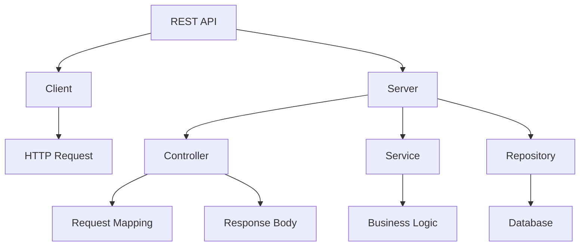

# Module 17: REST API Design

## Overview
REST (Representational State Transfer) is an architectural style for designing networked applications. It uses HTTP methods for CRUD operations and JSON for data exchange.

## Learning Objectives
- Design RESTful APIs
- Use HTTP methods properly
- Handle status codes
- Implement versioning
- Apply API best practices

## Prerequisites
- HTTP protocol
- JSON format
- Spring Boot basics

## Why This Concept Exists
Applications need:
- Standardized communication
- Client-server separation
- Stateless operations
- Scalability

REST provides:
- Simple, uniform interface
- Statelessness
- Cacheability
- Layered system

## Problem Statement
How do you design consistent, scalable APIs?

## Theory

### HTTP Methods

| Method | Purpose | Idempotent |
|--------|---------|------------|
| GET | Read | Yes |
| POST | Create | No |
| PUT | Update | Yes |
| DELETE | Delete | Yes |
| PATCH | Partial update | No |

### Status Codes

| Code | Meaning |
|------|---------|
| 200 | OK |
| 201 | Created |
| 204 | No Content |
| 400 | Bad Request |
| 401 | Unauthorized |
| 403 | Forbidden |
| 404 | Not Found |
| 500 | Server Error |

## Internal Working

### REST Request Flow
```
Client → HTTP Request → Server → Route → Controller → Service → Repository → Response
```

### Resource Naming
```
/users           → Collection
/users/123       → Specific resource
/users/123/orders → Sub-collection
```

## JVM Perspective

### Spring MVC
- DispatcherServlet routing
- Message converters
- Exception handlers
- Content negotiation

## Architecture Diagram



## Syntax

### Controller
```java
@RestController
@RequestMapping("/api/users")
public class UserController {
    
    @GetMapping
    public ResponseEntity<List<User>> getAll() {
        return ResponseEntity.ok(userService.findAll());
    }
    
    @GetMapping("/{id}")
    public ResponseEntity<User> getById(@PathVariable Long id) {
        return userService.findById(id)
            .map(ResponseEntity::ok)
            .orElse(ResponseEntity.notFound().build());
    }
    
    @PostMapping
    public ResponseEntity<User> create(@RequestBody @Valid UserDTO dto) {
        User created = userService.create(dto);
        return ResponseEntity.status(HttpStatus.CREATED).body(created);
    }
    
    @PutMapping("/{id}")
    public ResponseEntity<User> update(@PathVariable Long id, @RequestBody UserDTO dto) {
        return userService.update(id, dto)
            .map(ResponseEntity::ok)
            .orElse(ResponseEntity.notFound().build());
    }
    
    @DeleteMapping("/{id}")
    public ResponseEntity<Void> delete(@PathVariable Long id) {
        userService.delete(id);
        return ResponseEntity.noContent().build();
    }
}
```

## Easy Example
```java
@RestController
@RequestMapping("/api/products")
public class ProductController {
    
    @GetMapping
    public List<Product> getAll() {
        return productService.findAll();
    }
    
    @GetMapping("/{id}")
    public Product getById(@PathVariable Long id) {
        return productService.findById(id);
    }
    
    @PostMapping
    public Product create(@RequestBody Product product) {
        return productService.create(product);
    }
}
```

## Medium Example
```java
@RestController
@RequestMapping("/api/orders")
public class OrderController {
    
    @GetMapping
    public ResponseEntity<Page<Order>> getAll(
            @RequestParam(defaultValue = "0") int page,
            @RequestParam(defaultValue = "10") int size) {
        return ResponseEntity.ok(orderService.findAll(PageRequest.of(page, size)));
    }
    
    @GetMapping("/{id}")
    public ResponseEntity<Order> getById(@PathVariable Long id) {
        return orderService.findById(id)
            .map(ResponseEntity::ok)
            .orElse(ResponseEntity.notFound().build());
    }
    
    @PostMapping
    public ResponseEntity<Order> create(@RequestBody @Valid OrderRequest request) {
        Order order = orderService.create(request);
        URI location = URI.create("/api/orders/" + order.getId());
        return ResponseEntity.created(location).body(order);
    }
    
    @PatchMapping("/{id}/status")
    public ResponseEntity<Order> updateStatus(
            @PathVariable Long id, 
            @RequestBody StatusUpdate status) {
        return orderService.updateStatus(id, status)
            .map(ResponseEntity::ok)
            .orElse(ResponseEntity.notFound().build());
    }
}
```

## Hard Example
```java
@RestController
@RequestMapping("/api/v1/users")
public class HardExample {
    
    @GetMapping
    public ResponseEntity<Page<UserDTO>> getAll(
            @RequestParam(required = false) String search,
            @RequestParam(defaultValue = "id") String sortBy,
            @RequestParam(defaultValue = "asc") String sortDir,
            @RequestParam(defaultValue = "0") int page,
            @RequestParam(defaultValue = "20") int size) {
        
        Sort sort = sortDir.equalsIgnoreCase("desc") ? 
            Sort.by(sortBy).descending() : Sort.by(sortBy).ascending();
        
        Page<UserDTO> users = userService.findAll(search, PageRequest.of(page, size, sort));
        return ResponseEntity.ok(users);
    }
    
    @GetMapping("/{id}")
    public ResponseEntity<UserDTO> getById(
            @PathVariable Long id,
            @RequestHeader(value = "If-None-Match", required = false) String etag) {
        
        return userService.findById(id)
            .filter(user -> !etag.equals(user.getVersion()))
            .map(user -> ResponseEntity.ok()
                .eTag(user.getVersion())
                .body(user))
            .orElse(ResponseEntity.status(HttpStatus.NOT_MODIFIED).build());
    }
}
```

## Enterprise Example
```java
@RestController
@RequestMapping("/api/v1/orders")
public class EnterpriseOrderController {
    
    private final OrderService orderService;
    private final ApplicationEventPublisher eventPublisher;
    
    @PostMapping
    @ResponseStatus(HttpStatus.CREATED)
    public OrderDTO create(@RequestBody @Valid CreateOrderRequest request,
                          @AuthenticationPrincipal UserDetails user) {
        OrderDTO order = orderService.create(request, user.getUsername());
        
        // Publish event
        eventPublisher.publishEvent(new OrderCreatedEvent(order));
        
        return order;
    }
    
    @GetMapping
    public ResponseEntity<List<OrderDTO>> getAll(
            @RequestParam(required = false) OrderStatus status,
            @PageableDefault(sort = "createdAt", direction = Sort.Direction.DESC) 
            Pageable pageable) {
        
        List<OrderDTO> orders = orderService.findAll(status, pageable);
        
        return ResponseEntity.ok()
            .header("X-Total-Count", String.valueOf(orderService.count(status)))
            .body(orders);
    }
}
```

## Performance Considerations
- Use pagination for large datasets
- Implement caching
- Use compression
- Rate limiting

## Best Practices
1. Use proper HTTP methods
2. Return appropriate status codes
3. Version your API
4. Use HATEOAS
5. Document with OpenAPI

## Common Mistakes
1. Using wrong HTTP methods
2. Not handling errors properly
3. Not versioning API
4. Over-fetching data

## Comparison Table

| Aspect | Good API | Bad API |
|--------|----------|---------|
| Naming | /users/123 | /getUser?id=123 |
| Methods | GET, POST, PUT, DELETE | Only GET/POST |
| Status | 200, 201, 404 | Always 200 |
| Versioning | /api/v1/ | No versioning |

## Interview Questions

### Q1: What is REST?
**Answer:** Architectural style for networked applications using HTTP.

### Q2: What is the difference between PUT and PATCH?
**Answer:** PUT replaces entire resource, PATCH updates partially.

### Q3: What is HATEOAS?
**Answer:** Hypermedia as the Engine of Application State.

### Q4: What is the difference between 200 and 201?
**Answer:** 200 is OK, 201 is Created.

### Q5: What is idempotency?
**Answer:** Property where same request produces same result.

## Summary
REST APIs provide standardized, scalable communication. Follow best practices for consistent design.

## References
- RESTful Web Services
- Spring REST Documentation
- API Design Guide
