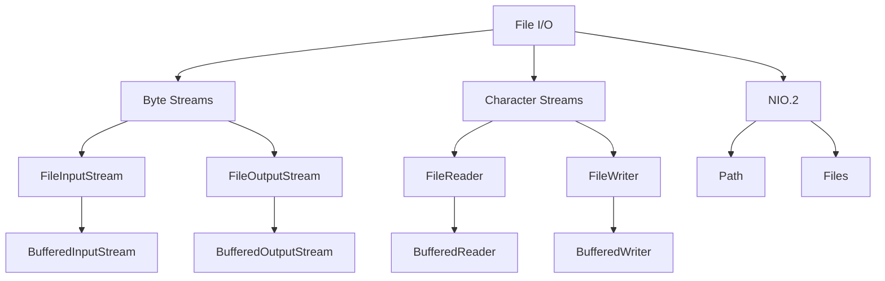
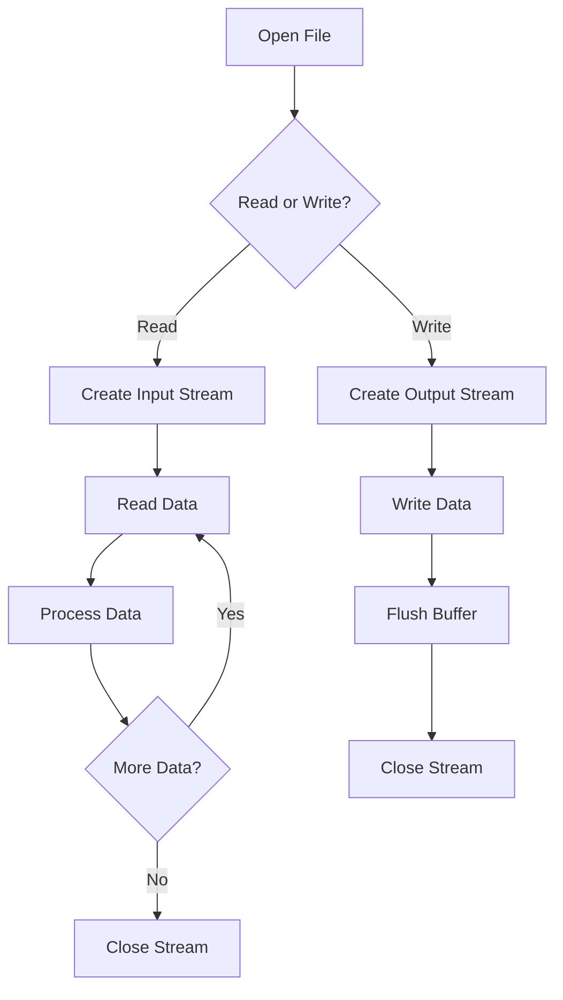
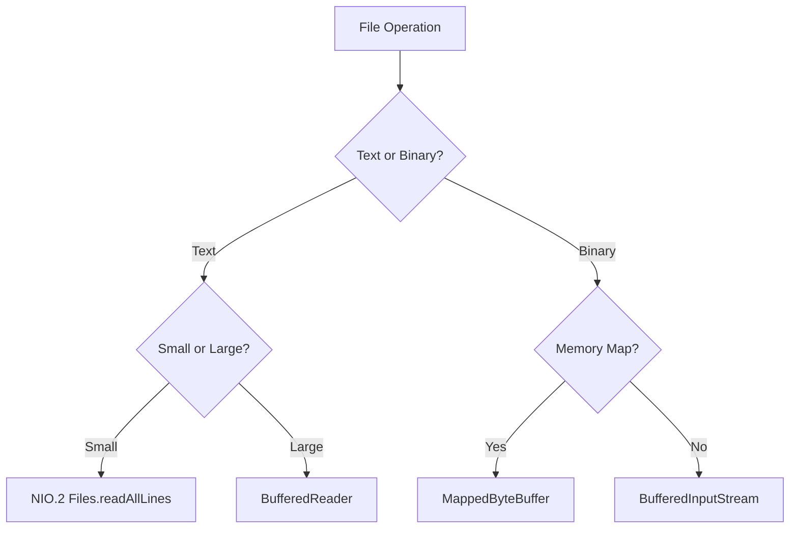

# Module 18: File I/O

## Overview
Java File I/O provides classes for file system operations, including reading, writing, copying, and deleting files. The java.io package offers stream-based I/O while java.nio.file provides modern file handling with Path and Files classes.

## Learning Objectives
- Master File and Path operations
- Understand stream-based I/O
- Use NIO.2 for modern file handling
- Handle character and byte streams
- Implement file watching

## Prerequisites
- Basic Java knowledge
- Understanding of streams
- Exception handling

## Why This Concept Exists
File operations are fundamental to:
- Configuration file reading
- Data processing
- Log file management
- Resource handling
- Data persistence

## Problem Statement
How do you read, write, and manage files efficiently in Java?

## Theory

### File I/O Classes

| Class | Purpose |
|-------|---------|
| File | File/directory metadata |
| Path | File system path |
| Files | File operations |
| FileInputStream | Byte input |
| FileOutputStream | Byte output |
| FileReader | Character input |
| FileWriter | Character output |
| BufferedReader | Buffered character input |
| BufferedWriter | Buffered character output |

### Stream Types

| Type | Purpose | Use Case |
|------|---------|----------|
| Byte Stream | Raw bytes | Binary files |
| Character Stream | Characters | Text files |
| Buffered | Performance | Large files |
| Unbuffered | Simple | Small files |

## Internal Working

### File Reading Process
1. Open file
2. Create stream
3. Read data
4. Process data
5. Close stream

### Buffering
- Default buffer: 8KB
- Reduces system calls
- Improves performance
- Automatic flushing

## JVM Perspective

### File Descriptor
- OS-level file handle
- Limited system resources
- Must be closed properly
- Shared across streams

### Memory Mapping
- MappedByteBuffer for large files
- OS manages memory
- Faster than stream I/O
- Limited by address space

## Memory Representation
```
BufferedInputStream:
┌─────────────────────────────────────┐
│ Buffer (8KB default)                │
│  ├─ Read position                   │
│  ├─ Count                           │
│  └─ Underlying InputStream          │
└─────────────────────────────────────┘
```

## Architecture Diagram



## Flow Diagram



## Syntax

### Modern File Operations (NIO.2)
```java
import java.nio.file.*;
import java.io.*;

// Read all lines
List<String> lines = Files.readAllLines(Path.of("file.txt"));

// Read all bytes
byte[] bytes = Files.readAllBytes(Path.of("file.txt"));

// Write to file
Files.writeString(Path.of("file.txt"), "Hello World");

// Copy file
Files.copy(Path.of("source.txt"), Path.of("dest.txt"));

// Delete file
Files.delete(Path.of("file.txt"));

// Create directory
Files.createDirectory(Path.of("dir"));
```

### Stream-based I/O
```java
import java.io.*;

// BufferedReader
try (BufferedReader br = new BufferedReader(new FileReader("file.txt"))) {
    String line;
    while ((line = br.readLine()) != null) {
        System.out.println(line);
    }
}

// BufferedWriter
try (BufferedWriter bw = new BufferedWriter(new FileWriter("file.txt"))) {
    bw.write("Hello");
    bw.newLine();
    bw.write("World");
}

// FileInputStream
try (FileInputStream fis = new FileInputStream("file.bin")) {
    byte[] buffer = new byte[1024];
    int bytesRead;
    while ((bytesRead = fis.read(buffer)) != -1) {
        // Process bytes
    }
}
```

### File Operations
```java
import java.io.File;

File file = new File("file.txt");

// Check existence
boolean exists = file.exists();
boolean isFile = file.isFile();
boolean isDir = file.isDirectory();

// Get info
String name = file.getName();
String path = file.getAbsolutePath();
long size = file.length();
long modified = file.lastModified();

// Operations
boolean created = file.createNewFile();
boolean deleted = file.delete();
boolean renamed = file.renameTo(new File("new.txt"));

// List directory
File[] files = file.listFiles();
```

## Easy Example
```java
import java.nio.file.*;
import java.io.*;

public class EasyExample {
    public static void main(String[] args) throws IOException {
        // Write to file
        Files.writeString(Path.of("test.txt"), "Hello World!\n");
        
        // Read from file
        String content = Files.readString(Path.of("test.txt"));
        System.out.println(content);
        
        // Read lines
        List<String> lines = Files.readAllLines(Path.of("test.txt"));
        lines.forEach(System.out::println);
    }
}
```

## Medium Example
```java
import java.io.*;
import java.nio.file.*;
import java.util.stream.*;

public class MediumExample {
    public static void main(String[] args) throws IOException {
        // Copy directory
        Path source = Path.of("source");
        Path target = Path.of("target");
        
        Files.walk(source)
            .forEach(path -> {
                try {
                    Path dest = target.resolve(source.relativize(path));
                    if (Files.isDirectory(path)) {
                        Files.createDirectories(dest);
                    } else {
                        Files.copy(path, dest);
                    }
                } catch (IOException e) {
                    e.printStackTrace();
                }
            });
        
        // Find files
        try (Stream<Path> paths = Files.walk(Path.of("."))) {
            paths.filter(Files::isRegularFile)
                .filter(p -> p.toString().endsWith(".java"))
                .forEach(System.out::println);
        }
    }
}
```

## Hard Example
```java
import java.io.*;
import java.nio.*;
import java.nio.channels.*;
import java.nio.file.*;

public class HardExample {
    // Memory-mapped file reading
    public static String readWithMapping(Path path) throws IOException {
        try (FileChannel channel = FileChannel.open(path, StandardOpenOption.READ)) {
            MappedByteBuffer buffer = channel.map(
                FileChannel.MapMode.READ_ONLY, 0, channel.size());
            
            StringBuilder sb = new StringBuilder();
            while (buffer.hasRemaining()) {
                sb.append((char) buffer.get());
            }
            return sb.toString();
        }
    }
    
    // File watching
    public static void watchDirectory(Path dir) throws IOException {
        WatchService watcher = FileSystems.getDefault().newWatchService();
        dir.register(watcher, 
            StandardWatchEventKinds.ENTRY_CREATE,
            StandardWatchEventKinds.ENTRY_MODIFY,
            StandardWatchEventKinds.ENTRY_DELETE);
        
        while (true) {
            WatchKey key = watcher.take();
            for (WatchEvent<?> event : key.pollEvents()) {
                System.out.println(event.kind() + ": " + event.context());
            }
            key.reset();
        }
    }
    
    public static void main(String[] args) throws IOException {
        // Read file with memory mapping
        String content = readWithMapping(Path.of("large-file.txt"));
        System.out.println("File size: " + content.length());
    }
}
```

## Enterprise Example
```java
import java.io.*;
import java.nio.file.*;
import java.util.concurrent.*;

public class EnterpriseExample {
    // Async file processing
    private static final ExecutorService executor = 
        Executors.newFixedThreadPool(4);
    
    public static CompletableFuture<Void> processFileAsync(Path path) {
        return CompletableFuture.runAsync(() -> {
            try {
                List<String> lines = Files.readAllLines(path);
                // Process lines
                System.out.println("Processed " + lines.size() + " lines");
            } catch (IOException e) {
                throw new CompletionException(e);
            }
        }, executor);
    }
    
    // Log file processor
    public static void processLogs(Path logDir) throws IOException {
        try (Stream<Path> files = Files.list(logDir)) {
            files.filter(p -> p.toString().endsWith(".log"))
                .forEach(path -> {
                    try {
                        long errors = Files.lines(path)
                            .filter(l -> l.contains("ERROR"))
                            .count();
                        System.out.println(path.getFileName() + ": " + errors + " errors");
                    } catch (IOException e) {
                        e.printStackTrace();
                    }
                });
        }
    }
    
    public static void main(String[] args) throws Exception {
        // Process multiple files async
        CompletableFuture.allOf(
            processFileAsync(Path.of("file1.txt")),
            processFileAsync(Path.of("file2.txt")),
            processFileAsync(Path.of("file3.txt"))
        ).join();
    }
}
```

## Performance Considerations
- Use buffered streams for large files
- Memory mapping for very large files
- Try-with-resources for proper cleanup
- NIO.2 is generally faster than java.io

## Time & Space Complexity
| Operation | Time | Space |
|-----------|------|-------|
| Read file | O(n) | O(n) |
| Write file | O(n) | O(1) |
| Copy file | O(n) | O(buffer) |
| List directory | O(n) | O(n) |

## Thread Safety
- Streams are not thread-safe
- Files can be shared read-only
- Use synchronization for concurrent writes
- NIO channels are thread-safe

## Best Practices
1. Use try-with-resources
2. Use NIO.2 for modern code
3. Buffer large reads/writes
4. Handle InterruptedException
5. Validate file paths

## Common Mistakes
1. Not closing streams
2. Using wrong encoding
3. Not buffering large files
4. Ignoring exceptions

## Pitfalls & Warnings
1. File paths are OS-specific
2. Character encoding issues
3. File locking complexities
4. Symbolic link handling

## Debugging Tips
1. Check file permissions
2. Verify file exists
3. Use absolute paths
4. Print stream status

## Comparison Table

| Feature | java.io | java.nio | NIO.2 |
|---------|---------|----------|-------|
| API Style | Streams | Channels | Path/Files |
| Performance | Good | Better | Best |
| Blocking | Yes | No | Yes |
| Complexity | Low | Medium | Low |

## Decision Tree



## Interview Questions

### Q1: What is the difference between File and Path?
**Answer:** File is legacy, Path is modern NIO.2 with more functionality.

### Q2: What is try-with-resources?
**Answer:** Auto-closes resources implementing AutoCloseable.

### Q3: What is the difference between FileReader and BufferedReader?
**Answer:** BufferedReader adds buffering for better performance.

### Q4: How do you read a file line by line?
**Answer:** Use BufferedReader.readLine() or Files.lines().

### Q5: What is memory-mapped file?
**Answer:** File mapped to memory for faster access via MappedByteBuffer.

### Q6: How do you handle large files?
**Answer:** Use buffered streams or memory mapping.

### Q7: What is the default buffer size?
**Answer:** 8KB for BufferedInputStream/BufferedOutputStream.

### Q8: How do you copy a file?
**Answer:** Use Files.copy() or streams.

### Q9: What is the difference between read() and readAllBytes()?
**Answer:** read() reads chunks, readAllBytes() reads entire file.

### Q10: How do you watch a directory?
**Answer:** Use WatchService with StandardWatchEventKinds.

### Q11: What encoding should I use?
**Answer:** UTF-8 is recommended for most cases.

### Q12: How do you delete a file?
**Answer:** Use Files.delete() or File.delete().

### Q13: What is the difference between exists and isRegularFile?
**Answer:** exists checks existence, isRegularFile checks if it's a file (not directory).

### Q14: How do you get file size?
**Answer:** Use Files.size() or File.length().

### Q15: How do you list files in a directory?
**Answer:** Use Files.list() or File.listFiles().

## Exercises

### Easy
1. Read and print a text file
2. Write user input to a file
3. Count lines in a file

### Medium
1. Copy directory recursively
2. Search for files by extension
3. Implement file watcher

### Hard
1. Build a file synchronization tool
2. Implement memory-mapped file processing
3. Create a log file analyzer

## Summary
Java File I/O provides comprehensive file system access. NIO.2 offers modern, efficient APIs for file operations.

## References
- Oracle Java Documentation: File I/O
- NIO.2 Tutorial
- Baeldung File Operations Guide
