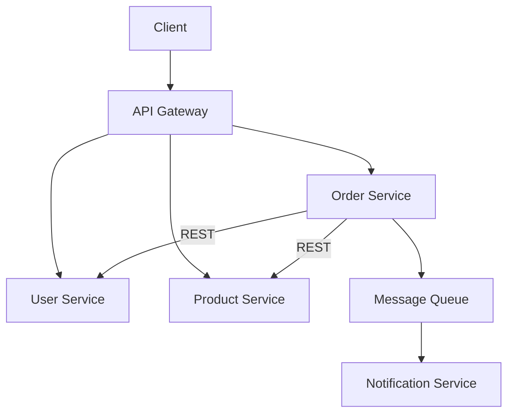
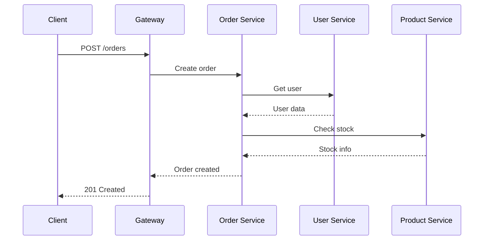

# 1. Microservices Fundamentals

## 1. Introduction
Microservices architecture structures an application as a collection of loosely coupled, independently deployable services. Each service runs its own process and communicates via lightweight mechanisms.

## 2. Learning Objectives
- Understand monolith vs microservices
- Learn bounded context
- Understand service decomposition
- Learn inter-service communication
- Understand distributed system challenges

## 3. Prerequisites
- Understanding of software architecture
- Knowledge of REST APIs
- Familiarity with distributed systems concepts

## 4. Why This Concept Exists
Microservices solve monolith limitations:
- Independent deployment
- Technology diversity
- Fault isolation
- Scalability

## 5. Problem Statement
Monolithic applications face:
- Tight coupling
- Difficult scaling
- Technology lock-in
- Complex deployment
- Team coordination issues

## 6. Theory
Microservices principles:
1. **Single Responsibility**: One service per bounded context
2. **Autonomy**: Independent development and deployment
3. **Decentralized**: Each service owns its data
4. **Resilience**: Design for failure
5. **Observability**: Monitoring and tracing

## 7. Internal Working
Services communicate via:
- Synchronous: REST, gRPC
- Asynchronous: Messages, Events
- Service Discovery: Find other services
- API Gateway: Single entry point

## 8. JVM Perspective
- Each service is a separate JVM
- Inter-service HTTP calls
- Message brokers for async
- Distributed tracing across JVMs

## 9. Memory Representation
```java
// Service definition
@Service
public class OrderService {
    @Autowired
    private UserServiceClient userClient;
    
    public Order createOrder(OrderRequest request) {
        User user = userClient.getUser(request.getUserId());
        // Process order
    }
}
```

## 10. Architecture Diagram


## 11. Flow Diagram


## 12. Syntax
```java
// REST client
@Service
public class UserServiceClient {
    @Autowired
    private RestTemplate restTemplate;
    
    public User getUser(Long id) {
        return restTemplate.getForObject(
            "http://user-service/api/users/" + id, User.class);
    }
}
```

## 13. Easy Example
```java
@SpringBootApplication
public class OrderServiceApplication {
    public static void main(String[] args) {
        SpringApplication.run(OrderServiceApplication.class, args);
    }
}

@RestController
@RequestMapping("/api/orders")
public class OrderController {
    @GetMapping
    public List<Order> getOrders() {
        return orderService.findAll();
    }
}
```

## 14. Medium Example
```java
@Service
public class OrderService {
    @Autowired
    private OrderRepository orderRepository;
    
    @Autowired
    private UserServiceClient userClient;
    
    @Autowired
    private ProductClient productClient;
    
    @CircuitBreaker(name = "userService", fallbackMethod = "getUserFallback")
    public Order createOrder(CreateOrderRequest request) {
        User user = userClient.getUser(request.getUserId());
        Product product = productClient.getProduct(request.getProductId());
        
        Order order = new Order();
        order.setUserId(user.getId());
        order.setProductId(product.getId());
        order.setTotal(product.getPrice() * request.getQuantity());
        
        return orderRepository.save(order);
    }
    
    public Order getUserFallback(CreateOrderRequest request, Exception e) {
        throw new ServiceUnavailableException("User service unavailable");
    }
}
```

## 15. Hard Example
```java
@Component
public class ResilientServiceClient {
    
    @Autowired
    private RestTemplate restTemplate;
    
    @Autowired
    private CircuitBreakerRegistry circuitBreakerRegistry;
    
    @Autowired
    private RetryRegistry retryRegistry;
    
    public <T> T callService(String url, Class<T> responseType) {
        CircuitBreaker circuitBreaker = circuitBreakerRegistry
            .circuitBreaker("serviceClient");
        
        Retry retry = retryRegistry.retry("serviceClient");
        
        Supplier<T> decoratedSupplier = Decorators.ofSupplier(() ->
                restTemplate.getForObject(url, responseType))
            .withCircuitBreaker(circuitBreaker)
            .withRetry(retry)
            .withFallback(CallNotPermittedException.class, e -> {
                throw new ServiceUnavailableException("Service unavailable");
            })
            .decorate()
            .get();
        
        return decoratedSupplier.get();
    }
}
```

## 16. Enterprise Example
```java
@RestController
@RequestMapping("/api/v1/orders")
@RequiredArgsConstructor
@Slf4j
public class OrderController {
    
    private final OrderService orderService;
    private final ApplicationEventPublisher eventPublisher;
    
    @PostMapping
    @Operation(summary = "Create order")
    public ResponseEntity<ApiResponse<OrderDTO>> createOrder(
            @RequestBody @Valid CreateOrderRequest request,
            @AuthenticationPrincipal UserDetails user) {
        
        log.info("Creating order for user: {}", user.getUsername());
        
        OrderDTO order = orderService.createOrder(request, user.getUsername());
        
        eventPublisher.publishEvent(new OrderCreatedEvent(order.getId()));
        
        return ResponseEntity.status(HttpStatus.CREATED)
            .body(ApiResponse.success(order));
    }
}

@Service
@Slf4j
@RequiredArgsConstructor
public class OrderService {
    
    private final OrderRepository orderRepository;
    private final UserServiceClient userClient;
    private final ProductClient productClient;
    private final PaymentClient paymentClient;
    
    @Transactional
    @CircuitBreaker(name = "orderService", fallbackMethod = "fallback")
    @Retry(name = "orderService")
    public OrderDTO createOrder(CreateOrderRequest request, String username) {
        UserDTO user = userClient.getUserByUsername(username);
        ProductDTO product = productClient.getProduct(request.getProductId());
        
        Order order = Order.builder()
            .userId(user.getId())
            .productId(product.getId())
            .quantity(request.getQuantity())
            .total(product.getPrice().multiply(
                BigDecimal.valueOf(request.getQuantity())))
            .status(OrderStatus.PENDING)
            .createdAt(LocalDateTime.now())
            .build();
        
        Order saved = orderRepository.save(order);
        log.info("Order created: {}", saved.getId());
        
        return OrderDTO.fromEntity(saved);
    }
}
```

## 17. Performance
- Network latency: 1-100ms between services
- Service discovery: ~1-5ms
- Circuit breaker: ~1ms overhead
- Message queue: 1-10ms async

## 18. Time & Space Complexity
- **Service Call**: O(1) per call
- **Service Discovery**: O(1)
- **Circuit Breaker**: O(1)
- **Space**: O(n) for service registry

## 19. Thread Safety
- Each service is independent
- RestTemplate is thread-safe
- Message consumers are thread-safe
- Circuit breakers are thread-safe

## 20. Best Practices
1. Design for failure
2. Implement circuit breakers
3. Use async communication when possible
4. Centralize configuration
5. Implement distributed tracing
6. Use API gateway
7. Monitor all services

## 21. Common Mistakes
1. Too many services (nano-services)
2. Synchronous communication everywhere
3. No fault tolerance
4. Shared databases
5. No API versioning

## 22. Pitfalls
- Distributed transactions
- Network failures
- Data consistency
- Service discovery failures
- Debugging complexity

## 23. Debugging Tips
1. Use distributed tracing
2. Correlate requests across services
3. Monitor service health
4. Use centralized logging
5. Implement circuit breaker dashboards

## 24. Comparison Table
| Aspect | Monolith | Microservices |
|--------|----------|---------------|
| Deployment | Single | Multiple |
| Scaling | Vertical | Horizontal |
| Technology | Single | Polyglot |
| Team | Single | Multiple |
| Complexity | Low | High |

## 25. Decision Tree
```
Need Microservices?
├── Yes → Team size?
│   ├── Large → Microservices
│   └── Small → Consider monolith first
└── No → Monolith sufficient
```

## 26. Interview Questions
1. What are microservices?
2. What is the difference between monolith and microservices?
3. What is a bounded context?
4. How do services communicate?
5. What is service discovery?
6. What is an API gateway?
7. What is a circuit breaker?
8. How do you handle distributed transactions?
9. What is the saga pattern?
10. How do you test microservices?
11. What are the challenges of microservices?
12. How do you handle service failures?
13. What is event-driven architecture?
14. How do you implement distributed tracing?
15. What is the role of message queues?

## 27. Exercises
### Beginner
1. Create two communicating services
2. Implement service discovery
3. Add circuit breaker

### Intermediate
1. Implement saga pattern
2. Add distributed tracing
3. Create API gateway

### Advanced
1. Implement event sourcing
2. Create service mesh
3. Implement CQRS

## 28. Summary
Microservices architecture enables building scalable, maintainable applications by decomposing them into independent services. Understanding the patterns, challenges, and best practices is essential for successful implementation.

## 29. References
- [Microservices Patterns](https://microservices.io/patterns/)
- [Spring Cloud](https://spring.io/projects/spring-cloud)
- [Domain-Driven Design](https://www.domainlanguage.com/ddd/)
