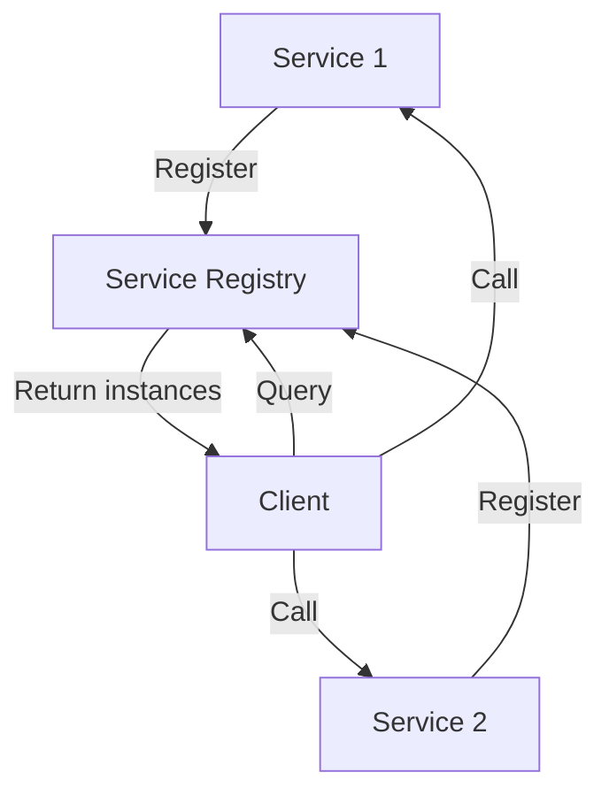
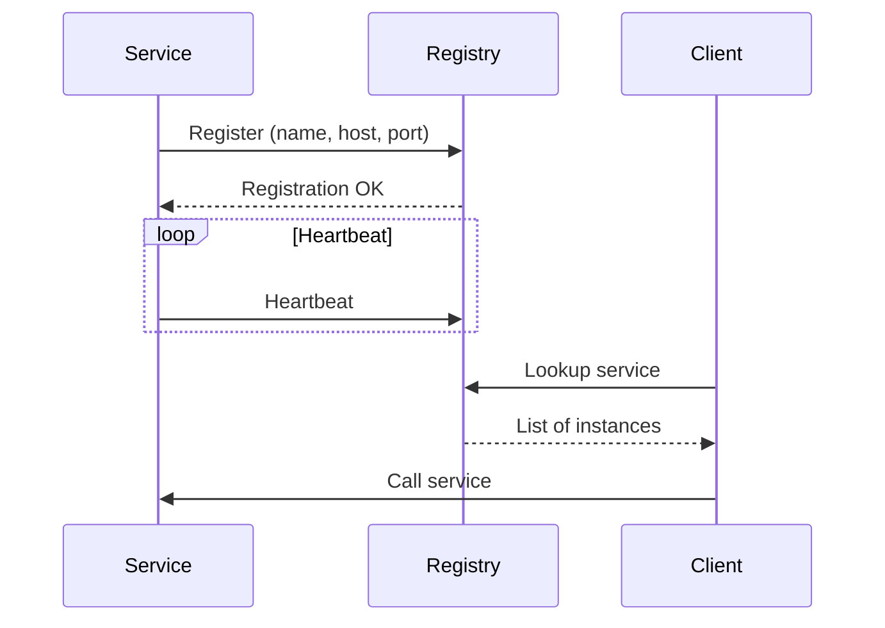

# 2. Service Discovery

## 1. Introduction
Service discovery enables services to find each other dynamically in a microservices architecture. Eureka, Consul, and other tools provide service registration and discovery mechanisms.

## 2. Learning Objectives
- Understand service discovery concepts
- Implement Eureka server and client
- Learn service registration
- Understand health checks
- Learn client-side vs server-side discovery

## 3. Prerequisites
- Understanding of microservices basics
- Knowledge of Spring Boot
- Familiarity with REST APIs

## 4. Why This Concept Exists
Service discovery solves:
- Dynamic service locations
- Load balancing
- Fault tolerance
- Service registration

## 5. Problem Statement
Without service discovery:
- Hardcoded service URLs
- Manual service registration
- No load balancing
- Difficult scaling

## 6. Theory
Service discovery types:
1. **Client-side**: Client queries registry
2. **Server-side**: Load balancer queries registry
3. **DNS-based**: DNS records for services

Components:
- Service Registry: Stores service instances
- Service Registration: Services register themselves
- Service Lookup: Services find other services

## 7. Internal Working
1. Service starts and registers with registry
2. Registry stores service metadata
3. Service sends heartbeats
4. Client queries registry for services
5. Client负载 balances across instances

## 8. JVM Perspective
- Eureka client runs in each service JVM
- Registry runs as separate JVM
- REST calls for registration
- In-memory cache of service instances

## 9. Memory Representation
```java
// Service registration
eureka.instance.appname=order-service
eureka.instance.instance-id=order-service:8080
eureka.client.service-url.defaultZone=http://localhost:8761/eureka/
```

## 10. Architecture Diagram


## 11. Flow Diagram


## 12. Syntax
```java
// Eureka Server
@SpringBootApplication
@EnableEurekaServer
public class EurekaServerApplication {
    public static void main(String[] args) {
        SpringApplication.run(EurekaServerApplication.class, args);
    }
}

// Eureka Client
@SpringBootApplication
@EnableDiscoveryClient
public class OrderServiceApplication {
    public static void main(String[] args) {
        SpringApplication.run(OrderServiceApplication.class, args);
    }
}
```

## 13. Easy Example
```java
@SpringBootApplication
@EnableEurekaServer
public class DiscoveryServer {
    public static void main(String[] args) {
        SpringApplication.run(DiscoveryServer.class, args);
    }
}

@SpringBootApplication
@EnableDiscoveryClient
public class UserService {
    @Bean
    @LoadBalanced
    public RestTemplate restTemplate() {
        return new RestTemplate();
    }
    
    @GetMapping("/users")
    public List<User> getUsers() {
        return restTemplate.getForObject(
            "http://user-service/api/users", List.class);
    }
}
```

## 14. Medium Example
```java
@SpringBootApplication
@EnableDiscoveryClient
public class OrderService {
    
    @Bean
    @LoadBalanced
    public RestTemplate restTemplate() {
        return new RestTemplate();
    }
    
    @Bean
    public WebClient.Builder webClientBuilder() {
        return WebClient.builder();
    }
}

@Service
public class UserServiceClient {
    
    @Autowired
    private RestTemplate restTemplate;
    
    public User getUser(Long id) {
        return restTemplate.getForObject(
            "http://user-service/api/users/" + id, User.class);
    }
}

@Service
public class ProductClient {
    
    @Autowired
    private WebClient.Builder webClientBuilder;
    
    public Product getProduct(Long id) {
        return webClientBuilder.build()
            .get()
            .uri("http://product-service/api/products/{id}", id)
            .retrieve()
            .bodyToMono(Product.class)
            .block();
    }
}
```

## 15. Hard Example
```java
@Configuration
public class DiscoveryConfig {
    
    @Bean
    @LoadBalanced
    public RestTemplate restTemplate() {
        return new RestTemplate();
    }
    
    @Bean
    public ReactiveLoadBalancerClientFilter reactiveLoadBalancerClientFilter() {
        return new ReactiveLoadBalancerClientFilter();
    }
}

@Service
@Slf4j
public class ResilientServiceClient {
    
    @Autowired
    private DiscoveryClient discoveryClient;
    
    @Autowired
    private RestTemplate restTemplate;
    
    public List<ServiceInstance> getInstances(String serviceId) {
        return discoveryClient.getInstances(serviceId);
    }
    
    public <T> T callWithLoadBalancing(String serviceId, String path, 
                                       Class<T> responseType) {
        List<ServiceInstance> instances = getInstances(serviceId);
        
        if (instances.isEmpty()) {
            throw new ServiceUnavailableException("No instances of " + serviceId);
        }
        
        ServiceInstance instance = instances.get(
            ThreadLocalRandom.current().nextInt(instances.size()));
        
        String url = instance.getUri() + path;
        log.info("Calling service at: {}", url);
        
        return restTemplate.getForObject(url, responseType);
    }
}
```

## 16. Enterprise Example
```java
@SpringBootApplication
@EnableDiscoveryClient
@EnableFeignClients
@Slf4j
public class OrderServiceApplication {
    public static void main(String[] args) {
        SpringApplication.run(OrderServiceApplication.class, args);
    }
}

@FeignClient(name = "user-service", fallbackFactory = UserClientFallbackFactory.class)
public interface UserClient {
    
    @GetMapping("/api/users/{id}")
    UserDTO getUser(@PathVariable Long id);
    
    @GetMapping("/api/users/username/{username}")
    UserDTO getUserByUsername(@PathVariable String username);
}

@Component
@Slf4j
public class UserClientFallbackFactory implements FallbackFactory<UserClient> {
    
    @Override
    public UserClient create(Throwable cause) {
        log.error("User service fallback triggered", cause);
        return new UserClient() {
            @Override
            public UserDTO getUser(Long id) {
                throw new ServiceUnavailableException("User service unavailable");
            }
            
            @Override
            public UserDTO getUserByUsername(String username) {
                throw new ServiceUnavailableException("User service unavailable");
            }
        };
    }
}
```

## 17. Performance
- Registration: ~100-500ms
- Lookup: ~1-10ms (with cache)
- Heartbeat interval: 30s default
- Instance eviction: 90s default

## 18. Time & Space Complexity
- **Registration**: O(1)
- **Lookup**: O(1) with cache, O(n) without
- **Heartbeat**: O(1)
- **Space**: O(n) for n services

## 19. Thread Safety
- Registry is thread-safe
- Discovery client is thread-safe
- Load balancing is thread-safe
- RestTemplate is thread-safe

## 20. Best Practices
1. Use health checks
2. Implement client-side caching
3. Use load balancing
4. Monitor registry health
5. Use multiple registry instances
6. Implement graceful shutdown

## 21. Common Mistakes
1. Not implementing health checks
2. Hardcoding service URLs
3. No load balancing
4. Single point of failure
5. Not handling service failures

## 22. Pitfalls
- Registry becomes SPOF
- Network partitions
- Service registration delays
- Cache staleness

## 23. Debugging Tips
1. Check registry dashboard
2. Verify service registration
3. Check health endpoints
4. Monitor heartbeat
5. Test failover scenarios

## 24. Comparison Table
| Feature | Eureka | Consul | Zookeeper |
|---------|--------|--------|-----------|
| CAP | AP | CP | CP |
| Health Check | HTTP/TCP | HTTP/TCP/gRPC | HTTP/TCP |
| KV Store | No | Yes | Yes |
| Load Balancing | Client | Client/Server | Client |

## 25. Decision Tree
```
Need Service Discovery?
├── Yes → Type?
│   ├── Spring Cloud → Eureka
│   ├── Multi-platform → Consul
│   └── Existing Zookeeper → Zookeeper
└── No → Static configuration
```

## 26. Interview Questions
1. What is service discovery?
2. What is the difference between Eureka and Consul?
3. How does Eureka handle network partitions?
4. What is a health check?
5. How do you implement load balancing?
6. What is client-side vs server-side discovery?
7. How do you handle service failures?
8. What is the CAP theorem?
9. How do you monitor service discovery?
10. What are best practices for service discovery?
11. How do you handle service versions?
12. What is service mesh?
13. How do you secure service discovery?
14. What is DNS-based discovery?
15. How do you implement blue-green deployment?

## 27. Exercises
### Beginner
1. Set up Eureka server
2. Register two services
3. Implement service lookup

### Intermediate
1. Add health checks
2. Implement load balancing
3. Add client-side caching

### Advanced
1. Implement multi-zone discovery
2. Add service versioning
3. Create custom discovery client

## 28. Summary
Service discovery is essential for microservices, enabling dynamic service location and load balancing. Eureka and Consul are popular choices, with Eureka being tightly integrated with Spring Cloud.

## 29. References
- [Netflix Eureka](https://github.com/Netflix/eureka)
- [Spring Cloud Netflix](https://spring.io/projects/spring-cloud-netflix)
- [HashiCorp Consul](https://www.consul.io/)
