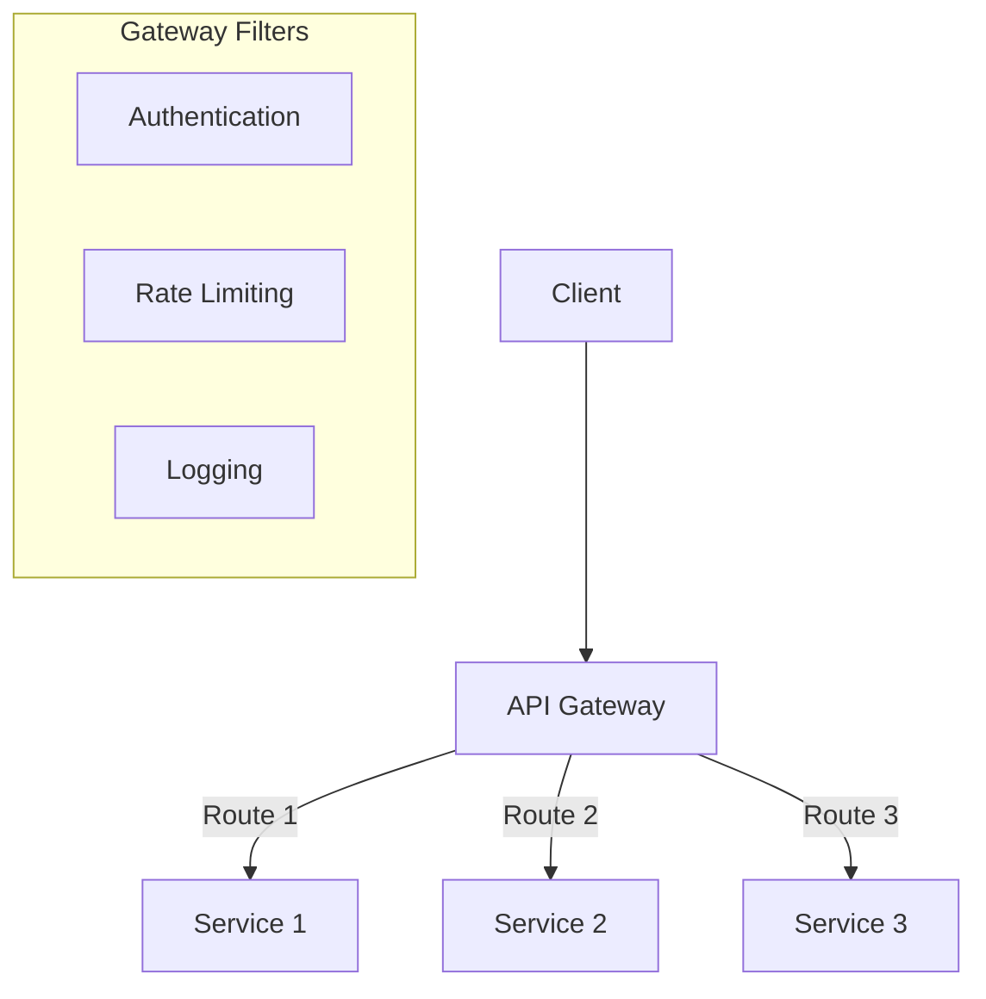
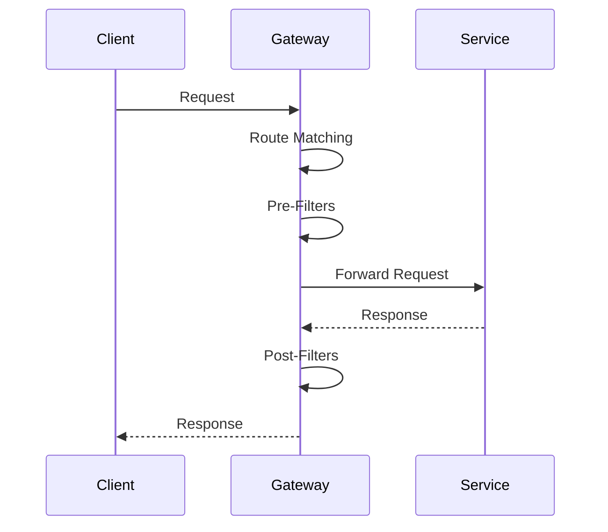

# 3. API Gateway

## 1. Introduction
An API Gateway acts as a single entry point for all client requests, routing them to appropriate microservices. Spring Cloud Gateway provides routing, filtering, and other cross-cutting concerns.

## 2. Learning Objectives
- Understand API Gateway concepts
- Implement Spring Cloud Gateway
- Learn routing and filtering
- Implement cross-cutting concerns
- Understand gateway patterns

## 3. Prerequisites
- Understanding of microservices
- Knowledge of Spring WebFlux
- Familiarity with reactive programming

## 4. Why This Concept Exists
API Gateway provides:
- Single entry point
- Request routing
- Authentication/authorization
- Rate limiting
- Load balancing

## 5. Problem Statement
Without API Gateway:
- Clients must know all service URLs
- Cross-cutting concerns duplicated
- No centralized security
- Difficult to monitor

## 6. Theory
Gateway patterns:
1. **Route**: Maps requests to services
2. **Filter**: Pre/post processing
3. **Predicate**: Request matching
4. **Rate Limiting**: Throttle requests

## 7. Internal Working
1. Client sends request to gateway
2. Gateway matches route predicate
3. Pre-filters execute (auth, logging)
4. Gateway forwards to service
5. Post-filters execute (response modification)
6. Response sent to client

## 8. JVM Perspective
- Gateway runs on Netty (non-blocking)
- Reactive streams for async processing
- In-memory route configuration
- Filter chain execution

## 9. Memory Representation
```yaml
spring:
  cloud:
    gateway:
      routes:
        - id: user-service
          uri: lb://user-service
          predicates:
            - Path=/api/users/**
          filters:
            - StripPrefix=1
```

## 10. Architecture Diagram


## 11. Flow Diagram


## 12. Syntax
```yaml
spring:
  cloud:
    gateway:
      routes:
        - id: user-service
          uri: lb://user-service
          predicates:
            - Path=/api/users/**
          filters:
            - StripPrefix=1
            - name: CircuitBreaker
              args:
                name: userService
                fallbackUri: forward:/fallback/users
```

## 13. Easy Example
```java
@SpringBootApplication
public class GatewayApplication {
    public static void main(String[] args) {
        SpringApplication.run(GatewayApplication.class, args);
    }
}

@Bean
public RouteLocator routes(RouteLocatorBuilder builder) {
    return builder.routes()
        .route("user-service", r -> r
            .path("/api/users/**")
            .filters(f -> f.stripPrefix(1))
            .uri("lb://user-service"))
        .route("order-service", r -> r
            .path("/api/orders/**")
            .filters(f -> f.stripPrefix(1))
            .uri("lb://order-service"))
        .build();
}
```

## 14. Medium Example
```java
@Component
public class CustomFilter implements GlobalFilter, Ordered {
    
    @Override
    public Mono<Void> filter(ServerWebExchange exchange, GatewayFilterChain chain) {
        ServerHttpRequest request = exchange.getRequest();
        
        // Add request ID
        String requestId = UUID.randomUUID().toString();
        ServerHttpRequest modifiedRequest = request.mutate()
            .header("X-Request-Id", requestId)
            .build();
        
        // Log request
        log.info("Request: {} {} -> {}", 
            request.getMethod(), request.getPath(), requestId);
        
        return chain.filter(exchange.mutate()
            .request(modifiedRequest)
            .build());
    }
    
    @Override
    public int getOrder() {
        return -1;
    }
}

@Component
public class AuthenticationFilter implements GlobalFilter, Ordered {
    
    @Autowired
    private JwtTokenValidator tokenValidator;
    
    @Override
    public Mono<Void> filter(ServerWebExchange exchange, GatewayFilterChain chain) {
        String token = extractToken(exchange.getRequest());
        
        if (token != null && tokenValidator.validate(token)) {
            return chain.filter(exchange);
        }
        
        exchange.getResponse().setStatusCode(HttpStatus.UNAUTHORIZED);
        return exchange.getResponse().setComplete();
    }
    
    private String extractToken(ServerHttpRequest request) {
        String authHeader = request.getHeaders().getFirst("Authorization");
        if (authHeader != null && authHeader.startsWith("Bearer ")) {
            return authHeader.substring(7);
        }
        return null;
    }
    
    @Override
    public int getOrder() {
        return -2;
    }
}
```

## 15. Hard Example
```java
@Configuration
public class GatewayConfig {
    
    @Bean
    public RouteLocator customRoutes(RouteLocatorBuilder builder) {
        return builder.routes()
            .route("user-service", r -> r
                .path("/api/users/**")
                .filters(f -> f
                    .stripPrefix(1)
                    .addRequestHeader("X-Source", "gateway")
                    .retry(config -> config
                        .setRetries(3)
                        .setBackoff(Duration.ofMillis(100), Duration.ofSeconds(1), 2, true))
                    .circuitBreaker(config -> config
                        .setName("userService")
                        .setFallbackUri("forward:/fallback/users")))
                .uri("lb://user-service"))
            .route("rate-limited", r -> r
                .path("/api/public/**")
                .filters(f -> f
                    .stripPrefix(1)
                    .requestRateLimiter(config -> config
                        .setRateLimiter(redisRateLimiter())
                        .setKeyResolver(userKeyResolver())))
                .uri("lb://public-service"))
            .build();
    }
    
    @Bean
    public RedisRateLimiter redisRateLimiter() {
        return new RedisRateLimiter(10, 20, 1);
    }
    
    @Bean
    public KeyResolver userKeyResolver() {
        return exchange -> Mono.just(
            exchange.getRequest().getRemoteAddress().getAddress().getHostAddress());
    }
}
```

## 16. Enterprise Example
```java
@Component
@Slf4j
public class EnterpriseGatewayFilter implements GlobalFilter, Ordered {
    
    @Autowired
    private MeterRegistry meterRegistry;
    
    @Autowired
    private TokenService tokenService;
    
    @Override
    public Mono<Void> filter(ServerWebExchange exchange, GatewayFilterChain chain) {
        long startTime = System.currentTimeMillis();
        ServerHttpRequest request = exchange.getRequest();
        
        String requestId = Optional.ofNullable(request.getHeaders().getFirst("X-Request-Id"))
            .orElse(UUID.randomUUID().toString());
        
        String token = extractToken(request);
        if (token == null || !tokenService.validate(token)) {
            exchange.getResponse().setStatusCode(HttpStatus.UNAUTHORIZED);
            return exchange.getResponse().setComplete();
        }
        
        Claims claims = tokenService.parseToken(token);
        
        ServerHttpRequest modifiedRequest = request.mutate()
            .header("X-Request-Id", requestId)
            .header("X-User-Id", claims.getSubject())
            .header("X-User-Roles", String.join(",", claims.getRoles()))
            .build();
        
        log.info("Gateway request: {} {} by user {} [{}]", 
            request.getMethod(), request.getPath(), 
            claims.getSubject(), requestId);
        
        meterRegistry.counter("gateway.requests",
            "method", request.getMethod().name(),
            "path", request.getPath().toString())
            .increment();
        
        return chain.filter(exchange.mutate()
            .request(modifiedRequest)
            .build())
            .then(Mono.fromRunnable(() -> {
                long duration = System.currentTimeMillis() - startTime;
                log.info("Gateway response: {} [{}] in {}ms", 
                    exchange.getResponse().getStatusCode(), requestId, duration);
                meterRegistry.timer("gateway.duration").record(duration, TimeUnit.MILLISECONDS);
            }));
    }
    
    @Override
    public int getOrder() {
        return -10;
    }
}
```

## 17. Performance
- Routing: ~1-5ms
- Filter chain: ~5-20ms
- Authentication: ~10-50ms
- Rate limiting: ~1-2ms

## 18. Time & Space Complexity
- **Route Matching**: O(1)
- **Filter Execution**: O(n) where n is filters
- **Rate Limiting**: O(1)
- **Space**: O(r) where r is routes

## 19. Thread Safety
- Gateway is non-blocking (Reactor)
- Filters must be thread-safe
- Rate limiter must be thread-safe
- Token validation must be thread-safe

## 20. Best Practices
1. Use predicates for routing
2. Implement circuit breakers
3. Add rate limiting
4. Use filters for cross-cutting concerns
5. Monitor gateway metrics
6. Implement request/response transformation

## 21. Common Mistakes
1. Too much logic in gateway
2. No circuit breakers
3. Missing rate limiting
4. Not logging requests
5. Hardcoded routes

## 22. Pitfalls
- Gateway becomes bottleneck
- Single point of failure
- Filter ordering issues
- Memory consumption

## 23. Debugging Tips
1. Enable debug logging
2. Check route configuration
3. Test filters individually
4. Monitor gateway metrics
5. Check service discovery

## 24. Comparison Table
| Feature | Spring Cloud Gateway | Zuul | Kong |
|---------|---------------------|------|------|
| Blocking | No | Yes | Yes |
| Performance | High | Medium | High |
| Features | Rich | Medium | Rich |
| Learning | Medium | Low | High |

## 25. Decision Tree
```
Need API Gateway?
├── Yes → Type?
│   ├── Spring Cloud → Spring Cloud Gateway
│   ├── Non-Java → Kong/Nginx
│   └── Legacy → Zuul
└── No → Direct service calls
```

## 26. Interview Questions
1. What is an API Gateway?
2. How does Spring Cloud Gateway work?
3. What is the difference between Zuul and Spring Cloud Gateway?
4. How do you implement authentication in gateway?
5. What is rate limiting?
6. How do you implement circuit breakers?
7. What are gateway filters?
8. How do you handle cross-cutting concerns?
9. What is route matching?
10. How do you monitor gateway performance?
11. What is the difference between predicates and filters?
12. How do you implement request transformation?
13. What are best practices for gateway design?
14. How do you handle gateway failures?
15. What is the role of gateway in microservices?

## 27. Exercises
### Beginner
1. Set up Spring Cloud Gateway
2. Configure basic routing
3. Add request logging

### Intermediate
1. Implement authentication filter
2. Add rate limiting
3. Implement circuit breakers

### Advanced
1. Create custom predicates
2. Implement request transformation
3. Add gateway metrics

## 28. Summary
API Gateway is essential for microservices architecture, providing routing, security, and cross-cutting concerns. Spring Cloud Gateway offers a modern, non-blocking solution built on Project Reactor.

## 29. References
- [Spring Cloud Gateway](https://spring.io/projects/spring-cloud-gateway)
- [Microservices Patterns](https://microservices.io/patterns/apigateway.html)
