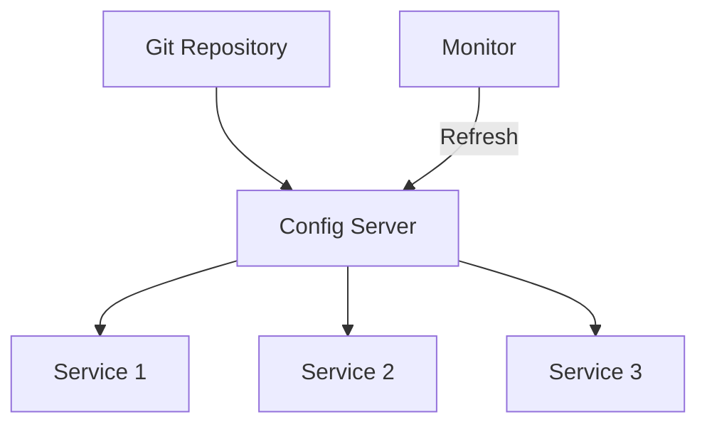
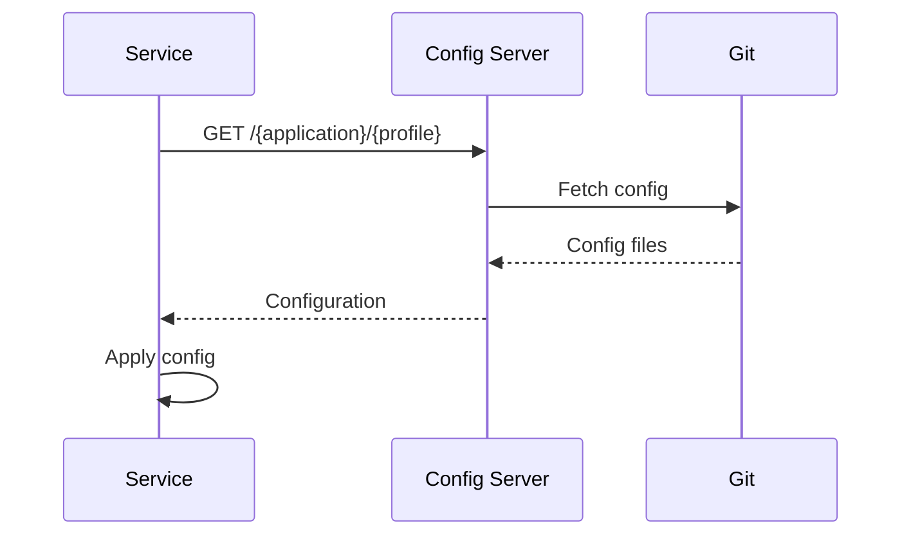

# 4. Config Server

## 1. Introduction
Spring Cloud Config provides centralized external configuration for microservices. It supports Git, SVN, and file system backends, enabling configuration management across environments.

## 2. Learning Objectives
- Understand centralized configuration
- Implement Spring Cloud Config Server
- Learn configuration sources
- Understand dynamic configuration
- Implement configuration encryption

## 3. Prerequisites
- Understanding of Spring Boot
- Knowledge of Git
- Familiarity with microservices

## 4. Why This Concept Exists
Centralized configuration provides:
- Single source of truth
- Environment-specific configs
- Dynamic configuration updates
- Configuration versioning

## 5. Problem Statement
Without centralized config:
- Configuration duplication
- Environment inconsistencies
- No dynamic updates
- Difficult to manage

## 6. Theory
Config Server components:
1. **Config Server**: Serves configuration
2. **Config Client**: Fetches configuration
3. **Backend**: Git, SVN, or file system
4. **Encryption**: Secure sensitive values

## 7. Internal Working
1. Config Server starts and connects to backend
2. Clients request configuration on startup
3. Server returns configuration as properties
4. Clients cache configuration locally
5. Refresh endpoint triggers updates

## 8. JVM Perspective
- Config Server runs as Spring Boot app
- Configuration loaded into Environment
- Clients fetch via REST
- Refresh uses @RefreshScope

## 9. Memory Representation
```yaml
# application.yml
spring:
  cloud:
    config:
      uri: http://localhost:8888
      name: order-service
      profile: production
```

## 10. Architecture Diagram


## 11. Flow Diagram


## 12. Syntax
```java
// Config Server
@SpringBootApplication
@EnableConfigServer
public class ConfigServerApplication {
    public static void main(String[] args) {
        SpringApplication.run(ConfigServerApplication.class, args);
    }
}

// Config Client
@RefreshScope
@RestController
public class ConfigController {
    @Value("${custom.property}")
    private String customProperty;
    
    @GetMapping("/config")
    public String getConfig() {
        return customProperty;
    }
}
```

## 13. Easy Example
```java
@SpringBootApplication
@EnableConfigServer
public class ConfigServer {
    public static void main(String[] args) {
        SpringApplication.run(ConfigServer.class, args);
    }
}

@SpringBootApplication
public class OrderService {
    @Value("${database.url}")
    private String databaseUrl;
    
    public static void main(String[] args) {
        SpringApplication.run(OrderService.class, args);
    }
}
```

## 14. Medium Example
```java
@Configuration
public class ConfigClientConfig {
    
    @Bean
    public ConfigClientProperties configClientProperties() {
        ConfigClientProperties properties = new ConfigClientProperties();
        properties.setUri("http://localhost:8888");
        properties.setName("order-service");
        properties.setProfile("production");
        properties.setLabel("main");
        return properties;
    }
}

@RefreshScope
@Service
public class FeatureService {
    
    @Value("${features.new-checkout.enabled:false}")
    private boolean newCheckoutEnabled;
    
    @Value("${features.dark-mode.enabled:false}")
    private boolean darkModeEnabled;
    
    public boolean isNewCheckoutEnabled() {
        return newCheckoutEnabled;
    }
}
```

## 15. Hard Example
```java
@Configuration
@EnableConfigServer
public class SecureConfigServer extends ConfigServerApplication {
    
    @Bean
    public EncryptionController encryptionController(KeyPair keyPair) {
        return new EncryptionController(keyPair);
    }
    
    @Bean
    public KeyPair keyPair() throws Exception {
        KeyPairGenerator generator = KeyPairGenerator.getInstance("RSA");
        generator.initialize(2048);
        return generator.generateKeyPair();
    }
}

@Component
public class ConfigRefreshListener {
    
    @EventListener
    public void handleRefresh(RefreshScopeRefreshedEvent event) {
        log.info("Configuration refreshed for: {}", event.getName());
    }
}

@RefreshScope
@Service
public class DynamicConfigService {
    
    @Value("${rate-limit.default:100}")
    private int defaultRateLimit;
    
    @Value("${cache.ttl:3600}")
    private int cacheTtl;
    
    @RefreshScope
    @Bean
    public CacheManager cacheManager() {
        return new ConcurrentMapCacheManager("features");
    }
}
```

## 16. Enterprise Example
```java
@SpringBootApplication
@EnableConfigServer
@Slf4j
public class EnterpriseConfigServer {
    
    @Bean
    public EnvironmentRepository environmentRepository() {
        return new GitEnvironmentRepository()
            .setUri("https://github.com/company/config-repo")
            .setSearchPaths("{application}-{profile}.yml")
            .setCloneOnStart(true);
    }
    
    @Bean
    public AuditService auditService() {
        return new AuditService();
    }
}

@Component
@Slf4j
public class ConfigChangeAuditor {
    
    @Autowired
    private AuditRepository auditRepository;
    
    @EventListener
    public void onRefresh(RefreshScopeRefreshedEvent event) {
        ConfigChangeAudit audit = ConfigChangeAudit.builder()
            .serviceName(event.getName())
            .timestamp(Instant.now())
            .changedBy(getCurrentUser())
            .build();
        
        auditRepository.save(audit);
        log.info("Config refresh audited for: {}", event.getName());
    }
}
```

## 17. Performance
- Config fetch: ~100-500ms (startup)
- Refresh: ~1-5s
- Cache hit: ~1ms
- Git operations: depends on repo size

## 18. Time & Space Complexity
- **Config Fetch**: O(n) where n is config size
- **Refresh**: O(n)
- **Encryption**: O(1)
- **Space**: O(n) for cached config

## 19. Thread Safety
- Config Server is thread-safe
- Environment is thread-safe
- RefreshScope uses proxy
- Cache must be thread-safe

## 20. Best Practices
1. Use Git for version control
2. Encrypt sensitive values
3. Use profiles for environments
4. Implement config refresh
5. Monitor config changes
6. Use config labels

## 21. Common Mistakes
1. Storing secrets in plain text
2. Not using profiles
3. Missing refresh mechanism
4. No config encryption
5. Not backing up config repo

## 22. Pitfalls
- Config server becomes SPOF
- Git repository failures
- Config drift
- Refresh race conditions

## 23. Debugging Tips
1. Check config server health
2. Verify Git connectivity
3. Test config fetch
4. Monitor refresh events
5. Check encryption keys

## 24. Comparison Table
| Feature | Spring Cloud Config | Consul | Apollo |
|---------|-------------------|--------|--------|
| Backend | Git/SVN/File | KV Store | Custom |
| UI | No | Yes | Yes |
| Dynamic | Yes | Yes | Yes |
| Encryption | Yes | Yes | Yes |

## 25. Decision Tree
```
Need Config Server?
├── Yes → Backend?
│   ├── Git → Spring Cloud Config
│   ├── KV Store → Consul
│   └── Full featured → Apollo
└── No → Application config
```

## 26. Interview Questions
1. What is Spring Cloud Config?
2. How does Config Server work?
3. What are the backend options?
4. How do you encrypt configuration?
5. What is @RefreshScope?
6. How do you handle configuration refresh?
7. What are best practices for config management?
8. How do you secure Config Server?
9. What is the difference between profiles and labels?
10. How do you test Config Server?
11. What is configuration drift?
12. How do you monitor config changes?
13. What is the role of Config Server in microservices?
14. How do you handle sensitive configuration?
15. What are alternatives to Spring Cloud Config?

## 27. Exercises
### Beginner
1. Set up Config Server with Git
2. Configure client to fetch config
3. Use profiles for environments

### Intermediate
1. Implement config encryption
2. Add config refresh
3. Create config audit logging

### Advanced
1. Implement high availability
2. Add config validation
3. Create custom backend

## 28. Summary
Spring Cloud Config provides centralized configuration management for microservices. Understanding configuration sources, encryption, and refresh mechanisms is essential for managing distributed systems.

## 29. References
- [Spring Cloud Config](https://spring.io/projects/spring-cloud-config)
- [Config Server Documentation](https://docs.spring.io/spring-cloud-config/docs/current/reference/html/)
