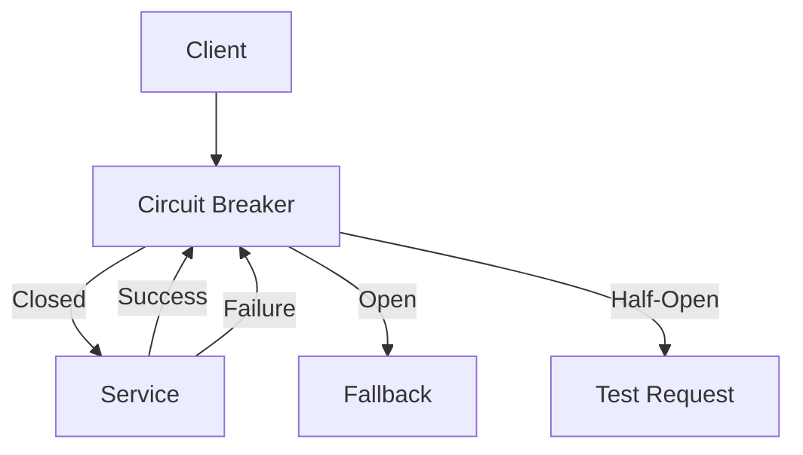

# 5. Circuit Breaker

## 1. Introduction
Circuit breaker pattern prevents cascading failures in microservices by detecting failures and providing fallback mechanisms. Resilience4j is a lightweight fault tolerance library for Java.

## 2. Learning Objectives
- Understand circuit breaker pattern
- Implement Resilience4j
- Learn fallback mechanisms
- Understand bulkhead pattern
- Implement rate limiting

## 3. Prerequisites
- Understanding of microservices
- Knowledge of fault tolerance concepts
- Familiarity with Spring Boot

## 4. Why This Concept Exists
Circuit breaker prevents:
- Cascading failures
- Resource exhaustion
- System overload
- Poor user experience

## 5. Problem Statement
Without circuit breaker:
- Failed services cause chain reaction
- Resources get exhausted
- System becomes unresponsive
- Recovery is difficult

## 6. Theory
Circuit breaker states:
1. **Closed**: Normal operation, requests pass through
2. **Open**: Failure threshold reached, requests fail fast
3. **Half-Open**: Testing if service recovered

Configuration:
- Failure rate threshold
- Slow call rate threshold
- Wait duration in open state
- Sliding window size

## 7. Internal Working
1. Circuit breaker monitors requests
2. If failures exceed threshold, circuit opens
3. Requests fail fast with fallback
4. After wait duration, circuit half-opens
5. If test requests succeed, circuit closes

## 8. JVM Perspective
- Circuit breaker state stored in memory
- Metrics collected per instance
- Thread-safe state transitions
- Non-blocking fallbacks

## 9. Memory Representation
```java
CircuitBreakerConfig config = CircuitBreakerConfig.custom()
    .failureRateThreshold(50)
    .waitDurationInOpenState(Duration.ofMillis(1000))
    .slidingWindowSize(10)
    .build();

CircuitBreaker circuitBreaker = CircuitBreaker.of("service", config);
```

## 10. Architecture Diagram


## 11. Flow Diagram
```mermaid
stateDiagram-v2
    [*] --> Closed
    Closed --> Open : Failure threshold
    Open --> Half-Open : Wait duration
    Half-Open --> Closed : Success
    Half-Open --> Open : Failure
```

## 12. Syntax
```java
@Service
public class OrderService {
    
    @CircuitBreaker(name = "userService", fallbackMethod = "getUserFallback")
    public User getUser(Long id) {
        return userClient.getUser(id);
    }
    
    public User getUserFallback(Long id, Exception e) {
        return User.defaultUser();
    }
}
```

## 13. Easy Example
```java
@Service
public class ProductService {
    
    @CircuitBreaker(name = "productService", fallbackMethod = "fallback")
    public Product getProduct(Long id) {
        return restTemplate.getForObject(
            "http://product-service/api/products/" + id, Product.class);
    }
    
    public Product fallback(Long id, Exception e) {
        return new Product(id, "Default Product", 0.0);
    }
}
```

## 14. Medium Example
```java
@Service
@Slf4j
public class ResilientOrderService {
    
    @Autowired
    private UserClient userClient;
    
    @Autowired
    private ProductClient productClient;
    
    @CircuitBreaker(name = "userService", fallbackMethod = "userFallback")
    @Retry(name = "userService")
    @TimeLimiter(name = "userService")
    public CompletableFuture<User> getUser(Long userId) {
        return CompletableFuture.supplyAsync(() -> 
            userClient.getUser(userId));
    }
    
    public CompletableFuture<User> userFallback(Long userId, Exception e) {
        log.warn("User service fallback for user: {}", userId);
        return CompletableFuture.completedFuture(User.unknown());
    }
    
    @CircuitBreaker(name = "productService", fallbackMethod = "productFallback")
    public Product getProduct(Long productId) {
        return productClient.getProduct(productId);
    }
    
    public Product fallback(Long productId, Exception e) {
        log.warn("Product service fallback for product: {}", productId);
        return Product.unavailable();
    }
}
```

## 15. Hard Example
```java
@Component
@Slf4j
public class CircuitBreakerConfig {
    
    @Bean
    public CircuitBreakerRegistry circuitBreakerRegistry() {
        CircuitBreakerConfig config = CircuitBreakerConfig.custom()
            .failureRateThreshold(50)
            .slowCallRateThreshold(80)
            .waitDurationInOpenState(Duration.ofSeconds(30))
            .slidingWindowType(SlidingWindowType.COUNT_BASED)
            .slidingWindowSize(10)
            .minimumNumberOfCalls(5)
            .permittedNumberOfCallsInHalfOpenState(3)
            .automaticTransitionFromOpenToHalfOpenEnabled(true)
            .recordExceptions(IOException.class, TimeoutException.class)
            .ignoreExceptions(BusinessException.class)
            .build();
        
        return CircuitBreakerRegistry.of(config);
    }
    
    @Bean
    public CircuitBreakerEventListener circuitBreakerEventListener() {
        return new CircuitBreakerEventListener() {
            @Override
            public void onStateTransition(StateTransitionEvent event) {
                log.info("Circuit breaker state transition: {}", event);
            }
        };
    }
}

@Service
@Slf4j
public class MonitoredOrderService {
    
    @Autowired
    private CircuitBreakerRegistry registry;
    
    @CircuitBreaker(name = "externalService", fallbackMethod = "fallback")
    @TimeLimiter(name = "externalService")
    @Retry(name = "externalService")
    public CompletableFuture<ExternalData> callExternalService(String request) {
        return CompletableFuture.supplyAsync(() -> {
            CircuitBreaker circuitBreaker = registry.circuitBreaker("externalService");
            
            return circuitBreaker.executeSupplier(() -> {
                log.debug("Calling external service");
                return externalClient.getData(request);
            });
        });
    }
    
    public CompletableFuture<ExternalData> fallback(String request, Exception e) {
        log.warn("External service fallback triggered: {}", e.getMessage());
        return CompletableFuture.completedFuture(ExternalData.fallback());
    }
}
```

## 16. Enterprise Example
```java
@Component
@Slf4j
public class EnterpriseCircuitBreaker {
    
    @Autowired
    private MeterRegistry meterRegistry;
    
    @Autowired
    private CircuitBreakerRegistry circuitBreakerRegistry;
    
    @PostConstruct
    public void init() {
        circuitBreakerRegistry.getEventPublisher()
            .onEvent(event -> {
                meterRegistry.counter("circuit_breaker.events",
                    "name", event.getCircuitBreakerName(),
                    "type", event.getEventType().name())
                    .increment();
            });
    }
    
    @CircuitBreaker(name = "paymentService", fallbackMethod = "paymentFallback")
    @TimeLimiter(name = "paymentService")
    @Bulkhead(name = "paymentService")
    @Retry(name = "paymentService")
    public CompletableFuture<PaymentResult> processPayment(PaymentRequest request) {
        return CompletableFuture.supplyAsync(() -> {
            log.info("Processing payment for order: {}", request.getOrderId());
            return paymentClient.process(request);
        });
    }
    
    public CompletableFuture<PaymentResult> paymentFallback(
            PaymentRequest request, Exception e) {
        
        log.error("Payment fallback triggered for order: {}", 
            request.getOrderId(), e);
        
        meterRegistry.counter("payment.fallback").increment();
        
        return CompletableFuture.completedFuture(
            PaymentResult.pending("Payment service unavailable"));
    }
}
```

## 17. Performance
- Circuit breaker check: ~1ms
- Fallback execution: ~1-10ms
- State transition: ~1ms
- Metrics collection: ~1ms

## 18. Time & Space Complexity
- **Request Evaluation**: O(1)
- **State Transition**: O(1)
- **Metrics Update**: O(1)
- **Space**: O(1) per circuit breaker

## 19. Thread Safety
- Circuit breaker is thread-safe
- State transitions are atomic
- Metrics collection is thread-safe
- Fallbacks must be thread-safe

## 20. Best Practices
1. Configure appropriate thresholds
2. Implement meaningful fallbacks
3. Monitor circuit breaker state
4. Use bulkhead for isolation
5. Combine with retry
6. Log state changes

## 21. Common Mistakes
1. No fallback implementation
2. Incorrect threshold configuration
3. Not monitoring state
4. Blocking fallbacks
5. Ignoring slow calls

## 22. Pitfalls
- Fallback cascade
- Incorrect state detection
- Resource leaks in fallbacks
- Missing timeout configuration

## 23. Debugging Tips
1. Monitor circuit breaker metrics
2. Log state transitions
3. Test fallback scenarios
4. Check timeout configuration
5. Verify threshold settings

## 24. Comparison Table
| Feature | Resilience4j | Hystrix | Sentinel |
|---------|--------------|---------|----------|
| Maintenance | Active | Maintenance | Active |
| Performance | High | Medium | High |
| Features | Rich | Rich | Rich |
| Learning | Medium | Low | Medium |

## 25. Decision Tree
```
Need Circuit Breaker?
├── Yes → Library?
│   ├── Spring Cloud → Resilience4j
│   ├── Legacy → Hystrix
│   └── Alibaba → Sentinel
└── No → Direct calls
```

## 26. Interview Questions
1. What is circuit breaker pattern?
2. What are the circuit breaker states?
3. How does Resilience4j work?
4. What is a fallback?
5. How do you configure circuit breaker?
6. What is bulkhead pattern?
7. How do you monitor circuit breakers?
8. What is rate limiting?
9. How do you test circuit breakers?
10. What are best practices?
11. What is the difference between circuit breaker and rate limiter?
12. How do you handle fallback failures?
13. What is slow call detection?
14. How do you combine circuit breaker with retry?
15. What are common circuit breaker configurations?

## 27. Exercises
### Beginner
1. Implement basic circuit breaker
2. Create fallback method
3. Test circuit breaker states

### Intermediate
1. Configure custom thresholds
2. Add monitoring metrics
3. Implement bulkhead

### Advanced
1. Create circuit breaker dashboard
2. Implement custom fallback logic
3. Add circuit breaker analytics

## 28. Summary
Circuit breaker is essential for building resilient microservices. Resilience4j provides a lightweight, flexible implementation with support for various fault tolerance patterns.

## 29. References
- [Resilience4j](https://resilience4j.readme.io/)
- [Circuit Breaker Pattern](https://martinfowler.com/bliki/CircuitBreaker.html)
- [Spring Cloud Circuit Breaker](https://spring.io/projects/spring-cloud-circuitbreaker)
