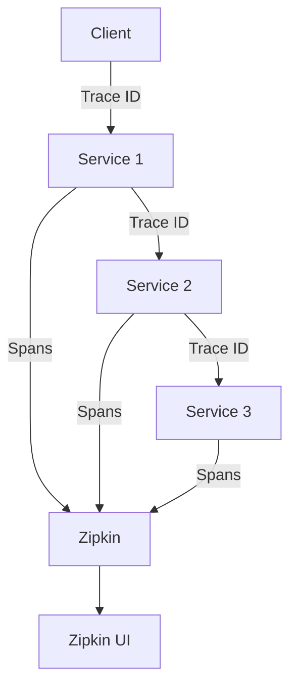
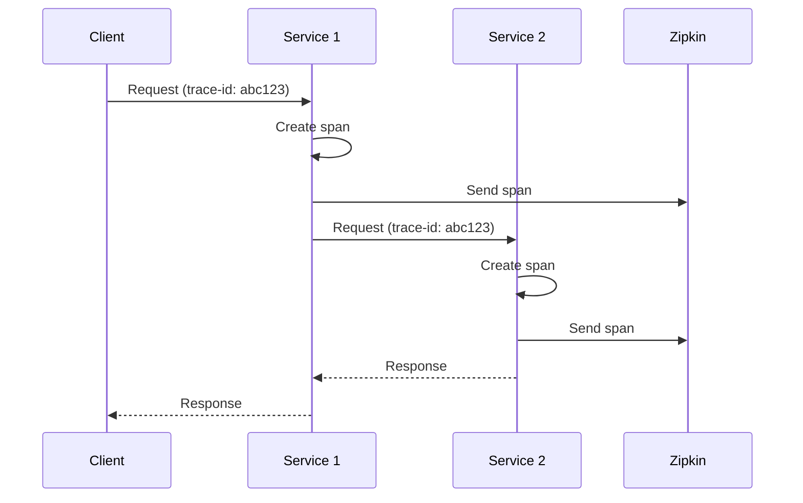

# 6. Distributed Tracing

## 1. Introduction
Distributed tracing tracks requests across microservices, providing visibility into system behavior. Spring Cloud Sleuth adds correlation IDs, and Zipkin provides trace visualization.

## 2. Learning Objectives
- Understand distributed tracing concepts
- Implement Spring Cloud Sleuth
- Set up Zipkin for visualization
- Learn trace correlation
- Understand span and trace concepts

## 3. Prerequisites
- Understanding of microservices
- Knowledge of Spring Boot
- Familiarity with logging concepts

## 4. Why This Concept Exists
Distributed tracing provides:
- Request tracking across services
- Performance monitoring
- Error debugging
- Dependency visualization

## 5. Problem Statement
Without distributed tracing:
- Difficult to track requests
- No visibility into bottlenecks
- Hard to debug failures
- No performance metrics

## 6. Theory
Tracing concepts:
1. **Trace**: Complete request journey
2. **Span**: Single operation within trace
3. **Trace ID**: Unique identifier for trace
4. **Span ID**: Unique identifier for span
5. **Correlation ID**: Links related logs

## 7. Internal Working
1. Sleuth adds trace headers to requests
2. Each service creates spans
3. Spans are sent to Zipkin
4. Zipkin stores and visualizes traces
5. Logs are correlated with trace IDs

## 8. JVM Perspective
- Sleuth instruments HTTP clients
- Spans stored in ThreadLocal
- Async export to Zipkin
- Minimal performance impact

## 9. Memory Representation
```java
// Trace context
Span currentSpan = tracer.currentSpan();
String traceId = currentSpan.context().traceId();
String spanId = currentSpan.context().spanId();
```

## 10. Architecture Diagram


## 11. Flow Diagram


## 12. Syntax
```java
// Application configuration
spring:
  zipkin:
    base-url: http://localhost:9411
  sleuth:
    sampler:
      probability: 1.0

// Programmatic span creation
@Autowired
private Tracer tracer;

Span span = tracer.nextSpan().name("myOperation").start();
try (Tracer.SpanInScope ws = tracer.withSpan(span)) {
    // Business logic
} finally {
    span.end();
}
```

## 13. Easy Example
```java
@SpringBootApplication
@Slf4j
public class TracedService {
    public static void main(String[] args) {
        SpringApplication.run(TracedService.class, args);
    }
    
    @GetMapping("/api/data")
    public String getData() {
        log.info("Processing request");
        return "data";
    }
}
```

## 14. Medium Example
```java
@Service
@Slf4j
public class OrderService {
    
    @Autowired
    private Tracer tracer;
    
    @Autowired
    private UserServiceClient userClient;
    
    public Order createOrder(CreateOrderRequest request) {
        Span span = tracer.nextSpan().name("createOrder").start();
        
        try (Tracer.SpanInScope ws = tracer.withSpan(span)) {
            log.info("Creating order for user: {}", request.getUserId());
            
            span.tag("userId", String.valueOf(request.getUserId()));
            
            User user = userClient.getUser(request.getUserId());
            
            Order order = new Order();
            order.setUserId(user.getId());
            
            log.info("Order created: {}", order.getId());
            
            return order;
        } finally {
            span.end();
        }
    }
}
```

## 15. Hard Example
```java
@Configuration
@Slf4j
public class TracingConfig {
    
    @Bean
    public Tracer tracer() {
        return new DefaultTracer();
    }
    
    @Bean
    public BravePropagationagationFactory propagationFactory() {
        return new BravePropagationagationFactory();
    }
}

@Component
@Slf4j
public class TracingInterceptor implements HandlerInterceptor {
    
    @Autowired
    private Tracer tracer;
    
    @Override
    public void preHandle(HttpServletRequest request, 
                         HttpServletResponse response, Object handler) {
        Span span = tracer.nextSpan().name(request.getRequestURI()).start();
        span.tag("http.method", request.getMethod());
        span.tag("http.url", request.getRequestURI());
        
        request.setAttribute("span", span);
        request.setAttribute("traceId", span.context().traceId());
        
        log.info("Request started: {} {}", 
            request.getMethod(), request.getRequestURI());
    }
    
    @Override
    public void afterCompletion(HttpServletRequest request,
                               HttpServletResponse response,
                               Object handler, Exception ex) {
        Span span = (Span) request.getAttribute("span");
        if (span != null) {
            span.tag("http.status", String.valueOf(response.getStatus()));
            if (ex != null) {
                span.error(ex);
            }
            span.finish();
        }
    }
}

@Service
@Slf4j
public class CorrelationService {
    
    public void logWithCorrelation(String message) {
        String traceId = MDC.get("traceId");
        String spanId = MDC.get("spanId");
        log.info("[{}, {}] {}", traceId, spanId, message);
    }
}
```

## 16. Enterprise Example
```java
@Component
@Slf4j
public class DistributedTracingService {
    
    @Autowired
    private Tracer tracer;
    
    @Autowired
    private MeterRegistry meterRegistry;
    
    public <T> T trace(String spanName, Supplier<T> operation) {
        Span span = tracer.nextSpan().name(spanName).start();
        
        try (Tracer.SpanInScope ws = tracer.withSpan(span)) {
            long startTime = System.currentTimeMillis();
            
            try {
                T result = operation.get();
                span.tag("result", "success");
                return result;
            } catch (Exception e) {
                span.tag("result", "error");
                span.error(e);
                throw e;
            } finally {
                long duration = System.currentTimeMillis() - startTime;
                span.tag("duration", String.valueOf(duration));
                span.finish();
                
                meterRegistry.timer("traced.operation",
                    "name", spanName)
                    .record(duration, TimeUnit.MILLISECONDS);
            }
        }
    }
}

@RestController
@RequestMapping("/api/orders")
@Slf4j
public class TracedOrderController {
    
    @Autowired
    private DistributedTracingService tracingService;
    
    @Autowired
    private OrderService orderService;
    
    @PostMapping
    public ResponseEntity<OrderDTO> createOrder(
            @RequestBody CreateOrderRequest request) {
        
        OrderDTO order = tracingService.trace("createOrder", () ->
            orderService.createOrder(request));
        
        return ResponseEntity.status(HttpStatus.CREATED).body(order);
    }
}
```

## 17. Performance
- Trace header propagation: ~1ms
- Span creation: ~1-5ms
- Async export: minimal impact
- Zipkin storage: depends on volume

## 18. Time & Space Complexity
- **Span Creation**: O(1)
- **Trace Propagation**: O(1)
- **Export**: O(n) where n is spans
- **Space**: O(n) for trace context

## 19. Thread Safety
- Trace context is thread-local
- Spans are thread-safe
- Export is asynchronous
- Zipkin client is thread-safe

## 20. Best Practices
1. Sample appropriately
2. Add meaningful tags
3. Correlate with logs
4. Monitor trace latency
5. Use correlation IDs
6. Implement trace sampling

## 21. Common Mistakes
1. Sampling too aggressively
2. Not adding meaningful tags
3. Missing trace propagation
4. Blocking on trace export
5. Not correlating logs

## 22. Pitfalls
- Performance overhead
- Storage requirements
- Sampling gaps
- Network failures

## 23. Debugging Tips
1. Check trace headers
2. Verify Zipkin connectivity
3. Test sampling rate
4. Monitor span export
5. Check log correlation

## 24. Comparison Table
| Feature | Sleuth+Zipkin | Jaeger | OpenTelemetry |
|---------|---------------|--------|---------------|
| Setup | Easy | Medium | Medium |
| UI | Yes | Yes | Yes |
| Features | Basic | Rich | Rich |
| Performance | High | High | High |

## 25. Decision Tree
```
Need Distributed Tracing?
├── Yes → Tool?
│   ├── Spring → Sleuth + Zipkin
│   ├── Kubernetes → Jaeger
│   └── Vendor neutral → OpenTelemetry
└── No → Logging only
```

## 26. Interview Questions
1. What is distributed tracing?
2. What is the difference between trace and span?
3. How does Spring Cloud Sleuth work?
4. What is Zipkin?
5. How do you propagate trace context?
6. What is sampling?
7. How do you correlate logs with traces?
8. What are best practices for tracing?
9. How do you trace async operations?
10. What is OpenTelemetry?
11. How do you monitor trace latency?
12. What are trace headers?
13. How do you trace database queries?
14. What is the performance impact of tracing?
15. How do you implement custom spans?

## 27. Exercises
### Beginner
1. Set up Sleuth and Zipkin
2. Create a trace across services
3. Add custom tags

### Intermediate
1. Implement log correlation
2. Create custom spans
3. Add trace sampling

### Advanced
1. Implement trace-based alerts
2. Create custom exporters
3. Add trace analytics

## 28. Summary
Distributed tracing is essential for debugging and monitoring microservices. Spring Cloud Sleuth and Zipkin provide a complete solution for tracking requests across services.

## 29. References
- [Spring Cloud Sleuth](https://spring.io/projects/spring-cloud-sleuth)
- [Zipkin](https://zipkin.io/)
- [OpenTelemetry](https://opentelemetry.io/)
