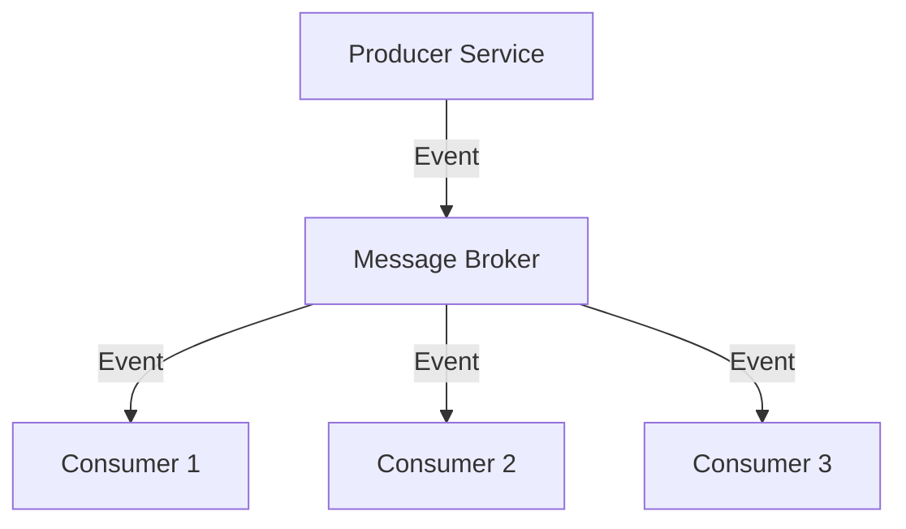
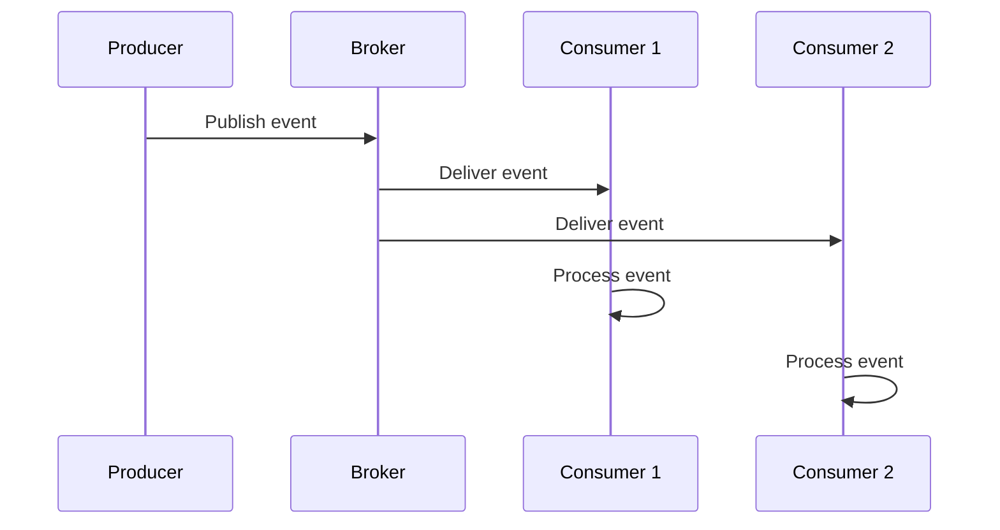

# 7. Event-Driven Architecture

## 1. Introduction
Event-driven architecture uses events to trigger communication between microservices. It enables loose coupling, scalability, and asynchronous processing through message brokers like Kafka and RabbitMQ.

## 2. Learning Objectives
- Understand event-driven concepts
- Learn event sourcing and CQRS
- Implement message brokers
- Understand async communication
- Learn event schemas

## 3. Prerequisites
- Understanding of microservices
- Knowledge of messaging concepts
- Familiarity with Spring Boot

## 4. Why This Concept Exists
Event-driven architecture provides:
- Loose coupling between services
- Scalability
- Async processing
- Audit trail

## 5. Problem Statement
Synchronous communication has issues:
- Tight coupling
- Performance bottlenecks
- No audit trail
- Difficult to scale

## 6. Theory
Event-driven patterns:
1. **Event Notification**: Simple event publication
2. **Event-Carried State Transfer**: Event contains full state
3. **Event Sourcing**: Store events, not state
4. **CQRS**: Separate read/write models

## 7. Internal Working
1. Service produces event
2. Event published to message broker
3. Consumer services receive event
4. Services update their state
5. Event stored for audit

## 8. JVM Perspective
- Kafka/RabbitMQ clients run in JVM
- Async event processing
- Event serialization with Avro/JSON
- Consumer groups for scaling

## 9. Memory Representation
```java
// Event definition
public class OrderCreatedEvent {
    private String eventId;
    private Long orderId;
    private Long userId;
    private LocalDateTime timestamp;
}

// Publishing event
kafkaTemplate.send("order-events", event);
```

## 10. Architecture Diagram


## 11. Flow Diagram


## 12. Syntax
```java
// Publishing events
@Service
public class OrderService {
    @Autowired
    private KafkaTemplate<String, Object> kafkaTemplate;
    
    public Order createOrder(CreateOrderRequest request) {
        Order order = orderRepository.save(new Order(request));
        kafkaTemplate.send("order-events", new OrderCreatedEvent(order));
        return order;
    }
}

// Consuming events
@KafkaListener(topics = "order-events")
public void handleOrderEvent(OrderCreatedEvent event) {
    // Process event
}
```

## 13. Easy Example
```java
@Service
public class OrderService {
    @Autowired
    private ApplicationEventPublisher eventPublisher;
    
    public Order createOrder(CreateOrderRequest request) {
        Order order = new Order(request);
        orderRepository.save(order);
        eventPublisher.publishEvent(new OrderCreatedEvent(order.getId()));
        return order;
    }
}

@Component
public class OrderEventHandler {
    @EventListener
    public void handleOrderCreated(OrderCreatedEvent event) {
        System.out.println("Order created: " + event.getOrderId());
    }
}
```

## 14. Medium Example
```java
@Service
@Slf4j
public class EventDrivenOrderService {
    
    @Autowired
    private KafkaTemplate<String, Object> kafkaTemplate;
    
    @Autowired
    private OrderRepository orderRepository;
    
    public Order createOrder(CreateOrderRequest request) {
        Order order = new Order(request);
        order.setStatus(OrderStatus.CREATED);
        orderRepository.save(order);
        
        OrderCreatedEvent event = OrderCreatedEvent.builder()
            .eventId(UUID.randomUUID().toString())
            .orderId(order.getId())
            .userId(order.getUserId())
            .total(order.getTotal())
            .timestamp(Instant.now())
            .build();
        
        kafkaTemplate.send("order-events", event);
        log.info("Order created event published: {}", event.getOrderId());
        
        return order;
    }
}

@Component
@Slf4j
public class OrderEventConsumer {
    
    @KafkaListener(topics = "order-events", groupId = "notification-service")
    public void handleOrderCreated(OrderCreatedEvent event) {
        log.info("Received order created event: {}", event.getOrderId());
        notificationService.sendOrderConfirmation(event);
    }
    
    @KafkaListener(topics = "payment-events", groupId = "order-service")
    public void handlePaymentCompleted(PaymentCompletedEvent event) {
        log.info("Payment completed for order: {}", event.getOrderId());
        orderService.updatePaymentStatus(event.getOrderId(), event.getPaymentId());
    }
}
```

## 15. Hard Example
```java
@Component
@Slf4j
public class EventSourcingService {
    
    @Autowired
    private EventStore eventStore;
    
    @Autowired
    private AggregateRepository aggregateRepository;
    
    public void processCommand(Command command) {
        Aggregate aggregate = aggregateRepository.load(command.getAggregateId());
        
        List<Event> events = aggregate.process(command);
        
        for (Event event : events) {
            eventStore.append(event);
            kafkaTemplate.send(getTopic(event), event);
        }
        
        aggregateRepository.save(aggregate);
    }
    
    public Aggregate rebuildAggregate(String aggregateId) {
        List<Event> events = eventStore.getEvents(aggregateId);
        
        Aggregate aggregate = AggregateFactory.create(aggregateId);
        for (Event event : events) {
            aggregate.apply(event);
        }
        
        return aggregate;
    }
}

@Service
@Slf4j
public class CQRSService {
    
    @Autowired
    private WriteRepository writeRepository;
    
    @Autowired
    private ReadRepository readRepository;
    
    @Transactional
    public void handleCommand(Command command) {
        Aggregate aggregate = writeRepository.load(command.getAggregateId());
        List<Event> events = aggregate.process(command);
        
        for (Event event : events) {
            writeRepository.save(event);
            updateReadModel(event);
        }
    }
    
    private void updateReadModel(Event event) {
        if (event instanceof OrderCreatedEvent) {
            OrderReadModel readModel = new OrderReadModel((OrderCreatedEvent) event);
            readRepository.save(readModel);
        }
    }
}
```

## 16. Enterprise Example
```java
@Configuration
@EnableKafka
public class KafkaConfig {
    
    @Bean
    public NewTopic orderEvents() {
        return TopicBuilder.name("order-events")
            .partitions(3)
            .replicas(3)
            .config(TopicConfig.RETENTION_MS_CONFIG, String.valueOf(Duration.ofDays(7).toMillis()))
            .build();
    }
    
    @Bean
    public ProducerFactory<String, Object> producerFactory() {
        Map<String, Object> config = new HashMap<>();
        config.put(ProducerConfig.BOOTSTRAP_SERVERS_CONFIG, "localhost:9092");
        config.put(ProducerConfig.KEY_SERIALIZER_CLASS_CONFIG, StringSerializer.class);
        config.put(ProducerConfig.VALUE_SERIALIZER_CLASS_CONFIG, JsonSerializer.class);
        config.put(ProducerConfig.ACKS_CONFIG, "all");
        return new DefaultKafkaProducerFactory<>(config);
    }
    
    @Bean
    public KafkaTemplate<String, Object> kafkaTemplate() {
        return new KafkaTemplate<>(producerFactory());
    }
}

@Service
@Slf4j
public class EnterpriseEventService {
    
    @Autowired
    private KafkaTemplate<String, Object> kafkaTemplate;
    
    @Autowired
    private MeterRegistry meterRegistry;
    
    @Transactional
    public void publishEvent(BaseEvent event) {
        try {
            kafkaTemplate.send(event.getTopic(), event.getKey(), event)
                .addCallback(
                    result -> {
                        log.debug("Event published: {}", event.getEventId());
                        meterRegistry.counter("events.published",
                            "topic", event.getTopic(),
                            "type", event.getClass().getSimpleName())
                            .increment();
                    },
                    ex -> {
                        log.error("Failed to publish event: {}", event.getEventId(), ex);
                        meterRegistry.counter("events.failed",
                            "topic", event.getTopic(),
                            "type", event.getClass().getSimpleName())
                            .increment();
                    }
                );
        } catch (Exception e) {
            log.error("Error publishing event", e);
            throw new EventPublishException("Failed to publish event", e);
        }
    }
}
```

## 17. Performance
- Event publishing: ~1-10ms
- Event consumption: ~1-100ms
- Kafka throughput: millions/sec
- Event storage: O(n)

## 18. Time & Space Complexity
- **Event Publishing**: O(1)
- **Event Consumption**: O(1)
- **Event Replay**: O(n)
- **Space**: O(n) for event store

## 19. Thread Safety
- Kafka clients are thread-safe
- Event consumers are thread-safe
- Event store must be thread-safe
- Aggregates must be thread-safe

## 20. Best Practices
1. Design events carefully
2. Use event versioning
3. Implement idempotent consumers
4. Monitor event processing
5. Use event schemas
6. Implement dead letter queues

## 21. Common Mistakes
1. Tight coupling in events
2. Not handling event failures
3. Missing event schemas
4. Not implementing idempotency
5. Ignoring event ordering

## 22. Pitfalls
- Event sprawl
- Event versioning issues
- Consumer lag
- Event storm

## 23. Debugging Tips
1. Monitor consumer lag
2. Check event schemas
3. Test event replay
4. Verify event ordering
5. Monitor event processing

## 24. Comparison Table
| Feature | Kafka | RabbitMQ | ActiveMQ |
|---------|-------|----------|----------|
| Throughput | High | Medium | Low |
| Ordering | Partition | Queue | Queue |
| Persistence | Yes | Optional | Yes |
| Consumer Groups | Yes | No | No |

## 25. Decision Tree
```
Need Event-Driven?
├── Yes → Broker?
│   ├── High throughput → Kafka
│   ├── Simple → RabbitMQ
│   └── Legacy → ActiveMQ
└── No → Synchronous
```

## 26. Interview Questions
1. What is event-driven architecture?
2. What is the difference between events and commands?
3. What is event sourcing?
4. What is CQRS?
5. How do you handle event ordering?
6. What is idempotency?
7. How do you monitor event processing?
8. What is a dead letter queue?
9. How do you version events?
10. What is event schema evolution?
11. How do you test event-driven systems?
12. What are the challenges of event-driven architecture?
13. How do you handle event failures?
14. What is the role of message brokers?
15. How do you implement event sourcing?

## 27. Exercises
### Beginner
1. Implement event publishing
2. Create event consumers
3. Test event processing

### Intermediate
1. Implement event sourcing
2. Add CQRS pattern
3. Create event versioning

### Advanced
1. Implement saga pattern
2. Create event store
3. Add event analytics

## 28. Summary
Event-driven architecture enables loose coupling and scalability in microservices. Understanding events, message brokers, and patterns like event sourcing and CQRS is essential for building responsive systems.

## 29. References
- [Event-Driven Architecture](https://martinfowler.com/articles/201701-event-driven.html)
- [Apache Kafka](https://kafka.apache.org/)
- [Event Sourcing](https://martinfowler.com/eaaDev/EventSourcing.html)
