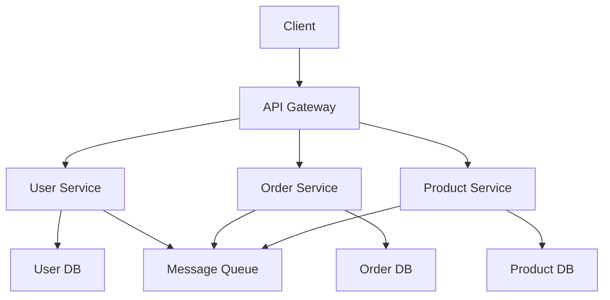

# Module 18: Microservices

## Overview
Microservices architecture structures applications as a collection of small, autonomous services. Each service is independently deployable, scalable, and maintains its own data store.

## Learning Objectives
- Understand microservices principles
- Design service boundaries
- Implement service communication
- Handle distributed challenges
- Apply microservices patterns

## Prerequisites
- REST API design
- Spring Boot
- Container basics

## Why This Concept Exists
Monolithic applications have:
- Tight coupling
- Scaling limitations
- Deployment risks
- Technology lock-in

Microservices provide:
- Independent deployment
- Technology diversity
- Fault isolation
- Scalability

## Problem Statement
How do you decompose applications into scalable, maintainable services?

## Theory

### Microservices Principles

| Principle | Description |
|-----------|-------------|
| Single Responsibility | One service, one job |
| Autonomy | Independent development |
| Decentralized | Own data store |
| Resilience | Failure isolation |
| Scalability | Independent scaling |

### Communication Patterns

| Pattern | Description |
|---------|-------------|
| Synchronous | REST, gRPC |
| Asynchronous | Messaging, events |
| Service Discovery | Locate services |
| API Gateway | Single entry point |

## Internal Working

### Service Communication
```
Service A → HTTP/gRPC → Service B
         ← Response ←

Service A → Message Queue → Service B
```

### Service Discovery
```
Service → Registry ← Service
         (Eureka)
```

## JVM Perspective

### Spring Cloud
- Service Discovery (Eureka)
- Configuration (Config)
- Circuit Breaker (Resilience4j)
- Gateway (Spring Cloud Gateway)

## Architecture Diagram



## Syntax

### Service Definition
```java
@RestController
@RequestMapping("/api/users")
public class UserController {
    
    @GetMapping("/{id}")
    public ResponseEntity<UserDTO> getUser(@PathVariable Long id) {
        return ResponseEntity.ok(userService.findById(id));
    }
}

@Service
public class UserService {
    
    @CircuitBreaker(name = "userService", fallbackMethod = "fallback")
    public UserDTO findById(Long id) {
        return userRepository.findById(id)
            .map(UserMapper::toDTO)
            .orElseThrow(() -> new UserNotFoundException(id));
    }
    
    public UserDTO fallback(Long id, Exception e) {
        return new UserDTO(id, "Unknown", "unknown@example.com");
    }
}
```

### Inter-Service Communication
```java
@Service
public class OrderService {
    
    private final WebClient webClient;
    
    public OrderService(WebClient.Builder builder) {
        this.webClient = builder.baseUrl("http://user-service").build();
    }
    
    @CircuitBreaker(name = "orderService", fallbackMethod = "fallback")
    public UserDTO getUser(Long userId) {
        return webClient.get()
            .uri("/api/users/{id}", userId)
            .retrieve()
            .bodyToMono(UserDTO.class)
            .block();
    }
}
```

## Easy Example
```java
@RestController
@RequestMapping("/api/orders")
public class OrderController {
    
    @PostMapping
    public ResponseEntity<OrderDTO> createOrder(@RequestBody CreateOrderRequest request) {
        OrderDTO order = orderService.create(request);
        return ResponseEntity.ok(order);
    }
    
    @GetMapping("/{id}")
    public ResponseEntity<OrderDTO> getOrder(@PathVariable Long id) {
        return orderService.findById(id)
            .map(ResponseEntity::ok)
            .orElse(ResponseEntity.notFound().build());
    }
}
```

## Medium Example
```java
@Service
public class OrderService {
    
    private final OrderRepository orderRepository;
    private final UserServiceClient userClient;
    private final ProductServiceClient productClient;
    
    @Transactional
    public OrderDTO createOrder(CreateOrderRequest request) {
        // Validate user
        UserDTO user = userClient.getUser(request.getUserId());
        if (user == null) {
            throw new UserNotFoundException(request.getUserId());
        }
        
        // Validate products
        for (OrderItem item : request.getItems()) {
            ProductDTO product = productClient.getProduct(item.getProductId());
            if (product == null) {
                throw new ProductNotFoundException(item.getProductId());
            }
        }
        
        // Create order
        Order order = Order.create(request);
        orderRepository.save(order);
        
        return OrderMapper.toDTO(order);
    }
    
    @CircuitBreaker(name = "userService", fallbackMethod = "userFallback")
    public UserDTO userFallback(Long userId, Exception e) {
        return new UserDTO(userId, "Unknown", "unknown@example.com");
    }
}
```

## Hard Example
```java
@Service
public class DistributedTransactionService {
    
    private final OrderRepository orderRepository;
    private final PaymentServiceClient paymentClient;
    private final InventoryServiceClient inventoryClient;
    private final KafkaTemplate<String, Object> kafkaTemplate;
    
    @Transactional
    public OrderDTO processOrder(CreateOrderRequest request) {
        // Create order
        Order order = Order.create(request);
        order.setStatus(OrderStatus.PENDING);
        orderRepository.save(order);
        
        // Reserve inventory
        boolean reserved = inventoryClient.reserve(
            request.getItems().stream()
                .map(item -> new ReservationRequest(item.getProductId(), item.getQuantity()))
                .toList()
        );
        
        if (!reserved) {
            order.setStatus(OrderStatus.FAILED);
            orderRepository.save(order);
            throw new InventoryException("Insufficient inventory");
        }
        
        // Process payment
        boolean paid = paymentClient.charge(order.getId(), order.getTotal());
        
        if (!paid) {
            inventoryClient.release(order.getId());
            order.setStatus(OrderStatus.PAYMENT_FAILED);
            orderRepository.save(order);
            throw new PaymentException("Payment failed");
        }
        
        // Complete order
        order.setStatus(OrderStatus.COMPLETED);
        orderRepository.save(order);
        
        // Publish event
        kafkaTemplate.send("order-events", new OrderCompletedEvent(order.getId()));
        
        return OrderMapper.toDTO(order);
    }
}
```

## Enterprise Example
```java
@Configuration
public class MicroserviceConfig {
    
    @Bean
    @LoadBalanced
    public WebClient.Builder webClientBuilder() {
        return WebClient.builder();
    }
    
    @Bean
    public CircuitBreakerFactory circuitBreakerFactory() {
        return new Resilience4jCircuitBreakerFactory();
    }
}

@Service
public class ResilientService {
    
    @CircuitBreaker(name = "externalService", fallbackMethod = "fallback")
    @Retry(name = "externalService")
    @TimeLimiter(name = "externalService")
    public CompletableFuture<String> callExternalService(String request) {
        return CompletableFuture.supplyAsync(() -> {
            // Call external service
            return webClient.get()
                .uri("/api/external")
                .retrieve()
                .bodyToMono(String.class)
                .block();
        });
    }
    
    public CompletableFuture<String> fallback(String request, Exception e) {
        return CompletableFuture.completedFuture("Fallback response");
    }
}
```

## Performance Considerations
- Use async communication
- Implement caching
- Use circuit breakers
- Monitor service health

## Best Practices
1. Design bounded contexts
2. Use API gateway
3. Implement circuit breakers
4. Centralize configuration
5. Monitor everything

## Common Mistakes
1. Too many services
2. Distributed monolith
3. Ignoring network latency
4. Not handling failures

## Comparison Table

| Aspect | Monolith | Microservices |
|--------|----------|---------------|
| Deployment | Single | Independent |
| Scaling | Vertical | Horizontal |
| Technology | Single | Diverse |
| Complexity | Low | High |

## Interview Questions

### Q1: What are microservices?
**Answer:** Architecture pattern of small, autonomous services.

### Q2: What is service discovery?
**Answer:** Mechanism for services to find each other.

### Q3: What is API gateway?
**Answer:** Single entry point for all client requests.

### Q4: What is circuit breaker?
**Answer:** Pattern to prevent cascade failures.

### Q5: What is the difference between monolith and microservices?
**Answer:** Monolith is single unit, microservices are decomposed.

## Summary
Microservices enable scalable, maintainable applications through decomposition.

## References
- Microservices Patterns
- Spring Cloud Documentation
- Building Microservices
