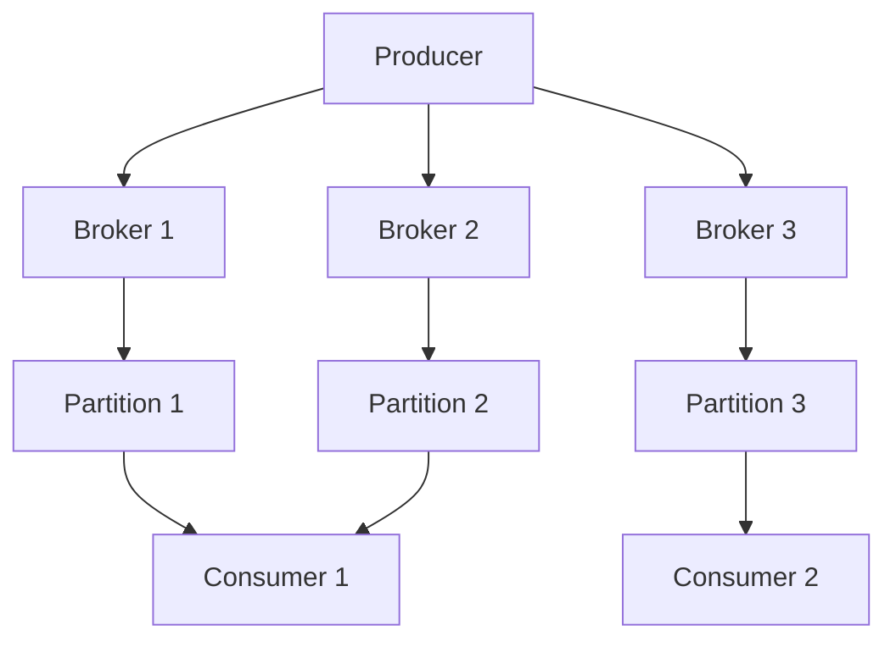
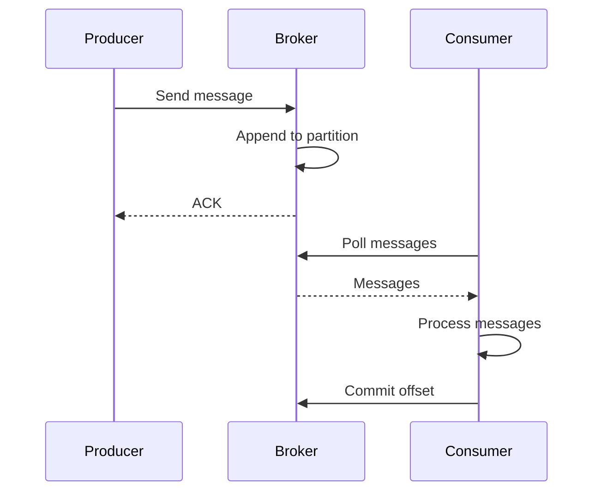

# 1. Kafka Fundamentals

## 1. Introduction
Apache Kafka is a distributed event streaming platform capable of handling trillions of events per day. It provides high-throughput, fault-tolerant, and scalable messaging.

## 2. Learning Objectives
- Understand Kafka architecture
- Learn brokers, topics, and partitions
- Understand consumer groups
- Learn Kafka replication
- Understand message delivery semantics

## 3. Prerequisites
- Understanding of messaging concepts
- Knowledge of distributed systems
- Familiarity with Java

## 4. Why This Concept Exists
Kafka provides:
- High throughput messaging
- Fault tolerance
- Horizontal scalability
- Event streaming

## 5. Problem Statement
Traditional messaging systems face:
- Limited throughput
- Single points of failure
- Difficult scaling
- No event replay

## 6. Theory
Kafka components:
1. **Broker**: Kafka server instance
2. **Topic**: Category of messages
3. **Partition**: Topic subdivision for parallelism
4. **Consumer Group**: Group of consumers
5. **Offset**: Message position in partition

## 7. Internal Working
1. Producer sends message to topic
2. Message is appended to partition
3. Partition is replicated across brokers
4. Consumer polls messages
5. Consumer commits offset

## 8. JVM Perspective
- Kafka runs on JVM (Scala/Java)
- Zero-copy transfers
- Page caching for performance
- Batch processing

## 9. Memory Representation
```java
// Topic configuration
Properties props = new Properties();
props.put("bootstrap.servers", "localhost:9092");
props.put("key.serializer", "org.apache.kafka.common.serialization.StringSerializer");
props.put("value.serializer", "org.apache.kafka.common.serialization.StringSerializer");
```

## 10. Architecture Diagram


## 11. Flow Diagram


## 12. Syntax
```java
// Producer
KafkaProducer<String, String> producer = new KafkaProducer<>(props);
producer.send(new ProducerRecord<>("topic", "key", "value"));

// Consumer
KafkaConsumer<String, String> consumer = new KafkaConsumer<>(props);
consumer.subscribe(Arrays.asList("topic"));
while (true) {
    ConsumerRecords<String, String> records = consumer.poll(Duration.ofMillis(100));
    for (ConsumerRecord<String, String> record : records) {
        System.out.println(record.value());
    }
}
```

## 13. Easy Example
```java
Properties props = new Properties();
props.put("bootstrap.servers", "localhost:9092");
props.put("key.serializer", StringSerializer.class);
props.put("value.serializer", StringSerializer.class);

KafkaProducer<String, String> producer = new KafkaProducer<>(props);
producer.send(new ProducerRecord<>("test-topic", "key", "hello kafka"));
producer.flush();
producer.close();
```

## 14. Medium Example
```java
Properties producerProps = new Properties();
producerProps.put("bootstrap.servers", "localhost:9092");
producerProps.put("acks", "all");
producerProps.put("retries", 3);
producerProps.put("key.serializer", StringSerializer.class);
producerProps.put("value.serializer", StringSerializer.class);

KafkaProducer<String, String> producer = new KafkaProducer<>(producerProps);

for (int i = 0; i < 10; i++) {
    String key = "key-" + i;
    String value = "message-" + i;
    producer.send(new ProducerRecord<>("my-topic", key, value));
}
producer.flush();
```

## 15. Hard Example
```java
Properties props = new Properties();
props.put("bootstrap.servers", "localhost:9092");
props.put("group.id", "my-group");
props.put("enable.auto.commit", "false");
props.put("key.deserializer", StringDeserializer.class);
props.put("value.deserializer", StringDeserializer.class);

KafkaConsumer<String, String> consumer = new KafkaConsumer<>(props);
consumer.subscribe(Arrays.asList("my-topic"));

try {
    while (true) {
        ConsumerRecords<String, String> records = consumer.poll(Duration.ofMillis(100));
        for (ConsumerRecord<String, String> record : records) {
            System.out.printf("key=%s, value=%s, partition=%d, offset=%d%n",
                record.key(), record.value(), record.partition(), record.offset());
        }
        consumer.commitSync();
    }
} finally {
    consumer.close();
}
```

## 16. Enterprise Example
```java
@Configuration
public class KafkaConfig {
    
    @Value("${spring.kafka.bootstrap-servers}")
    private String bootstrapServers;
    
    @Bean
    public ProducerFactory<String, String> producerFactory() {
        Map<String, Object> config = new HashMap<>();
        config.put(ProducerConfig.BOOTSTRAP_SERVERS_CONFIG, bootstrapServers);
        config.put(ProducerConfig.ACKS_CONFIG, "all");
        config.put(ProducerConfig.RETRIES_CONFIG, 3);
        config.put(ProducerConfig.KEY_SERIALIZER_CLASS_CONFIG, StringSerializer.class);
        config.put(ProducerConfig.VALUE_SERIALIZER_CLASS_CONFIG, JsonSerializer.class);
        return new DefaultKafkaProducerFactory<>(config);
    }
    
    @Bean
    public KafkaTemplate<String, String> kafkaTemplate() {
        return new KafkaTemplate<>(producerFactory());
    }
}
```

## 17. Performance
- Throughput: millions of messages/sec
- Latency: milliseconds
- Storage: disk-based, persistent
- Replication: configurable

## 18. Time & Space Complexity
- **Produce**: O(1)
- **Consume**: O(1) per message
- **Partition Lookup**: O(1)
- **Space**: O(n) where n is messages

## 19. Thread Safety
- Producer is thread-safe
- Consumer is NOT thread-safe
- Partition assignment is thread-safe
- Offset commits are thread-safe

## 20. Best Practices
1. Use appropriate partition count
2. Configure replication factor
3. Implement consumer groups
4. Monitor consumer lag
5. Use compression
6. Implement dead letter queues

## 21. Common Mistakes
1. Not enough partitions
2. Wrong serialization
3. Not handling rebalances
4. Ignoring consumer lag
5. No monitoring

## 22. Pitfalls
- Consumer rebalances
- Message ordering only within partition
- At-least-once delivery
- Disk space issues

## 23. Debugging Tips
1. Check broker connectivity
2. Verify topic exists
3. Monitor consumer lag
4. Check serialization
5. Review broker logs

## 24. Comparison Table
| Feature | Kafka | RabbitMQ | ActiveMQ |
|---------|-------|----------|----------|
| Throughput | High | Medium | Low |
| Ordering | Partition | Queue | Queue |
| Persistence | Yes | Optional | Yes |
| Consumer Groups | Yes | No | No |

## 25. Decision Tree
```
Need Messaging?
├── Yes → Type?
│   ├── Event Streaming → Kafka
│   ├── Task Queue → RabbitMQ
│   └── Legacy → ActiveMQ
└── No → REST only
```

## 26. Interview Questions
1. What is Kafka?
2. What are the main components?
3. What is a partition?
4. What is a consumer group?
5. How does Kafka ensure durability?
6. What is offset management?
7. How do you handle consumer rebalances?
8. What are delivery semantics?
9. How do you monitor Kafka?
10. What are best practices?
11. What is the difference between Kafka and RabbitMQ?
12. How do you scale Kafka?
13. What is message retention?
14. How do you handle late-arriving data?
15. What is exactly-once semantics?

## 27. Exercises
### Beginner
1. Set up Kafka locally
2. Create a topic
3. Produce and consume messages

### Intermediate
1. Implement consumer groups
2. Add message partitioning
3. Configure replication

### Advanced
1. Implement exactly-once semantics
2. Create Kafka Streams application
3. Build custom partitioner

## 28. Summary
Kafka is a powerful event streaming platform for building real-time data pipelines. Understanding its architecture, components, and best practices is essential for building scalable messaging systems.

## 29. References
- [Apache Kafka](https://kafka.apache.org/)
- [Kafka Documentation](https://kafka.apache.org/documentation/)
- [Spring Kafka](https://spring.io/projects/spring-kafka)
