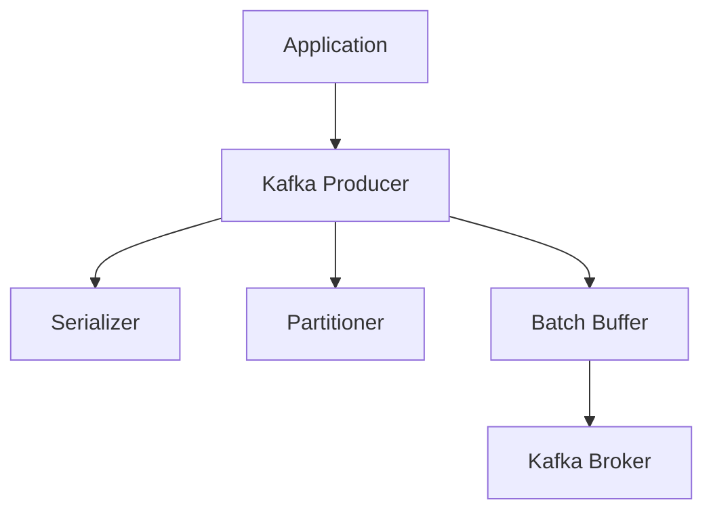
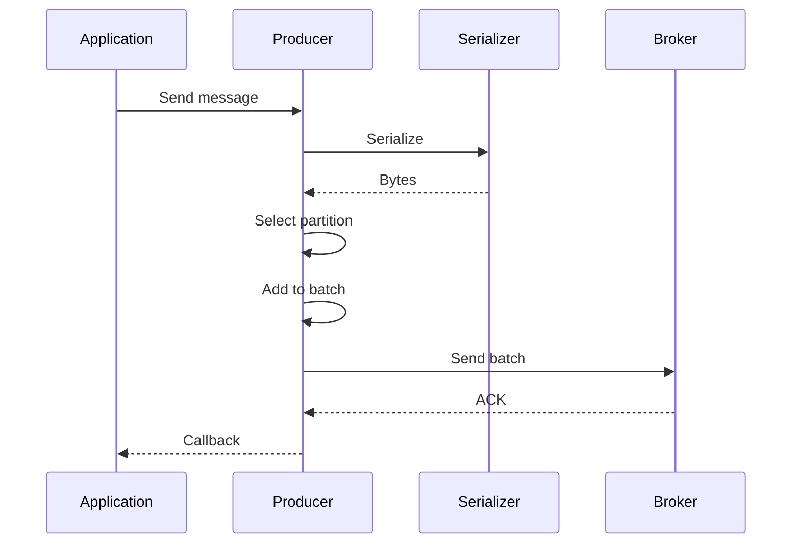

# 2. Kafka Producer

## 1. Introduction
Kafka producers are responsible for publishing messages to Kafka topics. They handle partitioning, serialization, and delivery guarantees.

## 2. Learning Objectives
- Understand producer configuration
- Learn message serialization
- Understand acknowledgment modes
- Implement error handling
- Learn producer batching

## 3. Prerequisites
- Understanding of Kafka fundamentals
- Knowledge of Java serialization
- Familiarity with configuration

## 4. Why This Concept Exists
Producers provide:
- Message publishing
- Partitioning strategy
- Delivery guarantees
- Error handling

## 5. Problem Statement
Without proper producer configuration:
- Message loss
- Poor performance
- Ordering issues
- Error handling failures

## 6. Theory
Producer components:
1. **Serializer**: Converts objects to bytes
2. **Partitioner**: Determines target partition
3. **Batching**: Groups messages for efficiency
4. **Acks**: Delivery confirmation

## 7. Internal Working
1. Producer receives message
2. Serializer converts to bytes
3. Partitioner selects partition
4. Message added to batch
5. Batch sent to broker
6. ACK received

## 8. JVM Perspective
- Producer is thread-safe
- Uses background threads for sending
- Batch buffer in memory
- Compression at producer or broker

## 9. Memory Representation
```java
ProducerRecord<String, String> record = new ProducerRecord<>(
    "topic",      // topic
    "key",        // key
    "value"       // value
);
```

## 10. Architecture Diagram


## 11. Flow Diagram


## 12. Syntax
```java
Properties props = new Properties();
props.put("bootstrap.servers", "localhost:9092");
props.put("key.serializer", StringSerializer.class);
props.put("value.serializer", StringSerializer.class);
props.put("acks", "all");
props.put("retries", 3);

KafkaProducer<String, String> producer = new KafkaProducer<>(props);
producer.send(new ProducerRecord<>("topic", "key", "value"));
```

## 13. Easy Example
```java
Properties props = new Properties();
props.put("bootstrap.servers", "localhost:9092");
props.put("key.serializer", StringSerializer.class);
props.put("value.serializer", StringSerializer.class);

KafkaProducer<String, String> producer = new KafkaProducer<>(props);
producer.send(new ProducerRecord<>("test-topic", "key", "value"));
producer.flush();
producer.close();
```

## 14. Medium Example
```java
Properties props = new Properties();
props.put("bootstrap.servers", "localhost:9092");
props.put("key.serializer", StringSerializer.class);
props.put("value.serializer", StringSerializer.class);
props.put("acks", "all");
props.put("retries", 3);
props.put("linger.ms", 10);
props.put("batch.size", 16384);

KafkaProducer<String, String> producer = new KafkaProducer<>(props);

for (int i = 0; i < 100; i++) {
    ProducerRecord<String, String> record = new ProducerRecord<>(
        "my-topic", "key-" + i, "value-" + i);
    
    producer.send(record, (metadata, exception) -> {
        if (exception != null) {
            exception.printStackTrace();
        } else {
            System.out.printf("Sent to partition %d, offset %d%n",
                metadata.partition(), metadata.offset());
        }
    });
}
producer.flush();
```

## 15. Hard Example
```java
@Component
public class ReliableProducer {
    
    @Autowired
    private KafkaTemplate<String, Object> kafkaTemplate;
    
    public CompletableFuture<SendResult<String, Object>> send(String topic, 
            String key, Object value) {
        
        return kafkaTemplate.send(topic, key, value)
            .completable()
            .whenComplete((result, ex) -> {
                if (ex != null) {
                    log.error("Failed to send message to topic: {}", topic, ex);
                } else {
                    log.debug("Message sent to partition {}, offset {}",
                        result.getRecordMetadata().partition(),
                        result.getRecordMetadata().offset());
                }
            });
    }
    
    public void sendSync(String topic, String key, Object value) {
        try {
            kafkaTemplate.send(topic, key, value).get(5, TimeUnit.SECONDS);
        } catch (Exception e) {
            log.error("Sync send failed", e);
            throw new MessagingException("Failed to send message", e);
        }
    }
}
```

## 16. Enterprise Example
```java
@Component
@Slf4j
public class EnterpriseProducer {
    
    @Autowired
    private KafkaTemplate<String, Object> kafkaTemplate;
    
    @Autowired
    private MeterRegistry meterRegistry;
    
    @Transactional
    public void publishEvent(BaseEvent event) {
        try {
            kafkaTemplate.send(event.getTopic(), event.getKey(), event)
                .addCallback(
                    result -> {
                        meterRegistry.counter("kafka.produced",
                            "topic", event.getTopic())
                            .increment();
                    },
                    ex -> {
                        log.error("Failed to publish event", ex);
                        meterRegistry.counter("kafka.produce.failed",
                            "topic", event.getTopic())
                            .increment();
                        throw new EventPublishException("Failed to publish", ex);
                    }
                );
        } catch (Exception e) {
            log.error("Error publishing event", e);
            throw e;
        }
    }
}
```

## 17. Performance
- Batch size affects throughput
- Compression reduces network usage
- Linger time increases latency
- Acks=all impacts throughput

## 18. Time & Space Complexity
- **Send**: O(1)
- **Batch**: O(b) where b is batch size
- **Space**: O(b) for batch buffer

## 19. Thread Safety
- Producer is thread-safe
- Callbacks run on producer threads
- Partitioner must be thread-safe
- Serializer must be thread-safe

## 20. Best Practices
1. Use all partitions
2. Configure retries
3. Use callbacks for monitoring
4. Batch messages
5. Use compression
6. Handle errors gracefully

## 21. Common Mistakes
1. Not flushing producer
2. Ignoring send callbacks
3. Not configuring retries
4. Using wrong serializers
5. No error handling

## 22. Pitfalls
- Message ordering not guaranteed across partitions
- Retries can cause duplicates
- Batch timeout issues
- Memory pressure from batching

## 23. Debugging Tips
1. Check broker connectivity
2. Verify serialization
3. Monitor producer metrics
4. Check acks configuration
5. Review producer logs

## 24. Comparison Table
| Config | acks=0 | acks=1 | acks=all |
|--------|--------|--------|----------|
| Performance | High | Medium | Low |
| Durability | None | Leader | All replicas |
| Use Case | Logs | General | Critical |

## 25. Decision Tree
```
Need Producer?
├── Yes → Delivery Guarantee?
│   ├── At-most-once → acks=0
│   ├── At-least-once → acks=all + retries
│   └── Exactly-once → Transactions
└── No → Consumer only
```

## 26. Interview Questions
1. What is a Kafka producer?
2. What are the main configurations?
3. What is the difference between acks modes?
4. How does batching work?
5. What is serialization?
6. How do you handle producer errors?
7. What is the difference between send and flush?
8. How do you ensure message ordering?
9. What are best practices for producers?
10. How do you monitor producer performance?
11. What is message compression?
12. How do you implement retries?
13. What is the difference between async and sync send?
14. How do you handle producer rebalances?
15. What is idempotent producer?

## 27. Exercises
### Beginner
1. Create a basic producer
2. Send messages with keys
3. Implement error handling

### Intermediate
1. Add batching configuration
2. Implement callbacks
3. Add compression

### Advanced
1. Implement transactions
2. Create custom partitioner
3. Add metrics collection

## 28. Summary
Kafka producers are essential for publishing messages. Understanding configuration, serialization, and delivery guarantees ensures reliable message delivery.

## 29. References
- [Kafka Producer](https://kafka.apache.org/documentation/#producerconfigs)
- [Spring Kafka](https://spring.io/projects/spring-kafka)
