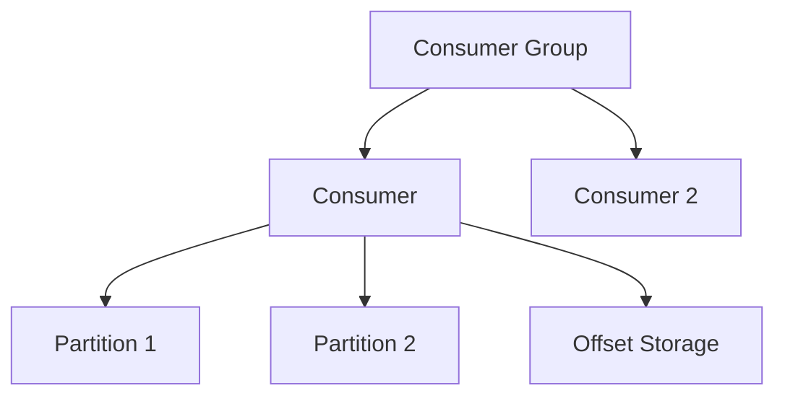
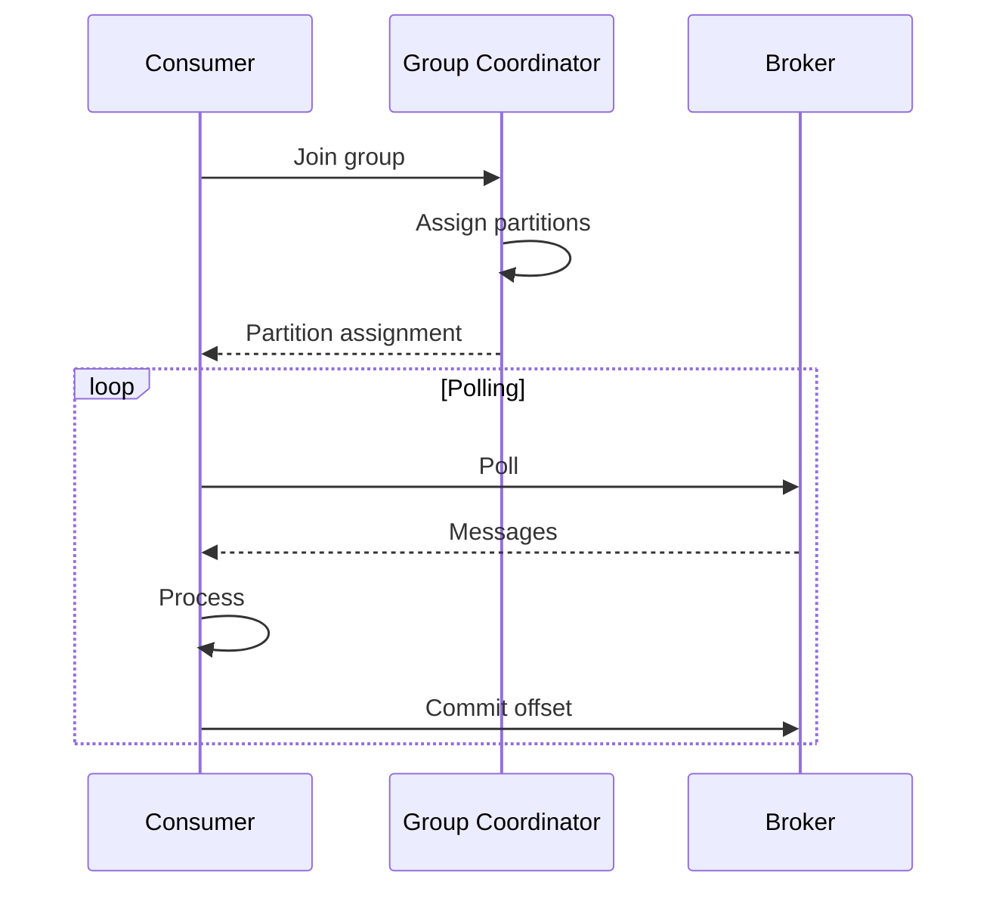

# 3. Kafka Consumer

## 1. Introduction
Kafka consumers read messages from topics. They handle deserialization, offset management, and consumer group coordination.

## 2. Learning Objectives
- Understand consumer configuration
- Learn consumer groups
- Understand offset management
- Implement error handling
- Learn rebalancing

## 3. Prerequisites
- Understanding of Kafka fundamentals
- Knowledge of Java collections
- Familiarity with threading

## 4. Why This Concept Exists
Consumers provide:
- Message consumption
- Group coordination
- Offset tracking
- Parallel processing

## 5. Problem Statement
Without proper consumer design:
- Message loss
- Duplicate processing
- Rebalance issues
- Performance problems

## 6. Theory
Consumer components:
1. **Consumer Group**: Coordinates partition assignment
2. **Offset**: Tracks consumption position
3. **Deserializer**: Converts bytes to objects
4. **Poll**: Fetches messages from broker

## 7. Internal Working
1. Consumer joins group
2. Coordinator assigns partitions
3. Consumer polls for messages
4. Messages deserialized
5. Messages processed
6. Offset committed

## 8. JVM Perspective
- Consumer is single-threaded
- Uses background thread for polling
- Offset commits are synchronous
- Rebalancing is coordinated

## 9. Memory Representation
```java
ConsumerRecords<String, String> records = consumer.poll(Duration.ofMillis(100));
for (ConsumerRecord<String, String> record : records) {
    System.out.println(record.key() + ": " + record.value());
}
```

## 10. Architecture Diagram


## 11. Flow Diagram


## 12. Syntax
```java
Properties props = new Properties();
props.put("bootstrap.servers", "localhost:9092");
props.put("group.id", "my-group");
props.put("enable.auto.commit", "true");
props.put("key.deserializer", StringDeserializer.class);
props.put("value.deserializer", StringDeserializer.class);

KafkaConsumer<String, String> consumer = new KafkaConsumer<>(props);
consumer.subscribe(Arrays.asList("topic"));

while (true) {
    ConsumerRecords<String, String> records = consumer.poll(Duration.ofMillis(100));
    records.forEach(record -> System.out.println(record.value()));
}
```

## 13. Easy Example
```java
Properties props = new Properties();
props.put("bootstrap.servers", "localhost:9092");
props.put("group.id", "test-group");
props.put("enable.auto.commit", "true");
props.put("key.deserializer", StringDeserializer.class);
props.put("value.deserializer", StringDeserializer.class);

KafkaConsumer<String, String> consumer = new KafkaConsumer<>(props);
consumer.subscribe(Arrays.asList("test-topic"));

while (true) {
    ConsumerRecords<String, String> records = consumer.poll(Duration.ofMillis(100));
    for (ConsumerRecord<String, String> record : records) {
        System.out.println("Received: " + record.value());
    }
}
```

## 14. Medium Example
```java
Properties props = new Properties();
props.put("bootstrap.servers", "localhost:9092");
props.put("group.id", "my-group");
props.put("enable.auto.commit", "false");
props.put("key.deserializer", StringDeserializer.class);
props.put("value.deserializer", StringDeserializer.class);

KafkaConsumer<String, String> consumer = new KafkaConsumer<>(props);
consumer.subscribe(Arrays.asList("my-topic"), new ConsumerRebalanceListener() {
    @Override
    public void onPartitionsRevoked(Collection<TopicPartition> partitions) {
        System.out.println("Partitions revoked: " + partitions);
    }
    
    @Override
    public void onPartitionsAssigned(Collection<TopicPartition> partitions) {
        System.out.println("Partitions assigned: " + partitions);
    }
});

try {
    while (true) {
        ConsumerRecords<String, String> records = consumer.poll(Duration.ofMillis(100));
        for (ConsumerRecord<String, String> record : records) {
            System.out.printf("key=%s, value=%s, partition=%d, offset=%d%n",
                record.key(), record.value(), record.partition(), record.offset());
        }
        consumer.commitSync();
    }
} finally {
    consumer.close();
}
```

## 15. Hard Example
```java
@Component
@Slf4j
public class ReliableConsumer {
    
    @KafkaListener(
        topics = "my-topic",
        groupId = "my-group",
        containerFactory = "kafkaListenerContainerFactory"
    )
    public void listen(ConsumerRecord<String, String> record,
                      Acknowledgment ack) {
        try {
            log.info("Received message: key={}, value={}, partition={}, offset={}",
                record.key(), record.value(), record.partition(), record.offset());
            
            processMessage(record);
            
            ack.acknowledge();
        } catch (Exception e) {
            log.error("Failed to process message", e);
            throw e;
        }
    }
    
    private void processMessage(ConsumerRecord<String, String> record) {
        // Business logic
    }
}
```

## 16. Enterprise Example
```java
@Component
@Slf4j
public class EnterpriseConsumer {
    
    @Autowired
    private MeterRegistry meterRegistry;
    
    @KafkaListener(
        topics = "${app.kafka.topic}",
        groupId = "${app.kafka.group-id}",
        containerFactory = "kafkaListenerContainerFactory"
    )
    public void consume(ConsumerRecord<String, String> record,
                       Acknowledgment ack) {
        String messageId = record.headers().lastHeader("message-id") != null ?
            new String(record.headers().lastHeader("message-id").value()) : null;
        
        Timer.Sample sample = Timer.start(meterRegistry);
        
        try {
            log.info("Processing message: {} from partition {} offset {}",
                messageId, record.partition(), record.offset());
            
            processWithRetry(record);
            
            sample.stop(Timer.builder("kafka.consume.success")
                .tag("topic", record.topic())
                .register(meterRegistry));
            
            ack.acknowledge();
        } catch (Exception e) {
            sample.stop(Timer.builder("kafka.consume.failure")
                .tag("topic", record.topic())
                .register(meterRegistry));
            
            log.error("Failed to process message: {}", messageId, e);
            throw e;
        }
    }
}
```

## 17. Performance
- Poll interval affects latency
- Batch size affects throughput
- Auto-commit simplifies but risks duplicates
- Manual commit ensures accuracy

## 18. Time & Space Complexity
- **Poll**: O(1)
- **Process**: O(n) where n is batch size
- **Commit**: O(1)
- **Space**: O(b) where b is batch size

## 19. Thread Safety
- Consumer is NOT thread-safe
- Rebalancing is coordinated
- Offset commits are synchronized
- Multiple consumers in different threads

## 20. Best Practices
1. Use manual commit
2. Handle rebalances
3. Implement error handling
4. Use consumer groups
5. Monitor consumer lag
6. Process messages idempotently

## 21. Common Mistakes
1. Auto-commit without processing
2. Not handling rebalances
3. Processing messages twice
4. Ignoring consumer lag
5. No error handling

## 22. Pitfalls
- Consumer rebalances cause pauses
- Duplicate processing on failure
- Offset commits can fail
- Long processing blocks polls

## 23. Debugging Tips
1. Check consumer group status
2. Monitor consumer lag
3. Verify partition assignment
4. Check offset commits
5. Review consumer logs

## 24. Comparison Table
| Mode | Auto-commit | Manual Sync | Manual Async |
|------|-------------|-------------|--------------|
| Simplicity | High | Medium | Low |
| Reliability | Low | High | High |
| Performance | High | Medium | High |
| Use Case | Dev/Test | Critical | High-throughput |

## 25. Decision Tree
```
Need Consumer?
├── Yes → Delivery Guarantee?
│   ├── At-most-once → Auto-commit
│   ├── At-least-once → Manual commit
│   └── Exactly-once → Transactions
└── No → Producer only
```

## 26. Interview Questions
1. What is a Kafka consumer?
2. What is a consumer group?
3. How does offset management work?
4. What is rebalancing?
5. How do you handle consumer failures?
6. What is the difference between poll and commit?
7. How do you ensure message ordering?
8. What are best practices for consumers?
9. How do you monitor consumer lag?
10. What is exactly-once consumption?
11. How do you handle slow consumers?
12. What is max.poll.records?
13. How do you implement retry logic?
14. What is dead letter queue?
15. How do you test consumers?

## 27. Exercises
### Beginner
1. Create a basic consumer
2. Implement consumer groups
3. Add error handling

### Intermediate
1. Implement manual commit
2. Add rebalance listener
3. Create consumer metrics

### Advanced
1. Implement exactly-once
2. Create consumer coordinator
3. Add consumer lag monitoring

## 28. Summary
Kafka consumers are essential for reading messages. Understanding consumer groups, offset management, and rebalancing ensures reliable message processing.

## 29. References
- [Kafka Consumer](https://kafka.apache.org/documentation/#consumerconfigs)
- [Spring Kafka](https://spring.io/projects/spring-kafka)
