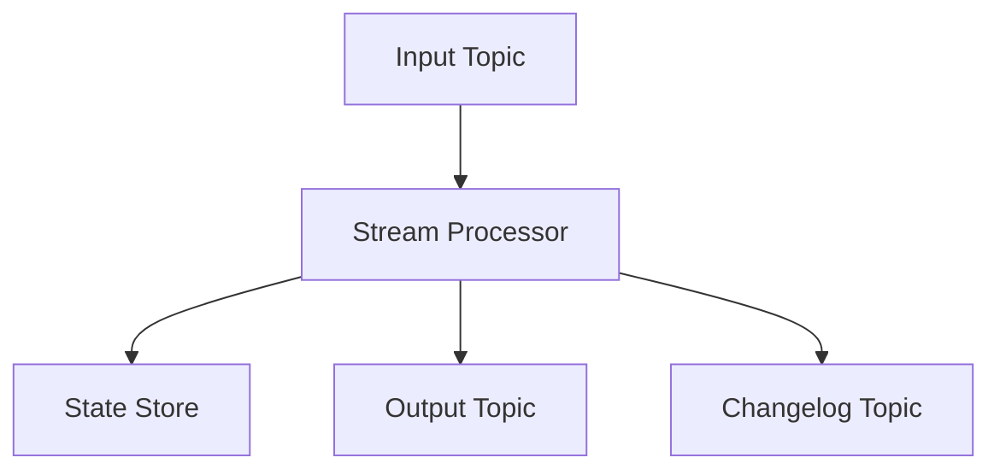
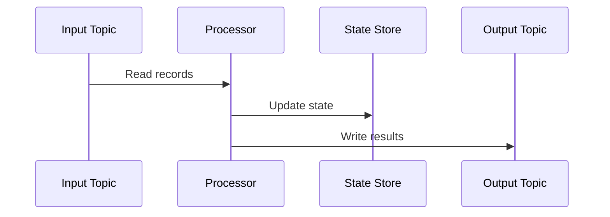

# 4. Kafka Streams

## 1. Introduction
Kafka Streams is a client library for building stream processing applications on top of Kafka. It provides high-level DSL and Processor API for real-time data processing.

## 2. Learning Objectives
- Understand stream processing concepts
- Learn Kafka Streams DSL
- Understand KStream and KTable
- Implement stateful processing
- Learn windowing operations

## 3. Prerequisites
- Understanding of Kafka fundamentals
- Knowledge of functional programming
- Familiarity with Java 8+ features

## 4. Why This Concept Exists
Kafka Streams provides:
- Real-time processing
- Stateful operations
- Windowing
- Exactly-once semantics

## 5. Problem Statement
Without stream processing:
- Batch processing delays
- Complex infrastructure
- No real-time insights
- Difficult state management

## 6. Theory
Kafka Streams concepts:
1. **KStream**: Infinite stream of records
2. **KTable**: Changelog of updates
3. **State Store**: Local state storage
4. **Windowing**: Time-based operations

## 7. Internal Working
1. Application reads from input topics
2. Streams are processed
3. State is maintained locally
4. Results written to output topics
5. Changelog topics ensure fault tolerance

## 8. JVM Perspective
- Runs in application JVM
- Uses local state stores
- Embedded RocksDB
- Cooperative rebalancing

## 9. Memory Representation
```java
StreamsBuilder builder = new StreamsBuilder();
KStream<String, String> stream = builder.stream("input-topic");
KStream<String, String> transformed = stream
    .filter((key, value) -> value != null)
    .mapValues(value -> value.toUpperCase());
transformed.to("output-topic");
```

## 10. Architecture Diagram


## 11. Flow Diagram


## 12. Syntax
```java
StreamsBuilder builder = new StreamsBuilder();
KStream<String, String> stream = builder.stream("input");

KStream<String, String> result = stream
    .filter((key, value) -> value != null)
    .mapValues(String::toUpperCase)
    .groupByKey()
    .count()
    .toStream();

result.to("output");
```

## 13. Easy Example
```java
Properties props = new Properties();
props.put(StreamsConfig.APPLICATION_ID_CONFIG, "my-stream");
props.put(StreamsConfig.BOOTSTRAP_SERVERS_CONFIG, "localhost:9092");

StreamsBuilder builder = new StreamsBuilder();
builder.stream("input-topic")
    .mapValues(value -> value.toUpperCase())
    .to("output-topic");

KafkaStreams streams = new KafkaStreams(builder.build(), props);
streams.start();
```

## 14. Medium Example
```java
StreamsBuilder builder = new StreamsBuilder();

KStream<String, String> stream = builder.stream("orders");

KTable<String, Long> orderCounts = stream
    .filter((key, value) -> value.contains("CREATED"))
    .groupByKey()
    .count();

orderCounts.toStream()
    .to("order-counts", Produced.with(Serdes.String(), Serdes.Long()));

KafkaStreams streams = new KafkaStreams(builder.build(), props);
streams.start();
```

## 15. Hard Example
```java
StreamsBuilder builder = new StreamsBuilder();

KStream<String, Order> orders = builder.stream("orders",
    Consumed.with(Serdes.String(), new OrderSerde()));

KStream<String, Order> validOrders = orders
    .filter((key, order) -> order.getAmount() > 0);

KGroupedStream<String, Order> grouped = validOrders
    .groupByKey();

KTable<String, OrderStats> stats = grouped
    .aggregate(
        OrderStats::new,
        (key, order, stats) -> stats.add(order),
        Materialized.with(Serdes.String(), new OrderStatsSerde())
    );

KStream<String, OrderStats> statsStream = stats.toStream();
statsStream.to("order-stats", Produced.with(Serdes.String(), new OrderStatsSerde()));

TimeWindows window = TimeWindows.ofSizeWithNoGrace(Duration.ofMinutes(5));
KTable<Windowed<String>, OrderStats> windowedStats = grouped
    .windowedBy(window)
    .aggregate(
        OrderStats::new,
        (key, order, stats) -> stats.add(order),
        Materialized.with(Serdes.String(), new OrderStatsSerde())
    );
```

## 16. Enterprise Example
```java
@Configuration
public class KafkaStreamsConfig {
    
    @Bean
    public StreamsBuilder streamsBuilder() {
        return new StreamsBuilder();
    }
    
    @Bean
    public KafkaStreams kafkaStreams(StreamsBuilder builder, 
                                    StreamsConfig streamsConfig) {
        return new KafkaStreams(builder.build(), streamsConfig);
    }
}

@Component
@Slf4j
public class OrderStreamProcessor {
    
    @Autowired
    private StreamsBuilder builder;
    
    @PostConstruct
    public void setup() {
        KStream<String, Order> orders = builder.stream("orders");
        
        KTable<String, OrderSummary> summaries = orders
            .filter((key, order) -> order.getStatus() == OrderStatus.COMPLETED)
            .groupByKey()
            .aggregate(
                OrderSummary::new,
                (key, order, summary) -> summary.addOrder(order),
                Materialized.<String, OrderSummary, KeyValueStore<Bytes, byte[]>>as(
                    "order-summary-store")
                    .withKeySerde(Serdes.String())
                    .withValueSerde(new OrderSummarySerde())
            );
        
        summaries.toStream()
            .foreach((key, summary) -> {
                log.info("Order summary updated for user: {}", key);
                log.info("Total orders: {}, Total amount: {}", 
                    summary.getOrderCount(), summary.getTotalAmount());
            });
    }
}
```

## 17. Performance
- Processing: millions of records/sec
- Latency: milliseconds
- State store: local disk
- Changelog: Kafka topics

## 18. Time & Space Complexity
- **Process**: O(1) per record
- **Aggregate**: O(1) per record
- **Window**: O(w) where w is window size
- **Space**: O(s) for state store

## 19. Thread Safety
- Streams are thread-safe
- State stores are thread-safe
- Processors must be thread-safe
- Cooperative rebalancing

## 20. Best Practices
1. Use appropriateSerdes
2. Implement error handling
3. Monitor processing lag
4. Use state stores
5. Handle rebalances
6. Test with TopologyTestDriver

## 21. Common Mistakes
1. Not handling errors
2. Incorrect Serde configuration
3. Missing state store cleanup
4. Ignoring rebalances
5. No monitoring

## 22. Pitfalls
- State store corruption
- Rebalancing pauses
- Processing lag
- Memory pressure

## 23. Debugging Tips
1. Use TopologyTestDriver
2. Check processing metrics
3. Monitor state store
4. Review topology
5. Check Serde configuration

## 24. Comparison Table
| Feature | Kafka Streams | Spark Streaming | Flink |
|---------|---------------|-----------------|-------|
| Processing | Event-by-event | Micro-batch | Event-by-event |
| State | Local | External | External |
| Latency | Low | Medium | Low |
| Complexity | Low | Medium | High |

## 25. Decision Tree
```
Need Stream Processing?
├── Yes → Complexity?
│   ├── Simple → Kafka Streams
│   ├── Complex → Flink
│   └── Batch+Stream → Spark
└── No → Batch processing
```

## 26. Interview Questions
1. What is Kafka Streams?
2. What is the difference between KStream and KTable?
3. How does windowing work?
4. What is a state store?
5. How do you handle errors?
6. What is exactly-once processing?
7. How do you test Kafka Streams?
8. What is topology?
9. How do you monitor streams?
10. What are best practices?
11. What is the difference between Kafka Streams and Flink?
12. How do you handle late-arriving data?
13. What is grace period?
14. How do you implement joins?
15. What is interactive queries?

## 27. Exercises
### Beginner
1. Create a simple stream processor
2. Implement map and filter
3. Add windowing

### Intermediate
1. Implement aggregations
2. Create stateful processor
3. Add joins

### Advanced
1. Implement exactly-once
2. Create custom processor
3. Add interactive queries

## 28. Summary
Kafka Streams provides a powerful library for building stream processing applications. Understanding KStream, KTable, and windowing is essential for real-time data processing.

## 29. References
- [Kafka Streams](https://kafka.apache.org/documentation/streams/)
- [Kafka Streams DSL](https://kafka.apache.org/documentation/streams/developer-guide/dsl-api.html)
