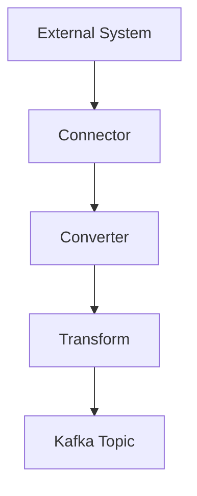
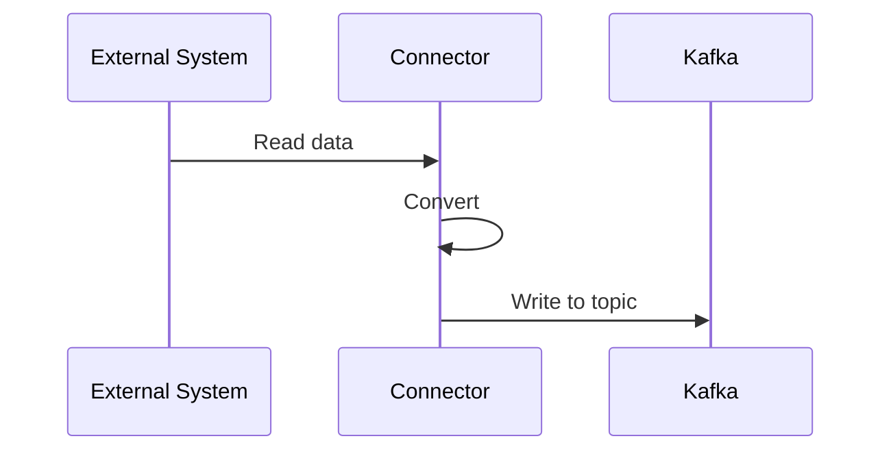

# 5. Kafka Connect

## 1. Introduction
Kafka Connect is a framework for streaming data between Kafka and external systems. It provides source and sink connectors for data integration.

## 2. Learning Objectives
- Understand Kafka Connect architecture
- Learn source and sink connectors
- Understand transforms
- Implement connector configuration
- Learn single message transforms

## 3. Prerequisites
- Understanding of Kafka fundamentals
- Knowledge of data integration concepts
- Familiarity with JSON/YAML

## 4. Why This Concept Exists
Kafka Connect provides:
- Reusable connectors
- Scalable data integration
- Schema management
- Fault tolerance

## 5. Problem Statement
Without Kafka Connect:
- Custom integration code
- No fault tolerance
- Difficult scaling
- Inconsistent data formats

## 6. Theory
Kafka Connect components:
1. **Source Connector**: Reads from external system
2. **Sink Connector**: Writes to external system
3. **Converter**: Handles data format
4. **Transform**: Modifies records

## 7. Internal Working
1. Connector reads/writes data
2. Data converted to/from Kafka format
3. Records transformed if configured
4. Records sent to/from Kafka
5. Offset tracked for fault tolerance

## 8. JVM Perspective
- Runs in Kafka Connect cluster
- Workers manage connectors
- Tasks handle data transfer
- Distributed or standalone mode

## 9. Memory Representation
```json
{
  "name": "my-connector",
  "config": {
    "connector.class": "org.apache.kafka.connect.file.FileStreamSourceConnector",
    "file": "/path/to/file",
    "topic": "my-topic"
  }
}
```

## 10. Architecture Diagram


## 11. Flow Diagram


## 12. Syntax
```bash
# Create connector
curl -X POST http://localhost:8083/connectors \
  -H "Content-Type: application/json" \
  -d '{
    "name": "my-connector",
    "config": {
      "connector.class": "org.apache.kafka.connect.file.FileStreamSourceConnector",
      "file": "/path/to/file",
      "topic": "my-topic"
    }
  }'
```

## 13. Easy Example
```json
{
  "name": "file-source",
  "config": {
    "connector.class": "org.apache.kafka.connect.file.FileStreamSourceConnector",
    "file": "/data/input.txt",
    "topic": "input-topic"
  }
}
```

## 14. Medium Example
```json
{
  "name": "jdbc-source",
  "config": {
    "connector.class": "io.confluent.connect.jdbc.JdbcSourceConnector",
    "connection.url": "jdbc:mysql://localhost:3306/mydb",
    "connection.user": "root",
    "connection.password": "password",
    "table.whitelist": "users,orders",
    "topic.prefix": "db-"
  }
}
```

## 15. Hard Example
```json
{
  "name": "elastic-sink",
  "config": {
    "connector.class": "io.confluent.connect.elasticsearch.ElasticsearchSinkConnector",
    "connection.url": "http://localhost:9200",
    "topics": "search-index",
    "type.name": "_doc",
    "key.ignore": "false",
    "schema.ignore": "false",
    "transform": "extractFields",
    "transforms.extractFields.type": "org.apache.kafka.connect.transforms.ExtractField$Value",
    "transforms.extractFields.field": "data"
  }
}
```

## 16. Enterprise Example
```json
{
  "name": "debezium-mysql",
  "config": {
    "connector.class": "io.debezium.connector.mysql.MySqlConnector",
    "database.hostname": "mysql-primary",
    "database.port": "3306",
    "database.user": "debezium",
    "database.password": "${file:/opt/kafka/config/secrets.properties:db.password}",
    "database.server.id": "1",
    "database.server.name": "inventory",
    "database.include.list": "inventory",
    "database.history.kafka.bootstrap.servers": "kafka:9092",
    "database.history.kafka.topic": "schema-changes.inventory"
  }
}
```

## 17. Performance
- Throughput depends on connector
- Parallelism via tasks
- Batch size affects performance
- Converter impacts speed

## 18. Time & Space Complexity
- **Read/Write**: O(1) per record
- **Convert**: O(1) per record
- **Transform**: O(1) per record
- **Space**: O(n) for buffered records

## 19. Thread Safety
- Workers are thread-safe
- Tasks run in parallel
- Converters must be thread-safe
- Transforms must be thread-safe

## 20. Best Practices
1. Use distributed mode
2. Configure error handling
3. Use transforms wisely
4. Monitor connector health
5. Use schema registry
6. Implement dead letter queues

## 21. Common Mistakes
1. Not configuring error handling
2. Ignoring schema evolution
3. No monitoring
4. Using transforms incorrectly
5. Missing offset tracking

## 22. Pitfalls
- Connector failures
- Schema compatibility
- Performance bottlenecks
- State management

## 23. Debugging Tips
1. Check connector status
2. Review worker logs
3. Monitor metrics
4. Test with standalone mode
5. Verify configurations

## 24. Comparison Table
| Feature | Kafka Connect | Custom Code | Flink |
|---------|---------------|-------------|-------|
| Development | Low | High | Medium |
| Maintenance | Low | High | Medium |
| Features | Limited | Unlimited | Rich |
| Scalability | High | Variable | High |

## 25. Decision Tree
```
Need Data Integration?
├── Yes → Existing Connector?
│   ├── Yes → Kafka Connect
│   └── No → Custom code
└── No → Manual integration
```

## 26. Interview Questions
1. What is Kafka Connect?
2. What is the difference between source and sink connectors?
3. How does Kafka Connect ensure fault tolerance?
4. What are transforms?
5. How do you configure connectors?
6. What is Schema Registry?
7. How do you monitor Kafka Connect?
8. What are best practices?
9. How do you handle errors?
10. What is distributed mode?
11. How do you scale connectors?
12. What is single message transform?
13. How do you implement custom converters?
14. What is dead letter queue?
15. How do you test connectors?

## 27. Exercises
### Beginner
1. Set up Kafka Connect
2. Create file source connector
3. Create file sink connector

### Intermediate
1. Implement JDBC connector
2. Add transforms
3. Configure error handling

### Advanced
1. Create custom connector
2. Implement distributed mode
3. Add monitoring

## 28. Summary
Kafka Connect provides a scalable framework for data integration. Understanding connectors, transforms, and configuration is essential for building data pipelines.

## 29. References
- [Kafka Connect](https://kafka.apache.org/documentation/#connect)
- [Confluent Connectors](https://docs.confluent.io/platform/current/connectors/)
