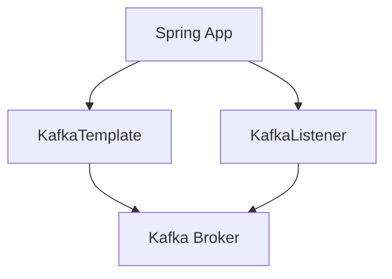
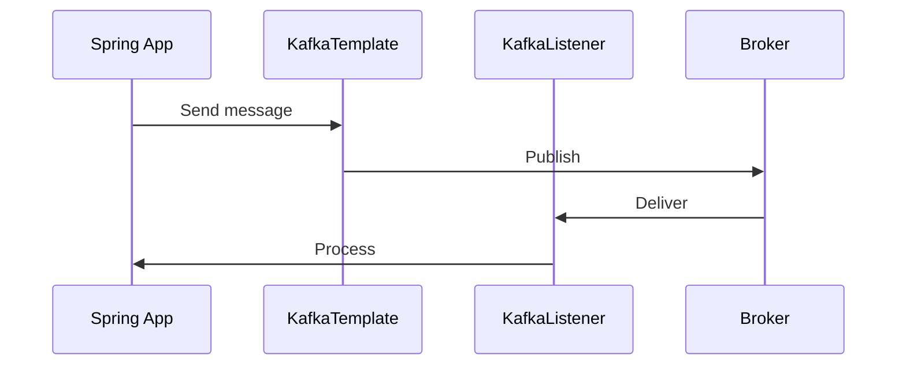

# 6. Spring Kafka

## 1. Introduction
Spring Kafka provides Spring-friendly APIs for Apache Kafka. It simplifies Kafka integration with features like @KafkaListener, KafkaTemplate, and configuration properties.

## 2. Learning Objectives
- Understand Spring Kafka integration
- Learn @KafkaListener annotation
- Use KafkaTemplate for sending
- Configure Spring Kafka
- Implement error handling

## 3. Prerequisites
- Understanding of Spring Boot
- Knowledge of Kafka fundamentals
- Familiarity with Spring configuration

## 4. Why This Concept Exists
Spring Kafka provides:
- Simplified configuration
- Annotation-driven development
- Integration with Spring ecosystem
- Error handling

## 5. Problem Statement
Without Spring Kafka:
- Complex configuration
- Boilerplate code
- Manual error handling
- No Spring integration

## 6. Theory
Spring Kafka components:
1. **KafkaTemplate**: Sends messages
2. **@KafkaListener**: Receives messages
3. **ConcurrentKafkaListenerContainerFactory**: Creates containers
4. **KafkaAdmin**: Manages topics

## 7. Internal Working
1. Spring Boot auto-configures Kafka
2. @KafkaListener creates listener containers
3. KafkaTemplate sends messages
4. Error handlers process failures
5. Admin manages topics

## 8. JVM Perspective
- Runs in Spring context
- Uses Spring's dependency injection
- Integrates with Spring Boot
- Uses Spring's error handling

## 9. Memory Representation
```java
@Autowired
private KafkaTemplate<String, String> kafkaTemplate;

@KafkaListener(topics = "my-topic")
public void listen(String message) {
    System.out.println(message);
}
```

## 10. Architecture Diagram


## 11. Flow Diagram


## 12. Syntax
```java
@Service
public class KafkaProducer {
    @Autowired
    private KafkaTemplate<String, String> kafkaTemplate;
    
    public void send(String message) {
        kafkaTemplate.send("my-topic", message);
    }
}

@Component
public class KafkaConsumer {
    @KafkaListener(topics = "my-topic")
    public void listen(String message) {
        System.out.println(message);
    }
}
```

## 13. Easy Example
```java
@Service
public class Producer {
    @Autowired
    private KafkaTemplate<String, String> kafkaTemplate;
    
    public void sendMessage(String message) {
        kafkaTemplate.send("test-topic", message);
    }
}

@Component
public class Consumer {
    @KafkaListener(topics = "test-topic")
    public void receive(String message) {
        System.out.println("Received: " + message);
    }
}
```

## 14. Medium Example
```java
@Service
@Slf4j
public class OrderProducer {
    @Autowired
    private KafkaTemplate<String, Order> kafkaTemplate;
    
    public void sendOrder(Order order) {
        kafkaTemplate.send("orders", order.getId().toString(), order)
            .addCallback(
                result -> log.info("Order sent: {}", order.getId()),
                ex -> log.error("Failed to send order", ex)
            );
    }
}

@Component
@Slf4j
public class OrderConsumer {
    @KafkaListener(
        topics = "orders",
        groupId = "order-group",
        containerFactory = "kafkaListenerContainerFactory"
    )
    public void receiveOrder(Order order) {
        log.info("Order received: {}", order.getId());
        processOrder(order);
    }
}
```

## 15. Hard Example
```java
@Configuration
@EnableKafka
public class KafkaConfig {
    
    @Value("${spring.kafka.bootstrap-servers}")
    private String bootstrapServers;
    
    @Bean
    public ConcurrentKafkaListenerContainerFactory<String, String>
            kafkaListenerContainerFactory() {
        ConcurrentKafkaListenerContainerFactory<String, String> factory =
            new ConcurrentKafkaListenerContainerFactory<>();
        factory.setConsumerFactory(consumerFactory());
        factory.setConcurrency(3);
        factory.getContainerProperties().setAckMode(ContainerProperties.AckMode.MANUAL_IMMEDIATE);
        return factory;
    }
    
    @Bean
    public ConsumerFactory<String, String> consumerFactory() {
        return new DefaultKafkaConsumerFactory<>(consumerProps());
    }
    
    @Bean
    public Map<String, Object> consumerProps() {
        Map<String, Object> props = new HashMap<>();
        props.put(ConsumerConfig.BOOTSTRAP_SERVERS_CONFIG, bootstrapServers);
        props.put(ConsumerConfig.GROUP_ID_CONFIG, "my-group");
        props.put(ConsumerConfig.KEY_DESERIALIZER_CLASS_CONFIG, StringDeserializer.class);
        props.put(ConsumerConfig.VALUE_DESERIALIZER_CLASS_CONFIG, JsonDeserializer.class);
        return props;
    }
}
```

## 16. Enterprise Example
```java
@Configuration
@EnableKafka
@Slf4j
public class EnterpriseKafkaConfig {
    
    @Bean
    public KafkaAdmin kafkaAdmin() {
        Map<String, Object> configs = new HashMap<>();
        configs.put(AdminClientConfig.BOOTSTRAP_SERVERS_CONFIG, "localhost:9092");
        return new KafkaAdmin(configs);
    }
    
    @Bean
    public NewTopic ordersTopic() {
        return TopicBuilder.name("orders")
            .partitions(3)
            .replicas(3)
            .build();
    }
}

@Service
@Slf4j
public class EnterpriseProducer {
    
    @Autowired
    private KafkaTemplate<String, Object> kafkaTemplate;
    
    @Autowired
    private MeterRegistry meterRegistry;
    
    @Transactional
    public void send(BaseEvent event) {
        String key = event.getAggregateId();
        kafkaTemplate.send(event.getTopic(), key, event)
            .addCallback(
                result -> {
                    meterRegistry.counter("kafka.produced",
                        "topic", event.getTopic()).increment();
                },
                ex -> {
                    log.error("Failed to send event", ex);
                    meterRegistry.counter("kafka.produce.failed",
                        "topic", event.getTopic()).increment();
                }
            );
    }
}

@Component
@Slf4j
public class EnterpriseConsumer {
    
    @KafkaListener(topics = "orders", groupId = "order-service")
    public void consume(ConsumerRecord<String, OrderEvent> record,
                       Acknowledgment ack) {
        log.info("Received order event: {} from partition {} offset {}",
            record.value().getOrderId(), record.partition(), record.offset());
        
        try {
            processEvent(record.value());
            ack.acknowledge();
        } catch (Exception e) {
            log.error("Failed to process order event", e);
            throw e;
        }
    }
}
```

## 17. Performance
- Auto-configuration overhead: ~100ms
- @KafkaListener: ~1-5ms
- KafkaTemplate: ~1-5ms
- Error handling: ~1ms

## 18. Time & Space Complexity
- **Send**: O(1)
- **Receive**: O(1)
- **Configuration**: O(1)
- **Space**: O(n) for messages

## 19. Thread Safety
- KafkaTemplate is thread-safe
- Listener containers are thread-safe
- Error handlers must be thread-safe
- Spring beans are singletons

## 20. Best Practices
1. Use @KafkaListener for consumers
2. Configure error handlers
3. Use KafkaTemplate for sending
4. Configure serialization properly
5. Use topic auto-creation wisely
6. Monitor with Micrometer

## 21. Common Mistakes
1. Not configuring error handling
2. Ignoring serialization
3. Missing group IDs
4. No monitoring
5. Using wrong container factory

## 22. Pitfalls
- Listener container leaks
- Serialization issues
- Error handler missing
- Configuration conflicts

## 23. Debugging Tips
1. Check Spring Boot auto-configuration
2. Verify serialization
3. Monitor listener containers
4. Check topic configuration
5. Review error logs

## 24. Comparison Table
| Feature | Spring Kafka | Raw Kafka | Spring Cloud Stream |
|---------|--------------|-----------|---------------------|
| Configuration | Easy | Complex | Easy |
| Error Handling | Built-in | Manual | Built-in |
| Monitoring | Micrometer | Manual | Micrometer |
| Learning Curve | Low | Medium | Low |

## 25. Decision Tree
```
Need Spring Kafka?
├── Yes → Type?
│   ├── Simple → Spring Kafka
│   ├── Complex → Raw Kafka
│   └── Cloud → Spring Cloud Stream
└── No → Raw Kafka
```

## 26. Interview Questions
1. What is Spring Kafka?
2. What is @KafkaListener?
3. How does KafkaTemplate work?
4. How do you configure Spring Kafka?
5. What is error handling?
6. How do you test Spring Kafka?
7. What is container factory?
8. How do you serialize/deserialize?
9. What are best practices?
10. How do you monitor Spring Kafka?
11. What is the difference between Spring Kafka and Spring Cloud Stream?
12. How do you implement transactions?
13. What is concurrency in @KafkaListener?
14. How do you handle rebalances?
15. What is @SendTo?

## 27. Exercises
### Beginner
1. Set up Spring Kafka
2. Create producer and consumer
3. Add error handling

### Intermediate
1. Implement @KafkaListener with concurrency
2. Add KafkaTemplate callbacks
3. Create topic configuration

### Advanced
1. Implement transactions
2. Add custom error handlers
3. Create custom serializers

## 28. Summary
Spring Kafka simplifies Kafka integration in Spring applications. Understanding @KafkaListener, KafkaTemplate, and configuration is essential for building messaging solutions.

## 29. References
- [Spring Kafka](https://spring.io/projects/spring-kafka)
- [Spring Kafka Reference](https://docs.spring.io/spring-kafka/reference/)
