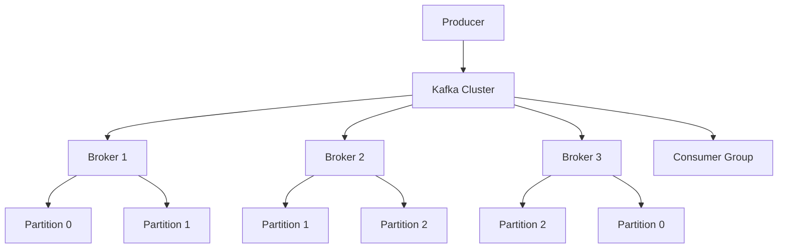

# Module 19: Apache Kafka

## Overview
Apache Kafka is a distributed event streaming platform for building real-time data pipelines and streaming applications. It provides high throughput, fault tolerance, and horizontal scalability.

## Learning Objectives
- Understand Kafka architecture
- Produce and consume messages
- Implement stream processing
- Configure Kafka clusters
- Handle message patterns

## Prerequisites
- Java fundamentals
- Distributed systems basics
- Networking concepts

## Why This Concept Exists
Applications need:
- Real-time data processing
- Event-driven architecture
- Message queuing
- Log aggregation

Kafka provides:
- High throughput
- Fault tolerance
- Horizontal scalability
-持久化

## Problem Statement
How do you handle high-throughput, real-time data streaming?

## Theory

### Kafka Components

| Component | Description |
|-----------|-------------|
| Broker | Kafka server |
| Topic | Message category |
| Partition | Topic subdivision |
| Consumer Group | Consumer coordination |
| Producer | Message sender |

### Message Patterns

| Pattern | Description |
|---------|-------------|
| Publish-Subscribe | Multiple consumers |
| Point-to-Point | Single consumer |
| Event Sourcing | State from events |

## Internal Working

### Kafka Architecture
```
Producer → Broker Cluster → Consumer
           (Partitions)
```

### Partitioning
```
Topic: orders
├── Partition 0: [msg1, msg4, msg7]
├── Partition 1: [msg2, msg5, msg8]
└── Partition 2: [msg3, msg6, msg9]
```

## JVM Perspective

### Java Client
- KafkaProducer
- KafkaConsumer
- KafkaStreams
- AdminClient

### Memory
- Page cache for throughput
- Zero-copy transfers
- Batch processing
- Compression

## Architecture Diagram



## Syntax

### Producer
```java
Properties props = new Properties();
props.put("bootstrap.servers", "localhost:9092");
props.put("key.serializer", "org.apache.kafka.common.serialization.StringSerializer");
props.put("value.serializer", "org.apache.kafka.common.serialization.StringSerializer");

KafkaProducer<String, String> producer = new KafkaProducer<>(props);

ProducerRecord<String, String> record = 
    new ProducerRecord<>("orders", "order-123", "order data");
producer.send(record);
```

### Consumer
```java
Properties props = new Properties();
props.put("bootstrap.servers", "localhost:9092");
props.put("group.id", "order-service");
props.put("key.deserializer", "org.apache.kafka.common.serialization.StringDeserializer");
props.put("value.deserializer", "org.apache.kafka.common.serialization.StringDeserializer");

KafkaConsumer<String, String> consumer = new KafkaConsumer<>(props);
consumer.subscribe(Arrays.asList("orders"));

while (true) {
    ConsumerRecords<String, String> records = consumer.poll(Duration.ofMillis(100));
    for (ConsumerRecord<String, String> record : records) {
        System.out.println(record.key() + ": " + record.value());
    }
}
```

## Easy Example
```java
import org.apache.kafka.clients.producer.*;
import java.util.*;

public class KafkaEasyExample {
    public static void main(String[] args) throws Exception {
        Properties props = new Properties();
        props.put("bootstrap.servers", "localhost:9092");
        props.put("key.serializer", "org.apache.kafka.common.serialization.StringSerializer");
        props.put("value.serializer", "org.apache.kafka.common.serialization.StringSerializer");
        
        try (KafkaProducer<String, String> producer = new KafkaProducer<>(props)) {
            for (int i = 0; i < 10; i++) {
                ProducerRecord<String, String> record = 
                    new ProducerRecord<>("test-topic", "key-" + i, "value-" + i);
                producer.send(record).get();
                System.out.println("Sent: " + i);
            }
        }
    }
}
```

## Medium Example
```java
import org.apache.kafka.clients.consumer.*;
import java.util.*;

public class KafkaMediumExample {
    public static void main(String[] args) {
        Properties props = new Properties();
        props.put("bootstrap.servers", "localhost:9092");
        props.put("group.id", "test-group");
        props.put("auto.offset.reset", "earliest");
        props.put("key.deserializer", "org.apache.kafka.common.serialization.StringDeserializer");
        props.put("value.deserializer", "org.apache.kafka.common.serialization.StringDeserializer");
        
        try (KafkaConsumer<String, String> consumer = new KafkaConsumer<>(props)) {
            consumer.subscribe(Arrays.asList("test-topic"));
            
            int consumed = 0;
            while (consumed < 10) {
                ConsumerRecords<String, String> records = consumer.poll(Duration.ofMillis(1000));
                for (ConsumerRecord<String, String> record : records) {
                    System.out.printf("Offset: %d, Key: %s, Value: %s%n",
                        record.offset(), record.key(), record.value());
                    consumed++;
                }
            }
        }
    }
}
```

## Hard Example
```java
import org.apache.kafka.streams.*;
import java.util.*;

public class KafkaHardExample {
    public static void main(String[] args) {
        Properties props = new Properties();
        props.put(StreamsConfig.APPLICATION_ID_CONFIG, "my-stream-app");
        props.put(StreamsConfig.BOOTSTRAP_SERVERS_CONFIG, "localhost:9092");
        
        StreamsBuilder builder = new StreamsBuilder();
        
        KStream<String, String> source = builder.stream("input-topic");
        
        source
            .filter((key, value) -> value != null)
            .mapValues(value -> value.toUpperCase())
            .to("output-topic");
        
        KafkaStreams streams = new KafkaStreams(builder.build(), props);
        streams.start();
        
        Runtime.getRuntime().addShutdownHook(new Thread(streams::close));
    }
}
```

## Enterprise Example
```java
import org.apache.kafka.clients.producer.*;
import org.apache.kafka.clients.consumer.*;
import org.apache.kafka.streams.*;
import java.util.concurrent.*;

public class KafkaEnterpriseExample {
    // Exactly-once semantics
    public static void main(String[] args) throws Exception {
        Properties producerProps = new Properties();
        producerProps.put("bootstrap.servers", "localhost:9092");
        producerProps.put("transactional.id", "my-transactional-id");
        producerProps.put("key.serializer", "org.apache.kafka.common.serialization.StringSerializer");
        producerProps.put("value.serializer", "org.apache.kafka.common.serialization.StringSerializer");
        
        KafkaProducer<String, String> producer = new KafkaProducer<>(producerProps);
        producer.initTransactions();
        
        Properties consumerProps = new Properties();
        consumerProps.put("bootstrap.servers", "localhost:9092");
        consumerProps.put("group.id", "my-group");
        consumerProps.put("isolation.level", "read_committed");
        consumerProps.put("key.deserializer", "org.apache.kafka.common.serialization.StringDeserializer");
        consumerProps.put("value.deserializer", "org.apache.kafka.common.serialization.StringDeserializer");
        
        KafkaConsumer<String, String> consumer = new KafkaConsumer<>(consumerProps);
        consumer.subscribe(Arrays.asList("input-topic"));
        
        producer.beginTransaction();
        try {
            ConsumerRecords<String, String> records = consumer.poll(Duration.ofMillis(1000));
            for (ConsumerRecord<String, String> record : records) {
                ProducerRecord<String, String> output = 
                    new ProducerRecord<>("output-topic", record.key(), record.value().toUpperCase());
                producer.send(output);
            }
            producer.commitTransaction();
        } catch (Exception e) {
            producer.abortTransaction();
        }
    }
}
```

## Performance Considerations
- Use batch sending
- Enable compression
- Configure appropriate replicas
- Use consumer groups

## Best Practices
1. Use multiple partitions
2. Configure appropriate replicas
3. Use consumer groups
4. Enable compression
5. Monitor lag

## Comparison Table

| Feature | Kafka | RabbitMQ | ActiveMQ |
|---------|-------|----------|----------|
| Throughput | High | Medium | Medium |
| Ordering | Per partition | Queue | Queue |
| Persistence | Yes | Optional | Yes |
| Scalability | High | Medium | Medium |

## Interview Questions

### Q1: What is Kafka?
**Answer:** Distributed event streaming platform.

### Q2: What is a topic?
**Answer:** Category or feed name for messages.

### Q3: What is a partition?
**Answer:** Topic subdivision for parallelism.

### Q4: What is a consumer group?
**Answer:** Group of consumers sharing partition consumption.

### Q5: What is offset?
**Answer:** Position of consumer in partition.

## Summary
Kafka provides high-throughput, fault-tolerant event streaming for real-time applications.

## References
- Apache Kafka Documentation
- Kafka Java Client
- Kafka Streams Guide
