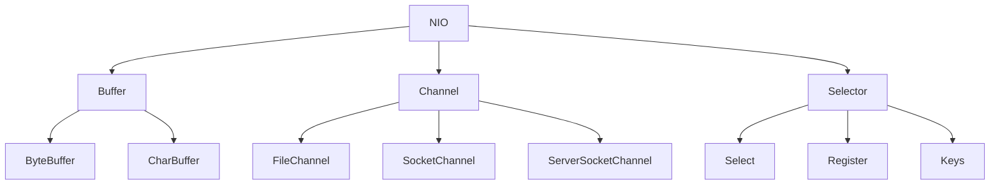
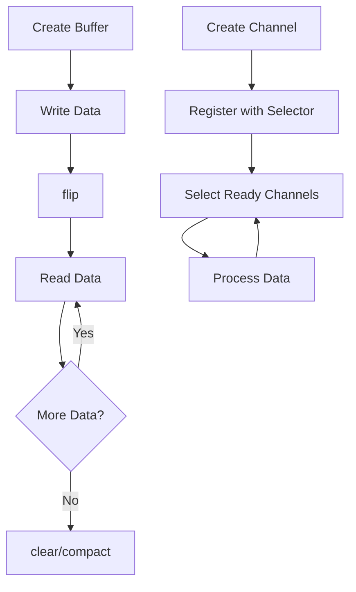
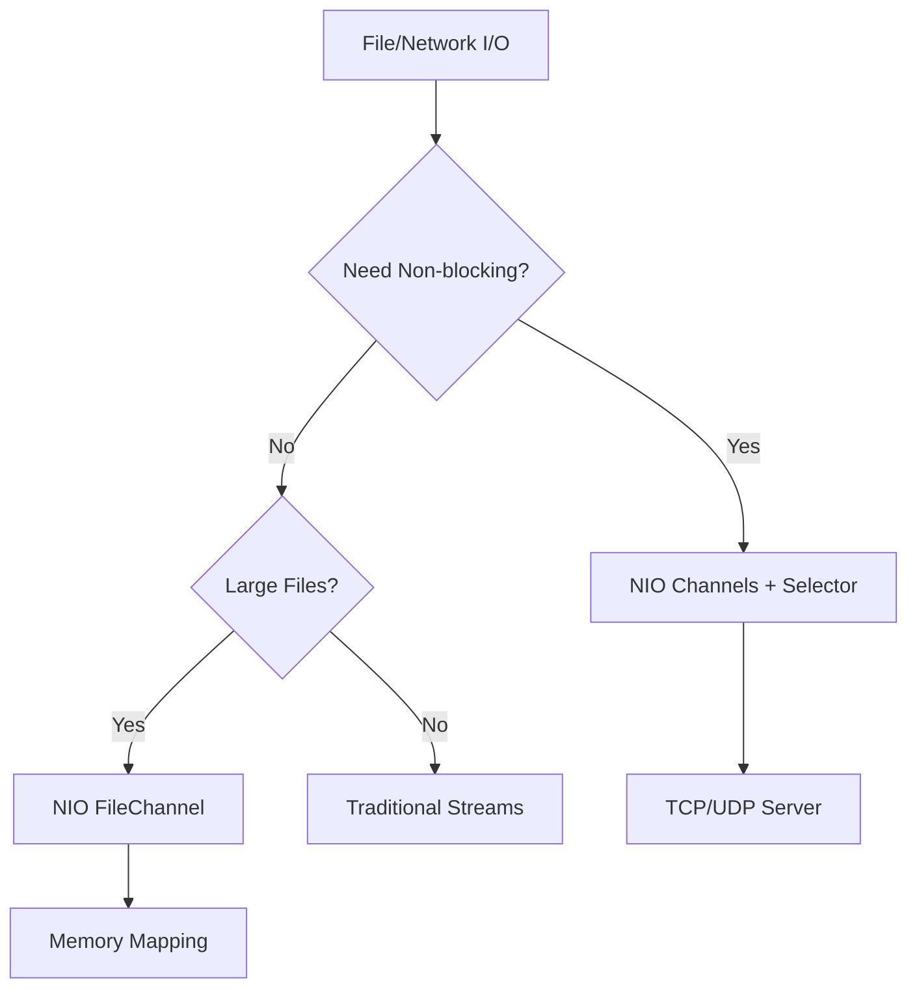

# Module 19: NIO (New I/O)

## Overview
Java NIO (New I/O) provides non-blocking I/O capabilities with channels, buffers, and selectors. It enables scalable network applications and efficient file operations through memory-mapped files and buffer-based processing.

## Learning Objectives
- Master Buffer operations
- Understand Channel types
- Use Selector for multiplexing
- Implement non-blocking I/O
- Handle ByteBuffer efficiently

## Prerequisites
- Basic Java knowledge
- Stream I/O understanding
- Networking basics

## Why This Concept Exists
Traditional I/O is blocking:
- Thread waits for each operation
- Limited concurrent connections
- Poor scalability

NIO provides:
- Non-blocking operations
- Buffer-based processing
- Selector for multiplexing
- Better scalability

## Problem Statement
How do you handle many concurrent I/O operations efficiently without blocking threads?

## Theory

### NIO Components

| Component | Purpose |
|-----------|---------|
| Buffer | Data container |
| Channel | I/O connection |
| Selector | Multiplexer |
| Charset | Encoding/decoding |

### Buffer Types

| Buffer | Primitive | Use Case |
|--------|-----------|----------|
| ByteBuffer | byte | Binary data |
| CharBuffer | char | Text data |
| IntBuffer | int | Integer data |
| LongBuffer | long | Long data |
| FloatBuffer | float | Float data |
| DoubleBuffer | double | Double data |

### Channel Types

| Channel | Purpose |
|---------|---------|
| FileChannel | File I/O |
| SocketChannel | TCP client |
| ServerSocketChannel | TCP server |
| DatagramChannel | UDP |

## Internal Working

### Buffer Internals
```
ByteBuffer:
┌─────────────────────────────────────┐
│ Capacity                            │
│ ┌─────────────────────────────────┐ │
│ │ Position │ Limit │ Capacity    │ │
│ │ (read)   │(write)│ (max)       │ │
│ └─────────────────────────────────┘ │
└─────────────────────────────────────┘
```

### Non-blocking I/O
1. Register channels with Selector
2. Selector monitors events
3. Process ready channels
4. No thread blocking

## JVM Perspective

### Memory Mapping
- Direct buffers: OS memory
- Heap buffers: JVM memory
- Direct buffers faster for I/O
- More GC pressure for heap buffers

### Buffer Operations
- flip(): prepare for reading
- clear(): prepare for writing
- compact(): preserve unread data
- rewind(): re-read from start

## Memory Representation
```
DirectByteBuffer:
┌─────────────────────────────────────┐
│ Native Memory (OS)                  │
│  ├─ Data                            │
│  └─ Cleaner for GC                  │
├─────────────────────────────────────┤
│ JVM Object Header                   │
└─────────────────────────────────────┘
```

## Architecture Diagram



## Flow Diagram



## Syntax

### Buffer Operations
```java
// Create buffer
ByteBuffer buffer = ByteBuffer.allocate(1024);
ByteBuffer directBuffer = ByteBuffer.allocateDirect(1024);

// Write data
buffer.put((byte) 'H');
buffer.put("ello".getBytes());

// Prepare for reading
buffer.flip();

// Read data
byte b = buffer.get();
byte[] bytes = new byte[buffer.remaining()];
buffer.get(bytes);

// Clear for reuse
buffer.clear();
```

### FileChannel
```java
// Read file
try (FileChannel channel = FileChannel.open(Path.of("file.txt"), StandardOpenOption.READ)) {
    ByteBuffer buffer = ByteBuffer.allocate(1024);
    while (channel.read(buffer) > 0) {
        buffer.flip();
        // Process buffer
        buffer.clear();
    }
}

// Write file
try (FileChannel channel = FileChannel.open(Path.of("file.txt"), 
        StandardOpenOption.WRITE, StandardOpenOption.CREATE)) {
    ByteBuffer buffer = ByteBuffer.wrap("Hello".getBytes());
    channel.write(buffer);
}
```

### SocketChannel
```java
// Client
SocketChannel client = SocketChannel.open();
client.connect(new InetSocketAddress("localhost", 8080));
ByteBuffer buffer = ByteBuffer.wrap("Hello".getBytes());
client.write(buffer);

// Server
ServerSocketChannel server = ServerSocketChannel.open();
server.bind(new InetSocketAddress(8080));
server.configureBlocking(false);
SocketChannel client = server.accept();
```

### Selector
```java
Selector selector = Selector.open();
ServerSocketChannel server = ServerSocketChannel.open();
server.configureBlocking(false);
server.register(selector, SelectionKey.OP_ACCEPT);

while (true) {
    selector.select();
    Set<SelectionKey> keys = selector.selectedKeys();
    
    for (SelectionKey key : keys) {
        if (key.isAcceptable()) {
            // Handle accept
        } else if (key.isReadable()) {
            // Handle read
        }
    }
    keys.clear();
}
```

## Easy Example
```java
import java.nio.*;
import java.nio.file.*;

public class EasyExample {
    public static void main(String[] args) throws Exception {
        // Buffer operations
        ByteBuffer buffer = ByteBuffer.allocate(20);
        buffer.put("Hello NIO".getBytes());
        buffer.flip();
        
        byte[] bytes = new byte[buffer.remaining()];
        buffer.get(bytes);
        System.out.println(new String(bytes));
        
        // File reading with NIO
        String content = Files.readString(Path.of("test.txt"));
        System.out.println(content);
    }
}
```

## Medium Example
```java
import java.nio.*;
import java.nio.channels.*;
import java.nio.file.*;

public class MediumExample {
    // Copy file using NIO
    public static void copyFile(Path source, Path target) throws Exception {
        try (FileChannel srcChannel = FileChannel.open(source, StandardOpenOption.READ);
             FileChannel dstChannel = FileChannel.open(target, 
                StandardOpenOption.WRITE, StandardOpenOption.CREATE)) {
            
            dstChannel.transferFrom(srcChannel, 0, srcChannel.size());
        }
    }
    
    public static void main(String[] args) throws Exception {
        copyFile(Path.of("source.txt"), Path.of("dest.txt"));
        System.out.println("File copied successfully");
    }
}
```

## Hard Example
```java
import java.nio.*;
import java.nio.channels.*;
import java.net.*;
import java.util.*;

public class HardExample {
    // Non-blocking echo server
    public static void main(String[] args) throws Exception {
        Selector selector = Selector.open();
        ServerSocketChannel server = ServerSocketChannel.open();
        server.bind(new InetSocketAddress(8080));
        server.configureBlocking(false);
        server.register(selector, SelectionKey.OP_ACCEPT);
        
        System.out.println("Server started on port 8080");
        
        while (true) {
            selector.select();
            Iterator<SelectionKey> keys = selector.selectedKeys().iterator();
            
            while (keys.hasNext()) {
                SelectionKey key = keys.next();
                keys.remove();
                
                if (key.isAcceptable()) {
                    SocketChannel client = server.accept();
                    client.configureBlocking(false);
                    client.register(selector, SelectionKey.OP_READ);
                    System.out.println("Client connected");
                } else if (key.isReadable()) {
                    SocketChannel client = (SocketChannel) key.channel();
                    ByteBuffer buffer = ByteBuffer.allocate(1024);
                    int bytesRead = client.read(buffer);
                    
                    if (bytesRead == -1) {
                        client.close();
                    } else {
                        buffer.flip();
                        client.write(buffer);
                    }
                }
            }
        }
    }
}
```

## Enterprise Example
```java
import java.nio.*;
import java.nio.channels.*;
import java.nio.file.*;
import java.util.concurrent.*;

public class EnterpriseExample {
    // Async file processor
    public static CompletableFuture<Long> countLines(Path path) {
        return CompletableFuture.supplyAsync(() -> {
            try (Stream<String> lines = Files.lines(path)) {
                return lines.count();
            } catch (Exception e) {
                throw new CompletionException(e);
            }
        });
    }
    
    // NIO file watcher service
    public static void watchService(Path dir, Consumer<Path> onChange) throws Exception {
        WatchService watcher = FileSystems.getDefault().newWatchService();
        dir.register(watcher, StandardWatchEventKinds.ENTRY_MODIFY);
        
        while (true) {
            WatchKey key = watcher.take();
            for (WatchEvent<?> event : key.pollEvents()) {
                Path changed = (Path) event.context();
                onChange.accept(dir.resolve(changed));
            }
            key.reset();
        }
    }
    
    public static void main(String[] args) throws Exception {
        // Process multiple files
        List<CompletableFuture<Long>> futures = List.of(
            countLines(Path.of("file1.txt")),
            countLines(Path.of("file2.txt")),
            countLines(Path.of("file3.txt"))
        );
        
        CompletableFuture.allOf(futures.toArray(new CompletableFuture[0])).join();
        
        for (CompletableFuture<Long> f : futures) {
            System.out.println("Lines: " + f.get());
        }
    }
}
```

## Performance Considerations
- Direct buffers: faster I/O, more GC overhead
- Heap buffers: easier GC, slower I/O
- Buffer size affects performance
- Selector efficiency with many connections

## Time & Space Complexity
| Operation | Time | Space |
|-----------|------|-------|
| Buffer allocate | O(1) | O(capacity) |
| Channel read | O(1) | O(buffer) |
| Selector select | O(keys) | O(keys) |
| File transfer | O(size) | O(1) |

## Thread Safety
- Buffers are not thread-safe
- Channels can be shared
- Selector is thread-safe
- Synchronize buffer access

## Best Practices
1. Use direct buffers for large I/O
2. Reuse buffers when possible
3. Use try-with-resources for channels
4. Configure non-blocking mode
5. Handle incomplete reads/writes

## Common Mistakes
1. Forgetting to flip() buffer
2. Not clearing buffer after use
3. Using blocking mode with Selector
4. Not handling partial reads

## Pitfalls & Warnings
1. Direct buffers have GC implications
2. Buffer overflow/underflow exceptions
3. Channel closing releases resources
4. Selector wake-up required

## Debugging Tips
1. Print buffer position/limit/capacity
2. Check channel isOpen()
3. Verify selector key interests
4. Use jconsole for NIO monitoring

## Comparison Table

| Feature | Streams | NIO | NIO.2 |
|---------|---------|-----|-------|
| Blocking | Yes | No | Yes |
| Buffer | No | Yes | No |
| Channels | No | Yes | No |
| Scalability | Low | High | Medium |

## Decision Tree



## Interview Questions

### Q1: What is NIO?
**Answer:** New I/O API with non-blocking channels, buffers, and selectors.

### Q2: What is a Buffer?
**Answer:** A container for data with position, limit, and capacity.

### Q3: What is a Channel?
**Answer:** A connection to an I/O entity that supports reading/writing.

### Q4: What is a Selector?
**Answer:** A multiplexer for non-blocking channels.

### Q5: What is the difference between direct and heap buffers?
**Answer:** Direct buffers use OS memory, heap buffers use JVM memory.

### Q6: What does flip() do?
**Answer:** Prepares buffer for reading by setting limit to position and position to 0.

### Q7: What is non-blocking I/O?
**Answer:** I/O operations that return immediately without waiting for completion.

### Q8: How do you read a file with NIO?
**Answer:** Use FileChannel with ByteBuffer.

### Q9: What is memory-mapped file?
**Answer:** File mapped to memory for direct access via MappedByteBuffer.

### Q10: How do you handle multiple connections?
**Answer:** Use Selector with non-blocking SocketChannels.

### Q11: What is the difference between NIO and traditional I/O?
**Answer:** NIO is non-blocking with channels, traditional I/O is blocking with streams.

### Q12: What is SelectionKey?
**Answer:** Represents a channel's registration with a selector.

### Q13: How do you write to a file with NIO?
**Answer:** Use FileChannel.write(ByteBuffer).

### Q14: What is the difference between read() and readAllBytes()?
**Answer:** read() reads into buffer, readAllBytes() reads entire file.

### Q15: When should I use NIO?
**Answer:** For scalable network servers or efficient file operations.

## Exercises

### Easy
1. Read a file using ByteBuffer
2. Write data to a file using FileChannel
3. Copy a file using NIO

### Medium
1. Implement a non-blocking echo server
2. Create a file watcher service
3. Use memory-mapped files

### Hard
1. Build a chat server with Selector
2. Implement a file transfer protocol
3. Create an async file processor

## Summary
NIO provides non-blocking I/O with channels, buffers, and selectors for scalable applications.

## References
- Oracle Java Documentation: NIO
- Java NIO Tutorial
- Baeldung NIO Guide
