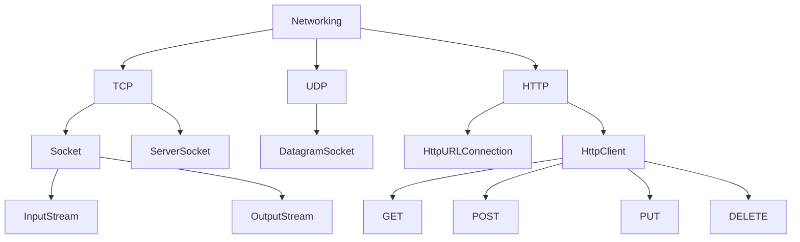
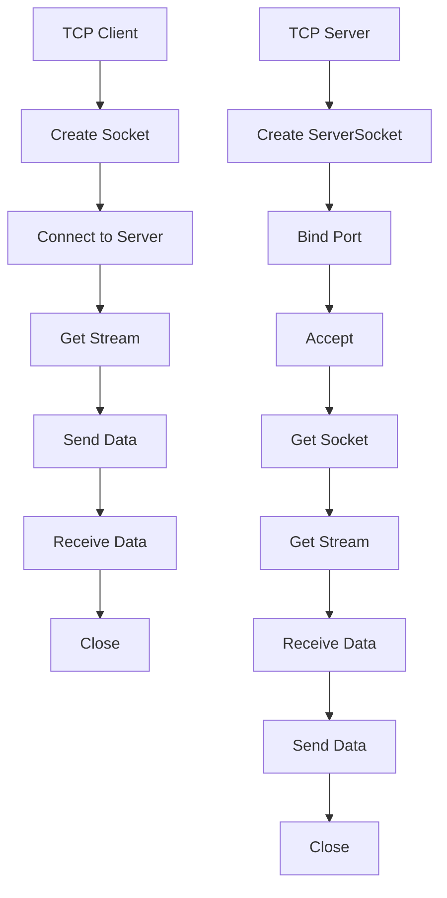
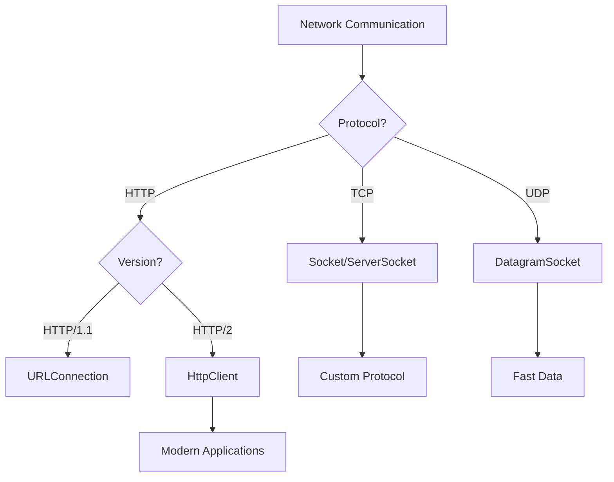

# Module 20: Networking

## Overview
Java networking provides classes for TCP/IP and UDP communication, URL handling, and HTTP connections. The java.net package offers socket programming, server sockets, and high-level HTTP clients.

## Learning Objectives
- Master Socket and ServerSocket
- Understand URL and URLConnection
- Use HttpClient for HTTP requests
- Implement TCP/UDP protocols
- Handle network exceptions

## Prerequisites
- Basic Java knowledge
- I/O stream understanding
- Basic networking concepts

## Why This Concept Exists
Network communication enables:
- Client-server applications
- Web services
- Remote procedure calls
- Distributed systems
- API integrations

## Problem Statement
How do you implement network communication in Java applications?

## Theory

### Networking Classes

| Class | Purpose |
|-------|---------|
| Socket | TCP client |
| ServerSocket | TCP server |
| DatagramSocket | UDP |
| URL | URL handling |
| HttpURLConnection | HTTP requests |
| HttpClient | Modern HTTP |

### Protocol Layers

| Layer | Java Class | Purpose |
|-------|-----------|---------|
| Transport | Socket/ServerSocket | TCP |
| Transport | DatagramSocket | UDP |
| Application | URL/URLConnection | HTTP |
| Application | HttpClient | Modern HTTP |

## Internal Working

### TCP Connection
1. Client creates Socket
2. Server creates ServerSocket
3. Server accepts connection
4. Data exchange
5. Connection closed

### HTTP Request
1. Create client
2. Build request
3. Send request
4. Receive response
5. Process response

## JVM Perspective

### Socket Implementation
- Uses OS socket API
- Thread blocking on I/O
- Buffer management
- Connection pooling

### HTTP/2 Support
- Multiplexed streams
- Header compression
- Server push
- Binary framing

## Memory Representation
```
Socket:
┌─────────────────────────────────────┐
│ Input Stream (read)                 │
│ Output Stream (write)               │
│ Socket Options                      │
│ Remote Address                      │
└─────────────────────────────────────┘
```

## Architecture Diagram



## Flow Diagram



## Syntax

### TCP Client
```java
import java.net.*;
import java.io.*;

Socket socket = new Socket("localhost", 8080);
BufferedReader in = new BufferedReader(new InputStreamReader(socket.getInputStream()));
PrintWriter out = new PrintWriter(socket.getOutputStream(), true);

out.println("Hello Server");
String response = in.readLine();
System.out.println("Server: " + response);

socket.close();
```

### TCP Server
```java
import java.net.*;
import java.io.*;

ServerSocket server = new ServerSocket(8080);
System.out.println("Server started on port 8080");

while (true) {
    Socket client = server.accept();
    BufferedReader in = new BufferedReader(new InputStreamReader(client.getInputStream()));
    PrintWriter out = new PrintWriter(client.getOutputStream(), true);
    
    String message = in.readLine();
    System.out.println("Client: " + message);
    out.println("Echo: " + message);
    
    client.close();
}
```

### HTTP Client
```java
import java.net.http.*;
import java.net.*;

HttpClient client = HttpClient.newHttpClient();

// GET request
HttpRequest request = HttpRequest.newBuilder()
    .uri(URI.create("https://api.example.com/data"))
    .header("Accept", "application/json")
    .GET()
    .build();

HttpResponse<String> response = client.send(request, 
    HttpResponse.BodyHandlers.ofString());

System.out.println("Status: " + response.statusCode());
System.out.println("Body: " + response.body());

// POST request
HttpRequest postRequest = HttpRequest.newBuilder()
    .uri(URI.create("https://api.example.com/data"))
    .header("Content-Type", "application/json")
    .POST(HttpRequest.BodyPublishers.ofString("{\"key\":\"value\"}"))
    .build();

HttpResponse<String> postResponse = client.send(postRequest,
    HttpResponse.BodyHandlers.ofString());
```

### UDP
```java
import java.net.*;

// Sender
DatagramSocket socket = new DatagramSocket();
byte[] data = "Hello UDP".getBytes();
DatagramPacket packet = new DatagramPacket(data, data.length, 
    InetAddress.getByName("localhost"), 9999);
socket.send(packet);
socket.close();

// Receiver
DatagramSocket serverSocket = new DatagramSocket(9999);
byte[] buffer = new byte[1024];
DatagramPacket receivePacket = new DatagramPacket(buffer, buffer.length);
serverSocket.receive(receivePacket);
String message = new String(receivePacket.getData());
System.out.println("Received: " + message);
serverSocket.close();
```

## Easy Example
```java
import java.net.http.*;
import java.net.*;

public class EasyExample {
    public static void main(String[] args) throws Exception {
        HttpClient client = HttpClient.newHttpClient();
        
        HttpRequest request = HttpRequest.newBuilder()
            .uri(URI.create("https://httpbin.org/get"))
            .GET()
            .build();
        
        HttpResponse<String> response = client.send(request,
            HttpResponse.BodyHandlers.ofString());
        
        System.out.println("Status: " + response.statusCode());
        System.out.println("Headers: " + response.headers().map());
        System.out.println("Body: " + response.body().substring(0, 200));
    }
}
```

## Medium Example
```java
import java.net.*;
import java.io.*;

public class MediumExample {
    // Simple chat client
    public static void main(String[] args) throws Exception {
        Socket socket = new Socket("localhost", 8080);
        
        new Thread(() -> {
            try {
                BufferedReader in = new BufferedReader(
                    new InputStreamReader(socket.getInputStream()));
                String message;
                while ((message = in.readLine()) != null) {
                    System.out.println("Server: " + message);
                }
            } catch (IOException e) {
                e.printStackTrace();
            }
        }).start();
        
        PrintWriter out = new PrintWriter(socket.getOutputStream(), true);
        BufferedReader console = new BufferedReader(new InputStreamReader(System.in));
        
        String input;
        while ((input = console.readLine()) != null) {
            out.println(input);
        }
    }
}
```

## Hard Example
```java
import java.net.*;
import java.io.*;
import java.util.concurrent.*;

public class HardExample {
    // Thread pool server
    private static final ExecutorService pool = Executors.newFixedThreadPool(10);
    
    public static void main(String[] args) throws Exception {
        ServerSocket server = new ServerSocket(8080);
        System.out.println("Server started on port 8080");
        
        while (true) {
            Socket client = server.accept();
            pool.submit(() -> handleClient(client));
        }
    }
    
    private static void handleClient(Socket client) {
        try {
            BufferedReader in = new BufferedReader(
                new InputStreamReader(client.getInputStream()));
            PrintWriter out = new PrintWriter(client.getOutputStream(), true);
            
            String message;
            while ((message = in.readLine()) != null) {
                System.out.println("Client: " + message);
                out.println("Echo: " + message);
            }
        } catch (IOException e) {
            e.printStackTrace();
        } finally {
            try {
                client.close();
            } catch (IOException e) {
                e.printStackTrace();
            }
        }
    }
}
```

## Enterprise Example
```java
import java.net.http.*;
import java.net.*;
import java.time.*;
import java.util.concurrent.*;

public class EnterpriseExample {
    // HTTP client with timeout and retry
    private static final HttpClient client = HttpClient.newBuilder()
        .connectTimeout(Duration.ofSeconds(10))
        .executor(Executors.newFixedThreadPool(10))
        .build();
    
    public static String fetchWithRetry(String url, int maxRetries) throws Exception {
        int retries = 0;
        while (retries < maxRetries) {
            try {
                HttpRequest request = HttpRequest.newBuilder()
                    .uri(URI.create(url))
                    .timeout(Duration.ofSeconds(5))
                    .GET()
                    .build();
                
                HttpResponse<String> response = client.send(request,
                    HttpResponse.BodyHandlers.ofString());
                
                if (response.statusCode() == 200) {
                    return response.body();
                }
            } catch (Exception e) {
                retries++;
                if (retries >= maxRetries) {
                    throw e;
                }
                Thread.sleep(1000 * retries);
            }
        }
        throw new RuntimeException("Max retries exceeded");
    }
    
    public static void main(String[] args) throws Exception {
        String response = fetchWithRetry("https://httpbin.org/get", 3);
        System.out.println("Response: " + response.substring(0, 100));
    }
}
```

## Performance Considerations
- Use connection pooling
- Set appropriate timeouts
- Use HTTP/2 for multiplexing
- Buffer network reads/writes

## Time & Space Complexity
| Operation | Time | Space |
|-----------|------|-------|
| Connect | O(1) | O(1) |
| Send data | O(n) | O(n) |
| Receive data | O(n) | O(n) |
| HTTP request | O(n) | O(n) |

## Thread Safety
- Sockets are not thread-safe
- HttpClient is thread-safe
- Use separate threads for I/O
- Synchronize shared access

## Best Practices
1. Use try-with-resources
2. Set connection timeouts
3. Use connection pooling
4. Handle IOExceptions
5. Close resources properly

## Common Mistakes
1. Not closing sockets
2. Blocking main thread
3. Ignoring timeouts
4. Not handling exceptions

## Pitfalls & Warnings
1. Port conflicts
2. Firewall blocking
3. DNS resolution failures
4. Connection leaks

## Debugging Tips
1. Use netstat to check connections
2. Print socket status
3. Log network errors
4. Use Wireshark for packet capture

## Comparison Table

| Feature | Socket | HttpClient | URLConnection |
|---------|--------|------------|---------------|
| Level | Low | High | Medium |
| Protocol | TCP | HTTP | HTTP |
| Non-blocking | No | Yes | No |
| Modern | No | Yes | No |

## Decision Tree



## Interview Questions

### Q1: What is the difference between TCP and UDP?
**Answer:** TCP is reliable and ordered, UDP is fast but unreliable.

### Q2: How do you create a TCP server?
**Answer:** Use ServerSocket and accept() method.

### Q3: What is HttpClient?
**Answer:** Modern Java HTTP client supporting HTTP/2 and async operations.

### Q4: How do you handle network timeouts?
**Answer:** Use setSoTimeout() for sockets, timeout() for HttpClient.

### Q5: What is connection pooling?
**Answer:** Reusing connections for multiple requests to improve performance.

### Q6: How do you implement a chat application?
**Answer:** Use TCP sockets with threads for sending/receiving.

### Q7: What is the difference between Socket and ServerSocket?
**Answer:** Socket is for clients, ServerSocket is for servers.

### Q8: How do you send HTTP POST request?
**Answer:** Use HttpClient with POST method and body publishers.

### Q9: What is DatagramSocket?
**Answer:** Socket for UDP communication.

### Q10: How do you handle multiple clients?
**Answer:** Use thread pool or non-blocking I/O with Selector.

### Q11: What is the difference between getInputStream and getOutputStream?
**Answer:** getInputStream reads from remote, getOutputStream writes to remote.

### Q12: How do you implement file transfer?
**Answer:** Use Socket with InputStream/OutputStream for data transfer.

### Q13: What is the difference between HttpURLConnection and HttpClient?
**Answer:** HttpClient is modern, supports HTTP/2, better API.

### Q14: How do you handle SSL/TLS?
**Answer:** Use SSLSocket or HttpClient with SSL context.

### Q15: What are common network exceptions?
**Answer:** IOException, ConnectException, SocketTimeoutException.

## Exercises

### Easy
1. Create a simple echo server
2. Send HTTP GET request
3. Implement UDP sender/receiver

### Medium
1. Build a multi-client chat server
2. Create a file download client
3. Implement a REST API client

### Hard
1. Build a web server
2. Implement a proxy server
3. Create a network file system

## Summary
Java networking provides comprehensive support for TCP, UDP, and HTTP communication with both blocking and non-blocking APIs.

## References
- Oracle Java Documentation: Networking
- Java Socket Programming Tutorial
- HttpClient Documentation
