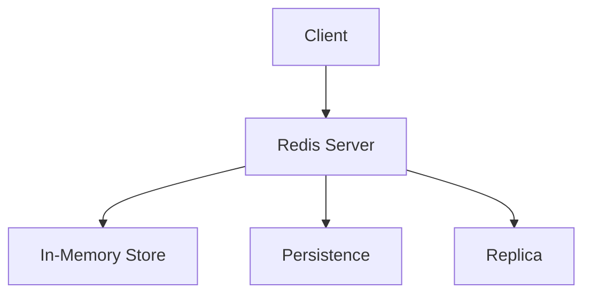
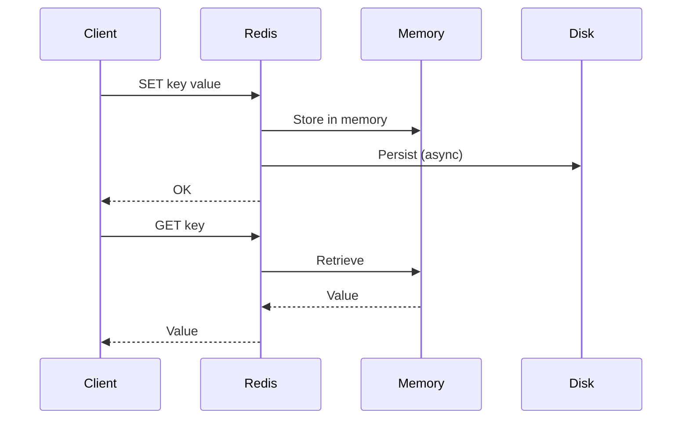

# 1. Redis Fundamentals

## 1. Introduction
Redis (Remote Dictionary Server) is an open-source, in-memory data store used as a database, cache, message broker, and streaming engine. It supports various data structures and operations.

## 2. Learning Objectives
- Understand Redis architecture
- Learn in-memory storage concepts
- Understand persistence mechanisms
- Learn Redis data types
- Understand replication

## 3. Prerequisites
- Understanding of key-value stores
- Knowledge of data structures
- Familiarity with client-server architecture

## 4. Why This Concept Exists
Redis provides:
- Ultra-fast data access
- Flexible data structures
- Persistence options
- High availability

## 5. Problem Statement
Traditional databases have:
- Slow disk I/O
- Complex queries for simple operations
- Limited data structures
- High latency

## 6. Theory
Redis features:
1. **In-memory**: Data stored in RAM
2. **Data Structures**: Strings, Lists, Sets, Hashes
3. **Persistence**: RDB and AOF
4. **Replication**: Master-slave architecture
5. **Pub/Sub**: Message broadcasting

## 7. Internal Working
1. Client sends command
2. Redis processes command
3. Data updated in memory
4. Response sent to client
5. Persistence writes to disk

## 8. JVM Perspective
- Redis is not JVM-based (C language)
- Java clients use TCP connections
- Connection pooling for performance
- Serialization for complex objects

## 9. Memory Representation
```bash
SET user:1 name "John"
GET user:1
HSET user:1 name "John" email "john@example.com"
```

## 10. Architecture Diagram


## 11. Flow Diagram


## 12. Syntax
```bash
SET key value
GET key
DEL key
EXISTS key
EXPIRE key seconds
```

## 13. Easy Example
```java
Jedis jedis = new Jedis("localhost", 6379);
jedis.set("name", "John");
String name = jedis.get("name");
System.out.println("Name: " + name);
jedis.close();
```

## 14. Medium Example
```java
Jedis jedis = new Jedis("localhost", 6379);
jedis.hset("user:1", "name", "John");
jedis.hset("user:1", "email", "john@example.com");
Map<String, String> user = jedis.hgetAll("user:1");
System.out.println("User: " + user);
jedis.close();
```

## 15. Hard Example
```java
Jedis jedis = new Jedis("localhost", 6379);
jedis.sadd("online-users", "user1", "user2", "user3");
jedis.sadd("active-users", "user2", "user3", "user4");
Set<String> both = jedis.sinter("online-users", "active-users");
System.out.println("Online and active: " + both);
jedis.close();
```

## 16. Enterprise Example
```java
@Configuration
public class RedisConfig {
    
    @Bean
    public RedisConnectionFactory redisConnectionFactory() {
        LettuceConnectionFactory factory = new LettuceConnectionFactory();
        factory.setHostName("localhost");
        factory.setPort(6379);
        return factory;
    }
    
    @Bean
    public RedisTemplate<String, Object> redisTemplate() {
        RedisTemplate<String, Object> template = new RedisTemplate<>();
        template.setConnectionFactory(redisConnectionFactory());
        template.setKeySerializer(new StringRedisSerializer());
        template.setValueSerializer(new GenericJackson2JsonRedisSerializer());
        return template;
    }
}
```

## 17. Performance
- Read/Write: ~0.1ms
- Throughput: 100k+ operations/sec
- Latency: sub-millisecond
- Memory: depends on data

## 18. Time & Space Complexity
- **GET/SET**: O(1)
- **HGET/HSET**: O(1)
- **LPUSH/RPUSH**: O(1)
- **LRANGE**: O(n)

## 19. Thread Safety
- Redis is single-threaded (command processing)
- Client libraries handle concurrency
- Connection pooling required
- Atomic operations

## 20. Best Practices
1. Use connection pooling
2. Set expiration times
3. Use appropriate data structures
4. Monitor memory usage
5. Implement persistence
6. Use replication for HA

## 21. Common Mistakes
1. Not using connection pooling
2. Storing large objects
3. No expiration policies
4. Ignoring memory limits
5. Not monitoring performance

## 22. Pitfalls
- Memory limitations
- Single-threaded bottleneck
- Persistence delays
- Network latency

## 23. Debugging Tips
1. Use redis-cli for debugging
2. Monitor with INFO command
3. Check slowlog
4. Use MONITOR for debugging
5. Profile memory usage

## 24. Comparison Table
| Feature | Redis | Memcached | MongoDB |
|---------|-------|-----------|---------|
| Data Structures | Rich | Simple | Documents |
| Persistence | Yes | No | Yes |
| Replication | Yes | No | Yes |
| Performance | High | High | Medium |

## 25. Decision Tree
```
Need Cache?
├── Yes → Data Type?
│   ├── Simple → Memcached
│   ├── Complex → Redis
│   └── Document → MongoDB
└── No → Use database
```

## 26. Interview Questions
1. What is Redis?
2. What are Redis data structures?
3. How does Redis persistence work?
4. What is the difference between RDB and AOF?
5. How does Redis replication work?
6. What is Redis clustering?
7. How do you implement caching with Redis?
8. What are Redis transactions?
9. How do you monitor Redis?
10. What are best practices?
11. What is the difference between Redis and Memcached?
12. How do you handle memory limits?
13. What is Redis Sentinel?
14. How do you implement pub/sub?
15. What is Redis Stream?

## 27. Exercises
### Beginner
1. Install Redis
2. Use redis-cli commands
3. Implement basic caching

### Intermediate
1. Use Redis data structures
2. Implement pub/sub
3. Add persistence

### Advanced
1. Implement Redis cluster
2. Create Redis modules
3. Add Lua scripting

## 28. Summary
Redis is a versatile in-memory data store providing fast access to data with various data structures. Understanding its architecture, persistence, and best practices is essential for building high-performance applications.

## 29. References
- [Redis Documentation](https://redis.io/documentation)
- [Redis Commands](https://redis.io/commands/)
- [Lettuce Client](https://lettuce.io/)
