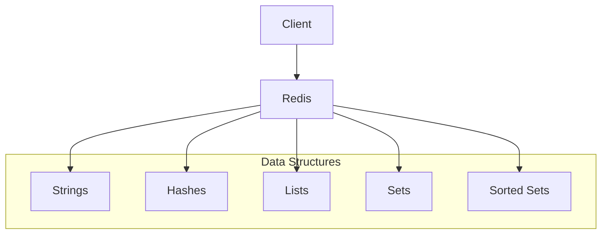
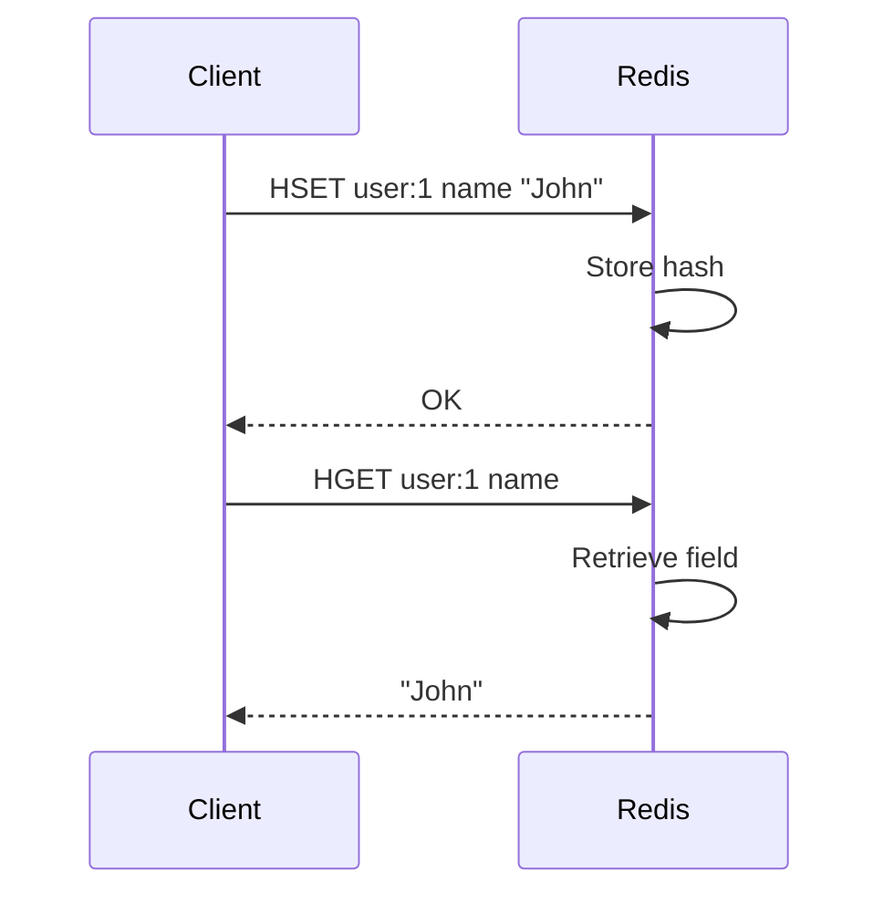

# 2. Redis Data Structures

## 1. Introduction
Redis supports various data structures beyond simple key-value pairs. Understanding these structures enables efficient data modeling and operations.

## 2. Learning Objectives
- Understand Redis data structures
- Learn Strings, Hashes, Lists, Sets
- Understand Sorted Sets
- Learn when to use each structure
- Implement operations on data structures

## 3. Prerequisites
- Understanding of Redis fundamentals
- Knowledge of data structures concepts
- Familiarity with Redis commands

## 4. Why This Concept Exists
Redis data structures provide:
- Efficient data storage
- Atomic operations
- Complex data modeling
- Performance optimization

## 5. Problem Statement
Without proper data structures:
- Inefficient data storage
- Complex operations
- Poor performance
- Limited functionality

## 6. Theory
Redis data structures:
1. **Strings**: Binary-safe strings
2. **Hashes**: Maps of string values
3. **Lists**: Linked lists of strings
4. **Sets**: Unordered collections
5. **Sorted Sets**: Ordered collections with scores

## 7. Internal Working
1. Data stored in memory
2. Operations are atomic
3. Different encoding for different sizes
4. Efficient memory usage
5. O(1) for most operations

## 8. JVM Perspective
- Redis handles data structures natively
- Java clients serialize/deserialize
- Connection pooling required
- Async operations possible

## 9. Memory Representation
```bash
# String
SET name "John"

# Hash
HSET user:1 name "John" email "john@example.com"

# List
LPUSH queue "task1" "task2"

# Set
SADD tags "java" "redis"

# Sorted Set
ZADD leaderboard 100 "player1"
```

## 10. Architecture Diagram


## 11. Flow Diagram


## 12. Syntax
```bash
# Strings
SET key value
GET key
INCR key

# Hashes
HSET key field value
HGET key field
HGETALL key

# Lists
LPUSH key value
RPUSH key value
LRANGE key 0 -1

# Sets
SADD key member
SMEMBERS key
SINTER key1 key2

# Sorted Sets
ZADD key score member
ZRANGE key 0 -1
ZRANGEBYSCORE key min max
```

## 13. Easy Example
```java
Jedis jedis = new Jedis("localhost", 6379);

// Strings
jedis.set("name", "John");
System.out.println(jedis.get("name"));

// Hashes
jedis.hset("user:1", "name", "John");
System.out.println(jedis.hget("user:1", "name"));

// Lists
jedis.lpush("queue", "task1", "task2");
System.out.println(jedis.lrange("queue", 0, -1));

// Sets
jedis.sadd("tags", "java", "redis");
System.out.println(jedis.smembers("tags"));

// Sorted Sets
jedis.zadd("leaderboard", 100, "player1");
System.out.println(jedis.zrange("leaderboard", 0, -1));

jedis.close();
```

## 14. Medium Example
```java
Jedis jedis = new Jedis("localhost", 6379);

// Hash operations
jedis.hset("product:1", "name", "Laptop");
jedis.hset("product:1", "price", "999");
jedis.hset("product:1", "stock", "50");
Map<String, String> product = jedis.hgetAll("product:1");
System.out.println("Product: " + product);

// List as queue
jedis.lpush("tasks", "task1", "task2", "task3");
String task = jedis.rpop("tasks");
System.out.println("Processing: " + task);

// Set operations
jedis.sadd("group1", "user1", "user2");
jedis.sadd("group2", "user2", "user3");
Set<String> common = jedis.sinter("group1", "group2");
System.out.println("Common users: " + common);

jedis.close();
```

## 15. Hard Example
```java
Jedis jedis = new Jedis("localhost", 6379);

// Sorted Set for leaderboard
jedis.zadd("leaderboard", 100, "player1");
jedis.zadd("leaderboard", 200, "player2");
jedis.zadd("leaderboard", 150, "player3");

// Get top 3 players
Set<String> topPlayers = jedis.zrevrange("leaderboard", 0, 2);
System.out.println("Top 3: " + topPlayers);

// Get players with score > 100
Set<String> highScorers = jedis.zrangeByScore("leaderboard", 100, Double.MAX_VALUE);
System.out.println("High scorers: " + highScorers);

// Increment score
jedis.zincrby("leaderboard", 50, "player1");
System.out.println("Updated score: " + jedis.zscore("leaderboard", "player1"));

jedis.close();
```

## 16. Enterprise Example
```java
@Service
public class RedisDataService {
    
    @Autowired
    private RedisTemplate<String, Object> redisTemplate;
    
    public void cacheUser(User user) {
        String key = "user:" + user.getId();
        redisTemplate.opsForHash().put(key, "name", user.getName());
        redisTemplate.opsForHash().put(key, "email", user.getEmail());
        redisTemplate.expire(key, Duration.ofHours(24));
    }
    
    public User getUser(Long id) {
        String key = "user:" + id;
        Map<Object, Object> data = redisTemplate.opsForHash().entries(key);
        if (data.isEmpty()) return null;
        
        User user = new User();
        user.setId(id);
        user.setName((String) data.get("name"));
        user.setEmail((String) data.get("email"));
        return user;
    }
    
    public void addToQueue(String queueName, String task) {
        redisTemplate.opsForList().leftPush(queueName, task);
    }
    
    public String dequeue(String queueName) {
        return (String) redisTemplate.opsForList().rightPop(queueName);
    }
}
```

## 17. Performance
- String operations: O(1)
- Hash operations: O(1)
- List operations: O(1) for push/pop
- Set operations: O(1) for add/remove
- Sorted Set: O(log(n))

## 18. Time & Space Complexity
- **SET/GET**: O(1)
- **HSET/HGET**: O(1)
- **LPUSH/RPUSH**: O(1)
- **SADD**: O(1)
- **ZADD**: O(log(n))

## 19. Thread Safety
- Redis commands are atomic
- Multi-threaded I/O in Redis 6+
- Client libraries handle concurrency
- Connection pooling required

## 20. Best Practices
1. Choose appropriate data structure
2. Use pipelining for batch operations
3. Set expiration times
4. Monitor memory usage
5. Use Lua scripts for complex operations
6. Implement connection pooling

## 21. Common Mistakes
1. Wrong data structure choice
2. Not using pipelining
3. Storing large objects
4. No expiration policies
5. Ignoring memory limits

## 22. Pitfalls
- Memory limitations
- Single-threaded bottleneck
- Network latency
- Serialization overhead

## 23. Debugging Tips
1. Use TYPE command to check structure
2. Use OBJECT ENCODING for details
3. Monitor memory with INFO
4. Use DEBUG OBJECT for inspection
5. Profile slow commands

## 24. Comparison Table
| Structure | Use Case | Performance | Memory |
|-----------|----------|-------------|--------|
| String | Simple values | O(1) | Low |
| Hash | Object fields | O(1) | Medium |
| List | Queue/Stack | O(1) | Medium |
| Set | Unique items | O(1) | Medium |
| Sorted Set | Rankings | O(log n) | High |

## 25. Decision Tree
```
Need Data Structure?
├── Yes → Type?
│   ├── Simple value → String
│   ├── Object fields → Hash
│   ├── Ordered collection → List/Set
│   └── Ranked data → Sorted Set
└── No → Use database
```

## 26. Interview Questions
1. What are Redis data structures?
2. When to use Hash vs String?
3. What is the difference between List and Set?
4. How do Sorted Sets work?
5. What are the performance characteristics?
6. How do you choose the right structure?
7. What are the memory implications?
8. How do you implement a queue with Redis?
9. How do you implement caching?
10. What are the best practices?
11. How do you handle large datasets?
12. What is HyperLogLog?
13. What are Bitmaps?
14. How do you implement counters?
15. What are Streams?

## 27. Exercises
### Beginner
1. Use Strings for caching
2. Implement Hash for user profile
3. Create List for task queue

### Intermediate
1. Implement Set operations
2. Create Sorted Set leaderboard
3. Use pipelining

### Advanced
1. Implement HyperLogLog
2. Create Bitmap operations
3. Use Lua scripts

## 28. Summary
Redis data structures provide efficient ways to store and manipulate data. Understanding when to use each structure is essential for building performant applications.

## 29. References
- [Redis Data Structures](https://redis.io/docs/data-types/)
- [Redis Commands](https://redis.io/commands/)
