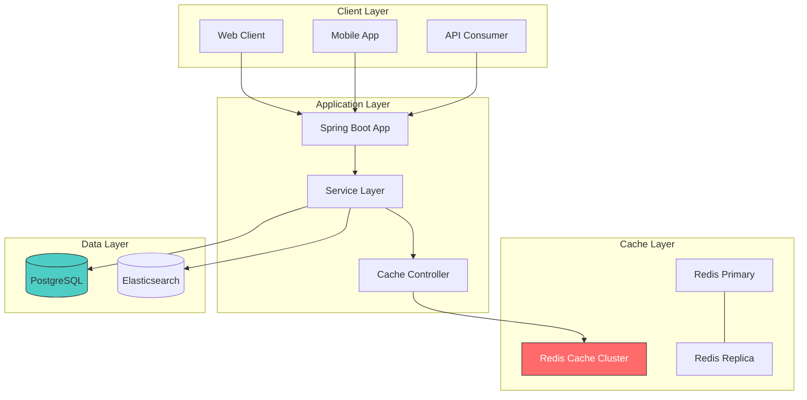
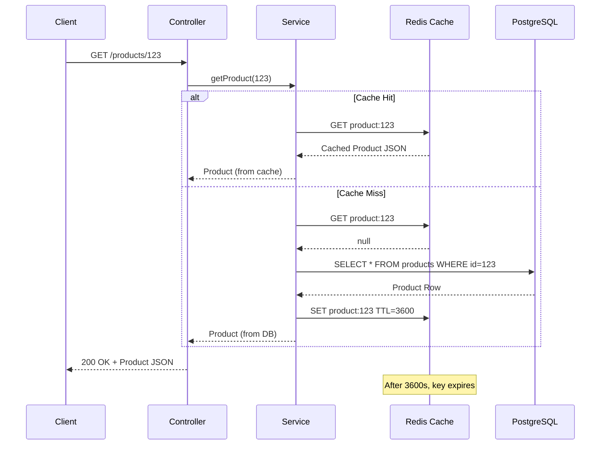
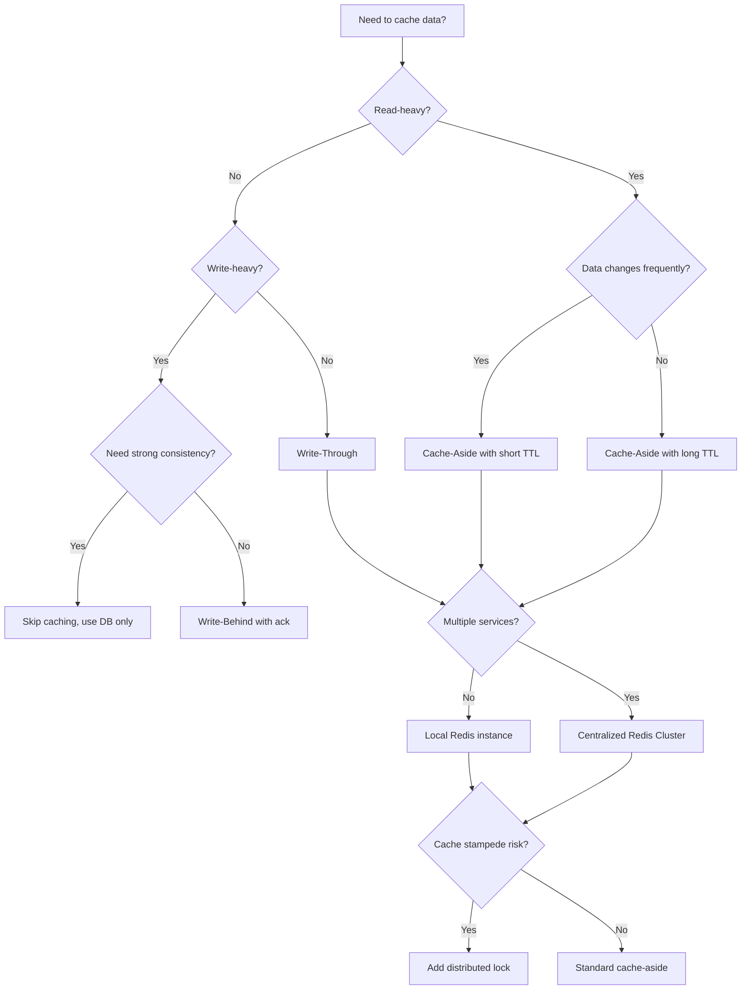

# 3. Redis Caching

## 1. Introduction

Caching is one of the most critical use cases for Redis. By storing frequently accessed data in memory, Redis eliminates repeated expensive database queries, drastically reducing latency and improving throughput. This module covers caching patterns, eviction policies, cache invalidation strategies, and production-grade implementation with Spring Boot and Redis.

## 2. Learning Objectives

- Understand the role of caching in application architecture
- Learn all major caching patterns: Cache-Aside, Read-Through, Write-Through, Write-Behind
- Configure Redis as a cache backend with Spring Boot
- Implement cache invalidation and expiration strategies
- Handle cache stampede and thundering herd problems
- Optimize cache hit rates and memory usage
- Apply enterprise-grade caching patterns for microservices

## 3. Prerequisites

- Understanding of Redis fundamentals (Module 20, Topic 1)
- Knowledge of Redis data structures (Module 20, Topic 2)
- Familiarity with Spring Boot and dependency injection
- Basic understanding of database performance characteristics

## 4. Why This Concept Exists

Every database call involves disk I/O, network latency, and query parsing. Repeated queries for the same data waste resources and slow applications. Caching exists to:

1. **Reduce database load** – Offload read-heavy traffic from the database
2. **Improve response times** – Memory access is nanoseconds vs milliseconds for disk
3. **Improve scalability** – Handle more users without adding database replicas
4. **Cost optimization** – Fewer database servers needed
5. **Enhance user experience** – Sub-millisecond response times

## 5. Problem Statement

Without caching:
- A simple `SELECT * FROM users WHERE id = ?` might take 5-50ms per call
- A product page making 20 DB queries could take 200-1000ms
- Under load, database connections become a bottleneck
- Read replicas help but still have network overhead
- Flash sales or viral traffic can overwhelm even well-configured databases

Redis caching solves this by serving hot data from memory with O(1) lookup complexity.

## 6. Theory

### Caching Patterns

**Cache-Aside (Lazy Loading)**
The application is responsible for cache management. On read: check cache first, if miss, query DB and populate cache. On write: invalidate cache.

```
Read:  App → Cache → (miss) → DB → Cache → App
Write: App → DB → Invalidate Cache
```

**Read-Through**
The cache itself loads data from the DB on miss. The application only interacts with the cache.

```
App → Cache → (miss, Cache loads from DB) → App
```

**Write-Through**
Every write goes to both cache and DB synchronously. Data is always consistent.

```
App → Cache + DB (simultaneously)
```

**Write-Behind (Write-Back)**
Writes go to cache first, then asynchronously flushed to DB. Higher performance but risk of data loss.

```
App → Cache → (async) → DB
```

### Eviction Policies

When Redis memory is full, it evicts keys based on configured policies:

| Policy | Description | Use Case |
|--------|-------------|----------|
| `noeviction` | Returns errors when memory limit is reached | Critical data |
| `allkeys-lru` | Evicts least recently used key from all keys | General cache |
| `volatile-lru` | Evicts LRU key with expire set | Cache + persistent mix |
| `allkeys-lfu` | Evicts least frequently used key | Hot data preference |
| `volatile-lfu` | Evicts LFU key with expire set | Frequency-based cache |
| `allkeys-random` | Evicts random key | Equal importance data |
| `volatile-random` | Evicts random key with expire | Random cache eviction |
| `volatile-ttl` | Evicts key with shortest TTL | TTL-based priority |

### Cache Invalidation

The hardest problem in caching — knowing when to invalidate:

1. **TTL-based** – Keys expire after a fixed duration
2. **Event-driven** – Invalidate on data change events
3. **Version-based** – Cache key includes version number
4. **Tag-based** – Group related keys for bulk invalidation

## 7. Internal Working

### How Redis Serves Cache Requests

```
1. Client sends GET command with key
2. Redis looks up key in hash table (O(1))
3. If key exists and not expired → returns value (cache HIT)
4. If key missing or expired → returns nil (cache MISS)
5. On miss, application queries DB and calls SET with TTL
6. Redis stores key-value with metadata (expiry time, LRU counter)
```

### Memory Layout of a Cache Entry

```
┌──────────────────────────────────────────┐
│ Redis Object                             │
├──────────────────────────────────────────┤
│ Key: "user:12345"                        │
│ Value: Serialized JSON (512 bytes)       │
│ Encoding: OBJ_ENCODING_EMBSTR or RAW     │
│ LRU Clock: 12345678                      │
│ Ref Count: 1                             │
│ Type: OBJ_STRING                         │
└──────────────────────────────────────────┘
```

### LRU Approximation

Redis uses an approximate LRU algorithm (not exact LRU for performance):
- Maintains a sample pool of keys (default 5 keys per eviction attempt)
- Picks the oldest key from the random sample
- Much cheaper than maintaining a full LRU linked list

## 8. JVM Perspective

### Spring Cache Abstraction Layer

```
┌─────────────────────────────────────────────┐
│ Application Code                            │
│   @Cacheable / @CacheEvict annotations      │
├─────────────────────────────────────────────┤
│ Spring Cache Abstraction (CacheManager)      │
├─────────────────────────────────────────────┤
│ RedisCacheManager                           │
│   ├── RedisCache (per cache region)         │
│   ├── RedisCacheWriter (Redis operations)   │
│   └── RedisCacheConfiguration               │
├─────────────────────────────────────────────┤
│ RedisTemplate / LettuceConnectionFactory    │
├─────────────────────────────────────────────┤
│ Lettuce (Redis Client - Netty-based)        │
├─────────────────────────────────────────────┤
│ Redis Server                                │
└─────────────────────────────────────────────┘
```

### Serialization in JVM

When Spring Cache stores data in Redis:

```
Java Object → CacheSerializer → byte[] → Redis SET
Redis GET → byte[] → CacheSerializer → Java Object
```

Spring Boot 3.x uses `GenericJackson2JsonRedisSerializer` by default, storing JSON with type info.

## 9. Memory Representation

### Redis Memory Layout

```
Key: "product:cache:1001"
┌─────────────────────────────────────────────────────────────┐
│ redisDb.dict (hash table)                                   │
│   Entry: keyptr → "product:cache:1001"                     │
│   Entry: valptr → redisObject {                             │
│     type: OBJ_STRING (0)                                    │
│     encoding: OBJ_ENCODING_EMBSTR (1)                       │
│     lru: LRU_CLOCK()                                        │
│     refcount: 1                                             │
│     ptr → SDS string: serialized product JSON               │
│   }                                                         │
│                                                             │
│ redisDb.expires (secondary hash table)                      │
│   Entry: keyptr → "product:cache:1001"                     │
│   Entry: valptr → expire time: 1700000000                   │
└─────────────────────────────────────────────────────────────┘
```

### Memory Overhead Per Key

| Component | Size |
|-----------|------|
| Key (SDS) | ~50 bytes overhead + key length |
| Value (string) | ~50 bytes overhead + value length |
| Dict entry | 24 bytes |
| Expire entry | 24 bytes |
| **Total overhead** | **~148 bytes per cached key** |

## 10. Architecture Diagram



## 11. Flow Diagram



## 12. Syntax

### Spring Cache Annotations

```java
// Cache result of method
@Cacheable(value = "products", key = "#id")
public Product getProduct(Long id) {
    return productRepository.findById(id).orElseThrow();
}

// Cache unless condition
@Cacheable(value = "products", unless = "#result.price > 1000")
public Product getAffordableProduct(Long id) {
    return productRepository.findById(id).orElseThrow();
}

// Custom key generation
@Cacheable(value = "products", key = "#category + ':' + #page")
public List<Product> getProductsByCategory(String category, int page) {
    return productRepository.findByCategory(category, PageRequest.of(page, 20));
}

// Evict specific cache
@CacheEvict(value = "products", key = "#id")
public void deleteProduct(Long id) {
    productRepository.deleteById(id);
}

// Evict all entries in cache
@CacheEvict(value = "products", allEntries = true)
@Scheduled(fixedRate = 60000)
public void evictAllProductsCache() {
    // Scheduled cache refresh
}

// Put cache (always execute, cache result)
@CachePut(value = "products", key = "#product.id")
public Product updateProduct(Product product) {
    return productRepository.save(product);
}

// Custom cache manager
@Bean
public RedisCacheManager cacheManager(RedisConnectionFactory connectionFactory) {
    RedisCacheConfiguration config = RedisCacheConfiguration.defaultCacheConfig()
        .entryTtl(Duration.ofHours(1))
        .serializeKeysWith(RedisSerializationContext.SerializationPair.fromSerializer(new StringRedisSerializer()))
        .serializeValuesWith(RedisSerializationContext.SerializationPair.fromSerializer(new GenericJackson2JsonRedisSerializer()))
        .disableCachingNullValues();

    return RedisCacheManager.builder(connectionFactory)
        .cacheDefaults(config)
        .withCacheConfiguration("products",
            RedisCacheConfiguration.defaultCacheConfig().entryTtl(Duration.ofMinutes(30)))
        .withCacheConfiguration("users",
            RedisCacheConfiguration.defaultCacheConfig().entryTtl(Duration.ofHours(2)))
        .build();
}
```

### Manual Cache Operations with RedisTemplate

```java
@Service
public class ManualCacheService {

    @Autowired
    private RedisTemplate<String, Object> redisTemplate;

    public Product getProduct(Long id) {
        String key = "product:" + id;
        
        // Try cache first
        Product product = (Product) redisTemplate.opsForValue().get(key);
        
        if (product == null) {
            // Cache miss - query DB
            product = productRepository.findById(id)
                .orElseThrow(() -> new ProductNotFoundException(id));
            
            // Populate cache with 1 hour TTL
            redisTemplate.opsForValue().set(key, product, Duration.ofHours(1));
        }
        
        return product;
    }

    public void invalidateProduct(Long id) {
        redisTemplate.delete("product:" + id);
    }
}
```

## 13. Easy Example

A simple product caching service with manual cache-aside pattern:

```java
@Service
@RequiredArgsConstructor
public class ProductCacheService {

    private final RedisTemplate<String, Product> redisTemplate;
    private final ProductRepository productRepository;
    
    private static final String CACHE_PREFIX = "product:";
    private static final Duration DEFAULT_TTL = Duration.ofMinutes(30);

    public Product getProduct(Long id) {
        String key = CACHE_PREFIX + id;
        
        // 1. Check cache
        Product cached = redisTemplate.opsForValue().get(key);
        if (cached != null) {
            return cached;
        }
        
        // 2. Cache miss - query database
        Product product = productRepository.findById(id)
            .orElseThrow(() -> new ResourceNotFoundException("Product", id));
        
        // 3. Populate cache
        redisTemplate.opsForValue().set(key, product, DEFAULT_TTL);
        
        return product;
    }

    public void updateProduct(Product product) {
        // 1. Update database
        productRepository.save(product);
        
        // 2. Invalidate cache
        redisTemplate.delete(CACHE_PREFIX + product.getId());
    }

    public void deleteProduct(Long id) {
        productRepository.deleteById(id);
        redisTemplate.delete(CACHE_PREFIX + id);
    }
}
```

## 14. Medium Example

A complete caching layer with TTL variations, cache warming, and batch operations:

```java
@Service
@RequiredArgsConstructor
@Slf4j
public class UserCacheService {

    private final StringRedisTemplate stringRedisTemplate;
    private final ObjectMapper objectMapper;
    private final UserRepository userRepository;

    private static final Duration SHORT_TTL = Duration.ofMinutes(5);
    private static final Duration LONG_TTL = Duration.ofHours(1);
    private static final Duration SESSION_TTL = Duration.ofDays(7);

    public User getUser(Long userId) {
        String key = "user:" + userId;
        
        try {
            String json = stringRedisTemplate.opsForValue().get(key);
            if (json != null) {
                return objectMapper.readValue(json, User.class);
            }
        } catch (JsonProcessingException e) {
            log.warn("Failed to deserialize cached user: {}", userId);
            stringRedisTemplate.delete(key);
        }

        User user = userRepository.findById(userId)
            .orElseThrow(() -> new ResourceNotFoundException("User", userId));

        try {
            String json = objectMapper.writeValueAsString(user);
            stringRedisTemplate.opsForValue().set(key, json, LONG_TTL);
        } catch (JsonProcessingException e) {
            log.error("Failed to cache user: {}", userId, e);
        }

        return user;
    }

    public List<User> getUsersByIds(List<Long> userIds) {
        List<String> keys = userIds.stream()
            .map(id -> "user:" + id)
            .toList();

        // Batch fetch from cache
        List<String> cachedValues = stringRedisTemplate.opsForValue().multiGet(keys);

        List<User> result = new ArrayList<>();
        List<Long> cacheMissIds = new ArrayList<>();

        for (int i = 0; i < userIds.size(); i++) {
            String value = (cachedValues != null && i < cachedValues.size()) ? cachedValues.get(i) : null;
            if (value != null) {
                try {
                    result.add(objectMapper.readValue(value, User.class));
                } catch (JsonProcessingException e) {
                    cacheMissIds.add(userIds.get(i));
                }
            } else {
                cacheMissIds.add(userIds.get(i));
            }
        }

        // Fetch cache misses from DB
        if (!cacheMissIds.isEmpty()) {
            List<User> dbUsers = userRepository.findAllById(cacheMissIds);
            
            Map<String, String> toCache = new HashMap<>();
            for (User user : dbUsers) {
                try {
                    String json = objectMapper.writeValueAsString(user);
                    toCache.put("user:" + user.getId(), json);
                    result.add(user);
                } catch (JsonProcessingException e) {
                    log.error("Failed to serialize user: {}", user.getId());
                }
            }

            // Batch set in cache
            if (!toCache.isEmpty()) {
                stringRedisTemplate.opsForValue().multiSet(toCache);
                // Set TTLs for batch entries
                toCache.keySet().forEach(key -> 
                    stringRedisTemplate.expire(key, LONG_TTL)
                );
            }
        }

        return result;
    }

    @PostConstruct
    public void warmCache() {
        log.info("Starting cache warming for hot users...");
        List<Long> hotUserIds = userRepository.findTop100ByOrderByLastLoginDesc();
        getUsersByIds(hotUserIds);
        log.info("Cache warmed with {} users", hotUserIds.size());
    }
}
```

## 15. Hard Example

A production-grade caching solution with distributed locks, stampede prevention, and cache metrics:

```java
@Service
@RequiredArgsConstructor
@Slf4j
public class AdvancedCacheService {

    private final StringRedisTemplate redisTemplate;
    private final ObjectMapper objectMapper;
    private final DataSource dataSource;
    private final MeterRegistry meterRegistry;

    private static final Duration DEFAULT_TTL = Duration.ofMinutes(30);
    private static final Duration LOCK_TTL = Duration.ofSeconds(10);
    private static final String LOCK_PREFIX = "lock:";
    private static final String CACHE_PREFIX = "cache:";
    private static final Duration STALE_GRACE = Duration.ofSeconds(30);

    // Cache stampede prevention using distributed lock
    public <T> T getOrLoad(String key, Class<T> type, Supplier<T> loader, Duration ttl) {
        // Try cache first
        T value = getFromCache(key, type);
        if (value != null) {
            meterRegistry.counter("cache.hit").increment();
            return value;
        }

        meterRegistry.counter("cache.miss").increment();

        // Acquire distributed lock to prevent stampede
        String lockKey = LOCK_PREFIX + key;
        boolean locked = Boolean.TRUE.equals(
            redisTemplate.opsForValue().setIfAbsent(lockKey, "1", LOCK_TTL)
        );

        if (!locked) {
            // Another thread is loading, wait and retry
            return waitForValue(key, type, ttl);
        }

        try {
            // Double-check after acquiring lock
            value = getFromCache(key, type);
            if (value != null) {
                meterRegistry.counter("cache.hit.afterLock").increment();
                return value;
            }

            // Load from data source
            value = loader.get();
            meterRegistry.counter("cache.loaded").increment();

            // Store in cache
            putInCache(key, value, ttl);

            return value;
        } finally {
            redisTemplate.delete(lockKey);
        }
    }

    @SuppressWarnings("unchecked")
    private <T> T getFromCache(String key, Class<T> type) {
        try {
            String json = redisTemplate.opsForValue().get(CACHE_PREFIX + key);
            if (json == null) return null;
            
            return objectMapper.readValue(json, type);
        } catch (Exception e) {
            log.warn("Cache read failed for key: {}", key, e);
            redisTemplate.delete(CACHE_PREFIX + key);
            return null;
        }
    }

    private <T> void putInCache(String key, T value, Duration ttl) {
        try {
            String json = objectMapper.writeValueAsString(value);
            redisTemplate.opsForValue().set(CACHE_PREFIX + key, json, ttl);
        } catch (Exception e) {
            log.error("Cache write failed for key: {}", key, e);
        }
    }

    private <T> T waitForValue(String key, Class<T> type, Duration ttl) {
        long deadline = System.nanoTime() + Duration.ofSeconds(5).toNanos();
        
        while (System.nanoTime() < deadline) {
            T value = getFromCache(key, type);
            if (value != null) return value;
            
            try {
                Thread.sleep(50);
            } catch (InterruptedException e) {
                Thread.currentThread().interrupt();
                throw new CacheException("Interrupted waiting for cache value");
            }
        }
        
        // Fallback to loading directly
        return getFromCache(key, type);
    }

    // Pattern-based cache invalidation
    public void invalidatePattern(String pattern) {
        Set<String> keys = redisTemplate.keys(CACHE_PREFIX + pattern + "*");
        if (keys != null && !keys.isEmpty()) {
            redisTemplate.delete(keys);
            meterRegistry.counter("cache.invalidated").increment(keys.size());
            log.info("Invalidated {} cache keys matching: {}", keys.size(), pattern);
        }
    }

    // Cache with sliding expiration
    public <T> T getWithSlidingExpiry(String key, Class<T> type, Supplier<T> loader, 
                                       Duration baseTtl, Duration slidingWindow) {
        String cacheKey = CACHE_PREFIX + key;
        
        // Get value and remaining TTL
        List<Object> results = redisTemplate.execute((RedisCallback<List<Object>>) conn -> {
            List<Object> res = new ArrayList<>();
            byte[] keyBytes = cacheKey.getBytes();
            res.add(conn.get(keyBytes));
            res.add(conn.ttl(keyBytes));
            return res;
        });

        if (results != null && results.get(0) != null) {
            Long ttl = (Long) results.get(1);
            if (ttl != null && ttl > 0 && ttl < slidingWindow.getSeconds()) {
                // Slide expiration forward
                redisTemplate.expire(cacheKey, baseTtl);
            }
            
            try {
                return objectMapper.readValue((byte[]) results.get(0), type);
            } catch (Exception e) {
                log.warn("Deserialization failed, reloading cache", e);
            }
        }

        // Cache miss
        T value = loader.get();
        if (value != null) {
            putInCache(key, value, baseTtl);
        }
        return value;
    }

    // Get cache statistics
    public Map<String, Object> getCacheStats() {
        Map<String, Object> stats = new HashMap<>();
        Set<String> keys = redisTemplate.keys(CACHE_PREFIX + "*");
        
        stats.put("totalKeys", keys != null ? keys.size() : 0);
        stats.put("usedMemory", redisTemplate.execute(
            (RedisCallback<String>) conn -> conn.info("memory").toString()));
        
        return stats;
    }
}
```

## 16. Enterprise Example

A microservices product catalog with cache coherence across services:

```java
@Service
@RequiredArgsConstructor
@Slf4j
public class ProductCatalogCacheService {

    private final StringRedisTemplate redisTemplate;
    private final ObjectMapper objectMapper;
    private final ProductRepository productRepository;
    private final KafkaTemplate<String, String> kafkaTemplate;
    private final MeterRegistry meterRegistry;

    private static final Duration CATALOG_TTL = Duration.ofHours(1);
    private static final Duration CATEGORY_TTL = Duration.ofMinutes(15);
    private static final Duration SEARCH_TTL = Duration.ofMinutes(5);

    // Distributed cache with event-driven invalidation
    @Cacheable(value = "catalog", key = "#id", unless = "#result == null")
    public ProductDTO getProduct(Long id) {
        Product product = productRepository.findById(id)
            .orElseThrow(() -> new ResourceNotFoundException("Product", id));
        
        ProductDTO dto = mapToDTO(product);
        meterRegistry.gauge("cache.catalog.size", 
            redisTemplate.keys("catalog::*").map(Set::size).orElse(0));
        
        return dto;
    }

    // Cache-aside with read-through for category pages
    public CategoryPageDTO getCategoryProducts(String category, int page, int size) {
        String key = String.format("category:%s:%d:%d", category, page, size);
        
        CategoryPageDTO cached = getFromCache(key, CategoryPageDTO.class);
        if (cached != null) {
            return cached;
        }

        CategoryPageDTO result = loadCategoryProducts(category, page, size);
        putInCache(key, result, CATEGORY_TTL);
        return result;
    }

    // Write-through: update DB and invalidate all related caches
    @Transactional
    public ProductDTO updateProduct(Long id, UpdateProductRequest request) {
        Product product = productRepository.findById(id)
            .orElseThrow(() -> new ResourceNotFoundException("Product", id));

        product.setName(request.getName());
        product.setPrice(request.getPrice());
        product.setCategory(request.getCategory());
        
        Product updated = productRepository.save(product);

        // Invalidate related caches
        invalidateCachesForProduct(updated);

        // Publish event for other microservices
        ProductUpdatedEvent event = ProductUpdatedEvent.builder()
            .productId(updated.getId())
            .category(updated.getCategory())
            .timestamp(Instant.now())
            .build();
        
        kafkaTemplate.send("product-updates", objectMapper.writeValueAsString(event));

        return mapToDTO(updated);
    }

    // Bulk cache warming on startup / scheduled refresh
    @Scheduled(cron = "0 0 2 * * ?") // 2 AM daily
    public void warmCatalogCache() {
        log.info("Starting scheduled cache warming...");
        
        List<Product> products = productRepository.findAll(PageRequest.of(0, 1000));
        
        Map<String, String> cacheEntries = new HashMap<>();
        for (Product product : products) {
            try {
                String key = "catalog::" + product.getId();
                String json = objectMapper.writeValueAsString(mapToDTO(product));
                cacheEntries.put(key, json);
            } catch (Exception e) {
                log.warn("Failed to serialize product: {}", product.getId());
            }
        }

        if (!cacheEntries.isEmpty()) {
            redisTemplate.opsForValue().multiSet(cacheEntries);
            cacheEntries.keySet().forEach(k -> redisTemplate.expire(k, CATALOG_TTL));
        }
        
        log.info("Cache warmed with {} products", cacheEntries.size());
    }

    // Tag-based invalidation for related cache entries
    private void invalidateCachesForProduct(Product product) {
        // Invalidate product cache
        redisTemplate.delete("catalog::" + product.getId());
        
        // Invalidate all category cache pages that might contain this product
        Set<String> categoryKeys = redisTemplate.keys("category:" + product.getCategory() + ":*");
        if (categoryKeys != null) {
            redisTemplate.delete(categoryKeys);
        }
        
        // Invalidate search caches
        Set<String> searchKeys = redisTemplate.keys("search:*" + product.getName().toLowerCase() + "*");
        if (searchKeys != null) {
            redisTemplate.delete(searchKeys);
        }
    }

    private <T> T getFromCache(String key, Class<T> type) {
        try {
            String json = redisTemplate.opsForValue().get(key);
            return json != null ? objectMapper.readValue(json, type) : null;
        } catch (Exception e) {
            log.warn("Cache read failed: {}", key);
            return null;
        }
    }

    private <T> void putInCache(String key, T value, Duration ttl) {
        try {
            redisTemplate.opsForValue().set(key, objectMapper.writeValueAsString(value), ttl);
        } catch (Exception e) {
            log.error("Cache write failed: {}", key, e);
        }
    }
}
```

## 17. Performance Considerations

1. **Cache Hit Rate**: Aim for 95%+ hit rate. Below 90% indicates poor caching strategy.
2. **Serialization Cost**: JSON serialization/deserialization adds 5-15% overhead. Consider Protobuf for hot paths.
3. **Network Round Trips**: Batch operations with `multiGet`/`multiSet` reduce round trips.
4. **TTL Tuning**: Too short → high miss rate. Too long → stale data. Profile your access patterns.
5. **Key Length**: Shorter keys save memory. Use prefixes wisely.
6. **Pipeline Usage**: Batch independent cache reads/writes with `executePipelined()`.
7. **Connection Pool**: Tune Lettuce pool for your workload. Default maxIdle=8 may be too low.
8. **Memory Budget**: Set `maxmemory` policy carefully. Monitor eviction rates.

## 18. Time & Space Complexity

| Operation | Time | Space |
|-----------|------|-------|
| GET (cache hit) | O(1) | O(value size) |
| SET with TTL | O(1) | O(key + value size) |
| DELETE | O(1) | O(1) |
| Pipeline GET (N keys) | O(N) | O(N × value size) |
| multiGet (N keys) | O(N) | O(N × value size) |
| TTL lookup | O(1) | O(1) |
| Pattern-based delete (N matches) | O(N) | O(N) |

## 19. Thread Safety

### Spring Cache with Concurrent Access

Spring Cache annotations are thread-safe by default — `CacheManager.getCache()` returns thread-safe `Cache` instances.

```java
// Thread-safe: Spring handles synchronization
@Cacheable("products")
public Product getProduct(Long id) { ... }

// Manual: Redis operations are atomic, but check-then-set is not
// Use distributed lock or atomic SETNX for stampede prevention
```

### Distributed Lock Pattern

```java
public <T> T getOrLoadAtomic(String key, Supplier<T> loader) {
    String lockKey = "lock:" + key;
    boolean acquired = redisTemplate.opsForValue()
        .setIfAbsent(lockKey, "1", Duration.ofSeconds(10));
    
    if (!acquired) {
        // Wait and retry
        Thread.sleep(100);
        return getFromCache(key);
    }
    
    try {
        T value = getFromCache(key);
        if (value != null) return value;
        
        value = loader.get();
        putInCache(key, value);
        return value;
    } finally {
        redisTemplate.delete(lockKey);
    }
}
```

## 20. Best Practices

1. **Use cache-aside pattern** for most scenarios — it gives you full control
2. **Set sensible TTLs** — even cached data should expire eventually
3. **Never cache null values** — use `unless = "#result == null"` or check before caching
4. **Use short, predictable cache keys** — `user:{id}` not `user_data_retrieval_for_user_id_{id}`
5. **Monitor cache hit/miss ratio** — use Redis INFO command or Spring Boot Actuator
6. **Warm caches on startup** — don't let first users suffer cold cache
7. **Implement circuit breaker** — fall through to DB if Redis is unavailable
8. **Use separate Redis for cache vs session** — different memory/scale requirements
9. **Serialize efficiently** — consider Protobuf or Kryo over JSON for high-frequency paths
10. **Version your cache keys** — `v2:product:123` allows smooth rollouts

## 21. Common Mistakes

1. **Caching without TTL** — Memory grows unbounded, Redis kills the process
2. **Cache stampede** — 1000 concurrent requests all miss cache and hit DB simultaneously
3. **Stale cache after writes** — Forgetting to invalidate cache on update
4. **Over-caching** — Caching data that's rarely accessed wastes memory
5. **Using KEYS command in production** — Blocks Redis, use SCAN instead
6. **Serializing entire entity graph** — Cache only what's needed
7. **Ignoring serialization version compatibility** — Schema changes break cached data

## 22. Pitfalls & Warnings

> **WARNING**: `@CacheEvict` does not guarantee immediate consistency. Another thread may re-populate the cache between eviction and the next read.

> **WARNING**: Spring Cache with Redis stores class type information. Changing package names invalidates all cached data.

> **WARNING**: Large cached objects (>100KB) cause network latency spikes. Consider splitting or using hash structures.

> **PITFALL**: `@Cacheable` does not work on internal method calls within the same class (Spring proxy limitation). Use self-injection or AopContext.

> **PITFALL**: Cache key must be serializable. Using `toString()` on objects with custom `toString()` methods may produce unexpected keys.

## 23. Debugging Tips

```java
// 1. Enable cache logging
logging:
  level:
    org.springframework.cache: TRACE
    io.lettuce.core: DEBUG

// 2. Inspect Redis keys directly
redis-cli KEYS "product:*"

// 3. Check cache stats
redis-cli INFO stats | grep -E "keyspace_hits|keyspace_misses"

// 4. Monitor cache operations with Spring Boot Actuator
// GET /actuator/metrics/cache.gets
// GET /actuator/metrics/cache.puts
// GET /actuator/metrics/cache.evictions

// 5. Add cache debugging in code
@Aspect
@Component
@Slf4j
public class CacheAspect {
    @Around("@annotation(org.springframework.cache.annotation.Cacheable)")
    public Object logCacheOperation(ProceedingJoinPoint pjp) throws Throwable {
        String cacheName = ((Cacheable) pjp.getSignature()
            .getDeclaringAnnotation(org.springframework.cache.annotation.Cacheable.class)).value()[0];
        String key = pjp.getArgs()[0].toString();
        
        log.debug("Cache operation: {}[{}]", cacheName, key);
        Object result = pjp.proceed();
        log.debug("Cache result: {}[{}] = {}", cacheName, key, 
            result != null ? "HIT" : "MISS");
        return result;
    }
}
```

## 24. Comparison Table

| Pattern | Consistency | Performance | Complexity | Data Loss Risk |
|---------|------------|-------------|------------|----------------|
| Cache-Aside | Eventual | High | Low | None |
| Read-Through | Eventual | High | Medium | None |
| Write-Through | Strong | Medium | Medium | None |
| Write-Behind | Eventual | Very High | High | High |
| No Cache | Strong | Low | None | None |

## 25. Decision Tree



## 26. Interview Questions

1. **What is the cache-aside pattern and when would you use it?**
   Cache-Aside: Application checks cache first, on miss loads from DB and populates cache. Use when you need full control over cache population and invalidation.

2. **Explain the difference between LRU and LFU eviction policies.**
   LRU evicts least recently accessed key. LFU evicts least frequently accessed key. LFU is better for workload with consistent hot keys; LRU adapts faster to access pattern changes.

3. **What is cache stampede and how do you prevent it?**
   Cache stampede: Many concurrent requests miss cache simultaneously and overwhelm the DB. Prevent with distributed locks (setnx), early expiration, or probabilistic early refresh.

4. **How do you handle cache invalidation in a microservices architecture?**
   Use event-driven invalidation via message queues (Kafka/RabbitMQ). Each service publishes invalidation events. Use tag-based invalidation for related entries.

5. **What happens when Redis goes down in a cache-aside implementation?**
   Application falls back to direct DB queries. Circuit breaker pattern prevents cascade failures. Cache gradually rebuilds when Redis recovers. Consider Redis Sentinel for HA.

6. **Explain write-through vs write-behind caching.**
   Write-through: synchronous write to cache + DB, strong consistency but higher latency. Write-behind: write to cache first, async flush to DB, higher performance but risk of data loss on crash.

7. **How do you choose the right TTL for cache entries?**
   Consider: data volatility, staleness tolerance, access frequency, memory constraints. Profile actual access patterns. Use shorter TTLs for rapidly changing data.

8. **What are the memory overhead considerations when caching with Redis?**
   ~148 bytes overhead per key (SDS, dict entry, expire entry, redisObject). Factor this into memory budgeting. Use hash structures for related data to share overhead.

9. **How do you prevent caching null values in Spring Cache?**
   Use `@Cacheable(value = "cache", unless = "#result == null")`. For manual caching, check for null before calling SET.

10. **Explain cache coherence and how Redis maintains it.**
    Cache coherence: multiple clients see same data. Redis is single-threaded for commands, ensuring atomicity. With replicas, there's propagation delay. Use WAIT command for read-after-write consistency.

11. **How would you implement a cache warming strategy?**
    On application startup: load most-accessed items. Scheduled jobs: periodically refresh hot data. Use access logs to identify hot keys. Implement cache-aside with background refresh.

12. **What serialization options exist for Redis caching?**
    JSON (Jackson): human-readable, portable, moderate performance. Protobuf: compact, fast, schema-dependent. Kryo: very fast, not portable. Lettuce codecs: optimized for Redis.

13. **How do you monitor cache effectiveness?**
    Track hit rate (keyspace_hits / (hits + misses)), memory usage, eviction rate, key count. Use Redis INFO, Spring Boot Actuator, and Prometheus/Grafana dashboards.

14. **When should you NOT use Redis caching?**
    When data changes every read, when strong consistency is critical, when dataset exceeds available memory, when latency requirements are sub-microsecond (use in-process cache like Caffeine).

15. **Explain the @CachePut annotation and its use cases.**
    @CachePut always executes the method and updates the cache. Use when you need to refresh cache on every access or implement write-through pattern.

16. **How do you handle cache key collisions?**
    Use consistent naming conventions: `{service}:{entity}:{id}`. Include version numbers for schema changes. Use hash tags `{}` for related keys that should co-locate.

## 27. Exercises

### Level 1 (Beginner)
Implement a basic cache-aside pattern for a `UserService`:
- Create a `UserCacheService` with `getUser()` and `updateUser()` methods
- Use RedisTemplate to manually cache user objects with 30-minute TTL
- Handle cache miss by querying a mock repository
- Invalidate cache on update

### Level 2 (Intermediate)
Build a cache layer for an e-commerce product catalog:
- Implement `@Cacheable`, `@CacheEvict`, and `@CachePut` annotations
- Configure RedisCacheManager with custom TTL per cache region
- Implement batch cache loading with `multiGet`/`multiSet`
- Add cache warming on `@PostConstruct`
- Monitor cache hit rate with Micrometer metrics

### Level 3 (Advanced)
Design a distributed cache with stampede prevention:
- Implement `getOrLoadAtomic()` with distributed lock using Redis SETNX
- Add sliding expiration for hot keys
- Implement pattern-based cache invalidation using SCAN
- Build cache statistics endpoint
- Add circuit breaker fallback when Redis is unavailable
- Write unit and integration tests with Testcontainers Redis

## 28. Summary

Redis caching is the cornerstone of high-performance applications. Key takeaways:

- **Cache-Aside** is the most flexible and commonly used pattern
- **Eviction policies** (LRU, LFU) determine what gets evicted when memory is full
- **TTL** prevents stale data and unbounded memory growth
- **Stampede prevention** is critical for production systems
- **Cache invalidation** is the hardest part — use event-driven invalidation in microservices
- **Spring Cache** annotations provide declarative caching; RedisTemplate gives imperative control
- **Monitor everything** — hit rate, memory, evictions, latency

## 29. References

- [Spring Cache Abstraction](https://docs.spring.io/spring-framework/reference/integration/cache.html)
- [Spring Data Redis](https://spring.io/projects/spring-data-redis)
- [Redis Documentation - Key Expiration](https://redis.io/docs/manual/key expiration/)
- [Redis Documentation - Eviction Policies](https://redis.io/docs/manual/maxmemory/)
- [Martin Kleppmann - Designing Data-Intensive Applications (Chapter on Caching)](https://dataintensive.net/)
- [Redis Best Practices](https://redis.io/docs/management/optimization/)
- [Caffeine Cache](https://github.com/ben-manes/caffeine) — Local JVM cache for L1 caching
