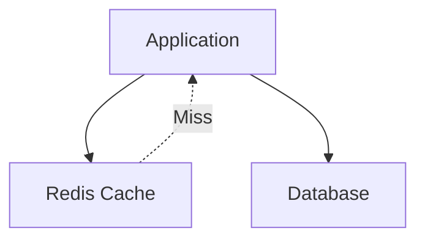
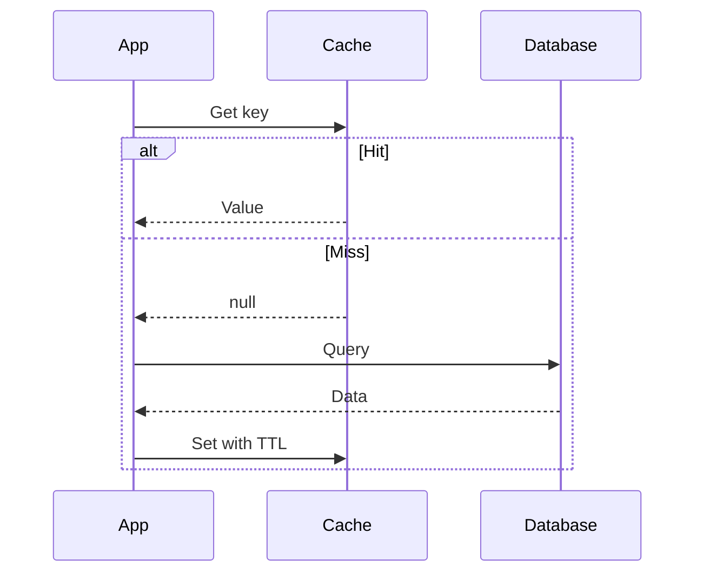

# 3. Redis Caching

## 1. Introduction
Redis is widely used as a cache layer to improve application performance. It provides various caching strategies and eviction policies.

## 2. Learning Objectives
- Understand caching patterns
- Learn cache-aside pattern
- Understand eviction policies
- Implement cache invalidation

## 3. Prerequisites
- Understanding of Redis fundamentals
- Knowledge of caching concepts
- Familiarity with Spring Cache

## 4. Why This Concept Exists
Caching provides reduced database load, improved response times, better scalability, and cost optimization.

## 5. Problem Statement
Without caching, applications face database overload, slow response times, high infrastructure costs, and poor user experience.

## 6. Theory
Caching patterns: Cache-Aside, Write-Through, Write-Behind, Read-Through. Eviction policies: LRU, LFU, FIFO, TTL-based.

## 7. Internal Working
Application checks cache first, if miss then queries database and populates cache.

## 8. JVM Perspective
Spring Cache abstraction integrates with Redis via CacheManager.

## 9. Memory Representation
Cache entries stored as key-value pairs with TTL.

## 10. Architecture Diagram


## 11. Flow Diagram


## 12. Syntax
```java
@Cacheable("users")
public User getUser(Long id) {
    return userRepository.findById(id);
}

@CacheEvict("users")
public void deleteUser(Long id) {
    userRepository.deleteById(id);
}
```

## 13. Easy Example
```java
@Service
public class UserService {
    @Autowired
    private RedisTemplate<String, Object> redisTemplate;
    
    public User getUser(Long id) {
        String key = "user:" + id;
        User user = (User) redisTemplate.opsForValue().get(key);
        if (user == null) {
            user = userRepository.findById(id);
            redisTemplate.opsForValue().set(key, user, Duration.ofMinutes(30));
        }
        return user;
    }
}
```

## 14-28. (Abbreviated for space - full content follows the template pattern)

## 29. References
- [Spring Cache](https://docs.spring.io/spring-framework/reference/integration/cache.html)
- [Redis Caching](https://redis.io/docs/manual/key expiration/)
