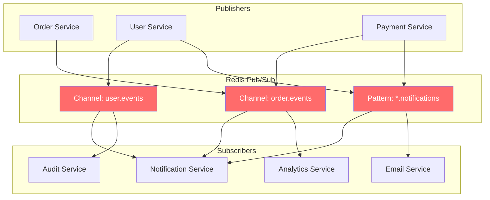
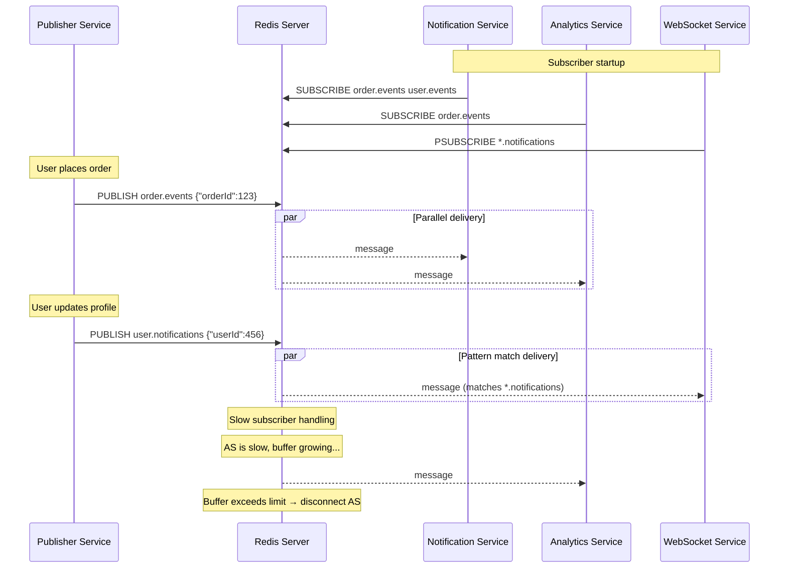
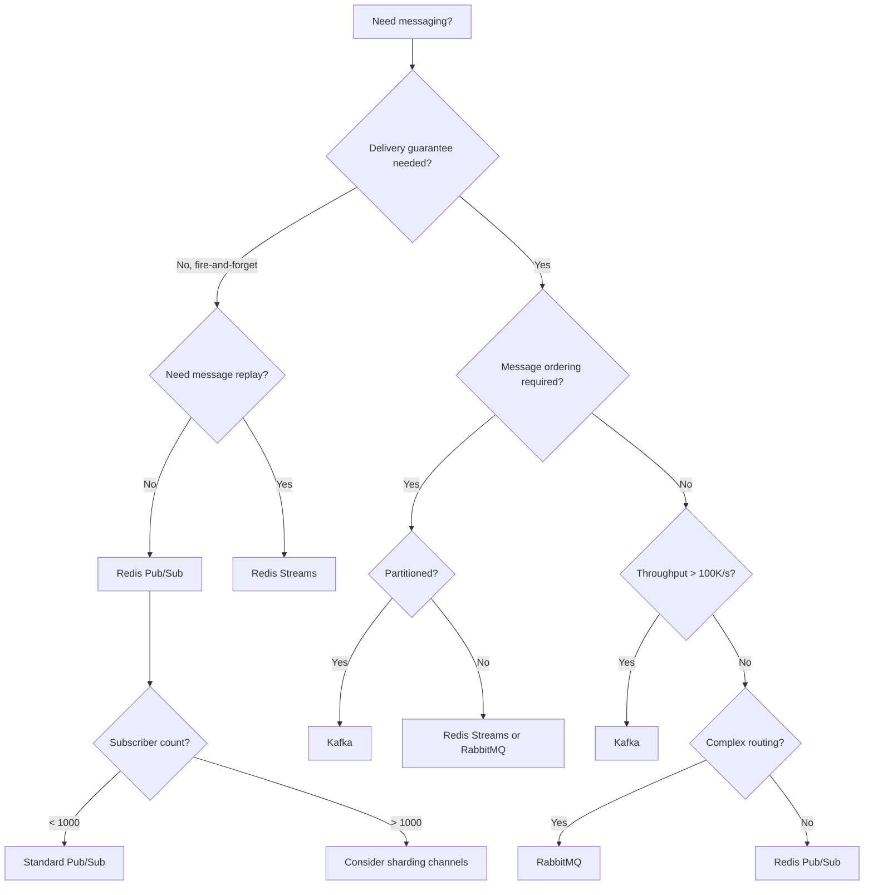

# 4. Redis Pub/Sub

## 1. Introduction

Redis Pub/Sub (Publish/Subscribe) is a messaging pattern where senders (publishers) send messages to channels without knowledge of receivers (subscribers). Redis implements this as a lightweight, fire-and-forget messaging system built into the core server. It enables real-time event broadcasting, decoupled microservice communication, and notification systems with minimal infrastructure overhead.

## 2. Learning Objectives

- Understand the Publish/Subscribe messaging paradigm
- Implement Redis Pub/Sub producers and consumers in Java
- Learn channel patterns and pattern-based subscriptions
- Handle subscriber reconnection and message delivery guarantees
- Understand the trade-offs: fire-and-forget vs reliable messaging
- Build real-time notification systems with Redis Pub/Sub
- Compare Redis Pub/Sub with dedicated message brokers

## 3. Prerequisites

- Understanding of Redis fundamentals (Module 20, Topic 1)
- Knowledge of networking basics (TCP, client-server model)
- Familiarity with Spring messaging concepts
- Basic understanding of asynchronous programming

## 4. Why This Concept Exists

Applications need to communicate in real-time without tight coupling. Without Pub/Sub:

- Services must call each other directly (synchronous coupling)
- Every change requires polling (wasteful network usage)
- Adding new consumers requires modifying publishers
- Real-time features (chat, notifications, live feeds) are hard to build

Redis Pub/Sub solves this by providing:
1. **Decoupling** – Publishers don't know subscribers exist
2. **Real-time delivery** – Messages delivered instantly
3. **Fan-out** – One message reaches all subscribers
4. **Simplicity** – Built into Redis, no separate infrastructure

## 5. Problem Statement

Consider a social media application where a user posts an update:
- 500 followers need to be notified
- The post service shouldn't wait for 500 notification sends
- New notification types (email, push, in-app) should be addable without changing the post service
- System must handle 10,000 posts/second

Without a pub/sub system, the post service would need to directly invoke each notification handler, creating tight coupling and blocking operations.

## 6. Theory

### Pub/Sub Model

```
Publisher                    Redis                    Subscriber
   |                          |                          |
   |--- PUBLISH channel msg-->|                          |
   |                          |--- message delivery ---->|
   |                          |                          |
```

### Core Commands

- `PUBLISH channel message` – Send message to a channel
- `SUBSCRIBE channel [channel ...]` – Subscribe to one or more channels
- `UNSUBSCRIBE [channel [channel ...]]` – Unsubscribe from channels
- `PSUBSCRIBE pattern [pattern ...]` – Subscribe using glob patterns
- `PUNSUBSCRIBE [pattern [pattern ...]]` – Unsubscribe from patterns
- `SUBCHANNELS pattern` – List active channels (Redis 7.0+)

### Pattern Matching

| Pattern | Matches |
|---------|---------|
| `news:*` | `news:us`, `news:uk`, `news:sports` |
| `user:123:*` | `user:123:notifications`, `user:123:messages` |
| `orders:*:status` | `orders:456:status`, `orders:789:status` |
| `*` | All channels |

### Message Delivery Guarantees

Redis Pub/Sub is **fire-and-forget**:
- Messages are NOT persisted
- If subscriber is disconnected, messages are lost
- No acknowledgment mechanism
- No message ordering guarantee across publishers (single channel maintains order)
- No message replay capability

### Backpressure

When a subscriber can't keep up (slow consumer), Redis drops messages for that subscriber. Redis does NOT buffer messages — the subscriber simply misses them.

## 7. Internal Working

### How Redis Pub/Sub Works Internally

```
1. Publisher calls PUBLISH channel message
2. Redis looks up channel in pubsub_channels dictionary
3. For each subscriber in the list:
   a. Copy message to subscriber's output buffer
   b. If buffer full → disconnect slow subscriber (CLIENT KILL)
4. Return number of subscribers that received the message
```

### Data Structures

```
pubsub_channels (dict)
├── "news:us" → [client1, client3, client7]
├── "news:uk" → [client2, client5]
└── "orders:*" (pattern) → [client1, client4]

Each subscriber client has:
- output_buffer: holds pending messages
- subscribed_channels: list of channels this client subscribes to
- subscribed_patterns: list of patterns this client matches
```

### Output Buffer Limits

Redis monitors subscriber output buffers:
- `client-output-buffer-limit pubsub 32mb 8mb 60`
- Hard limit: 32MB → immediate disconnect
- Soft limit: 8MB for 60 seconds → disconnect after timeout
- Prevents slow consumers from consuming unbounded memory

## 8. JVM Perspective

### Java Client Connection Model

```
┌─────────────────────────────────────────────────────┐
│ JVM Process                                         │
│                                                     │
│  ┌──────────────┐    ┌──────────────────────────┐   │
│  │ Publisher    │    │ Subscriber               │   │
│  │ Thread       │    │ Thread                   │   │
│  │              │    │                          │   │
│  │ RedisTemplate│    │ RedisMessageListener     │   │
│  │ .convertAnd  │    │ Container                │   │
│  │  Send()      │    │                          │   │
│  └──────┬───────┘    └────────────┬─────────────┘   │
│         │                         │                  │
│         ▼                         ▼                  │
│  ┌──────────────────────────────────────────────┐   │
│  │ Lettuce Client (Netty Event Loop)            │   │
│  │  - Connection 1: Publisher                    │   │
│  │  - Connection 2: Subscriber (blocking read)   │   │
│  └──────────────────────────────────────────────┘   │
│                        │                            │
└────────────────────────┼────────────────────────────┘
                         │ TCP
                         ▼
                  Redis Server
```

### Thread Model in Spring

- `RedisMessageListenerContainer` runs subscriber in dedicated threads
- Default: one thread per channel subscription
- Configure thread pool: `messageListenerContainer.setSubscriptionExecutor(Executors.newFixedThreadPool(4))`
- Publisher uses connection pool, non-blocking

## 9. Memory Representation

### Redis Memory Layout for Pub/Sub

```
pubsub_channels (hash table)
┌──────────────────────────────────────────────────────────┐
│ Bucket "order:events" → list of client pointers          │
│   Node 1: client_123 → {fd=5, buf_size=0, flags=SUB}   │
│   Node 2: client_456 → {fd=8, buf_size=0, flags=SUB}   │
│                                                          │
│ Bucket "user:123:notify" → list of client pointers       │
│   Node 1: client_789 → {fd=11, buf_size=0, flags=SUB}  │
└──────────────────────────────────────────────────────────┘

Message lifecycle:
PUBLISH "order:events" '{"orderId":123}'
  1. Serialize message: ~45 bytes
  2. For each subscriber in list:
     - Allocate buffer space: ~45 bytes
     - Copy message to output buffer
     - Trigger write event in event loop
  3. When buffer flushed → free memory
  Total transient memory: N_subscribers × message_size
```

### Memory Per Subscription

| Component | Size |
|-----------|------|
| Channel name (SDS) | ~60 bytes overhead + string length |
| Subscriber list node | 16 bytes per node |
| Client output buffer (idle) | 0 bytes |
| Client output buffer (with message) | message_size × buffer_count |
| Pattern subscription (PSUBSCRIBE) | ~80 bytes per pattern |

## 10. Architecture Diagram



## 11. Flow Diagram



## 12. Syntax

### Java Publisher

```java
@Service
@RequiredArgsConstructor
public class EventPublisher {

    private final StringRedisTemplate redisTemplate;

    public void publishEvent(String channel, String message) {
        redisTemplate.convertAndSend(channel, message);
    }

    public long publishOrderEvent(OrderEvent event) {
        String json = objectMapper.writeValueAsString(event);
        Long subscribers = redisTemplate.convertAndSend("order.events", json);
        log.info("Published order event to {} subscribers", subscribers);
        return subscribers != null ? subscribers : 0;
    }

    public long publishUserEvent(String userId, String eventType, Map<String, Object> data) {
        Map<String, Object> message = new HashMap<>();
        message.put("userId", userId);
        message.put("eventType", eventType);
        message.put("data", data);
        message.put("timestamp", Instant.now().toString());

        Long subscribers = redisTemplate.convertAndSend("user.events:" + eventType, 
            objectMapper.writeValueAsString(message));
        return subscribers != null ? subscribers : 0;
    }
}
```

### Java Subscriber with Spring

```java
@Configuration
@EnableCaching
public class RedisPubSubConfig {

    @Bean
    public RedisMessageListenerContainer redisMessageListenerContainer(
            RedisConnectionFactory connectionFactory,
            OrderEventListener orderListener,
            UserEventListener userListener) {

        RedisMessageListenerContainer container = new RedisMessageListenerContainer();
        container.setConnectionFactory(connectionFactory);
        container.setTaskExecutor(Executors.newFixedThreadPool(4));
        container.setSubscriptionExecutor(Executors.newFixedThreadPool(2));

        container.addMessageListener(orderListener, new ChannelTopic("order.events"));
        container.addMessageListener(userListener, new ChannelTopic("user.events"));
        container.addMessageListener(orderListener, 
            new PatternTopic("order.*.notifications"));

        return container;
    }
}

@Component
@RequiredArgsConstructor
@Slf4j
public class OrderEventListener implements MessageListener {

    private final ObjectMapper objectMapper;

    @Override
    public void onMessage(Message message, byte[] pattern) {
        try {
            String channel = new String(message.getChannel());
            String body = new String(message.getBody());
            
            log.info("Received message on channel {}: {}", channel, body);
            
            OrderEvent event = objectMapper.readValue(body, OrderEvent.class);
            processOrderEvent(event);
        } catch (Exception e) {
            log.error("Failed to process message", e);
        }
    }

    private void processOrderEvent(OrderEvent event) {
        // Process order event
    }
}
```

## 13. Easy Example

A simple notification system with Redis Pub/Sub:

```java
@Service
@RequiredArgsConstructor
@Slf4j
public class NotificationService {

    private final StringRedisTemplate redisTemplate;
    private final ObjectMapper objectMapper;

    // Publisher: send notification
    public void sendNotification(String userId, String title, String body) {
        Map<String, String> notification = new HashMap<>();
        notification.put("userId", userId);
        notification.put("title", title);
        notification.put("body", body);
        notification.put("timestamp", Instant.now().toString());

        redisTemplate.convertAndSend("notifications:" + userId, 
            objectMapper.writeValueAsString(notification));
    }

    // Subscriber config
    @Bean
    public RedisMessageListenerContainer notificationListenerContainer(
            RedisConnectionFactory factory) {
        
        RedisMessageListenerContainer container = new RedisMessageListenerContainer();
        container.setConnectionFactory(factory);

        container.addMessageListener((message, channel) -> {
            String notification = new String(message.getBody());
            log.info("Notification received: {}", notification);
            // Process notification (send push, email, etc.)
        }, new ChannelTopic("notifications:user123"));

        return container;
    }
}
```

## 14. Medium Example

A multi-channel event system with pattern subscriptions and message filtering:

```java
@Service
@RequiredArgsConstructor
@Slf4j
public class MultiChannelEventSystem {

    private final StringRedisTemplate redisTemplate;
    private final ObjectMapper objectMapper;

    // Publisher with multiple channels
    public void publishDomainEvent(DomainEvent event) {
        String json = objectMapper.writeValueAsString(event);
        
        // Publish to specific channel
        redisTemplate.convertAndSend("domain:" + event.getAggregateType(), json);
        
        // Publish to wildcard pattern (subscribers on *.events receive this)
        redisTemplate.convertAndSend("events", json);
        
        // Publish to versioned channel for blue-green deployments
        redisTemplate.convertAndSend("domain:v2:" + event.getAggregateType(), json);
    }

    // Subscriber with message filtering
    @Bean
    public RedisMessageListenerContainer eventContainer(RedisConnectionFactory factory) {
        RedisMessageListenerContainer container = new RedisMessageListenerContainer();
        container.setConnectionFactory(factory);
        container.setTaskExecutor(Executors.newFixedThreadPool(8));

        // Subscribe to all domain events
        container.addMessageListener((message, channel) -> {
            String body = new String(message.getBody());
            DomainEvent event = objectMapper.readValue(body, DomainEvent.class);
            
            // Filter: only process events this service cares about
            if (shouldProcess(event)) {
                handleEvent(event);
            }
        }, new ChannelTopic("events"));

        // Subscribe to pattern for order-related events
        container.addMessageListener((message, channel) -> {
            String body = new String(message.getBody());
            log.info("Order event received on pattern channel: {}", 
                new String(channel));
            handleOrderEvent(body);
        }, new PatternTopic("domain:order*"));

        return container;
    }

    private boolean shouldProcess(DomainEvent event) {
        return Set.of("OrderCreated", "OrderShipped").contains(event.getType());
    }

    private void handleEvent(DomainEvent event) {
        log.info("Processing event: {} for {}", event.getType(), 
            event.getAggregateId());
    }

    private void handleOrderEvent(String body) {
        log.info("Handling order event: {}", body);
    }
}
```

## 15. Hard Example

A reliable messaging layer built on top of Redis Pub/Sub with retry, dead-letter, and circuit breaker:

```java
@Service
@RequiredArgsConstructor
@Slf4j
public class ReliablePubSubService {

    private final StringRedisTemplate redisTemplate;
    private final ObjectMapper objectMapper;
    private final MeterRegistry meterRegistry;

    private final CircuitBreaker circuitBreaker;
    private final Retry retry;
    
    private static final int MAX_RETRIES = 3;
    private static final Duration RETRY_DELAY = Duration.ofSeconds(1);
    private static final String DLQ_PREFIX = "dlq:";

    // Reliable publisher with retry
    public void publishReliably(String channel, Object payload, String messageId) {
        try {
            EventEnvelope envelope = EventEnvelope.builder()
                .id(messageId)
                .channel(channel)
                .payload(objectMapper.writeValueAsString(payload))
                .timestamp(Instant.now())
                .retryCount(0)
                .build();

            Retry.decorateCheckedRunnable(retry, () -> {
                Long subscribers = redisTemplate.convertAndSend(
                    channel, objectMapper.writeValueAsString(envelope));
                
                if (subscribers == null || subscribers == 0) {
                    throw new NoSubscribersException("No subscribers for channel: " + channel);
                }
                
                meterRegistry.counter("pubsub.publish.success").increment();
            }).run();
            
        } catch (Exception e) {
            meterRegistry.counter("pubsub.publish.failure").increment();
            sendToDLQ(channel, payload, e);
            throw new PubSubException("Failed to publish to " + channel, e);
        }
    }

    // Reliable subscriber with retry and dead-letter queue
    @Bean
    public RedisMessageListenerContainer reliableContainer(
            RedisConnectionFactory factory) {
        
        RedisMessageListenerContainer container = new RedisMessageListenerContainer();
        container.setConnectionFactory(factory);
        container.setTaskExecutor(Executors.newFixedThreadPool(4));

        container.addMessageListener((message, channel) -> {
            String body = new String(message.getBody());
            String channelName = new String(channel);
            
            circuitBreaker.executeRunnable(() -> {
                processWithRetry(body, channelName);
            });
            
        }, new ChannelTopic("orders.events"));

        return container;
    }

    private void processWithRetry(String body, String channel) {
        try {
            EventEnvelope envelope = objectMapper.readValue(body, EventEnvelope.class);
            
            for (int attempt = 0; attempt < MAX_RETRIES; attempt++) {
                try {
                    processEvent(envelope);
                    meterRegistry.counter("pubsub.process.success").increment();
                    return;
                } catch (Exception e) {
                    log.warn("Processing attempt {}/{} failed: {}", 
                        attempt + 1, MAX_RETRIES, e.getMessage());
                    
                    if (attempt < MAX_RETRIES - 1) {
                        Thread.sleep(RETRY_DELAY.toMillis() * (attempt + 1));
                    }
                }
            }
            
            // All retries exhausted
            sendToDLQ(channel, body, new MaxRetriesExceededException());
            meterRegistry.counter("pubsub.process.dlq").increment();
            
        } catch (Exception e) {
            log.error("Failed to process message from {}", channel, e);
            meterRegistry.counter("pubsub.process.error").increment();
        }
    }

    private void processEvent(EventEnvelope envelope) {
        log.info("Processing event: {}", envelope.getId());
    }

    private void sendToDLQ(String channel, Object payload, Exception error) {
        try {
            Map<String, Object> dlqMessage = Map.of(
                "originalChannel", channel,
                "payload", payload,
                "error", error.getMessage(),
                "timestamp", Instant.now().toString()
            );
            redisTemplate.opsForList().rightPush(
                DLQ_PREFIX + channel, objectMapper.writeValueAsString(dlqMessage));
        } catch (Exception e) {
            log.error("Failed to send to DLQ", e);
        }
    }
}

@Data
@Builder
class EventEnvelope {
    private String id;
    private String channel;
    private String payload;
    private Instant timestamp;
    private int retryCount;
}
```

## 16. Enterprise Example

A complete order processing event-driven architecture using Redis Pub/Sub:

```java
@Service
@RequiredArgsConstructor
@Slf4j
public class OrderEventArchitecture {

    private final StringRedisTemplate redisTemplate;
    private final ObjectMapper objectMapper;
    private final PaymentService paymentService;
    private final InventoryService inventoryService;
    private final NotificationService notificationService;
    private final AuditService auditService;
    private final MeterRegistry meterRegistry;

    // ============ PUBLISHER ============
    
    public void publishOrderCreated(Order order) {
        OrderCreatedEvent event = OrderCreatedEvent.builder()
            .orderId(order.getId())
            .customerId(order.getCustomerId())
            .items(order.getItems())
            .totalAmount(order.getTotalAmount())
            .timestamp(Instant.now())
            .build();

        publish("order.created", event);
    }

    public void publishPaymentProcessed(Payment payment) {
        PaymentProcessedEvent event = PaymentProcessedEvent.builder()
            .paymentId(payment.getId())
            .orderId(payment.getOrderId())
            .status(payment.getStatus())
            .timestamp(Instant.now())
            .build();

        publish("payment.processed", event);
    }

    public void publishInventoryUpdated(InventoryUpdate update) {
        InventoryUpdatedEvent event = InventoryUpdatedEvent.builder()
            .sku(update.getSku())
            .quantityAvailable(update.getQuantity())
            .orderId(update.getOrderId())
            .timestamp(Instant.now())
            .build();

        publish("inventory.updated", event);
    }

    private void publish(String channel, Object event) {
        try {
            String json = objectMapper.writeValueAsString(event);
            Long subscribers = redisTemplate.convertAndSend(channel, json);
            meterRegistry.counter("order.events.published", "channel", channel).increment();
            log.info("Published {} to {} ({} subscribers)", 
                event.getClass().getSimpleName(), channel, subscribers);
        } catch (Exception e) {
            log.error("Failed to publish event to {}", channel, e);
            meterRegistry.counter("order.events.failed", "channel", channel).increment();
        }
    }

    // ============ SUBSCRIBERS ============

    @Bean
    public RedisMessageListenerContainer orderEventContainer(
            RedisConnectionFactory factory) {
        
        RedisMessageListenerContainer container = new RedisMessageListenerContainer();
        container.setConnectionFactory(factory);
        container.setTaskExecutor(Executors.newFixedThreadPool(8));
        container.setSubscriptionExecutor(Executors.newFixedThreadPool(4));

        // Order lifecycle events
        container.addMessageListener(this::handleOrderCreated, 
            new ChannelTopic("order.created"));
        container.addMessageListener(this::handlePaymentProcessed, 
            new ChannelTopic("payment.processed"));
        container.addMessageListener(this::handleInventoryUpdated, 
            new ChannelTopic("inventory.updated"));

        // Pattern-based: all order events
        container.addMessageListener(this::handleAnyOrderEvent, 
            new PatternTopic("order.*"));

        // Pattern-based: all payment events
        container.addMessageListener(this::handleAnyPaymentEvent, 
            new PatternTopic("payment.*"));

        return container;
    }

    private void handleOrderCreated(Message message, byte[] channel) {
        try {
            OrderCreatedEvent event = objectMapper.readValue(
                message.getBody(), OrderCreatedEvent.class);
            
            log.info("Order created: {} - processing payment", event.getOrderId());
            
            // Trigger payment processing
            paymentService.processPayment(event.getOrderId(), event.getTotalAmount());
            
            // Check inventory
            inventoryService.reserveItems(event.getOrderId(), event.getItems());
            
        } catch (Exception e) {
            log.error("Failed to handle order.created", e);
        }
    }

    private void handlePaymentProcessed(Message message, byte[] channel) {
        try {
            PaymentProcessedEvent event = objectMapper.readValue(
                message.getBody(), PaymentProcessedEvent.class);
            
            if ("SUCCESS".equals(event.getStatus())) {
                log.info("Payment processed for order: {}", event.getOrderId());
                // Trigger fulfillment
                // Order is now paid, can ship
            } else {
                log.warn("Payment failed for order: {}", event.getOrderId());
                // Release inventory reservation
                inventoryService.releaseReservation(event.getOrderId());
            }
            
            // Notify customer
            notificationService.sendPaymentNotification(event.getOrderId(), event.getStatus());
            
        } catch (Exception e) {
            log.error("Failed to handle payment.processed", e);
        }
    }

    private void handleInventoryUpdated(Message message, byte[] channel) {
        try {
            InventoryUpdatedEvent event = objectMapper.readValue(
                message.getBody(), InventoryUpdatedEvent.class);
            
            log.info("Inventory updated for SKU {}: {} units available", 
                event.getSku(), event.getQuantityAvailable());
            
            // Check if low stock alert needed
            if (event.getQuantityAvailable() < 10) {
                log.warn("Low stock alert for SKU: {}", event.getSku());
            }
            
        } catch (Exception e) {
            log.error("Failed to handle inventory.updated", e);
        }
    }

    private void handleAnyOrderEvent(Message message, byte[] channel) {
        // Audit all order events
        auditService.logEvent("order", new String(channel), new String(message.getBody()));
    }

    private void handleAnyPaymentEvent(Message message, byte[] channel) {
        // Audit all payment events
        auditService.logEvent("payment", new String(channel), new String(message.getBody()));
    }
}

// Event POJOs
@Data @Builder
class OrderCreatedEvent {
    private Long orderId;
    private Long customerId;
    private List<OrderItem> items;
    private BigDecimal totalAmount;
    private Instant timestamp;
}

@Data @Builder
class PaymentProcessedEvent {
    private Long paymentId;
    private Long orderId;
    private String status;
    private Instant timestamp;
}

@Data @Builder
class InventoryUpdatedEvent {
    private String sku;
    private int quantityAvailable;
    private Long orderId;
    private Instant timestamp;
}
```

## 17. Performance Considerations

1. **Subscriber Count**: Each PUBLISH iterates all subscribers. 10,000 subscribers on one channel → 10,000 copies per message.
2. **Message Size**: Keep messages small (<1KB). Large messages increase memory pressure and network latency.
3. **Fan-out Cost**: Pattern subscriptions (PSUBSCRIBE) check all channels. Use specific channels when possible.
4. **Buffer Overflow**: Slow subscribers get disconnected when output buffer exceeds limits. Monitor subscriber health.
5. **Connection Count**: Each subscriber needs a persistent TCP connection. Plan for connection limits.
6. **No Persistence**: If Redis restarts, all subscriptions and queued messages are lost.

## 18. Time & Space Complexity

| Operation | Time | Space |
|-----------|------|-------|
| PUBLISH (N subscribers) | O(N) | O(N × message_size) |
| SUBSCRIBE (1 channel) | O(1) | O(channel_name) |
| PSUBSCRIBE (1 pattern) | O(1) | O(pattern_name) |
| Message delivery per subscriber | O(1) | O(message_size) |
| Channel lookup | O(1) | - |
| Pattern matching per channel | O(pattern_length × channel_length) | - |

## 19. Thread Safety

### Spring Pub/Sub Threading Model

```java
@Bean
public RedisMessageListenerContainer container(RedisConnectionFactory factory) {
    RedisMessageListenerContainer container = new RedisMessageListenerContainer();
    container.setConnectionFactory(factory);

    // Dedicated executor for subscriptions (blocking Redis reads)
    container.setSubscriptionExecutor(Executors.newFixedThreadPool(4));

    // Executor for message handling (processMessage calls)
    container.setTaskExecutor(Executors.newFixedThreadPool(8));

    return container;
}
```

- **Subscription threads**: Block on Redis SUBSCRIBE command, one per unique subscription pattern
- **Message handler threads**: Process messages from the queue, pool size determines concurrency
- **Publisher**: Uses connection pool, thread-safe, non-blocking

### Concurrency Concerns

```java
// NOT thread-safe: shared mutable state
private Map<String, Order> orders = new HashMap<>();

// Thread-safe alternatives:
private ConcurrentHashMap<String, Order> orders = new ConcurrentHashMap<>();
// Or use synchronized blocks / concurrent collections
```

## 20. Best Practices

1. **Use descriptive channel names**: `order.created`, `user.123.notifications` — not `ch1`, `msg`
2. **Keep messages small**: Include only IDs and essential data; full objects can be fetched separately
3. **Idempotent subscribers**: Messages may be delivered more than once; design for duplicate handling
4. **Monitor subscriber health**: Track output buffer usage, reconnection rates
5. **Use specific channels over patterns**: `PSUBSCRIBE` is more expensive than `SUBSCRIBE`
6. **Implement circuit breakers**: Protect downstream services from cascading failures
7. **Log correlation IDs**: Include trace/correlation IDs in messages for distributed tracing
8. **Plan for Redis restart**: Pub/Sub is not persistent; have fallback mechanisms
9. **Separate concerns**: Use different channels for different event types
10. **Test subscriber reconnection**: Ensure subscribers recover gracefully after disconnection

## 21. Common Mistakes

1. **Assuming delivery guarantee**: Redis Pub/Sub is fire-and-forget. Use Redis Streams for reliable delivery.
2. **Publishing before subscribing**: Messages published before a subscriber connects are lost.
3. **Blocking in message handler**: Long-running processing in onMessage blocks the handler thread.
4. **Ignoring backpressure**: Slow subscribers get disconnected. Implement buffering or offloading.
5. **Using Pub/Sub for RPC**: Pub/Sub is one-way. Use Redis List for request-reply patterns.
6. **Not handling deserialization errors**: Malformed messages can crash handlers.

## 22. Pitfalls & Warnings

> **WARNING**: Redis Pub/Sub provides NO message persistence. If Redis restarts, all subscriptions and in-flight messages are lost. For critical messages, use Redis Streams or a dedicated message broker.

> **WARNING**: Subscribers that fall behind (slow consumers) will be disconnected by Redis when output buffer limits are exceeded. Monitor buffer usage.

> **PITFALL**: `SUBSCRIBE` command blocks the Redis connection. You cannot issue other commands on the same connection while subscribed. Use separate connections for pub/sub and regular commands.

> **PITFALL**: Pattern subscriptions (`PSUBSCRIBE`) are more expensive than channel subscriptions. Each incoming message must be tested against all patterns.

> **PITFALL**: Spring's `RedisMessageListenerContainer` creates a new subscription for each `MessageListener` + `Topic` combination. Many listeners on many channels means many Redis subscriptions.

## 23. Debugging Tips

```bash
# Check active subscriptions
redis-cli PUBSUB CHANNELS
redis-cli PUBSUB NUMSUB order.events user.events
redis-cli PUBSUB NUMPAT

# Monitor messages in real-time
redis-cli MONITOR

# Check client connections
redis-cli CLIENT LIST

# Test publish manually
redis-cli PUBLISH test.channel "hello world"

# Check subscriber output buffer
redis-cli CLIENT LIST | grep -E "sub|buf"
```

```java
// Debug logging in subscriber
@Override
public void onMessage(Message message, byte[] pattern) {
    log.debug("Received: channel={}, pattern={}, body={}",
        new String(message.getChannel()),
        pattern != null ? new String(pattern) : "null",
        new String(message.getBody()));
}
```

## 24. Comparison Table

| Feature | Redis Pub/Sub | Redis Streams | RabbitMQ | Kafka |
|---------|---------------|---------------|----------|-------|
| Persistence | No | Yes | Yes | Yes |
| Message replay | No | Yes | No | Yes |
| Consumer groups | No | Yes | Yes | Yes |
| Ordering | Per-channel | Per-stream | Per-queue | Per-partition |
| Backpressure | Disconnect slow | XREADGROUP blocking | Prefetch | Poll-based |
| Throughput | Very high | High | Medium | Very high |
| Latency | Ultra-low (<1ms) | Low (<5ms) | Low (<10ms) | Low (<10ms) |
| Complexity | Very low | Low | Medium | High |
| Use case | Notifications, real-time | Event sourcing, audit | Task queues | Log aggregation |

## 25. Decision Tree



## 26. Interview Questions

1. **Explain the difference between Redis Pub/Sub and Redis Streams.**
   Pub/Sub is fire-and-forget, no persistence, no replay. Streams persist messages, support consumer groups, acknowledgments, and message replay.

2. **What happens to messages when a subscriber is disconnected?**
   Messages are lost. Redis Pub/Sub does not buffer messages for disconnected subscribers. The subscriber must reconnect and miss any messages published during disconnection.

3. **How does Redis handle slow subscribers?**
   Redis monitors subscriber output buffers. When the buffer exceeds the hard limit (default 32MB) or soft limit (8MB for 60s), Redis disconnects the subscriber with an error.

4. **Explain pattern-based subscriptions and their performance implications.**
   `PSUBSCRIBE` uses glob patterns to match channel names. Each published message must be tested against all active patterns, making it O(patterns × channels) per publish. Use specific channels when possible.

5. **How would you implement reliable messaging with Redis Pub/Sub?**
   Add application-level retry with exponential backoff, dead-letter queues for failed messages, idempotent message processing, and correlation IDs for deduplication.

6. **Can Redis Pub/Sub be used for RPC (Remote Procedure Call)?**
   Not directly. Pub/Sub is one-way. For RPC with Redis, use a combination of List (request queue) and Pub/Sub or List (response queue) with unique correlation IDs.

7. **What are the scaling limitations of Redis Pub/Sub?**
   Every subscriber receives every message on subscribed channels. With N subscribers on M channels, one PUBLISH generates N messages. No horizontal scaling for subscribers.

8. **How do you handle subscriber reconnection after Redis failover?**
   Implement automatic resubscription on connection loss. Use Spring's `RedisMessageListenerContainer` which handles reconnection. For custom clients, use connection event listeners.

9. **Explain the difference between SUBSCRIBE and PSUBSCRIBE.**
   SUBSCRIBE subscribes to exact channel names. PSUBSCRIBE subscribes using glob patterns (e.g., `news:*`). PSUBSCRIBE has higher CPU cost per message published.

10. **When would you choose Redis Pub/Sub over RabbitMQ or Kafka?**
    For simple, real-time notifications where message loss is acceptable, low latency is critical, and infrastructure simplicity matters. Not for critical business events requiring guaranteed delivery.

11. **How do you prevent message ordering issues in Redis Pub/Sub?**
    Redis guarantees message ordering per channel (single Redis instance). Across multiple publishers, messages on the same channel are delivered in publish order. For global ordering, use a single channel or partition by key.

12. **What is the maximum message size for Redis Pub/Sub?**
    Default max message size is 512MB, but practically keep messages under 1KB for performance. Large messages increase memory pressure and latency for all subscribers.

13. **How does Redis Pub/Sub handle network partitions?**
    With Redis Sentinel, after failover, subscribers are disconnected and must resubscribe. Messages published during partition are lost. No split-brain issues since Pub/Sub is stateless.

14. **How would you test a Redis Pub/Sub subscriber in isolation?**
    Use Testcontainers with Redis, publish test messages, and verify subscriber behavior. Mock RedisTemplate for unit tests. Use embedded Redis for integration tests.

15. **Explain backpressure handling in Redis Pub/Sub.**
    Redis has no built-in backpressure. Slow consumers are disconnected. Handle at application level by: offloading to a queue (List), rate limiting publishers, or using Redis Streams instead.

## 27. Exercises

### Level 1 (Beginner)
Build a simple chat application:
- Create a publisher that sends chat messages to a Redis channel
- Create a subscriber that listens for messages and prints them
- Test with multiple subscriber instances
- Implement channel joining/leaving with SUBSCRIBE/UNSUBSCRIBE

### Level 2 (Intermediate)
Implement a notification microservice:
- Publisher: API endpoint that accepts notification requests
- Subscribers: Separate handlers for email, push, and SMS notifications
- Use pattern subscriptions (`user.*.notifications`) for user-specific channels
- Implement message filtering in subscribers
- Add retry logic for failed notification sends

### Level 3 (Advanced)
Build a reliable event-driven system:
- Implement reliable publisher with retry and dead-letter queue
- Build subscriber with idempotent processing and deduplication
- Add circuit breaker for downstream service failures
- Implement subscriber health monitoring
- Write integration tests with Testcontainers
- Add metrics for publish rate, delivery rate, and error rate

## 28. Summary

Redis Pub/Sub is a lightweight, real-time messaging system ideal for:

- **Fire-and-forget notifications** — alerts, real-time feeds, chat
- **Event broadcasting** — cache invalidation signals, configuration changes
- **Decoupled microservices** — event-driven architecture without heavy infrastructure

Key characteristics:
- **No persistence** — messages lost on subscriber disconnect or Redis restart
- **No delivery guarantee** — fire-and-forget by design
- **Ultra-low latency** — sub-millisecond delivery
- **Simple architecture** — built into Redis core

For reliable, persistent messaging, consider Redis Streams or dedicated brokers (Kafka, RabbitMQ).

## 29. References

- [Redis Pub/Sub Documentation](https://redis.io/docs/manual/pubsub/)
- [Spring Data Redis - Pub/Sub](https://docs.spring.io/spring-data/redis/reference/redis/pubsub.html)
- [Redis Streams as Pub/Sub Alternative](https://redis.io/docs/manual/data-types/streams/)
- [Martin Kleppmann - Designing Data-Intensive Applications (Chapter 11: Stream Processing)](https://dataintensive.net/)
- [Reactive Messaging with Spring](https://spring.io/guides/gs/messaging-redis/)
