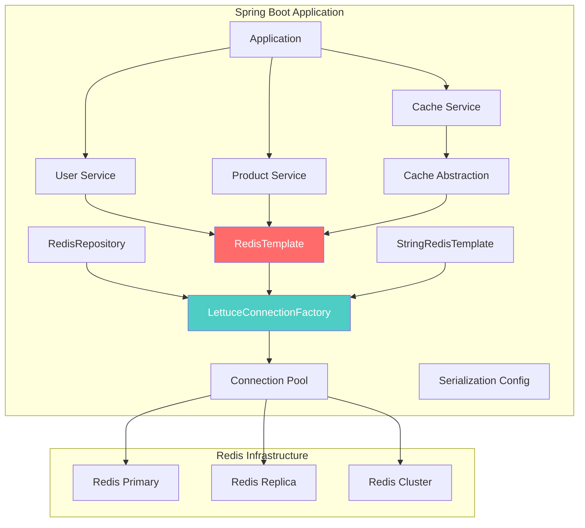
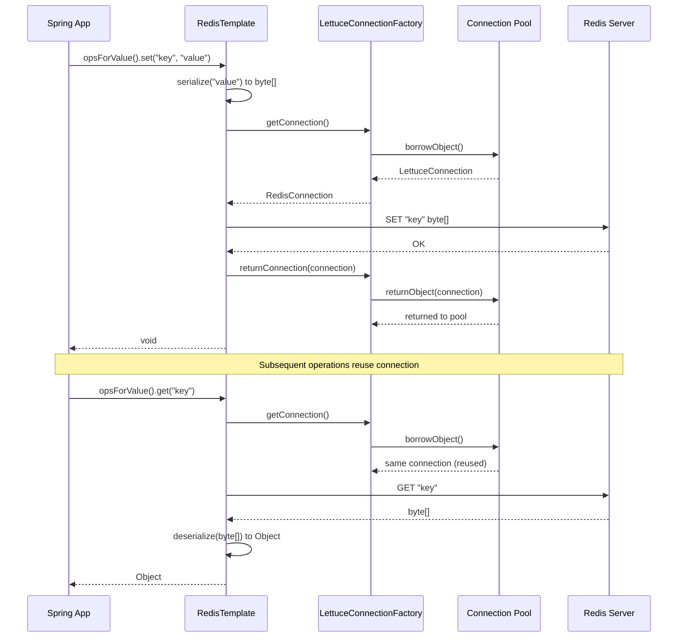
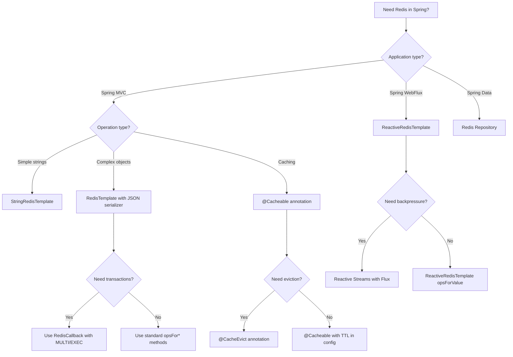

# 5. Spring Data Redis

## 1. Introduction

Spring Data Redis provides Spring-friendly abstractions for integrating with Redis. It offers `RedisTemplate` for low-level operations, `StringRedisTemplate` for string-specific operations, Repository support for domain objects, and seamless integration with Spring Cache and Spring Boot auto-configuration. This module covers the complete Spring Data Redis ecosystem with practical, production-ready examples.

## 2. Learning Objectives

- Configure Spring Data Redis with Spring Boot
- Master RedisTemplate and StringRedisTemplate operations
- Implement custom serializers (Jackson, Protobuf, Kryo)
- Build Redis repositories with Spring Data
- Configure connection pooling with Lettuce
- Implement distributed locks and counters
- Integrate with Spring Cache abstraction

## 3. Prerequisites

- Understanding of Spring Boot and dependency injection
- Knowledge of Redis fundamentals (Module 20, Topic 1)
- Familiarity with Spring Data concepts
- Basic understanding of Java serialization

## 4. Why This Concept Exists

Without Spring Data Redis:
- Manual connection management and error handling
- Boilerplate serialization/deserialization code
- No consistent abstraction across data stores
- Configuration duplication across projects
- Manual connection pool tuning

Spring Data Redis solves this with:
1. **Unified API** — Consistent template pattern across Spring Data projects
2. **Auto-configuration** — Zero-config setup with Spring Boot
3. **Repository abstraction** — CRUD operations without boilerplate
4. **Built-in serializers** — Jackson, String, JDK serializers ready to use
5. **Connection pooling** — Lettuce connection pool with sensible defaults

## 5. Problem Statement

A typical Spring application needs to interact with Redis for caching, session storage, and data access. Without Spring Data Redis:
- Each developer writes their own Jedis/Lettuce connection code
- Serialization logic is duplicated across services
- Configuration varies between environments
- Testing requires manual Redis setup
- Connection pool management is error-prone

## 6. Theory

### Spring Data Redis Architecture

```
┌────────────────────────────────────────────────────────┐
│ Application Code                                       │
│   @Autowired RedisTemplate / Repository               │
├────────────────────────────────────────────────────────┤
│ Spring Data Redis Abstraction Layer                    │
│   ├── RedisTemplate<K, V>                             │
│   ├── StringRedisTemplate                             │
│   ├── ReactiveRedisTemplate                           │
│   ├── RedisRepository                                 │
│   └── Cache Abstraction                               │
├────────────────────────────────────────────────────────┤
│ Connection Factory                                     │
│   ├── LettuceConnectionFactory (default)              │
│   ├── JedisConnectionFactory (alternative)            │
│   └── ReactiveLettsConnectionFactory                  │
├────────────────────────────────────────────────────────┤
│ Redis Client                                           │
│   ├── Lettuce (Netty-based, async, Connection sharing) │
│   └── Jedis (blocking, Connection per operation)       │
├────────────────────────────────────────────────────────┤
│ Redis Server                                           │
└────────────────────────────────────────────────────────┘
```

### Key Abstractions

| Class | Purpose |
|-------|---------|
| `RedisTemplate<K,V>` | General-purpose template for Redis operations |
| `StringRedisTemplate` | Specialized template for String keys/values |
| `RedisConnectionFactory` | Creates Redis connections |
| `RedisSerializer<T>` | Serializes/deserializes Redis values |
| `RedisStandaloneConfiguration` | Standalone Redis config |
| `RedisClusterConfiguration` | Cluster Redis config |
| `LettuceClientConfiguration` | Lettuce-specific config |

### Serialization Strategies

```
Java Object -> RedisSerializer -> byte[] -> Redis
Redis -> byte[] -> RedisSerializer -> Java Object

Available Serializers:
- StringRedisSerializer: UTF-8 strings
- GenericJackson2JsonRedisSerializer: JSON with type info
- GenericToStringSerializer: toString/fromString
- JdkSerializationRedisSerializer: Java serialization (default)
- ProtobufRedisSerializer: Protocol Buffers
- KryoRedisSerializer: Kryo serialization
```

## 7. Internal Working

### How RedisTemplate Executes Commands

```
1. redisTemplate.opsForValue().set("key", "value")
   |
2. RedisCallback creates Redis command
   |
3. RedisConnectionFactory returns RedisConnection
   |
4. Connection serializes key and value using RedisSerializer
   |
5. Command sent to Redis via Lettuce client
   |
6. Response received and deserialized
   |
7. Connection returned to pool
```

### Lettuce Connection Model

```
┌─────────────────────────────────────────────────┐
│ LettuceConnectionFactory                         │
│   ├── connectionPool: LettuceConnectionPool      │
│   │   ├── idle: [conn1, conn2, conn3]            │
│   │   ├── active: [conn4, conn5]                 │
│   │   └── maxIdle=8, maxTotal=16                 │
│   └── clusterCommandDispatcher                    │
│                                                  │
│ Single connection can handle multiple commands   │
│ (multiplexed, async, Netty-based)                │
└─────────────────────────────────────────────────┘
```

### Auto-Configuration Flow

```
1. Spring Boot detects Redis dependency
2. Loads RedisAutoConfiguration
3. Creates RedisConnectionFactory from application.properties
4. Creates RedisTemplate<String, Object> bean
5. Creates StringRedisTemplate bean
6. Configures serializers and connection settings
```

## 8. JVM Perspective

### Memory Footprint

```
RedisTemplate instance:
├── connectionFactory (shared, singleton)
│   ├── LettuceConnectionFactory
│   │   ├── ConnectionPool: ~2KB base + connections
│   │   └── Each Lettuce connection: ~4KB
│   └── Total for pool of 16: ~68KB
├── defaultSerializer: GenericJackson2JsonRedisSerializer
│   ├── ObjectMapper: ~50KB
│   └── Type mapping cache: ~2KB
├── keySerializer: StringRedisSerializer
└── Total RedisTemplate: ~120KB
```

### Serialization Overhead

| Serializer | Object Size | JSON Size | Protobuf Size |
|-----------|-------------|-----------|---------------|
| User (5 fields) | ~200 bytes | ~180 bytes | ~80 bytes |
| Product (10 fields) | ~400 bytes | ~350 bytes | ~120 bytes |
| Order (20 fields) | ~800 bytes | ~650 bytes | ~200 bytes |
| List of 100 Users | ~20KB | ~18KB | ~8KB |

## 9. Memory Representation

### Redis Connection Pool in JVM

```
LettuceConnectionPool
├── Pool<Map<String, RedisClusterNode>>
│   ├── ObjectPool<ConnectionPoolSlot>
│   │   ├── PoolConfig: maxTotal=16, maxIdle=8, minIdle=2
│   │   ├── Active connections: Set<ConnectionPoolSlot>
│   │   │   ├── Slot 1: LettuceConnection -> StatefulRedisConnection
│   │   │   ├── Slot 2: LettuceConnection -> StatefulRedisConnection
│   │   │   └── ... (up to maxTotal)
│   │   └── Idle connections: Queue<ConnectionPoolSlot>
│   │       ├── Slot A: LettuceConnection -> StatefulRedisConnection
│   │       └── ... (up to maxIdle)
│   └── Pool statistics: created=0, destroyed=0, borrowed=0
└── Shared connection for non-cluster (multiplexed)
```

### Serialized Data Format (Jackson JSON)

```json
{
  "@class": "com.example.model.User",
  "id": 12345,
  "name": "John Doe",
  "email": "john@example.com",
  "createdAt": "2024-01-15T10:30:00Z",
  "roles": ["ADMIN", "USER"]
}

Stored in Redis:
Key:   "user:12345" (22 bytes)
Value: Above JSON (~200 bytes)
```

## 10. Architecture Diagram



## 11. Flow Diagram



## 12. Syntax

### Configuration

```yaml
spring:
  data:
    redis:
      host: localhost
      port: 6379
      password: secret
      database: 0
      timeout: 5000ms
      lettuce:
        pool:
          max-active: 16
          max-idle: 8
          min-idle: 2
          max-wait: 5000ms
        shutdown-timeout: 200ms
      ssl:
        enabled: true
```

### RedisTemplate Configuration

```java
@Configuration
@EnableCaching
public class RedisConfig {

    @Bean
    public RedisConnectionFactory redisConnectionFactory() {
        LettuceClientConfiguration config = LettuceClientConfiguration.builder()
            .commandTimeout(Duration.ofSeconds(2))
            .clientName("spring-app")
            .build();

        RedisStandaloneConfiguration serverConfig =
            new RedisStandaloneConfiguration("localhost", 6379);
        serverConfig.setPassword("secret");
        serverConfig.setDatabase(0);

        return new LettuceConnectionFactory(serverConfig, config);
    }

    @Bean
    public RedisTemplate<String, Object> redisTemplate(RedisConnectionFactory factory) {
        RedisTemplate<String, Object> template = new RedisTemplate<>();
        template.setConnectionFactory(factory);

        template.setKeySerializer(new StringRedisSerializer());
        template.setHashKeySerializer(new StringRedisSerializer());

        GenericJackson2JsonRedisSerializer jsonSerializer =
            new GenericJackson2JsonRedisSerializer();
        template.setValueSerializer(jsonSerializer);
        template.setHashValueSerializer(jsonSerializer);

        template.afterPropertiesSet();
        return template;
    }

    @Bean
    public StringRedisTemplate stringRedisTemplate(RedisConnectionFactory factory) {
        return new StringRedisTemplate(factory);
    }
}
```

### Basic Operations

```java
@Service
@RequiredArgsConstructor
public class RedisOperationsExample {

    private final RedisTemplate<String, Object> redisTemplate;
    private final StringRedisTemplate stringRedisTemplate;

    public void stringOperations() {
        redisTemplate.opsForValue().set("name", "John");
        redisTemplate.opsForValue().set("name", "John", Duration.ofMinutes(30));
        redisTemplate.opsForValue().setIfAbsent("name", "John", Duration.ofHours(1));

        Object name = redisTemplate.opsForValue().get("name");
        redisTemplate.opsForValue().increment("counter");
        redisTemplate.opsForValue().decrement("counter");

        redisTemplate.opsForValue().append("key", "suffix");

        List<String> keys = List.of("key1", "key2", "key3");
        List<Object> values = redisTemplate.opsForValue().multiGet(keys);
    }

    public void hashOperations() {
        redisTemplate.opsForHash().put("user:1", "name", "John");
        redisTemplate.opsForHash().putAll("user:1", Map.of("name", "John", "age", "30"));

        Object name = redisTemplate.opsForHash().get("user:1", "name");
        Map<Object, Object> allFields = redisTemplate.opsForHash().entries("user:1");

        redisTemplate.opsForHash().delete("user:1", "age");
        redisTemplate.opsForHash().hasKey("user:1", "name");
    }

    public void listOperations() {
        redisTemplate.opsForList().leftPush("queue", "task1");
        redisTemplate.opsForList().rightPush("queue", "task2");
        redisTemplate.opsForList().leftPushAll("queue", List.of("a", "b", "c"));

        Object item = redisTemplate.opsForList().leftPop("queue");
        Object blocking = redisTemplate.opsForList().leftPop("queue", Duration.ofSeconds(5));

        List<Object> range = redisTemplate.opsForList().range("queue", 0, -1);
        Long size = redisTemplate.opsForList().size("queue");
    }

    public void setOperations() {
        redisTemplate.opsForSet().add("tags", "java", "spring", "redis");
        redisTemplate.opsForSet().members("tags");
        redisTemplate.opsForSet().isMember("tags", "java");
        redisTemplate.opsForSet().remove("tags", "java");
        redisTemplate.opsForSet().intersect("tags", "frameworks");
        redisTemplate.opsForSet().union("set1", "set2");
    }

    public void zSetOperations() {
        redisTemplate.opsForZSet().add("leaderboard", "player1", 100.0);
        redisTemplate.opsForZSet().add("leaderboard", "player2", 200.0);
        redisTemplate.opsForZSet().incrementScore("leaderboard", "player1", 50.0);

        Set<Object> topPlayers = redisTemplate.opsForZSet()
            .reverseRange("leaderboard", 0, 9);

        Double score = redisTemplate.opsForZSet().score("leaderboard", "player1");
        Long rank = redisTemplate.opsForZSet().reverseRank("leaderboard", "player1");
    }
}
```

## 13. Easy Example

A simple user repository using RedisTemplate:

```java
@Service
@RequiredArgsConstructor
@Slf4j
public class UserRepository {

    private final RedisTemplate<String, User> redisTemplate;

    private static final String KEY_PREFIX = "user:";
    private static final Duration DEFAULT_TTL = Duration.ofHours(1);

    public void save(User user) {
        String key = KEY_PREFIX + user.getId();
        redisTemplate.opsForValue().set(key, user, DEFAULT_TTL);
        log.info("Saved user: {} with key: {}", user.getId(), key);
    }

    public User findById(Long id) {
        String key = KEY_PREFIX + id;
        User user = redisTemplate.opsForValue().get(key);
        if (user != null) {
            log.info("Cache hit for user: {}", id);
        } else {
            log.info("Cache miss for user: {}", id);
        }
        return user;
    }

    public void deleteById(Long id) {
        String key = KEY_PREFIX + id;
        redisTemplate.delete(key);
        log.info("Deleted user with key: {}", key);
    }

    public boolean existsById(Long id) {
        return Boolean.TRUE.equals(redisTemplate.hasKey(KEY_PREFIX + id));
    }

    public void saveAll(List<User> users) {
        Map<String, User> entries = new HashMap<>();
        for (User user : users) {
            entries.put(KEY_PREFIX + user.getId(), user);
        }
        redisTemplate.opsForValue().multiSet(entries);

        entries.keySet().forEach(key ->
            redisTemplate.expire(key, DEFAULT_TTL)
        );
    }
}

@Data
@Builder
@AllArgsConstructor
@NoArgsConstructor
public class User implements Serializable {
    private Long id;
    private String name;
    private String email;
    private Instant createdAt;
}
```

## 14. Medium Example

A complete service layer with Redis caching, transactions, and distributed operations:

```java
@Service
@RequiredArgsConstructor
@Slf4j
public class OrderService {

    private final RedisTemplate<String, Object> redisTemplate;
    private final StringRedisTemplate stringRedisTemplate;
    private final OrderRepository orderRepository;
    private final ObjectMapper objectMapper;

    private static final String ORDER_CACHE = "order:";
    private static final String ORDER_COUNTER = "order:counter";
    private static final String PENDING_ORDERS = "orders:pending";
    private static final Duration ORDER_TTL = Duration.ofHours(2);

    @Transactional
    public Order createOrder(CreateOrderRequest request) {
        Long orderId = stringRedisTemplate.opsForValue().increment(ORDER_COUNTER);

        Order order = Order.builder()
            .id(orderId)
            .customerId(request.getCustomerId())
            .items(request.getItems())
            .status("PENDING")
            .createdAt(Instant.now())
            .build();

        orderRepository.save(order);

        redisTemplate.opsForValue().set(ORDER_CACHE + orderId, order, ORDER_TTL);

        redisTemplate.opsForZSet().add(
            PENDING_ORDERS,
            order,
            System.currentTimeMillis()
        );

        log.info("Created order: {} with atomic ID: {}", order.getId(), orderId);
        return order;
    }

    public Order getOrder(Long orderId) {
        String key = ORDER_CACHE + orderId;

        Order cached = (Order) redisTemplate.opsForValue().get(key);
        if (cached != null) {
            return cached;
        }

        Order order = orderRepository.findById(orderId)
            .orElseThrow(() -> new ResourceNotFoundException("Order", orderId));

        redisTemplate.opsForValue().set(key, order, ORDER_TTL);
        return order;
    }

    public List<Order> getOrdersByCustomer(Long customerId) {
        List<Long> orderIds = orderRepository.findOrderIdsByCustomerId(customerId);

        List<String> keys = orderIds.stream()
            .map(id -> ORDER_CACHE + id)
            .toList();

        List<Object> cached = redisTemplate.opsForValue().multiGet(keys);

        List<Order> result = new ArrayList<>();
        List<Long> missIds = new ArrayList<>();

        for (int i = 0; i < orderIds.size(); i++) {
            Object value = (cached != null && i < cached.size()) ? cached.get(i) : null;
            if (value != null) {
                result.add((Order) value);
            } else {
                missIds.add(orderIds.get(i));
            }
        }

        if (!missIds.isEmpty()) {
            List<Order> dbOrders = orderRepository.findAllById(missIds);

            Map<String, Object> toCache = new HashMap<>();
            for (Order order : dbOrders) {
                toCache.put(ORDER_CACHE + order.getId(), order);
                result.add(order);
            }

            if (!toCache.isEmpty()) {
                redisTemplate.opsForValue().multiSet(toCache);
                toCache.keySet().forEach(k -> redisTemplate.expire(k, ORDER_TTL));
            }
        }

        return result;
    }

    public boolean isRateLimited(String customerId, int maxOrders, Duration window) {
        String key = "ratelimit:orders:" + customerId;
        long now = System.currentTimeMillis();
        long windowStart = now - window.toMillis();

        redisTemplate.opsForZSet().removeRangeByScore(key, 0, windowStart);

        Long count = redisTemplate.opsForZSet().zCard(key);

        if (count != null && count >= maxOrders) {
            return true;
        }

        redisTemplate.opsForZSet().add(key, String.valueOf(now), now);
        redisTemplate.expire(key, window);
        return false;
    }
}
```

## 15. Hard Example

A production-grade abstraction layer with custom serializers, reactive support, and monitoring:

```java
@Configuration
@EnableCaching
@EnableMethodCache
public class AdvancedRedisConfig {

    @Bean
    public LettuceClientConfigurationBuilderCustomizer lettuceCustomizer() {
        return builder -> builder
            .commandTimeout(Duration.ofSeconds(3))
            .clientName("advanced-app")
            .and()
            .clientOptions(ClientOptions.builder()
                .autoReconnect(true)
                .disconnectedBehavior(
                    ClientOptions.DisconnectedBehavior.REJECT_COMMANDS)
                .build());
    }

    @Bean
    public RedisConnectionFactory redisConnectionFactory(
            @Value("${spring.data.redis.host}") String host,
            @Value("${spring.data.redis.port}") int port) {

        LettuceClientConfiguration clientConfig = LettuceClientConfiguration.builder()
            .commandTimeout(Duration.ofSeconds(2))
            .build();

        RedisStandaloneConfiguration serverConfig =
            new RedisStandaloneConfiguration(host, port);

        LettuceConnectionFactory factory =
            new LettuceConnectionFactory(serverConfig, clientConfig);
        factory.setEagerInitialization(true);
        return factory;
    }

    @Bean
    public RedisTemplate<String, Object> redisTemplate(
            RedisConnectionFactory factory) {
        RedisTemplate<String, Object> template = new RedisTemplate<>();
        template.setConnectionFactory(factory);

        template.setKeySerializer(new StringRedisSerializer());
        template.setHashKeySerializer(new StringRedisSerializer());

        ObjectMapper objectMapper = new ObjectMapper();
        objectMapper.registerModule(new JavaTimeModule());
        objectMapper.configure(
            DeserializationFeature.FAIL_ON_UNKNOWN_PROPERTIES, false);
        objectMapper.activateDefaultTyping(
            objectMapper.getPolymorphicTypeValidator(),
            ObjectMapper.DefaultTyping.NON_FINAL);

        GenericJackson2JsonRedisSerializer jsonSerializer =
            new GenericJackson2JsonRedisSerializer(objectMapper);
        template.setValueSerializer(jsonSerializer);
        template.setHashValueSerializer(jsonSerializer);

        template.setEnableDefaultCacheSerializer(false);
        template.afterPropertiesSet();
        return template;
    }

    @Bean
    public CacheManager cacheManager(RedisConnectionFactory connectionFactory) {
        RedisCacheConfiguration config = RedisCacheConfiguration.defaultCacheConfig()
            .entryTtl(Duration.ofMinutes(30))
            .serializeKeysWith(RedisSerializationContext.SerializationPair
                .fromSerializer(new StringRedisSerializer()))
            .serializeValuesWith(RedisSerializationContext.SerializationPair
                .fromSerializer(new GenericJackson2JsonRedisSerializer()))
            .disableCachingNullValues();

        return RedisCacheManager.builder(connectionFactory)
            .cacheDefaults(config)
            .withCacheConfiguration("users",
                RedisCacheConfiguration.defaultCacheConfig()
                    .entryTtl(Duration.ofHours(1)))
            .withCacheConfiguration("products",
                RedisCacheConfiguration.defaultCacheConfig()
                    .entryTtl(Duration.ofMinutes(15)))
            .transactionAware()
            .build();
    }
}

@Service
@RequiredArgsConstructor
@Slf4j
public class ReactiveRedisService {

    private final ReactiveRedisTemplate<String, Object> reactiveRedisTemplate;

    public Mono<Boolean> save(String key, Object value, Duration ttl) {
        return reactiveRedisTemplate.opsForValue()
            .set(key, value, ttl);
    }

    public Mono<Object> get(String key) {
        return reactiveRedisTemplate.opsForValue().get(key);
    }

    public Flux<Object> getAll(String pattern) {
        return reactiveRedisTemplate.keys(pattern)
            .flatMap(k -> reactiveRedisTemplate.opsForValue().get(k));
    }

    public Mono<Long> increment(String key) {
        return reactiveRedisTemplate.opsForValue().increment(key);
    }
}
```

## 16. Enterprise Example

A microservice-ready Redis integration with monitoring, circuit breaker, and multi-datasource:

```java
@Configuration
@Profile("production")
public class EnterpriseRedisConfig {

    @Bean
    @Primary
    public RedisConnectionFactory primaryRedisConnectionFactory(
            @Value("${redis.primary.host}") String host,
            @Value("${redis.primary.port}") int port,
            @Value("${redis.primary.password}") String password) {

        RedisStandaloneConfiguration config = new RedisStandaloneConfiguration(host, port);
        config.setPassword(password);

        LettuceClientConfiguration clientConfig = LettuceClientConfiguration.builder()
            .commandTimeout(Duration.ofSeconds(2))
            .clientName("primary")
            .useSsl()
            .disablePeerVerification()
            .build();

        return new LettuceConnectionFactory(config, clientConfig);
    }

    @Bean
    public RedisConnectionFactory secondaryRedisConnectionFactory(
            @Value("${redis.secondary.host}") String host,
            @Value("${redis.secondary.port}") int port) {

        RedisStandaloneConfiguration config = new RedisStandaloneConfiguration(host, port);

        LettuceClientConfiguration clientConfig = LettuceClientConfiguration.builder()
            .commandTimeout(Duration.ofSeconds(5))
            .clientName("secondary")
            .build();

        return new LettuceConnectionFactory(config, clientConfig);
    }

    @Bean
    @Primary
    public RedisTemplate<String, Object> primaryRedisTemplate(
            @Qualifier("primaryRedisConnectionFactory") RedisConnectionFactory factory) {
        return createRedisTemplate(factory);
    }

    @Bean
    public RedisTemplate<String, Object> secondaryRedisTemplate(
            @Qualifier("secondaryRedisConnectionFactory") RedisConnectionFactory factory) {
        return createRedisTemplate(factory);
    }

    private RedisTemplate<String, Object> createRedisTemplate(RedisConnectionFactory factory) {
        RedisTemplate<String, Object> template = new RedisTemplate<>();
        template.setConnectionFactory(factory);
        template.setKeySerializer(new StringRedisSerializer());
        template.setValueSerializer(new GenericJackson2JsonRedisSerializer());
        template.afterPropertiesSet();
        return template;
    }
}

@Component
@RequiredArgsConstructor
@Slf4j
public class RedisHealthIndicator implements HealthIndicator {

    private final RedisConnectionFactory connectionFactory;
    private final MeterRegistry meterRegistry;

    @Override
    public Health health() {
        try {
            RedisConnection connection = connectionFactory.getConnection();
            String pong = connection.ping();
            connection.close();

            meterRegistry.gauge("redis.health", 1);

            return Health.up()
                .withDetail("ping", pong)
                .withDetail("connected", true)
                .build();
        } catch (Exception e) {
            meterRegistry.gauge("redis.health", 0);
            return Health.down()
                .withDetail("error", e.getMessage())
                .build();
        }
    }
}

@Component
@RequiredArgsConstructor
@Slf4j
public class RedisMetricsCollector {

    private final StringRedisTemplate redisTemplate;
    private final MeterRegistry meterRegistry;

    @Scheduled(fixedRate = 30000)
    public void collectMetrics() {
        try {
            Properties info = redisTemplate.execute(
                (RedisCallback<Properties>) conn -> conn.info("stats"));

            if (info != null) {
                long hits = Long.parseLong(info.getProperty("keyspace_hits", "0"));
                long misses = Long.parseLong(info.getProperty("keyspace_misses", "0"));
                double hitRate = (hits + misses > 0)
                    ? (double) hits / (hits + misses) * 100 : 0;

                meterRegistry.gauge("redis.keyspace.hits", hits);
                meterRegistry.gauge("redis.keyspace.misses", misses);
                meterRegistry.gauge("redis.keyspace.hitrate", hitRate);
            }

            Properties memory = redisTemplate.execute(
                (RedisCallback<Properties>) conn -> conn.info("memory"));

            if (memory != null) {
                long usedMemory = Long.parseLong(
                    memory.getProperty("used_memory", "0"));
                meterRegistry.gauge("redis.memory.used", usedMemory);
            }

            Properties clients = redisTemplate.execute(
                (RedisCallback<Properties>) conn -> conn.info("clients"));

            if (clients != null) {
                long connectedClients = Long.parseLong(
                    clients.getProperty("connected_clients", "0"));
                meterRegistry.gauge("redis.clients.connected", connectedClients);
            }
        } catch (Exception e) {
            log.warn("Failed to collect Redis metrics: {}", e.getMessage());
        }
    }
}
```

## 17. Performance Considerations

1. **Connection Pool Sizing**: Set max-active based on concurrent threads. Rule of thumb: max-active = 2 x CPU cores.
2. **Serialization Choice**: Jackson JSON is readable but slower. Use Protobuf or Kryo for hot paths.
3. **Pipeline Usage**: Batch independent operations with `executePipelined()` to reduce round trips.
4. **Command Timeout**: Set reasonable timeouts (2-5 seconds). Too short causes false failures; too long blocks threads.
5. **Lazy vs Eager Initialization**: Eager initialization connects on startup, failing fast if Redis is down.
6. **Serializer Reuse**: Create serializers as singletons. ObjectMapper is expensive to create.
7. **Key Design**: Shorter keys save memory. Use hash tags `{}` for cluster co-location.
8. **Disable Default Cache Serializer**: Only serialize values, not keys, for better performance.

## 18. Time & Space Complexity

| Operation | Time | Space |
|-----------|------|-------|
| GET | O(1) | O(value size) |
| SET | O(1) | O(key + value size) |
| DELETE | O(1) | O(1) |
| multiGet (N keys) | O(N) | O(N x value size) |
| multiSet (N entries) | O(N) | O(N x (key + value size)) |
| Pipeline (N commands) | O(N) | O(N x avg command size) |
| Hash operations | O(1) per field | O(entries x field size) |
| ZSet operations | O(log N) | O(entries x member size) |

## 19. Thread Safety

### RedisTemplate Thread Safety

`RedisTemplate` is thread-safe. It uses a connection pool (LettuceConnectionFactory) and each operation borrows and returns a connection:

```java
// Thread-safe: Each thread gets its own connection from the pool
@Service
public class MyService {
    @Autowired
    private RedisTemplate<String, Object> redisTemplate;

    // Multiple threads can call this concurrently
    public void saveData(String key, Object value) {
        redisTemplate.opsForValue().set(key, value);
    }
}
```

### Connection Pool Concurrency

```
Thread 1 ──borrow──> Connection 1 ──execute──> return ──> pool
Thread 2 ──borrow──> Connection 2 ──execute──> return ──> pool
Thread 3 ──borrow──> Connection 1 ──execute──> return ──> pool
Thread 4 ──wait──> (pool exhausted, waiting for connection)
```

### Common Pitfalls

```java
// NOT thread-safe: Shared mutable state
private Map<String, Object> localCache = new HashMap<>();

// Thread-safe alternatives
private ConcurrentHashMap<String, Object> localCache = new ConcurrentHashMap<>();

// Or use @Cacheable which handles thread safety internally
```

## 20. Best Practices

1. **Use Spring Boot auto-configuration** unless you need custom setup
2. **Configure connection pool** explicitly for production workloads
3. **Use @Cacheable for caching** — don't reinvent the wheel
4. **Prefer GenericJackson2JsonRedisSerializer** over JDK serialization
5. **Set TTLs on all cache entries** — prevent unbounded memory growth
6. **Use StringRedisTemplate for simple string operations** — avoids serialization overhead
7. **Implement health checks** — monitor Redis connectivity
8. **Use Lettuce over Jedis** — better performance and connection sharing
9. **Separate concerns** — use different RedisTemplate beans for different domains
10. **Test with Testcontainers** — avoid test dependencies on external Redis

## 21. Common Mistakes

1. **Using JDK serialization** — not portable across languages, verbose, slow
2. **Not configuring connection pool** — default pool sizes may be too small
3. **Creating new ObjectMapper per request** — expensive, reuse as singleton
4. **Ignoring connection leaks** — always use try-with-resources or template methods
5. **Over-caching** — caching data that's rarely accessed wastes memory
6. **Not setting TTL** — Redis memory grows unbounded
7. **Using KEYS command** — blocks Redis, use SCAN instead
8. **Mixing Redis operations with transactions** — Redis transactions are limited
9. **Not handling serialization version changes** — schema changes invalidate cached data
10. **Using RedisTemplate for high-throughput scenarios** — consider Lettuce API directly

## 22. Pitfalls and Warnings

> **WARNING**: `@Cacheable` does not work on internal method calls within the same class. Spring uses proxies for AOP. Use self-injection or AopContext.

> **WARNING**: Changing Jackson ObjectMapper configuration (e.g., package scanning) invalidates all cached data. Cached objects contain `@class` type info.

> **WARNING**: Default JDK serialization is NOT portable across JVM versions. Always configure explicit serializers.

> **PITFALL**: `RedisTemplate.execute()` requires manual connection handling. Use `opsForValue()`, `opsForHash()` etc. for automatic connection management.

> **PITFALL**: Spring Data Redis auto-configuration creates `RedisTemplate<String, Object>` but uses `JdkSerializationRedisSerializer` by default. Always override serializers.

## 23. Debugging Tips

```java
// Enable Lettuce debug logging
logging:
  level:
    io.lettuce.core: DEBUG
    org.springframework.data.redis: DEBUG

// Enable Redis command logging
logging:
  level:
    io.lettuce.core.protocol: DEBUG

// Inspect connection pool
@Bean
public LettuceConnectionFactory redisConnectionFactory() {
    LettuceConnectionFactory factory = new LettuceConnectionFactory(...);
    factory.setEagerInitialization(true);

    // After context loads, check pool stats
    LettuceConnectionPool pool = (LettuceConnectionPool)
        factory.getConnectionProvider().getPool();
    // pool.getMetrics() returns pool statistics

    return factory;
}

// Monitor commands with Redis MONITOR (development only)
// redis-cli MONITOR

// Use Spring Boot Actuator for Redis health
// GET /actuator/health/redis
// GET /actuator/info/redis
```

## 24. Comparison Table

| Feature | RedisTemplate | StringRedisTemplate | ReactiveRedisTemplate |
|---------|---------------|---------------------|----------------------|
| API Type | Blocking | Blocking | Reactive (Mono/Flux) |
| Serialization | Generic (configurable) | String only | Generic (configurable) |
| Use Case | General purpose | String-only operations | Reactive applications |
| Thread Model | One thread per operation | One thread per operation | Event loop (Netty) |
| Connection | Borrow/return from pool | Borrow/return from pool | Shared async connection |
| Best For | Traditional Spring | Simple caching | WebFlux applications |

## 25. Decision Tree



## 26. Interview Questions

1. **What is the difference between RedisTemplate and StringRedisTemplate?**
   StringRedisTemplate extends RedisTemplate with String serializers for both keys and values. Use StringRedisTemplate when working only with strings to avoid serialization configuration.

2. **How does Spring Data Redis handle connection pooling?**
   Spring Boot auto-configures Lettuce with a connection pool. Default settings: max-active=8, max-idle=8, min-idle=0. Configure via `spring.data.redis.lettuce.pool.*` properties.

3. **Explain the difference between Lettuce and Jedis Redis clients.**
   Lettuce is Netty-based, supports async/non-blocking operations, and shares a single connection across threads. Jedis is blocking, requires a connection per operation, and needs a pool for thread safety.

4. **How do you configure custom serializers in Spring Data Redis?**
   Create a `RedisTemplate<String, Object>` bean, call `setKeySerializer()` and `setValueSerializer()` with your serializer (e.g., `GenericJackson2JsonRedisSerializer`), and call `afterPropertiesSet()`.

5. **What is the purpose of `afterPropertiesSet()` in RedisTemplate configuration?**
   It validates the configuration, initializes internal state, and prepares the template for use. Must be called after setting all properties on the template.

6. **How do you implement cache-aside pattern with Spring Data Redis?**
   Use `@Cacheable(value = "cache", key = "#id")` on the method. Spring intercepts calls, checks cache via Redis, and returns cached value on hit. On miss, the method executes and result is cached.

7. **How do you handle cache invalidation in Spring?**
   Use `@CacheEvict(value = "cache", key = "#id")` on update/delete methods. For bulk invalidation, use `@CacheEvict(value = "cache", allEntries = true)`.

8. **Explain the difference between `multiGet` and `executePipelined`.**
   `multiGet` sends a single MGET command. `executePipelined` batches multiple commands sent in sequence without waiting for responses. Use pipeline for mixed operations, multiGet for bulk reads.

9. **How do you configure Redis for SSL/TLS in Spring Boot?**
   Set `spring.data.redis.ssl.enabled=true`. For custom SSL, configure `LettuceClientConfiguration` with `.useSsl().disablePeerVerification()`.

10. **What happens when Redis connection is lost in Spring?**
    Spring throws `RedisConnectionFailureException`. Implement circuit breaker pattern. With Lettuce auto-reconnect enabled, connections are re-established automatically.

11. **How do you test Spring Data Redis code?**
    Use Testcontainers with Redis container. Spring Boot provides `@DataRedisTest` for slice testing. Mock RedisTemplate for unit tests.

12. **Explain the `@CachePut` annotation and when to use it.**
    `@CachePut` always executes the method and updates the cache. Use for write-through caching where cache should always reflect the latest data.

13. **How do you implement distributed locking with Spring Data Redis?**
    Use `redisTemplate.opsForValue().setIfAbsent(lockKey, ownerId, timeout)` for lock acquisition. Implement release with Lua script to ensure atomicity (check owner before delete).

14. **What are the memory implications of different serializers?**
    JDK serialization: largest, not portable. Jackson JSON: moderate size, readable, portable. Protobuf: smallest, fastest, requires schema. Kryo: very fast, not portable.

15. **How do you configure multiple Redis data sources in Spring?**
    Create separate `RedisConnectionFactory` and `RedisTemplate` beans with `@Qualifier` annotations. Use `@Primary` for the default template. Configure each with different host/port/database.

## 27. Exercises

### Level 1 (Beginner)
Set up Spring Data Redis:
- Create a Spring Boot project with `spring-boot-starter-data-redis`
- Configure `RedisTemplate` with Jackson JSON serializer
- Implement CRUD operations for a `Product` entity
- Add TTL to cached entries
- Write a simple test with `@DataRedisTest`

### Level 2 (Intermediate)
Build a complete caching layer:
- Implement cache-aside pattern for `UserService`
- Configure `RedisCacheManager` with per-cache TTL settings
- Add `@Cacheable`, `@CacheEvict`, and `@CachePut` annotations
- Implement batch cache operations with `multiGet`/`multiSet`
- Add cache warming on application startup
- Monitor cache hit rate with Micrometer metrics

### Level 3 (Advanced)
Design an enterprise Redis integration:
- Configure multiple Redis data sources (primary + secondary)
- Implement custom `RedisSerializer` with Protobuf
- Build a distributed lock abstraction with retry and TTL
- Add reactive Redis operations with `ReactiveRedisTemplate`
- Implement Redis health checks and metrics collection
- Write integration tests with Testcontainers Redis

## 28. Summary

Spring Data Redis is the standard way to integrate Redis with Spring applications:

- **RedisTemplate** provides a high-level API for all Redis data types
- **Auto-configuration** eliminates boilerplate setup
- **Custom serializers** allow portable, efficient data formats
- **Connection pooling** with Lettuce ensures high performance
- **Cache abstraction** with annotations simplifies caching implementation
- **Health monitoring** provides production visibility
- **Testcontainers** support enables reliable testing

Key recommendations:
- Use Lettuce (not Jedis) as the Redis client
- Always configure explicit serializers (not JDK default)
- Set TTLs on all cached data
- Monitor connection pool and cache hit rates
- Test with embedded/containers Redis

## 29. References

- [Spring Data Redis Reference](https://docs.spring.io/spring-data/redis/reference/redis.html)
- [Spring Boot Redis Auto-Configuration](https://docs.spring.io/spring-boot/docs/current/reference/htmlsingle/#data.redis)
- [Lettuce Documentation](https://lettuce.io/)
- [Spring Cache Abstraction](https://docs.spring.io/spring-framework/reference/integration/cache.html)
- [Testcontainers Redis Module](https://www.testcontainers.org/modules/databases/redis/)
- [Redis Documentation](https://redis.io/docs/)
