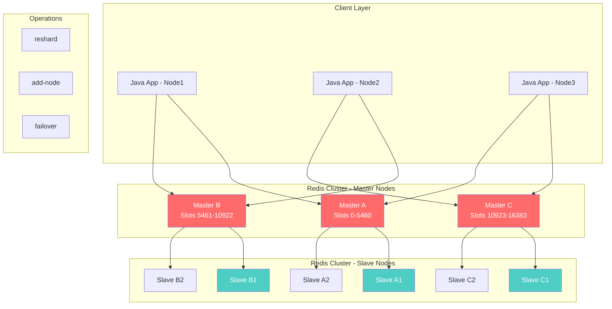
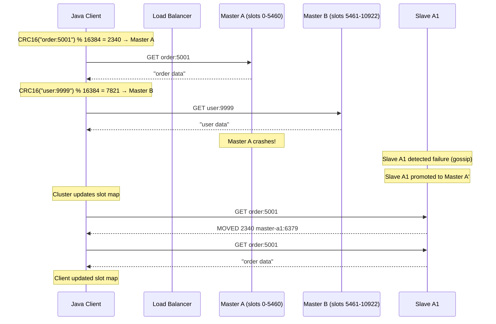
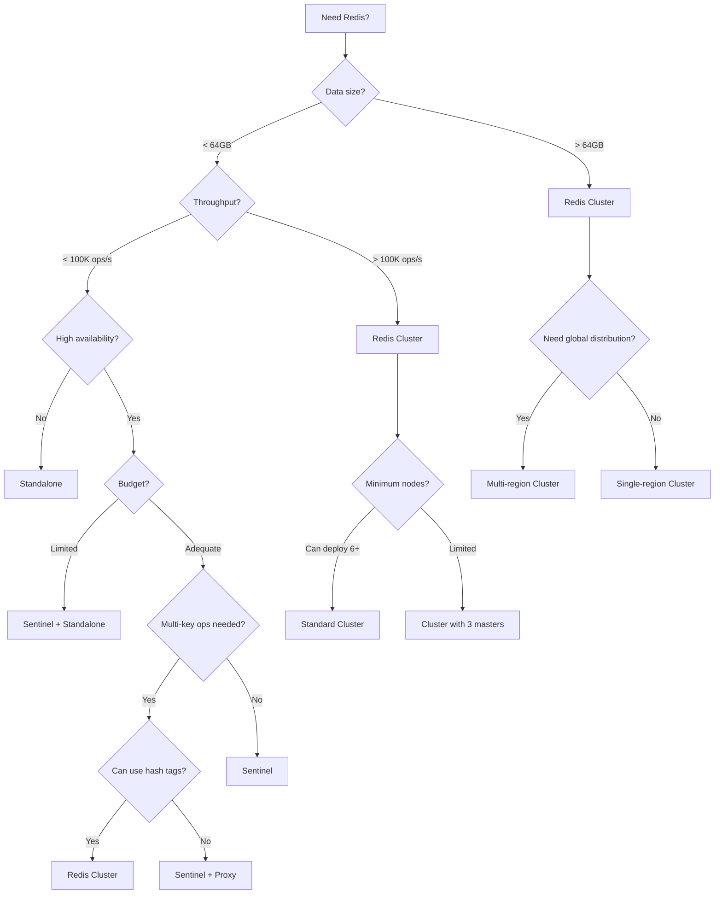

# 6. Redis Cluster

## 1. Introduction

Redis Cluster provides horizontal scaling through automatic data sharding (partitioning), replication for high availability, and automatic failover. It distributes data across multiple Redis nodes using hash slots, enabling linear scalability for both reads and writes. This module covers the architecture, configuration, operations, and client-side implementation of Redis Cluster with Spring Boot.

## 2. Learning Objectives

- Understand Redis Cluster architecture and hash slot distribution
- Configure Redis Cluster with Spring Boot
- Implement client-side cluster-aware operations
- Learn replication and failover mechanisms
- Understand cluster resharding and slot migration
- Handle cross-slot operations and hash tags
- Monitor cluster health and performance
- Implement cluster-aware caching and pub/sub

## 3. Prerequisites

- Understanding of Redis fundamentals (Module 20, Topic 1)
- Knowledge of Redis data structures (Module 20, Topic 2)
- Understanding of distributed systems concepts (CAP theorem, consistency)
- Familiarity with Spring Data Redis (Module 20, Topic 5)

## 4. Why This Concept Exists

A single Redis instance has inherent limitations:

1. **Memory limit** — Single machine has finite RAM (typically 64-512GB)
2. **Throughput limit** — Single instance handles ~100K-500K ops/sec
3. **Availability** — Single point of failure; if it dies, service is down
4. **Geographic distribution** — Cannot serve global users from one location

Redis Cluster solves these by:
- **Sharding** — Data split across multiple nodes (horizontal scaling)
- **Replication** — Each master has slave replicas (high availability)
- **Automatic failover** — Promotes slave to master on failure
- **No proxy** — Client connects directly to correct node (low latency)

## 5. Problem Statement

An e-commerce platform serves 10 million users with 500K concurrent connections:
- Single Redis instance at 64GB memory fills up with session + cache data
- Peak traffic hits 800K ops/sec, exceeding single-instance throughput
- Redis downtime causes complete service outage
- Need to serve users in US, EU, and Asia with low latency

Redis Cluster addresses all four constraints: memory, throughput, availability, and distribution.

## 6. Theory

### Hash Slot Distribution

Redis Cluster divides the key space into 16,384 hash slots (0-16383).

```
Hash slot = CRC16(key) % 16384

Example:
CRC16("user:123") % 16384 = 5649 → Node B
CRC16("product:456") % 16384 = 1203 → Node A
CRC16("order:789") % 16384 = 8821 → Node C
```

### Cluster Architecture

```
┌─────────────────────────────────────────────────────┐
│                    Client                            │
│  ClusterClient: maintains slot->node mapping        │
└───────────┬─────────────────────┬───────────────────┘
            │                     │
            ▼                     ▼
┌───────────────────┐  ┌───────────────────┐
│   Node A (Master) │  │   Node B (Master) │
│   Slots 0-5460    │  │   Slots 5461-10922│
├───────────────────┤  ├───────────────────┤
│   Node A1 (Slave) │  │   Node B1 (Slave) │
└───────────────────┘  └───────────────────┘
            │                     │
            ▼                     ▼
┌───────────────────┐
│   Node C (Master) │
│   Slots 10923-16383│
├───────────────────┤
│   Node C1 (Slave) │
└───────────────────┘
```

### Cluster Commands

```bash
# Create cluster
redis-cli --cluster create node1:6379 node2:6379 node3:6379 \
    node4:6379 node5:6379 node6:6379 --cluster-replicas 1

# Check cluster status
redis-cli cluster info
redis-cli cluster nodes
redis-cli cluster slots

# Add node
redis-cli --cluster add-node new-node:6379 existing-node:6379

# Remove node
redis-cli --cluster del-node node:6379 node-id

# Reshard slots
redis-cli --cluster reshard node:6379

# Check slot coverage
redis-cli cluster countkeysinslot <slot>
```

### Cross-Slot Operations

Certain operations require all keys to be in the same hash slot:

```
# These work (same slot with hash tags):
MSET {user:123}:name "John" {user:123}:email "john@example.com"
SUNION {tag:java} {tag:spring}

# These FAIL (different slots):
MSET user:123:name "John" user:456:name "Jane"
SUNION tag:java tag:spring
```

Hash tags force keys into the same slot:
```
{user:123}:name → slot based on "user:123"
{user:123}:email → same slot
user:123:name → slot based on entire key (different slot!)
```

### Replication in Cluster

```
Master A (slots 0-5460)
├── Slave A1 (replicates A)
└── Slave A2 (replicates A)

Master B (slots 5461-10922)
├── Slave B1 (replicates B)
└── Slave B2 (replicates B)

Master C (slots 10923-16383)
├── Slave C1 (replicates C)
└── Slave C2 (replicates C)
```

### Failover Process

```
1. Master A becomes unreachable
2. Cluster nodes detect failure (gossip protocol, 15 second timeout)
3. Majority of masters agree A is down
4. Slave A1 is promoted to master
5. Cluster updates slot mapping: slots 0-5460 now owned by A1
6. Clients receive MOVED redirection to A1
7. New master A1 starts accepting writes
```

## 7. Internal Working

### How Cluster Routing Works

```
Client sends: GET user:123
  │
  ├─ 1. Client computes slot: CRC16("user:123") % 16384 = 5649
  │
  ├─ 2. Client checks local slot map: slot 5649 → Node B
  │
  ├─ 3. Client sends GET user:123 to Node B
  │
  ├─ 4. Node B returns value
  │
  └─ 5. If wrong node, receives MOVED redirect:
       MOVED 5649 node-b:6379
       Client updates slot map and retries
```

### Gossip Protocol

Redis Cluster uses gossip protocol for node discovery and failure detection:

```
Every second, each node sends gossip message:
{
  "epoch": 1234,
  "sender": "node-a:6379",
  "myaddr": "node-a:6379",
  "myslots": [0-5460],
  "nodes": [
    {"addr": "node-b:6379", "slots": [5461-10922], "flags": "master"},
    {"addr": "node-a1:6379", "slots": [], "flags": "slave", "master": "node-a:6379"}
  ]
}
```

### Slot Migration

```
Source Node A                    Target Node D
─────────────────────────────────────────────
CLUSTER SETSLOT 5649 IMPORTING →
                                 ← CLUSTER SETSLOT 5649 MIGRATING
GET key → (found)               
MIGRATE key → ──────────────────→ SET key
GET key → (not found)           
ASK 5649 node-d:6379 ──────────→ GET key
                                 ← return value
```

## 8. JVM Perspective

### Lettuce Cluster Client

```
┌──────────────────────────────────────────────────────────┐
│ JVM Process                                              │
│                                                          │
│  ┌────────────────────────────────────────────────────┐  │
│  │ RedisClusterClient (Lettuce)                       │  │
│  │   ├── ClusterTopologyRefresh (periodic)            │  │
│  │   ├── ClusterCommandDispatcher                     │  │
│  │   │   ├── Slot → Node mapping (concurrent map)     │  │
│  │   │   ├── Connection per node                      │  │
│  │   │   └── Automatic MOVED/ASK handling             │  │
│  │   └── Connection Pool (shared across nodes)        │  │
│  └────────────────────────────────────────────────────┘  │
│                         │                                │
│  ┌──────────────────────┴─────────────────────────────┐  │
│  │ RedisTemplate                                        │  │
│  │   ├── opsForValue().get("key")                      │  │
│  │   │   └── ClusterClient routes to correct node      │  │
│  │   └── Automatic failover on MOVED/ASK               │  │
│  └────────────────────────────────────────────────────┘  │
└──────────────────────────────────────────────────────────┘
```

### Slot Map in Memory

```
ConcurrentHashMap<Integer, RedisClusterNode> slotMap:
├── 0      → NodeA(node-a:6379)
├── 1      → NodeA(node-a:6379)
├── ...
├── 5460   → NodeA(node-a:6379)
├── 5461   → NodeB(node-b:6379)
├── ...
├── 10922  → NodeB(node-b:6379)
├── 10923  → NodeC(node-c:6379)
├── ...
└── 16383  → NodeC(node-c:6379)

Slot resolution: CRC16(key) % 16384 → lookup in slotMap → get node
```

## 9. Memory Representation

### Cluster State in Redis

```
clusterState (per node):
├── myself: clusterNode
├── nodes: dict(clusterNode)
│   ├── "node-a:6379": {slots: [0-5460], flags: MASTER}
│   ├── "node-b:6379": {slots: [5461-10922], flags: MASTER}
│   ├── "node-c:6379": {slots: [10923-16383], flags: MASTER}
│   ├── "node-a1:6379": {slots: [], flags: SLAVE, master: "node-a:6379"}
│   ├── "node-b1:6379": {slots: [], flags: SLAVE, master: "node-b:6379"}
│   └── "node-c1:6379": {slots: [], flags: SLAVE, master: "node-c:6379"}
├── slots: clusterNode[16384]
│   ├── slots[0] → node-a
│   ├── slots[5461] → node-b
│   └── slots[10923] → node-c
├── state: CLUSTER_OK
├── epoch: 1234
└── migrations: dict
    └── slot 5649 → node-d (IMPORTING)
```

### Per-Node Memory

| Component | Size |
|-----------|------|
| clusterNode structure | ~400 bytes |
| Slot ownership bitmap | 2048 bytes (16384/8) |
| Gossip protocol state | ~1KB per node |
| Total cluster overhead per node | ~10KB + 10KB per other node |

## 10. Architecture Diagram



## 11. Flow Diagram



## 12. Syntax

### Spring Boot Configuration

```yaml
spring:
  data:
    redis:
      cluster:
        nodes:
          - node1:6379
          - node2:6379
          - node3:6379
          - node4:6379
          - node5:6379
          - node6:6379
        max-redirects: 3
      lettuce:
        pool:
          max-active: 16
          max-idle: 8
          min-idle: 2
        cluster:
          refresh:
            adaptive: true
            period: 30s
```

### Java Configuration

```java
@Configuration
@EnableCaching
public class RedisClusterConfig {

    @Bean
    public RedisConnectionFactory redisConnectionFactory() {
        RedisClusterConfiguration clusterConfig = new RedisClusterConfiguration(
            List.of("node1:6379", "node2:6379", "node3:6379",
                    "node4:6379", "node5:6379", "node6:6379"));
        clusterConfig.setMaxRedirects(3);
        clusterConfig.setPassword("secret");

        LettuceClientConfiguration clientConfig = LettuceClientConfiguration.builder()
            .commandTimeout(Duration.ofSeconds(3))
            .build();

        return new LettuceConnectionFactory(clusterConfig, clientConfig);
    }

    @Bean
    public RedisTemplate<String, Object> redisTemplate(
            RedisConnectionFactory factory) {
        RedisTemplate<String, Object> template = new RedisTemplate<>();
        template.setConnectionFactory(factory);
        template.setKeySerializer(new StringRedisSerializer());
        template.setValueSerializer(new GenericJackson2JsonRedisSerializer());
        template.afterPropertiesSet();
        return template;
    }

    @Bean
    public RedisClusterClient clusterClient() {
        RedisClusterConfiguration clusterConfig = new RedisClusterConfiguration(
            List.of("node1:6379", "node2:6379", "node3:6379"));

        ClusterTopologyRefreshOptions topologyRefresh = ClusterTopologyRefreshOptions.builder()
            .enablePeriodicRefresh(Duration.ofSeconds(30))
            .enableAdaptiveRefreshTrigger(
                ClusterTopologyRefreshOptions.MOVED_REDIRECT,
                ClusterTopologyRefreshOptions.ASK_REDIRECT)
            .build();

        ClusterClientOptions clientOptions = ClusterClientOptions.builder()
            .topologyRefreshOptions(topologyRefresh)
            .autoReconnect(true)
            .disconnectedBehavior(
                ClusterClientOptions.DisconnectedBehavior.REJECT_COMMANDS)
            .build();

        LettuceClientConfiguration clientConfig = LettuceClientConfiguration.builder()
            .clientOptions(clientOptions)
            .commandTimeout(Duration.ofSeconds(3))
            .build();

        return (RedisClusterClient) RedisClusterClient.create(
            ClientResources.builder().build(),
            clusterConfig,
            clientConfig);
    }
}
```

### Cluster-Aware Operations

```java
@Service
@RequiredArgsConstructor
@Slf4j
public class ClusterAwareService {

    private final RedisTemplate<String, Object> redisTemplate;
    private final RedisClusterClient clusterClient;

    // Automatic cluster routing
    public void saveWithHashTag(String userId, String name, String email) {
        // All keys with same hash tag go to same slot
        String prefix = "{" + userId + "}";
        redisTemplate.opsForValue().set(prefix + ":name", name);
        redisTemplate.opsForValue().set(prefix + ":email", email);
    }

    // Get slot information for a key
    public void getSlotInfo(String key) {
        String redisKey = "slotcheck:" + key;
        redisTemplate.opsForValue().set(redisKey, "test");

        Long slot = redisTemplate.execute(
            (RedisCallback<Long>) conn -> {
                byte[] keyBytes = redisKey.getBytes();
                return conn.clusterGetSlotForKey(keyBytes);
            });

        log.info("Key {} maps to slot {}", key, slot);
    }

    // Execute cluster-specific command
    public Map<String, Object> getClusterInfo() {
        return redisTemplate.execute(
            (RedisCallback<Map<String, Object>>) conn -> {
                Properties info = conn.clusterGetNodes();
                Properties slots = conn.clusterGetSlots();

                Map<String, Object> result = new HashMap<>();
                result.put("nodes", info);
                result.put("slots", slots);
                return result;
            });
    }

    // Get keys in a specific slot
    public List<String> getKeysInSlot(int slot) {
        return redisTemplate.execute(
            (RedisCallback<List<String>>) conn -> {
                List<String> keys = new ArrayList<>();
                byte[][] result = conn.clusterGetKeysInSlot(slot, 100);
                if (result != null) {
                    for (byte[] keyBytes : result) {
                        keys.add(new String(keyBytes));
                    }
                }
                return keys;
            });
    }
}
```

## 13. Easy Example

A simple cluster-aware caching service:

```java
@Service
@RequiredArgsConstructor
@Slf4j
public class ClusterCacheService {

    private final RedisTemplate<String, Object> redisTemplate;
    private static final Duration DEFAULT_TTL = Duration.ofMinutes(30);

    // Cache with automatic cluster routing
    public void cacheUser(Long userId, User user) {
        String key = "user:" + userId;
        redisTemplate.opsForValue().set(key, user, DEFAULT_TTL);
        log.info("Cached user {} (slot {})", userId, getSlot(key));
    }

    public User getUser(Long userId) {
        String key = "user:" + userId;
        return (User) redisTemplate.opsForValue().get(key);
    }

    // Cache with hash tags for multi-key operations
    public void cacheUserSession(String sessionId, String userId, String data) {
        String prefix = "{session:" + sessionId + "}";
        redisTemplate.opsForValue().set(prefix + ":user", userId, DEFAULT_TTL);
        redisTemplate.opsForValue().set(prefix + ":data", data, DEFAULT_TTL);
    }

    private int getSlot(String key) {
        return redisTemplate.execute(
            (RedisCallback<Integer>) conn -> conn.clusterGetSlotForKey(key.getBytes()));
    }
}
```

## 14. Medium Example

A complete cluster-aware data layer with resharding awareness:

```java
@Service
@RequiredArgsConstructor
@Slf4j
public class ClusterOrderService {

    private final RedisTemplate<String, Object> redisTemplate;
    private final StringRedisTemplate stringRedisTemplate;
    private final ObjectMapper objectMapper;
    private final MeterRegistry meterRegistry;

    // Store order with hash tag for atomic operations
    public void createOrder(Order order) {
        String orderId = String.valueOf(order.getId());

        // Use hash tag to keep all order data in same slot
        String prefix = "{order:" + orderId + "}";

        redisTemplate.executePipelined((RedisCallback<Object>) connection -> {
            connection.stringCommands().set(
                (prefix + ":data").getBytes(),
                objectMapper.writeValueAsBytes(order),
                Expiration.seconds(3600),
                RedisStringCommands.SetOption.UPSERT);

            connection.stringCommands().set(
                (prefix + ":status").getBytes(),
                order.getStatus().getBytes(),
                Expiration.seconds(3600),
                RedisStringCommands.SetOption.UPSERT);

            connection.zSetCommands().zAdd(
                "orders:byTime".getBytes(),
                System.currentTimeMillis(),
                orderId.getBytes());

            connection.hSetCommands().hSet(
                "orders:byCustomer".getBytes(),
                String.valueOf(order.getCustomerId()).getBytes(),
                orderId.getBytes());

            return null;
        });

        meterRegistry.counter("orders.created").increment();
        log.info("Created order {} in cluster", orderId);
    }

    public Order getOrder(Long orderId) {
        String prefix = "{order:" + orderId + "}";
        byte[] data = stringRedisTemplate.execute(
            (RedisCallback<byte[]>) conn ->
                conn.get((prefix + ":data").getBytes()));

        if (data != null) {
            return objectMapper.readValue(data, Order.class);
        }
        return null;
    }

    // Cross-slot operation: get orders from multiple customers
    public Map<Long, List<Order>> getOrdersByCustomers(List<Long> customerIds) {
        Map<Long, List<Order>> result = new HashMap<>();

        // Group by customer to minimize cross-slot queries
        for (Long customerId : customerIds) {
            List<String> orderIds = stringRedisTemplate.opsForHash()
                .values("orders:byCustomer")
                .stream()
                .filter(id -> {
                    // Filter for this customer
                    Order order = getOrder(Long.parseLong(id.toString()));
                    return order != null && order.getCustomerId().equals(customerId);
                })
                .map(Object::toString)
                .toList();

            List<Order> orders = orderIds.stream()
                .map(id -> {
                    try {
                        return getOrder(Long.parseLong(id));
                    } catch (Exception e) {
                        return null;
                    }
                })
                .filter(Objects::nonNull)
                .toList();

            result.put(customerId, orders);
        }

        return result;
    }

    // Cluster health check
    public ClusterHealth checkClusterHealth() {
        return redisTemplate.execute((RedisCallback<ClusterHealth>) conn -> {
            Properties nodes = conn.clusterGetNodes();
            int totalSlots = 0;
            int coveredSlots = 0;

            Properties slots = conn.clusterGetSlots();
            // Count covered slots
            for (Object key : slots.keySet()) {
                // Each key represents a slot range
                coveredSlots++;
            }

            return ClusterHealth.builder()
                .nodeCount(nodes.size())
                .totalSlots(16384)
                .coveredSlots(coveredSlots)
                .isHealthy(coveredSlots == 16384)
                .build();
        });
    }
}

@Data
@Builder
class ClusterHealth {
    private int nodeCount;
    private int totalSlots;
    private int coveredSlots;
    private boolean isHealthy;
}
```

## 15. Hard Example

A production cluster manager with automatic failover handling, slot migration awareness, and monitoring:

```java
@Service
@RequiredArgsConstructor
@Slf4j
public class ProductionClusterManager {

    private final RedisTemplate<String, Object> redisTemplate;
    private final StringRedisTemplate stringRedisTemplate;
    private final MeterRegistry meterRegistry;
    private final ObjectMapper objectMapper;

    private final Map<Integer, String> slotToNodeCache = new ConcurrentHashMap<>();
    private volatile Instant lastTopologyRefresh = Instant.now();

    // Initialize cluster topology cache
    @PostConstruct
    public void initTopology() {
        refreshTopology();
        log.info("Cluster topology initialized: {} slots mapped", slotToNodeCache.size());
    }

    @Scheduled(fixedRate = 30000)
    public void refreshTopology() {
        try {
            Map<Integer, String> newTopology = redisTemplate.execute(
                (RedisCallback<Map<Integer, String>>) conn -> {
                    Map<Integer, String> topology = new HashMap<>();
                    Properties slots = conn.clusterGetSlots();

                    // Parse slot ranges and map to nodes
                    for (Object key : slots.keySet()) {
                        // Implementation depends on Redis slot info format
                        // This is simplified for illustration
                    }
                    return topology;
                });

            if (newTopology != null && !newTopology.isEmpty()) {
                slotToNodeCache.clear();
                slotToNodeCache.putAll(newTopology);
                lastTopologyRefresh = Instant.now();
            }
        } catch (Exception e) {
            log.warn("Failed to refresh cluster topology: {}", e.getMessage());
            meterRegistry.counter("cluster.topology.refresh.failed").increment();
        }
    }

    // Get which node owns a specific slot
    public String getNodeForSlot(int slot) {
        return slotToNodeCache.getOrDefault(slot, "unknown");
    }

    // Monitor cluster stats
    @Scheduled(fixedRate = 10000)
    public void collectClusterMetrics() {
        try {
            redisTemplate.execute((RedisCallback<Void>) conn -> {
                Properties clusterInfo = conn.clusterGetNodes();

                // Count masters and slaves
                long masters = clusterInfo.keySet().stream()
                    .filter(k -> k.toString().contains("master"))
                    .count();
                long slaves = clusterInfo.size() - masters;

                meterRegistry.gauge("cluster.masters", masters);
                meterRegistry.gauge("cluster.slaves", slaves);
                meterRegistry.gauge("cluster.nodes", clusterInfo.size());

                return null;
            });

            // Check slot coverage
            Integer coveredSlots = redisTemplate.execute(
                (RedisCallback<Integer>) conn -> {
                    Properties slots = conn.clusterGetSlots();
                    return slots != null ? slots.size() : 0;
                });

            double coverage = coveredSlots != null
                ? (double) coveredSlots / 16384 * 100 : 0;
            meterRegistry.gauge("cluster.slot.coverage", coverage);

        } catch (Exception e) {
            log.warn("Failed to collect cluster metrics: {}", e.getMessage());
        }
    }

    // Handle MOVED/ASK redirects with retry
    public <T> T executeWithRetry(RedisCallback<T> callback, int maxRetries) {
        for (int attempt = 0; attempt <= maxRetries; attempt++) {
            try {
                return redisTemplate.execute(callback);
            } catch (RedisClusterException e) {
                if (e.getMessage() != null && e.getMessage().contains("MOVED")) {
                    log.warn("MOVED redirect detected, refreshing topology");
                    refreshTopology();

                    if (attempt == maxRetries) {
                        throw e;
                    }
                } else if (e.getMessage() != null && e.getMessage().contains("ASK")) {
                    log.warn("ASK redirect detected, retrying with ASK");
                    if (attempt == maxRetries) {
                        throw e;
                    }
                } else {
                    throw e;
                }
            }
        }
        throw new RedisClusterException("Max retries exceeded");
    }

    // Cross-slot operation using hash tags
    public void executeMultiKeyOperation(String hashTag, Runnable operation) {
        // Ensure all keys in the operation use the same hash tag
        String prefix = "{" + hashTag + "}";
        log.debug("Executing multi-key operation with hash tag: {}", prefix);
        operation.run();
    }

    // Cluster backup (RDB snapshot trigger)
    public void triggerClusterBackup() {
        redisTemplate.execute((RedisCallback<Void>) conn -> {
            // Trigger BGSAVE on all nodes
            for (String node : getMasterNodes()) {
                try {
                    conn.clusterGetNodes();
                    // In production, use redis-cli or direct connection
                    log.info("Backup triggered for node: {}", node);
                } catch (Exception e) {
                    log.warn("Failed to trigger backup on {}: {}", node, e.getMessage());
                }
            }
            return null;
        });
    }

    private List<String> getMasterNodes() {
        return redisTemplate.execute((RedisCallback<List<String>>) conn -> {
            Properties nodes = conn.clusterGetNodes();
            return nodes.keySet().stream()
                .filter(k -> k.toString().contains("master"))
                .map(Object::toString)
                .toList();
        });
    }
}

// Custom exception for cluster operations
class RedisClusterException extends RuntimeException {
    public RedisClusterException(String message) {
        super(message);
    }
}
```

## 16. Enterprise Example

A complete microservice using Redis Cluster with multi-region replication:

```java
@Service
@RequiredArgsConstructor
@Slf4j
public class GlobalProductCatalogService {

    private final RedisTemplate<String, Object> redisTemplate;
    private final StringRedisTemplate stringRedisTemplate;
    private final ProductRepository productRepository;
    private final MeterRegistry meterRegistry;
    private final ObjectMapper objectMapper;

    private static final Duration CATALOG_TTL = Duration.ofHours(1);
    private static final String REGION_PREFIX = "region:";

    // Region-aware caching
    public Product getProduct(Long productId, String region) {
        String key = REGION_PREFIX + region + ":product:" + productId;

        Product cached = (Product) redisTemplate.opsForValue().get(key);
        if (cached != null) {
            meterRegistry.counter("catalog.cache.hit", "region", region).increment();
            return cached;
        }

        meterRegistry.counter("catalog.cache.miss", "region", region).increment();

        Product product = productRepository.findById(productId)
            .orElseThrow(() -> new ResourceNotFoundException("Product", productId));

        // Cache with region-specific TTL
        Duration ttl = getRegionTtl(region);
        redisTemplate.opsForValue().set(key, product, ttl);

        return product;
    }

    // Cross-region product sync
    public void syncProductAcrossRegions(Long productId, Product product) {
        List<String> regions = List.of("us-east", "us-west", "eu-west", "ap-south");

        redisTemplate.executePipelined((RedisCallback<Object>) connection -> {
            for (String region : regions) {
                String key = REGION_PREFIX + region + ":product:" + productId;
                byte[] value = objectMapper.writeValueAsBytes(product);

                connection.stringCommands().set(
                    key.getBytes(),
                    value,
                    Expiration.seconds(CATALOG_TTL.getSeconds()),
                    RedisStringCommands.SetOption.UPSERT);
            }
            return null;
        });

        log.info("Synced product {} across {} regions", productId, regions.size());
    }

    // Inventory tracking with atomic operations
    public boolean decrementInventory(Long productId, int quantity) {
        String key = "inventory:" + productId;

        return Boolean.TRUE.equals(redisTemplate.execute(
            (RedisCallback<Boolean>) conn -> {
                byte[] keyBytes = key.getBytes();
                byte[] currentBytes = conn.get(keyBytes);

                if (currentBytes == null) return false;

                int current = Integer.parseInt(new String(currentBytes));
                if (current < quantity) return false;

                int newQty = current - quantity;
                conn.set(keyBytes, String.valueOf(newQty).getBytes());
                return true;
            }));
    }

    // Cluster-wide search with SCAN
    public List<String> searchProducts(String pattern) {
        return redisTemplate.execute((RedisCallback<List<String>>) conn -> {
            List<String> results = new ArrayList<>();
            ScanParams scanParams = new ScanParams().match(pattern).count(100);

            // SCAN through all slots
            for (int slot = 0; slot < 16384; slot += 100) {
                byte[][] keys = conn.clusterGetKeysInSlot(slot, 100);
                if (keys != null) {
                    for (byte[] key : keys) {
                        results.add(new String(key));
                    }
                }
            }
            return results;
        });
    }

    // Metrics collection
    @Scheduled(fixedRate = 60000)
    public void collectMetrics() {
        try {
            // Count keys per region
            Map<String, Long> regionCounts = new HashMap<>();
            String[] regions = {"us-east", "us-west", "eu-west", "ap-south"};

            for (String region : regions) {
                Long count = redisTemplate.execute(
                    (RedisCallback<Long>) conn -> {
                        byte[][] keys = conn.keys((REGION_PREFIX + region + ":*").getBytes());
                        return keys != null ? (long) keys.length : 0L;
                    });
                regionCounts.put(region, count != null ? count : 0L);
            }

            regionCounts.forEach((region, count) ->
                meterRegistry.gauge("catalog.keys", "region", region, count));

        } catch (Exception e) {
            log.warn("Failed to collect catalog metrics: {}", e.getMessage());
        }
    }

    private Duration getRegionTtl(String region) {
        return switch (region) {
            case "us-east", "us-west" -> Duration.ofMinutes(30);
            case "eu-west" -> Duration.ofMinutes(45);
            case "ap-south" -> Duration.ofMinutes(60);
            default -> CATALOG_TTL;
        };
    }
}
```

## 17. Performance Considerations

1. **Slot Distribution**: Ensure even distribution across masters. Unbalanced slots cause hotspots.
2. **Hash Tag Usage**: Use hash tags sparingly. Overusing concentrates data on one node.
3. **Pipeline Across Slots**: Pipeline commands to same slot for efficiency; cross-slot requires separate pipelines.
4. **Connection Pool Size**: Each master needs connections. Pool size = max-active / num-masters.
5. **Topology Refresh**: Too frequent refreshes add overhead; too infrequent causes stale routing.
6. **MOVED Redirects**: Client should cache slot mappings to minimize redirects.
7. **Memory Distribution**: Monitor per-node memory usage to detect imbalances.

## 18. Time and Space Complexity

| Operation | Time | Space |
|-----------|------|-------|
| Key lookup (single node) | O(1) | O(value size) |
| Cross-slot MGET | O(N) | O(N x value size) |
| Pipeline to same slot | O(N) | O(N x avg command size) |
| Cluster topology refresh | O(N) | O(N x node info size) |
| SLOTSCOUNT inspection | O(N) | O(N x slot info) |
| Resharding (per key) | O(1) per key | O(key + value size) |
| SCAN across cluster | O(N) | O(result set size) |

## 19. Thread Safety

### Cluster Client Thread Safety

Lettuce `RedisClusterClient` is thread-safe and uses a single connection per node (multiplexed):

```java
// Thread-safe: Lettuce handles connection multiplexing
@Service
public class ClusterService {
    @Autowired
    private RedisTemplate<String, Object> redisTemplate;

    // Multiple threads can call concurrently
    public void saveData(String key, Object value) {
        redisTemplate.opsForValue().set(key, value);
    }
}
```

### Slot Map Concurrency

```
Thread 1 reads slot map → ConcurrentHashMap (thread-safe)
Thread 2 updates slot map during topology refresh → Atomic replacement
Thread 3 sends command using slot map → Snapshot consistency
```

### Connection Pool in Cluster Mode

```
Cluster Mode:
  ├── Master A: connection pool (maxIdle=4)
  ├── Master B: connection pool (maxIdle=4)
  ├── Master C: connection pool (maxIdle=4)
  └── Each pool is thread-safe (Lettuce default)
```

## 20. Best Practices

1. **Use odd number of masters** — Minimum 3 masters for proper quorum
2. **Each master should have at least 1 slave** — For automatic failover
3. **Distribute across availability zones** — No two replicas in same AZ
4. **Use hash tags for multi-key operations** — `{entity:id}:field`
5. **Enable adaptive topology refresh** — Handle MOVED/ASK redirects automatically
6. **Monitor slot coverage** — Ensure all 16384 slots are covered
7. **Set reasonable timeouts** — Cluster operations have higher latency than single-node
8. **Plan resharding during off-peak** — Slot migration affects performance
9. **Use cluster-aware clients** — Lettuce handles MOVED/ASK automatically
10. **Test failover scenarios** — Verify application behavior during node failures

## 21. Common Mistakes

1. **Insufficient masters** — Less than 3 masters cannot form quorum
2. **No slave for master** — Single point of failure despite cluster
3. **Ignoring cross-slot limitations** — MGET across different slots fails
4. **Overusing hash tags** — Creates hotspots on single node
5. **Not monitoring slot distribution** — Uneven distribution causes performance issues
6. **Assuming linear scaling** — Performance scales with master count, not total nodes
7. **Ignoring MOVED redirects** — Client must handle or performance degrades
8. **Wrong max-redirects setting** — Too low causes failures, too high wastes retries

## 22. Pitfalls and Warnings

> **WARNING**: Redis Cluster does NOT support multi-key operations across different hash slots. Use hash tags `{key}` to force keys into the same slot, or use Lua scripts with key extraction.

> **WARNING**: Cluster mode uses more memory per key than standalone mode (~2x overhead for cluster metadata). Plan memory accordingly.

> **WARNING**: During slot migration, briefly some commands may fail with ASK redirects. Client must handle this gracefully.

> **PITFALL**: `DBSIZE` command in cluster mode returns count only for the connected node, not total cluster size. Use `SCAN` across all slots for accurate count.

> **PITFALL**: Redis Cluster does NOT support SELECT (multiple databases). All keys are in database 0.

## 23. Debugging Tips

```bash
# Check cluster status
redis-cli cluster info
redis-cli cluster nodes

# Find which node owns a slot
redis-cli cluster keyslot "user:123"

# Check keys in a slot
redis-cli cluster countkeysinslot 5649

# Get all keys in a slot (use SCAN for large clusters)
redis-cli --scan --pattern "*" --count 100

# Monitor cluster events
redis-cli MONITOR

# Check node memory
redis-cli info memory

# Force slot rebalance
redis-cli --cluster rebalance node1:6379

# Check cluster configuration
redis-cli cluster getkeysinslot <slot> <count>

# Debug MOVED/ASK errors
redis-cli cluster setslot <slot> node <node-id>
redis-cli cluster setslot <slot> migrating <node-id>
redis-cli cluster setslot <slot> importing <node-id>
```

```java
// Debug logging for cluster operations
logging:
  level:
    io.lettuce.core.cluster: DEBUG
    org.springframework.data.redis: DEBUG

// Monitor slot distribution in code
@Bean
public CommandLineRunner debugCluster(RedisConnectionFactory factory) {
    return args -> {
        RedisClusterConnection connection =
            (RedisClusterConnection) factory.getConnection();

        for (int i = 0; i < 16384; i++) {
            byte[] node = connection.clusterGetSlotForKey(
                ("test:" + i).getBytes());
            // Log slot distribution
        }
    };
}
```

## 24. Comparison Table

| Feature | Redis Standalone | Redis Sentinel | Redis Cluster |
|---------|-----------------|----------------|---------------|
| Sharding | No | No | Yes (16384 slots) |
| Replication | Manual | Yes (auto) | Yes (auto) |
| Failover | Manual | Yes (auto) | Yes (auto) |
| Throughput | Single node | Single node | Linear with nodes |
| Memory | Single node | Single node | Linear with nodes |
| Multi-key ops | All keys | All keys | Same slot only |
| Complexity | Very low | Low | Medium |
| Minimum nodes | 1 | 3 (sentinels) + 1 | 6 (3 master + 3 slave) |
| Client support | All | All | Cluster-aware clients |

## 25. Decision Tree



## 26. Interview Questions

1. **Explain Redis Cluster hash slots and how they work.**
   Redis Cluster divides the key space into 16,384 hash slots. Each key is assigned to a slot using `CRC16(key) % 16384`. Each master owns a subset of slots. The client or server computes the slot and routes the command to the correct node.

2. **What is the minimum number of nodes for a Redis Cluster?**
   Minimum 6 nodes: 3 masters and 3 slaves. Each master needs at least one slave for automatic failover. Three masters are required for proper quorum in failure detection.

3. **How does Redis Cluster handle cross-slot operations?**
   Operations on keys in different slots are not supported directly. Use hash tags `{key}` to force related keys into the same slot. Alternatively, perform separate operations for each slot or use Lua scripts.

4. **Explain MOVED and ASK redirections in Redis Cluster.**
   MOVED: The client is permanently redirected because the slot has been reassigned (e.g., after failover or resharding). The client should update its slot map. ASK: Temporary redirect during slot migration. The client should only use it for the specific command.

5. **How does Redis Cluster detect node failures?**
   Redis Cluster uses a gossip protocol. Each node sends heartbeat messages to others. If a master is not reachable by the majority of masters for 15 seconds (configurable), it's considered failing and a slave is promoted.

6. **What is slot migration and when is it used?**
   Slot migration moves slots from one master to another for resharding. It's used for rebalancing data across nodes, adding/removing nodes, or scaling specific shards.

7. **How does Spring Data Redis handle cluster mode?**
   Spring Boot auto-configures `LettuceConnectionFactory` with `RedisClusterConfiguration`. The Lettuce client handles slot routing, MOVED/ASK redirects, and topology refresh automatically. Configure nodes in `spring.data.redis.cluster.nodes`.

8. **What are hash tags and when should you use them?**
   Hash tags are portions of keys wrapped in `{}`. Only the content inside `{}` is used for slot calculation. Use them for multi-key operations (MGET, SUNION, transactions) that require keys in the same slot.

9. **How does Redis Cluster affect performance compared to standalone?**
   Single-key operations have similar performance. Multi-key operations across slots are not supported. Pipelines are per-node. Overall throughput scales linearly with the number of masters (up to a point).

10. **Explain the CAP theorem implications for Redis Cluster.**
    Redis Cluster favors AP (Availability + Partition tolerance). During network partitions, some slots may be unavailable. It provides eventual consistency — reads from replicas may be stale. For strong consistency, use WAIT command.

11. **How do you monitor a Redis Cluster in production?**
    Use `CLUSTER INFO` and `CLUSTER NODES` for cluster state. Monitor per-node metrics: memory, connections, ops/sec. Use Redis Exporter with Prometheus/Grafana. Track slot coverage, failover events, and MOVED/ASK rates.

12. **What happens when a master node fails in Redis Cluster?**
    The slave is automatically promoted to master after the timeout period (typically 15 seconds). The cluster updates the slot mapping. Clients receive MOVED redirections. The failed master's slaves become masters of its slots.

13. **How do you add a new node to a Redis Cluster?**
    Use `redis-cli --cluster add-node new:6379 existing:6379`. Then reshard slots to the new node using `redis-cli --cluster reshard`. The new node starts as a master or slave depending on flags.

14. **Explain the difference between Redis Cluster and Redis Sentinel.**
    Sentinel provides high availability for a single Redis instance (replication + failover). Cluster provides both high availability AND horizontal scaling through sharding. Sentinel is simpler; Cluster scales further.

15. **How do you handle cluster topology changes in a Java application?**
    Use Lettuce with adaptive topology refresh enabled. Configure `ClusterTopologyRefreshOptions` with periodic refresh and triggers for MOVED/ASK. The client automatically updates its slot mapping.

## 27. Exercises

### Level 1 (Beginner)
Set up a basic Redis Cluster:
- Start 6 Redis instances (3 masters, 3 slaves) on different ports
- Use `redis-cli --cluster create` to form the cluster
- Test slot assignment with different keys
- Use `redis-cli cluster info` to verify cluster state
- Write a Java client that connects to all nodes

### Level 2 (Intermediate)
Build a cluster-aware application:
- Configure Spring Boot with `RedisClusterConfiguration`
- Implement a service that uses hash tags for multi-key operations
- Add topology refresh configuration for automatic MOVED handling
- Monitor slot distribution across nodes
- Test failover by stopping a master node
- Verify automatic slave promotion

### Level 3 (Advanced)
Design a production cluster management system:
- Implement automatic cluster health monitoring
- Build a slot distribution analyzer and rebalancer
- Add cluster metrics collection (Prometheus/Grafana)
- Implement cross-region replication monitoring
- Test cluster behavior under various failure scenarios
- Write chaos engineering tests for node failures

## 28. Summary

Redis Cluster provides scalable, highly-available Redis:

- **Hash Slots**: 16,384 slots distributed across masters for data partitioning
- **Replication**: Each master has slaves for automatic failover
- **Automatic Failover**: Slaves promote to masters when masters fail
- **Client Routing**: Clients handle MOVED/ASK redirections
- **No Proxy**: Direct client-to-node communication for low latency
- **Linear Scaling**: Throughput and memory scale with master count

Key design principles:
- Use hash tags `{key}` for multi-key operations across slots
- Ensure minimum 3 masters with at least 1 slave each
- Enable adaptive topology refresh in clients
- Monitor slot coverage and node health continuously
- Plan resharding during low-traffic periods
- Test failover scenarios before production deployment

## 29. References

- [Redis Cluster Specification](https://redis.io/docs/reference/cluster-spec/)
- [Redis Cluster Tutorial](https://redis.io/docs/manual/scaling/)
- [Spring Data Redis - Cluster](https://docs.spring.io/spring-data/redis/reference/redis/cluster.html)
- [Lettuce Cluster Documentation](https://lettuce.io/docs/advanced-usage/)
- [Redis Cluster Operations](https://redis.io/docs/management/scaling/)
- [Martin Kleppmann - Designing Data-Intensive Applications (Chapter 5: Replication)](https://dataintensive.net/)
