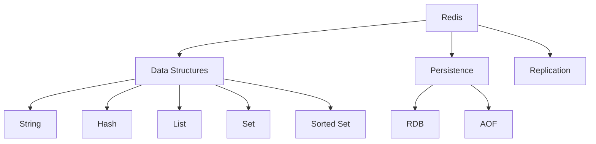

# Module 20: Redis

## Overview
Redis is an in-memory data structure store used as database, cache, and message broker. It supports strings, hashes, lists, sets, and sorted sets with high performance.

## Learning Objectives
- Understand Redis data structures
- Use Redis as cache
- Implement pub/sub
- Handle persistence
- Apply Redis patterns

## Prerequisites
- Data structure basics
- Caching concepts
- Java networking

## Why This Concept Exists
Applications need:
- Fast data access
- Caching
- Session storage
- Real-time messaging

Redis provides:
- In-memory performance
- Data structures
- Persistence
- Pub/Sub

## Problem Statement
How do you use in-memory storage for caching and real-time applications?

## Theory

### Redis Data Structures

| Structure | Description |
|-----------|-------------|
| String | Key-value pairs |
| Hash | Field-value maps |
| List | Linked lists |
| Set | Unordered collections |
| Sorted Set | Ordered collections |

### Use Cases

| Use Case | Structure |
|----------|-----------|
| Caching | String |
| Session | Hash |
| Queue | List |
| Tags | Set |
| Leaderboard | Sorted Set |

## Internal Working

### Redis Architecture
```
Client → Redis Server → Memory
                   → Disk (persistence)
```

### Persistence
- RDB: Point-in-time snapshots
- AOF: Append-only file

## JVM Perspective

### Java Client (Lettuce)
- Synchronous/Asynchronous
- Reactive support
- Cluster support
- Sentinel support

## Architecture Diagram



## Syntax

### Basic Operations
```java
// String
redis.set("key", "value");
String value = redis.get("key");

// Hash
redis.hset("user:1", "name", "John");
redis.hset("user:1", "email", "john@example.com");
Map<String, String> user = redis.hgetAll("user:1");

// List
redis.lpush("queue", "task1");
String task = redis.rpop("queue");

// Set
redis.sadd("tags", "java", "spring", "redis");
Set<String> tags = redis.smembers("tags");

// Sorted Set
redis.zadd("scores", 100, "player1");
redis.zadd("scores", 200, "player2");
Set<String> topPlayers = redis.zrevrange("scores", 0, 9);
```

## Easy Example
```java
import io.lettuce.core.*;
import io.lettuce.core.api.StatefulRedisConnection;

public class RedisEasyExample {
    public static void main(String[] args) {
        RedisClient client = RedisClient.create("redis://localhost:6379");
        StatefulRedisConnection<String, String> connection = client.connect();
        
        // String operations
        connection.sync().set("greeting", "Hello, Redis!");
        String greeting = connection.sync().get("greeting");
        System.out.println(greeting);
        
        // Hash operations
        connection.sync().hset("user:1", "name", "John");
        connection.sync().hset("user:1", "email", "john@example.com");
        
        String name = connection.sync().hget("user:1", "name");
        System.out.println("User: " + name);
        
        connection.close();
        client.shutdown();
    }
}
```

## Medium Example
```java
import io.lettuce.core.*;
import io.lettuce.core.api.StatefulRedisConnection;
import java.util.*;

public class RedisMediumExample {
    // Cache with TTL
    public static void cacheWithTTL(StatefulRedisConnection<String, String> conn) {
        conn.sync().set("cache:data", "cached value", 60, java.util.concurrent.TimeUnit.SECONDS);
        
        // Check cache
        String cached = conn.sync().get("cache:data");
        if (cached != null) {
            System.out.println("Cache hit: " + cached);
        } else {
            System.out.println("Cache miss");
        }
    }
    
    // List as queue
    public static void useAsQueue(StatefulRedisConnection<String, String> conn) {
        conn.sync().lpush("task-queue", "task1", "task2", "task3");
        
        String task = conn.sync().rpop("task-queue");
        System.out.println("Processing: " + task);
        
        long remaining = conn.sync().llen("task-queue");
        System.out.println("Remaining tasks: " + remaining);
    }
    
    public static void main(String[] args) {
        RedisClient client = RedisClient.create("redis://localhost:6379");
        StatefulRedisConnection<String, String> conn = client.connect();
        
        cacheWithTTL(conn);
        useAsQueue(conn);
        
        conn.close();
        client.shutdown();
    }
}
```

## Hard Example
```java
import io.lettuce.core.*;
import io.lettuce.core.api.StatefulRedisConnection;
import io.lettuce.core.pubsub.*;
import java.util.*;

public class RedisHardExample {
    // Pub/Sub
    public static void pubSub() throws InterruptedException {
        RedisClient client = RedisClient.create("redis://localhost:6379");
        
        // Subscriber
        StatefulRedisPubSubConnection<String, String> subConn = client.connectPubSub();
        subConn.sync().subscribe("news");
        
        subConn.addListener(new RedisPubSubAdapter<String, String>() {
            @Override
            public void message(String channel, String message) {
                System.out.println("Received from " + channel + ": " + message);
            }
        });
        
        // Publisher
        StatefulRedisPubSubConnection<String, String> pubConn = client.connectPubSub();
        pubConn.sync().publish("news", "Breaking news!");
        
        Thread.sleep(1000);
        
        subConn.close();
        pubConn.close();
        client.shutdown();
    }
    
    public static void main(String[] args) throws InterruptedException {
        pubSub();
    }
}
```

## Enterprise Example
```java
import io.lettuce.core.*;
import io.lettuce.core.api.StatefulRedisConnection;
import org.springframework.data.redis.core.RedisTemplate;
import java.util.concurrent.TimeUnit;

@Service
public class RedisCacheService {
    
    private final RedisTemplate<String, Object> redisTemplate;
    
    public RedisCacheService(RedisTemplate<String, Object> redisTemplate) {
        this.redisTemplate = redisTemplate;
    }
    
    public void cacheValue(String key, Object value, long ttl) {
        redisTemplate.opsForValue().set(key, value, ttl, TimeUnit.SECONDS);
    }
    
    public Object getCachedValue(String key) {
        return redisTemplate.opsForValue().get(key);
    }
    
    public void evictCache(String key) {
        redisTemplate.delete(key);
    }
    
    public boolean hasKey(String key) {
        return Boolean.TRUE.equals(redisTemplate.hasKey(key));
    }
}
```

## Performance Considerations
- Use pipelining for batch operations
- Keep key names short
- Use appropriate data structures
- Set TTL for cache entries

## Best Practices
1. Use connection pooling
2. Set expiration times
3. Use namespaces for keys
4. Monitor memory usage
5. Use Lua scripts for atomicity

## Comparison Table

| Feature | Redis | Memcached | Hazelcast |
|---------|-------|-----------|-----------|
| Data Structures | Rich | Simple | Rich |
| Persistence | Yes | No | Yes |
| Cluster | Yes | Yes | Yes |
| Pub/Sub | Yes | No | Yes |

## Interview Questions

### Q1: What is Redis?
**Answer:** In-memory data structure store used as cache and database.

### Q2: What data structures does Redis support?
**Answer:** String, Hash, List, Set, Sorted Set.

### Q3: What is the difference between Redis and Memcached?
**Answer:** Redis supports more data structures and persistence.

### Q4: What is Redis persistence?
**Answer:** Saving data to disk (RDB snapshots or AOF).

### Q5: What is Redis Pub/Sub?
**Answer:** Publish/Subscribe messaging pattern.

## Summary
Redis provides fast, flexible in-memory storage for caching and real-time applications.

## References
- Redis Documentation
- Lettuce Java Client
- Spring Data Redis
