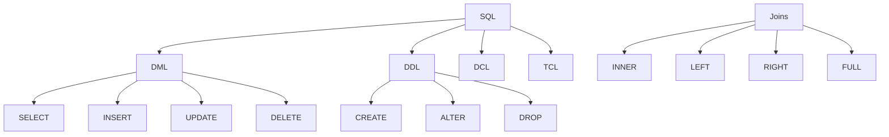
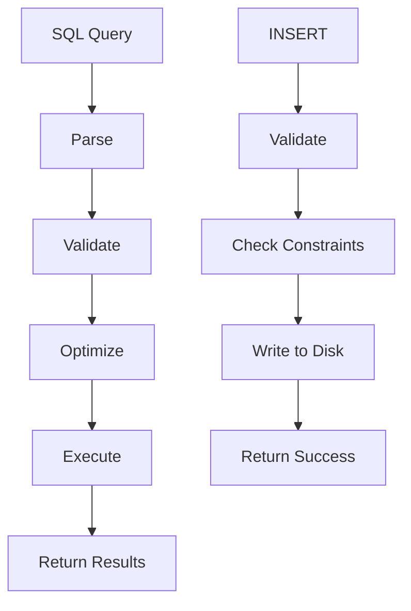
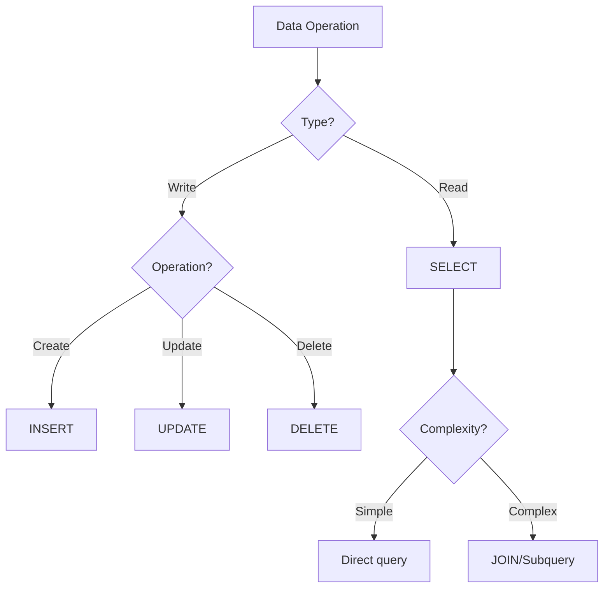

# Module 22: SQL

## Overview
SQL (Structured Query Language) is the standard language for managing relational databases. Java developers need SQL proficiency for database operations, query optimization, and data modeling.

## Learning Objectives
- Master SQL CRUD operations
- Understand joins and subqueries
- Use aggregate functions
- Implement transactions
- Optimize query performance

## Prerequisites
- Basic database concepts
- Java JDBC basics
- Relational database theory

## Why This Concept Exists
Databases store application data. SQL enables:
- Data persistence
- Complex queries
- Data integrity
- Concurrent access
- Reporting

## Problem Statement
How do you efficiently query, insert, update, and delete data in relational databases?

## Theory

### SQL Commands

| Command | Purpose |
|---------|---------|
| SELECT | Query data |
| INSERT | Add data |
| UPDATE | Modify data |
| DELETE | Remove data |
| CREATE | Create objects |
| ALTER | Modify objects |
| DROP | Delete objects |
| TRUNCATE | Remove all data |

### Join Types

| Join | Description |
|------|-------------|
| INNER | Matching rows |
| LEFT | All left + matching right |
| RIGHT | All right + matching left |
| FULL | All rows from both |
| CROSS | Cartesian product |

### Aggregate Functions

| Function | Purpose |
|----------|---------|
| COUNT | Count rows |
| SUM | Sum values |
| AVG | Average |
| MIN | Minimum |
| MAX | Maximum |

## Internal Working

### Query Processing
1. Parsing
2. Optimization
3. Execution
4. Result set

### Index Structure
```
B-Tree Index:
┌─────────────────────────────────────┐
│ Root Node                           │
│  ├─ [10] [20] [30]                  │
│  ├─ /    |    |    \               │
│  Leaf nodes with data pointers      │
└─────────────────────────────────────┘
```

## JVM Perspective

### JDBC Architecture
```
Java Application
      ↓
   JDBC API
      ↓
  JDBC Driver
      ↓
  Database
```

### PreparedStatement
- Pre-compiled SQL
- Prevents SQL injection
- Reusable execution
- Parameter binding

## Memory Representation
```
ResultSet:
┌─────────────────────────────────────┐
│ Current Row                         │
│  ├─ Column 1: value                 │
│  ├─ Column 2: value                 │
│  └─ Column N: value                 │
│ Cursor Position                     │
└─────────────────────────────────────┘
```

## Architecture Diagram



## Flow Diagram



## Syntax

### Basic Queries
```sql
-- SELECT
SELECT * FROM users;
SELECT name, email FROM users WHERE id = 1;
SELECT DISTINCT country FROM users;

-- ORDER BY
SELECT * FROM users ORDER BY name ASC;
SELECT * FROM users ORDER BY created_at DESC;

-- LIMIT
SELECT * FROM users LIMIT 10;
SELECT * FROM users LIMIT 10 OFFSET 20;
```

### Filtering
```sql
-- WHERE
SELECT * FROM users WHERE age > 18;
SELECT * FROM users WHERE country IN ('US', 'UK');
SELECT * FROM users WHERE name LIKE '%John%';
SELECT * FROM users WHERE email IS NULL;
```

### Joins
```sql
-- INNER JOIN
SELECT u.name, o.order_id
FROM users u
INNER JOIN orders o ON u.id = o.user_id;

-- LEFT JOIN
SELECT u.name, o.order_id
FROM users u
LEFT JOIN orders o ON u.id = o.user_id;

-- Multiple joins
SELECT u.name, o.order_id, p.product_name
FROM users u
INNER JOIN orders o ON u.id = o.user_id
INNER JOIN products p ON o.product_id = p.id;
```

### Aggregation
```sql
-- GROUP BY
SELECT country, COUNT(*) as user_count
FROM users
GROUP BY country;

-- HAVING
SELECT country, COUNT(*) as user_count
FROM users
GROUP BY country
HAVING COUNT(*) > 10;
```

### Subqueries
```sql
-- IN subquery
SELECT * FROM users
WHERE id IN (SELECT user_id FROM orders);

-- EXISTS
SELECT * FROM users u
WHERE EXISTS (SELECT 1 FROM orders o WHERE o.user_id = u.id);
```

## Easy Example
```sql
-- Create table
CREATE TABLE users (
    id INT PRIMARY KEY,
    name VARCHAR(100),
    email VARCHAR(100),
    age INT
);

-- Insert data
INSERT INTO users (id, name, email, age) VALUES
(1, 'John Doe', 'john@example.com', 25),
(2, 'Jane Smith', 'jane@example.com', 30);

-- Query data
SELECT * FROM users WHERE age > 20;

-- Update data
UPDATE users SET age = 26 WHERE id = 1;

-- Delete data
DELETE FROM users WHERE id = 2;
```

## Medium Example
```sql
-- Complex joins
SELECT 
    u.name,
    COUNT(o.id) as order_count,
    SUM(o.total) as total_spent
FROM users u
LEFT JOIN orders o ON u.id = o.user_id
GROUP BY u.id, u.name
HAVING COUNT(o.id) > 5
ORDER BY total_spent DESC;

-- Subqueries
SELECT * FROM products
WHERE price > (SELECT AVG(price) FROM products);

-- Window functions
SELECT 
    name,
    salary,
    RANK() OVER (ORDER BY salary DESC) as salary_rank
FROM employees;
```

## Hard Example
```sql
-- CTEs (Common Table Expressions)
WITH monthly_sales AS (
    SELECT 
        DATE_TRUNC('month', created_at) as month,
        SUM(total) as sales
    FROM orders
    GROUP BY 1
)
SELECT 
    month,
    sales,
    LAG(sales) OVER (ORDER BY month) as prev_month,
    sales - LAG(sales) OVER (ORDER BY month) as growth
FROM monthly_sales;

-- Recursive CTE
WITH RECURSIVE category_tree AS (
    SELECT id, name, parent_id
    FROM categories
    WHERE parent_id IS NULL
    
    UNION ALL
    
    SELECT c.id, c.name, c.parent_id
    FROM categories c
    INNER JOIN category_tree ct ON c.parent_id = ct.id
)
SELECT * FROM category_tree;
```

## Enterprise Example
```sql
-- Partitioned table
CREATE TABLE orders (
    id BIGINT,
    user_id INT,
    total DECIMAL(10,2),
    created_at TIMESTAMP
) PARTITION BY RANGE (created_at);

-- Materialized view
CREATE MATERIALIZED VIEW monthly_stats AS
SELECT 
    DATE_TRUNC('month', created_at) as month,
    COUNT(*) as order_count,
    SUM(total) as revenue
FROM orders
GROUP BY 1;

-- Stored procedure
CREATE PROCEDURE process_orders()
LANGUAGE plpgsql
AS $$
BEGIN
    UPDATE orders SET status = 'processed'
    WHERE status = 'pending' AND created_at < NOW() - INTERVAL '1 day';
END;
$$;
```

## Performance Considerations
- Use indexes on WHERE/JOIN columns
- Avoid SELECT *
- Use EXPLAIN to analyze queries
- Batch INSERT/UPDATE operations

## Time & Space Complexity
| Operation | Time | Space |
|-----------|------|-------|
| SELECT (indexed) | O(log n) | O(1) |
| SELECT (full scan) | O(n) | O(1) |
| JOIN | O(n*m) | O(n+m) |
| INSERT | O(1) | O(1) |

## Thread Safety
- Connections are not thread-safe
- Use connection pooling
- Transactions are connection-scoped
- Use appropriate isolation levels

## Best Practices
1. Use PreparedStatement
2. Create proper indexes
3. Use transactions
4. Avoid N+1 queries
5. Batch operations

## Common Mistakes
1. SQL injection vulnerabilities
2. Missing indexes
3. N+1 query problems
4. Not using transactions

## Pitfalls & Warnings
1. NULL handling
2. Data type mismatches
3. Locking issues
4. Deadlocks

## Debugging Tips
1. Use EXPLAIN/EXPLAIN ANALYZE
2. Log slow queries
3. Monitor connection pool
4. Check database locks

## Comparison Table

| Feature | SQL | NoSQL | ORM |
|---------|-----|-------|-----|
| Structure | Rigid | Flexible | Mapped |
| Transactions | ACID | BASE | ACID |
| Scaling | Vertical | Horizontal | Vertical |
| Query | SQL | Various | Methods |

## Decision Tree



## Interview Questions

### Q1: What is the difference between WHERE and HAVING?
**Answer:** WHERE filters rows before grouping, HAVING filters after grouping.

### Q2: What is a LEFT JOIN?
**Answer:** Returns all rows from left table and matching rows from right table.

### Q3: What is the difference between DELETE and TRUNCATE?
**Answer:** DELETE removes specific rows, TRUNCATE removes all rows.

### Q4: What is an index?
**Answer:** A data structure that improves query performance.

### Q5: What is a transaction?
**Answer:** A group of operations that are executed as a single unit.

### Q6: What is ACID?
**Answer:** Atomicity, Consistency, Isolation, Durability.

### Q7: What is a subquery?
**Answer:** A query nested inside another query.

### Q8: What is the difference between IN and EXISTS?
**Answer:** IN checks membership, EXISTS checks for matching rows.

### Q9: What is a window function?
**Answer:** A function that performs calculation across rows related to current row.

### Q10: What is normalization?
**Answer:** Process of organizing data to reduce redundancy.

### Q11: What is the difference between INNER and OUTER JOIN?
**Answer:** INNER returns only matching rows, OUTER returns all rows.

### Q12: What is a primary key?
**Answer:** A column that uniquely identifies each row.

### Q13: What is a foreign key?
**Answer:** A column that references a primary key in another table.

### Q14: What is the difference between CHAR and VARCHAR?
**Answer:** CHAR is fixed-length, VARCHAR is variable-length.

### Q15: What is a view?
**Answer:** A virtual table based on a SELECT statement.

## Exercises

### Easy
1. Write a SELECT query with WHERE clause
2. Create a table with constraints
3. Insert and update data

### Medium
1. Write a query with JOIN
2. Use aggregate functions with GROUP BY
3. Implement a subquery

### Hard
1. Write a recursive CTE
2. Optimize a slow query
3. Implement a stored procedure

## Summary
SQL is essential for database operations. Master queries, joins, and optimization for effective data management.

## References
- SQL Tutorial
- PostgreSQL Documentation
- MySQL Documentation
