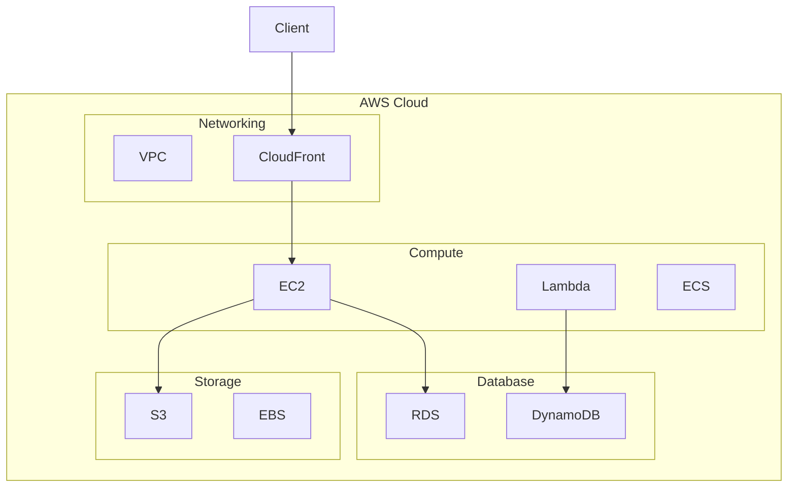
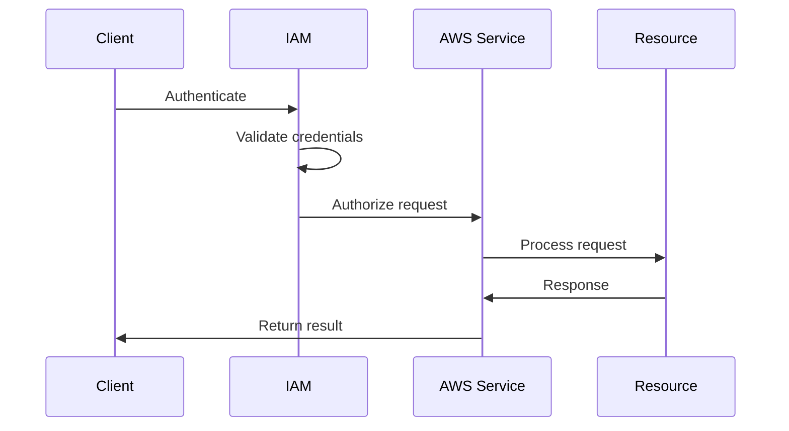

# 1. Introduction

Amazon Web Services (AWS) is a comprehensive cloud platform offering over 200 services. This module covers AWS fundamentals, core services, and Java SDK integration for building cloud-native applications.

# 2. Learning Objectives

- Understand AWS global infrastructure
- Navigate IAM, VPC, and core services
- Use AWS SDK v2 for Java
- Implement cloud-native patterns
- Follow AWS Well-Architected Framework

# 3. Prerequisites

- Java programming knowledge
- Basic networking concepts
- Understanding of cloud computing basics

# 4. Why This Concept Exists

Cloud computing enables on-demand access to computing resources without upfront investment. AWS provides scalable, reliable, and cost-effective infrastructure for running applications globally.

# 5. Problem Statement

**Without Cloud (On-Premises):**
- High upfront capital expenditure
- Hardware procurement delays
- Capacity planning required
- Geographic limitation

**With AWS:**
- Pay-as-you-go model
- Instant provisioning
- Auto-scaling capabilities
- Global reach

# 6. Theory

**AWS Global Infrastructure:**
- **Regions**: Geographic areas (us-east-1, eu-west-1)
- **Availability Zones**: Isolated data centers within regions
- **Edge Locations**: CDN points of presence

**Core Services:**
| Category | Services |
|----------|----------|
| Compute | EC2, Lambda, ECS, EKS |
| Storage | S3, EBS, EFS |
| Database | RDS, DynamoDB, ElastiCache |
| Networking | VPC, CloudFront, Route 53 |
| Security | IAM, KMS, WAF |

# 7. Internal Working

**AWS Request Flow:**
1. Client sends request to AWS endpoint
2. AWS authenticates via IAM credentials
3. Request routed to appropriate service
4. Service processes request
5. Response returned to client

# 8. JVM Perspective

**AWS SDK v2 for Java:**
```java
// Initialize S3 client
S3Client s3 = S3Client.builder()
    .region(Region.US_EAST_1)
    .credentialsProvider(DefaultCredentialsProvider.create())
    .build();

// Upload object
s3.putObject(PutObjectRequest.builder()
    .bucket("my-bucket")
    .key("my-key")
    .build(),
    RequestBody.fromBytes(data));
```

# 9. Memory Representation

```
AWS Account
├── IAM Users/Roles
├── VPC (Virtual Private Cloud)
│   ├── Public Subnets
│   ├── Private Subnets
│   └── Internet Gateway
├── EC2 Instances
├── S3 Buckets
├── RDS Databases
└── Lambda Functions
```

# 10. Architecture Diagram (Mermaid)



# 11. Flow Diagram (Mermaid)



# 12. Syntax

```java
// AWS SDK v2 Maven dependency
<dependency>
    <groupId>software.amazon.awssdk</groupId>
    <artifactId>s3</artifactId>
    <version>2.21.0</version>
</dependency>

// credentials
// ~/.aws/credentials or environment variables
[default]
aws_access_key_id = YOUR_ACCESS_KEY
aws_secret_access_key = YOUR_SECRET_KEY
```

# 13. Easy Example

```java
import software.amazon.awssdk.regions.Region;
import software.amazon.awssdk.services.s3.S3Client;

public class AWSEasyExample {
    public static void main(String[] args) {
        S3Client s3 = S3Client.builder()
            .region(Region.US_EAST_1)
            .build();
        
        s3.listBuckets().buckets().forEach(
            bucket -> System.out.println(bucket.name())
        );
    }
}
```

# 14. Medium Example

```java
import software.amazon.awssdk.core.sync.RequestBody;
import software.amazon.awssdk.services.s3.S3Client;
import software.amazon.awssdk.services.s3.model.*;

public class AWSMediumExample {
    public static void main(String[] args) {
        S3Client s3 = S3Client.builder().build();
        
        // Create bucket
        s3.createBucket(CreateBucketRequest.builder()
            .bucket("my-bucket")
            .build());
        
        // Upload object
        s3.putObject(PutObjectRequest.builder()
            .bucket("my-bucket")
            .key("my-file.txt")
            .build(),
            RequestBody.fromString("Hello, AWS!"));
        
        // List objects
        s3.listObjectsV2(ListObjectsV2Request.builder()
            .bucket("my-bucket")
            .build())
            .contents()
            .forEach(obj -> System.out.println(obj.key()));
    }
}
```

# 15. Hard Example

```java
import software.amazon.awssdk.core.sync.RequestBody;
import software.amazon.awssdk.services.s3.S3Client;
import software.amazon.awssdk.services.s3.model.*;
import java.nio.file.Path;

public class AWSHardExample {
    public static void main(String[] args) {
        S3Client s3 = S3Client.builder().build();
        String bucket = "my-enterprise-bucket";
        
        // Configure bucket encryption
        s3.putBucketEncryption(PutBucketEncryptionRequest.builder()
            .bucket(bucket)
            .serverSideEncryptionConfiguration(
                ServerSideEncryptionConfiguration.builder()
                    .applyServerSideEncryptionByDefault(
                        ServerSideEncryptionByDefault.builder()
                            .sseAlgorithm(ServerSideEncryptionAlgorithm.AES256)
                            .build())
                    .build())
            .build());
        
        // Enable versioning
        s3.putBucketVersioning(PutBucketVersioningRequest.builder()
            .bucket(bucket)
            .versioningConfiguration(
                VersioningConfiguration.builder()
                    .status(BucketVersioningStatus.ENABLED)
                    .build())
            .build());
        
        // Upload with metadata
        s3.putObject(PutObjectRequest.builder()
            .bucket(bucket)
            .key("documents/report.pdf")
            .metadata(Map.of(
                "author", "John Doe",
                "department", "Engineering"
            ))
            .build(),
            RequestBody.fromFile(Path.of("report.pdf")));
    }
}
```

# 16. Enterprise Example

```java
import software.amazon.awssdk.auth.credentials.DefaultCredentialsProvider;
import software.amazon.awssdk.core.client.config.ClientOverrideConfiguration;
import software.amazon.awssdk.regions.Region;
import software.amazon.awssdk.services.s3.S3Client;
import software.amazon.awssdk.services.s3.model.*;
import java.time.Duration;

public class AWSEnterpriseExample {
    public static void main(String[] args) {
        S3Client s3 = S3Client.builder()
            .region(Region.US_EAST_1)
            .credentialsProvider(DefaultCredentialsProvider.create())
            .overrideConfiguration(ClientOverrideConfiguration.builder()
                .apiCallTimeout(Duration.ofSeconds(30))
                .apiCallAttemptTimeout(Duration.ofSeconds(10))
                .build())
            .build();
        
        // List buckets with pagination
        ListBucketsResponse response = s3.listBuckets();
        response.buckets().forEach(bucket -> {
            System.out.printf("Bucket: %s, Created: %s%n",
                bucket.name(), bucket.creationDate());
        });
        
        // Multi-part upload for large files
        CreateMultipartUploadResponse createResponse = 
            s3.createMultipartUpload(CreateMultipartUploadRequest.builder()
                .bucket("my-bucket")
                .key("large-file.zip")
                .build());
        
        String uploadId = createResponse.uploadId();
        // Upload parts...
        // Complete multipart upload
    }
}
```

# 17. Performance

**AWS Service Performance:**
| Service | Latency | Throughput |
|---------|---------|------------|
| S3 | 50-200ms | 5,500 GET/s per prefix |
| EC2 | <1ms (internal) | Instance-dependent |
| Lambda | 1-10ms cold start | 1,000 concurrent |
| RDS | 1-10ms | Instance-dependent |

# 18. Time & Space Complexity

| Operation | Time | Space |
|-----------|------|-------|
| API call | 50-200ms | O(response) |
| Data transfer | O(data size) | O(buffer) |
| Provisioning | 1-5 min | O(resource) |

# 19. Thread Safety

AWS SDK clients are thread-safe. Use a single client instance per service across threads. Client creation is expensive; reuse clients.

# 20. Best Practices

1. Use IAM roles instead of access keys
2. Enable MFA for all users
3. Use VPC for network isolation
4. Encrypt data at rest and in transit
5. Enable CloudTrail for auditing
6. Use Cost Explorer for optimization
7. Implement backup strategies
8. Follow Well-Architected Framework

# 21. Common Mistakes

- Hardcoding credentials in code
- Using root account for daily tasks
- Not enabling encryption
- Ignoring cost monitoring
- Not using IAM policies correctly
- Over-provisioning resources

# 22. Pitfalls

- Data transfer costs can be high
- Lambda cold starts affect latency
- S3 eventual consistency (now strong)
- RDS instance size limitations
- VPC subnet limits

# 23. Debugging Tips

```java
// Enable SDK logging
System.setProperty("aws.debug", "true");

// Check credentials
aws sts get-caller-identity

// Verify permissions
aws iam simulate-principal-policy

// Check service quotas
aws service-quotas list-services
```

# 24. Comparison Table

| Feature | AWS | Azure | GCP |
|---------|-----|-------|-----|
| Market Share | 32% | 23% | 10% |
| Regions | 31 | 60+ | 37 |
| Free Tier | Yes | Yes | Yes |
| Java SDK | v2 | v2 | v2 |

# 25. Decision Tool

```
Need cloud resources?
├── Compute? → EC2/Lambda
├── Storage? → S3/EBS
├── Database? → RDS/DynamoDB
├── Networking? → VPC/CloudFront
└── Serverless? → Lambda/API Gateway
```

# 26. Interview Questions

1. **What is AWS?**
   Amazon Web Services is a comprehensive cloud platform offering compute, storage, database, and other services.

2. **What is the difference between region and availability zone?**
   A region is a geographic area; availability zones are isolated data centers within a region.

3. **What is IAM?**
   Identity and Access Management controls who can access AWS resources and what they can do.

4. **What is the difference between IAM users and roles?**
   Users have long-term credentials; roles provide temporary credentials for AWS services or federated users.

5. **What is VPC?**
   Virtual Private Cloud is a logically isolated section of AWS where you launch resources.

6. **What is the difference between public and private subnets?**
   Public subnets have internet access via internet gateway; private subnets don't.

7. **What is the shared responsibility model?**
   AWS is responsible for security OF the cloud; customers are responsible for security IN the cloud.

8. **What is AWS SDK v2?**
   The latest version of the AWS SDK for Java with improved performance and API design.

9. **How do you handle credentials in Java?**
   Use DefaultCredentialsProvider, IAM roles, or environment variables. Never hardcode.

10. **What is S3?**
    Simple Storage Service provides object storage with high durability and availability.

11. **What is the difference between S3 standard and Glacier?**
    Standard is for frequent access; Glacier is for archival with lower cost and retrieval delays.

12. **What is Lambda?**
    A serverless compute service that runs code without provisioning servers.

13. **What is cold start in Lambda?**
    The delay when Lambda initializes a new execution environment. Can be reduced with provisioned concurrency.

14. **What is the Well-Architected Framework?**
    A set of best practices for designing cloud architectures across six pillars.

15. **How do you optimize AWS costs?**
    Use reserved instances, spot instances, right-size resources, and monitor with Cost Explorer.

# 27. Exercises

**Level 1:**
1. Set up AWS credentials locally
2. Create an S3 bucket and upload a file
3. List buckets using AWS SDK v2

**Level 2:**
1. Create a VPC with public and private subnets
2. Launch an EC2 instance in the VPC
3. Configure security groups

**Level 3:**
1. Implement a serverless API with Lambda
2. Set up CloudFront distribution
3. Configure monitoring with CloudWatch

# 28. Summary

AWS provides comprehensive cloud services for building scalable, reliable applications. Understanding core services, IAM, networking, and SDK integration is essential for modern Java developers working with cloud-native architectures.

# 29. References

- [AWS Documentation](https://docs.aws.amazon.com/)
- [AWS SDK v2 for Java](https://docs.aws.amazon.com/sdk-for-java/latest/developer-guide/)
- [AWS Well-Architected Framework](https://aws.amazon.com/architecture/well-architected/)
- [AWS Free Tier](https://aws.amazon.com/free/)
- [AWS re:Invent](https://aws.amazon.com/reinvent/)
