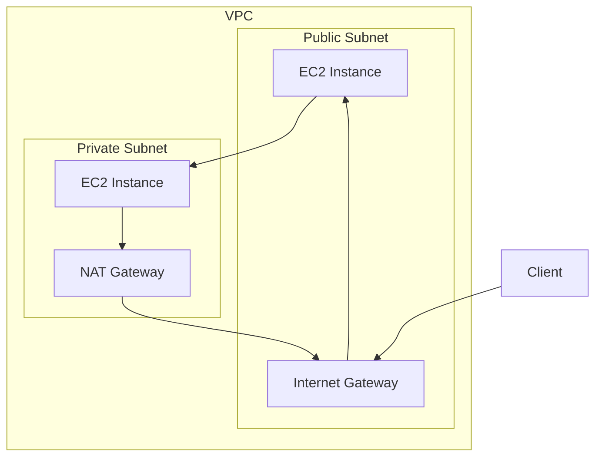
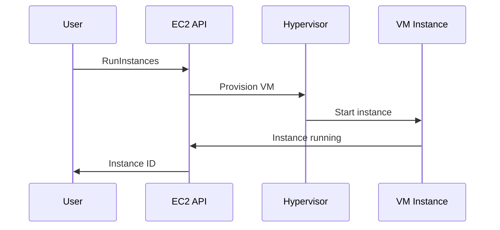

# 1. Introduction

Amazon EC2 (Elastic Compute Cloud) provides scalable computing capacity in the AWS cloud. It eliminates hardware constraints, allowing you to launch virtual servers (instances) on-demand.

# 2. Learning Objectives

- Understand EC2 instance types and use cases
- Configure security groups and key pairs
- Manage EC2 lifecycle with AWS SDK v2
- Implement auto-scaling strategies
- Optimize EC2 costs

# 3. Prerequisites

- AWS fundamentals (Module 23.1)
- Basic Linux/Windows administration
- Networking concepts

# 4. Why This Concept Exists

EC2 provides on-demand, scalable compute resources without upfront hardware investment. You can quickly scale capacity up or down based on demand, paying only for what you use.

# 5. Problem Statement

**Without EC2:**
- Hardware procurement delays
- Fixed capacity
- High upfront costs
- Geographic limitations

**With EC2:**
- Instant provisioning
- Elastic scaling
- Pay-as-you-go
- Global availability

# 6. Theory

**Instance Types:**

| Type | Use Case | Examples |
|------|----------|---------|
| General Purpose | Balanced | t3, m5 |
| Compute Optimized | CPU-intensive | c5, c6i |
| Memory Optimized | RAM-intensive | r5, x2gd |
| Storage Optimized | I/O-intensive | i3, d2 |
| Accelerated | GPU/ML | p4, g5 |

**Instance States:**
- Running, Stopped, Terminated, Pending, Shutting-down

# 7. Internal Working

**EC2 Architecture:**
```
AWS Region
├── Availability Zone A
│   ├── EC2 Instance 1
│   └── EC2 Instance 2
├── Availability Zone B
│   ├── EC2 Instance 3
│   └── EC2 Instance 4
└── Security Groups
    └── Firewall Rules
```

# 8. JVM Perspective

**Java Application on EC2:**
```java
// Get instance metadata
String metadataUrl = "http://169.254.169.254/latest/meta-data/";
// Use EC2 instance role for credentials
// Configure JVM for EC2 environment
```

# 9. Memory Representation

```
EC2 Instance
├── CPU (vCPUs)
├── Memory (RAM)
├── Storage (EBS/Instance)
├── Network (ENI)
└── IAM Role
```

# 10. Architecture Diagram (Mermaid)



# 11. Flow Diagram (Mermaid)



# 12. Syntax

```java
import software.amazon.awssdk.services.ec2.Ec2Client;
import software.amazon.awssdk.services.ec2.model.*;

// Create EC2 client
Ec2Client ec2 = Ec2Client.builder().build();

// Launch instance
RunInstancesRequest request = RunInstancesRequest.builder()
    .imageId("ami-0c55b159cbfafe1f0")
    .instanceType(InstanceType.T3_MICRO)
    .minCount(1)
    .maxCount(1)
    .keyName("my-key-pair")
    .securityGroupIds("sg-12345678")
    .subnetId("subnet-12345678")
    .build();

RunInstancesResponse response = ec2.runInstances(request);
String instanceId = response.instances().get(0).instanceId();
```

# 13. Easy Example

```java
import software.amazon.awssdk.services.ec2.Ec2Client;
import software.amazon.awssdk.services.ec2.model.*;

public class EC2EasyExample {
    public static void main(String[] args) {
        Ec2Client ec2 = Ec2Client.builder().build();
        
        // List instances
        ec2.describeInstances().reservations().forEach(
            reservation -> reservation.instances().forEach(
                instance -> System.out.printf("ID: %s, State: %s%n",
                    instance.instanceId(), instance.state().nameAsString())
            )
        );
    }
}
```

# 14. Medium Example

```java
import software.amazon.awssdk.services.ec2.Ec2Client;
import software.amazon.awssdk.services.ec2.model.*;

public class EC2MediumExample {
    public static void main(String[] args) {
        Ec2Client ec2 = Ec2Client.builder().build();
        
        // Launch instance with user data
        String userData = "#!/bin/bash\\nyum update -y\\nyum install -y java-17-openjdk";
        
        RunInstancesRequest request = RunInstancesRequest.builder()
            .imageId("ami-0c55b159cbfafe1f0")
            .instanceType(InstanceType.T3_MICRO)
            .minCount(1)
            .maxCount(1)
            .keyName("my-key-pair")
            .userData(userData)
            .tagSpecifications(TagSpecification.builder()
                .resourceType(ResourceType.INSTANCE)
                .tags(Tag.builder().key("Name").value("my-server").build())
                .build())
            .build();
        
        RunInstancesResponse response = ec2.runInstances(request);
        String instanceId = response.instances().get(0).instanceId();
        
        // Start instance
        ec2.startInstances(StartInstancesRequest.builder()
            .instanceIds(instanceId)
            .build());
    }
}
```

# 15. Hard Example

```java
import software.amazon.awssdk.services.ec2.Ec2Client;
import software.amazon.awssdk.services.ec2.model.*;
import java.util.List;

public class EC2HardExample {
    public static void main(String[] args) {
        Ec2Client ec2 = Ec2Client.builder().build();
        
        // Create security group
        CreateSecurityGroupRequest sgRequest = CreateSecurityGroupRequest.builder()
            .groupName("my-security-group")
            .description("Security group for my application")
            .vpcId("vpc-12345678")
            .build();
        
        CreateSecurityGroupResponse sgResponse = ec2.createSecurityGroup(sgRequest);
        String sgId = sgResponse.groupId();
        
        // Add inbound rules
        ec2.authorizeSecurityGroupIngress(AuthorizeSecurityGroupIngressRequest.builder()
            .groupId(sgId)
            .ipPermissions(
                IpPermission.builder()
                    .fromPort(22)
                    .toPort(22)
                    .protocol("tcp")
                    .ipRanges(IpRange.builder().cidrIp("0.0.0.0/0").build())
                    .build(),
                IpPermission.builder()
                    .fromPort(8080)
                    .toPort(8080)
                    .protocol("tcp")
                    .ipRanges(IpRange.builder().cidrIp("0.0.0.0/0").build())
                    .build()
            )
            .build());
        
        // Launch instance
        RunInstancesRequest request = RunInstancesRequest.builder()
            .imageId("ami-0c55b159cbfafe1f0")
            .instanceType(InstanceType.T3_SMALL)
            .minCount(1)
            .maxCount(1)
            .keyName("my-key-pair")
            .securityGroupIds(sgId)
            .subnetId("subnet-12345678")
            .build();
        
        RunInstancesResponse response = ec2.runInstances(request);
        String instanceId = response.instances().get(0).instanceId();
        
        // Wait for instance to be running
        ec2.waiter().waitUntilInstanceRunning(
            DescribeInstancesRequest.builder()
                .instanceIds(instanceId)
                .build());
    }
}
```

# 16. Enterprise Example

```java
import software.amazon.awssdk.services.ec2.Ec2Client;
import software.amazon.awssdk.services.ec2.model.*;
import software.amazon.awssdk.services.autoscaling.AutoScalingClient;
import software.amazon.awssdk.services.autoscaling.model.*;

public class EC2EnterpriseExample {
    public static void main(String[] args) {
        Ec2Client ec2 = Ec2Client.builder().build();
        AutoScalingClient autoScaling = AutoScalingClient.builder().build();
        
        // Create launch template
        CreateLaunchTemplateRequest ltRequest = CreateLaunchTemplateRequest.builder()
            .launchTemplateName("my-launch-template")
            .launchTemplateData(LaunchTemplateData.builder()
                .imageId("ami-0c55b159cbfafe1f0")
                .instanceType(InstanceType.T3_MEDIUM)
                .keyName("my-key-pair")
                .securityGroupIds("sg-12345678")
                .userData("#!/bin/bash\\nyum install -y java-17-openjdk")
                .iamInstanceProfile(IamInstanceProfileSpecification.builder()
                    .arn("arn:aws:iam::123456789:instance-profile/my-role")
                    .build())
                .monitoring(InstancesMonitoringSpecification.builder()
                    .enabled(true)
                    .build())
                .build())
            .build();
        
        ec2.createLaunchTemplate(ltRequest);
        
        // Create auto scaling group
        CreateAutoScalingGroupRequest asgRequest = CreateAutoScalingGroupRequest.builder()
            .autoScalingGroupName("my-asg")
            .launchTemplate(LaunchTemplateSpecification.builder()
                .launchTemplateName("my-launch-template")
                .version("$Latest")
                .build())
            .minSize(2)
            .maxSize(10)
            .desiredCapacity(3)
            .vpcZoneIdentifier("subnet-12345678,subnet-87654321")
            .targetGroupARNs("arn:aws:elasticloadbalancing:us-east-1:123456789:targetgroup/my-tg")
            .healthCheckType("ELB")
            .healthCheckGracePeriod(300)
            .build();
        
        autoScaling.createAutoScalingGroup(asgRequest);
    }
}
```

# 17. Performance

**EC2 Performance:**
| Instance Type | vCPUs | Memory | Network |
|--------------|-------|--------|---------|
| t3.micro | 2 | 1 GiB | Up to 5 Gbps |
| m5.large | 2 | 8 GiB | Up to 10 Gbps |
| c5.xlarge | 4 | 8 GiB | Up to 10 Gbps |
| r5.2xlarge | 8 | 64 GiB | Up to 10 Gbps |

# 18. Time & Space Complexity

| Operation | Time |
|-----------|------|
| Launch instance | 1-3 min |
| Stop/Start | 1-5 min |
| Terminate | 1-3 min |
| Describe | 1-5 sec |

# 19. Thread Safety

EC2 API calls are independent and thread-safe. Use a single Ec2Client instance across threads.

# 20. Best Practices

1. Use IAM roles for EC2 instances
2. Enable detailed monitoring
3. Use placement groups for low latency
4. Implement auto-scaling
5. Use spot instances for cost savings
6. Enable deletion termination protection
7. Tag all resources
8. Use latest generation instances

# 21. Common Mistakes

- Using public IP for production
- Not configuring security groups properly
- Ignoring cost optimization
- Not enabling termination protection
- Using outdated instance types

# 22. Pitfalls

- Instance store data is ephemeral
- EBS volume limits per instance type
- Metadata service is accessible from instance
- Public IPv4 addresses are no longer free

# 23. Debugging Tips

```bash
# Check instance status
aws ec2 describe-instance-status --instance-ids i-1234567890abcdef0

# Check instance metadata
curl http://169.254.169.254/latest/meta-data/

# View system log
aws ec2 get-console-output --instance-id i-1234567890abcdef0
```

# 24. Comparison Table

| Feature | EC2 | Lambda | ECS |
|---------|-----|--------|-----|
| Scaling | Manual/Auto | Automatic | Auto |
| Management | High | None | Medium |
| Cost Model | Hourly | Per request | Hourly |
| Use Case | General | Event-driven | Containers |

# 25. Decision Tool

```
Need compute?
├── General workload? → EC2
├── Event-driven? → Lambda
├── Containers? → ECS/EKS
├── Batch processing? → Batch
└── HPC? → ParallelCluster
```

# 26. Interview Questions

1. **What is EC2?**
   Elastic Compute Cloud provides scalable virtual servers in the AWS cloud.

2. **What are the different instance types?**
   General Purpose, Compute Optimized, Memory Optimized, Storage Optimized, and Accelerated.

3. **What is the difference between stopping and terminating?**
   Stopping preserves EBS volumes; terminating deletes them (unless disableDeleteTermination is set).

4. **What are security groups?**
   Virtual firewalls that control inbound and outbound traffic for EC2 instances.

5. **What is the difference between security groups and NACLs?**
   Security groups are instance-level; NACLs are subnet-level. Security groups are stateful; NACLs are stateless.

6. **What is user data?**
   Scripts or commands that run when an instance launches for initialization.

7. **What are placement groups?**
   Logical grouping of instances for low-latency network performance.

8. **What is the difference between on-demand, reserved, and spot instances?**
   On-demand: pay per use; Reserved: discount for commitment; Spot: discounted but can be interrupted.

9. **How do you access an EC2 instance securely?**
   Use SSH with key pairs; avoid password authentication; use Session Manager.

10. **What is an AMI?**
    Amazon Machine Image is a template for launching EC2 instances with pre-configured software.

11. **What is the instance metadata service?**
    A service running on every EC2 instance providing instance information via HTTP.

12. **How do you implement auto-scaling?**
    Use Auto Scaling Groups with scaling policies based on metrics.

13. **What are Elastic IP addresses?**
    Static public IP addresses that can be associated with EC2 instances.

14. **What is ENI?**
    Elastic Network Interface is a virtual network card attached to an EC2 instance.

15. **How do you optimize EC2 costs?**
    Use Reserved Instances, Spot Instances, right-size instances, and stop unused instances.

# 27. Exercises

**Level 1:**
1. Launch an EC2 instance with AWS SDK
2. List all running instances
3. Stop and start an instance

**Level 2:**
1. Create a security group with custom rules
2. Launch an instance with user data
3. Attach an Elastic IP

**Level 3:**
1. Create a launch template
2. Set up an auto-scaling group
3. Configure scaling policies

# 28. Summary

EC2 provides flexible, scalable compute capacity for running applications in the AWS cloud. Understanding instance types, security groups, and SDK integration is essential for building cloud-native Java applications.

# 29. References

- [EC2 Documentation](https://docs.aws.amazon.com/ec2/)
- [EC2 Instance Types](https://aws.amazon.com/ec2/instance-types/)
- [AWS SDK v2 EC2](https://docs.aws.amazon.com/sdk-for-java/latest/developer-guide/java_ec2.html)
- [EC2 Best Practices](https://docs.aws.amazon.com/AWSEC2/latest/UserGuide/ec2-best-practices.html)
- [EC2 Pricing](https://aws.amazon.com/ec2/pricing/)
