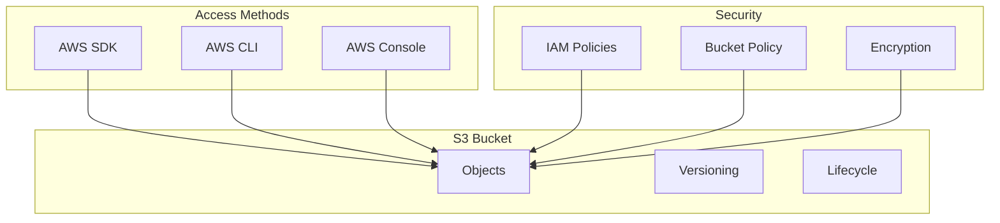
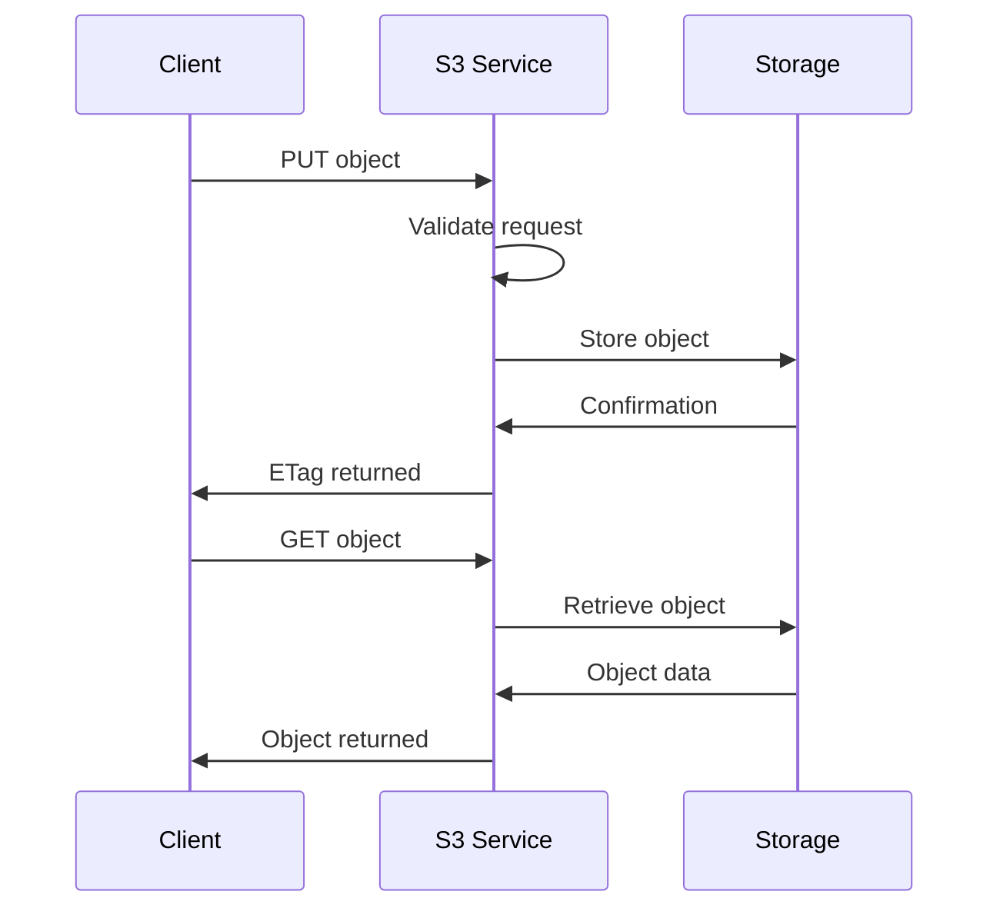

# 1. Introduction

Amazon S3 (Simple Storage Service) provides object storage with high durability, availability, and scalability. It's designed to store and retrieve any amount of data from anywhere.

# 2. Learning Objectives

- Understand S3 bucket and object concepts
- Configure versioning and lifecycle policies
- Implement S3 security best practices
- Use AWS SDK v2 for S3 operations
- Optimize S3 performance and costs

# 3. Prerequisites

- AWS fundamentals (Module 23.1)
- Basic understanding of object storage
- Java programming knowledge

# 4. Why This Concept Exists

Traditional storage solutions have limitations in scalability, durability, and cost. S3 provides virtually unlimited storage with 99.999999999% durability, making it ideal for backup, archiving, and data lakes.

# 5. Problem Statement

**Without S3:**
- Limited storage capacity
- Hardware management overhead
- High costs for scalability
- Geographic limitations

**With S3:**
- Virtually unlimited storage
- No hardware management
- Pay-as-you-go pricing
- Global accessibility

# 6. Theory

**S3 Storage Classes:**

| Class | Use Case | Retrieval |
|-------|----------|-----------|
| Standard | Frequent access | Instant |
| Intelligent-Tiering | Unknown patterns | Instant |
| Standard-IA | Infrequent access | Instant |
| One Zone-IA | Non-critical, infrequent | Instant |
| Glacier Instant | Archive, milliseconds | Instant |
| Glacier Flexible | Archive, minutes-hours | Minutes |
| Glacier Deep Archive | Long-term archive | Hours |

**S3 Features:**
- Versioning
- Lifecycle policies
- Cross-region replication
- Server-side encryption
- Access logging

# 7. Internal Working

**S3 Architecture:**
```
S3 Bucket
├── Objects
│   ├── Key: "photos/image.jpg"
│   ├── Value: Binary data
│   ├── Metadata
│   └── Version ID
├── Versioning
│   ├── Version 1
│   ├── Version 2
│   └── Delete marker
└── Policies
    ├── Bucket policy
    ├── ACLs
    └── IAM policies
```

# 8. JVM Perspective

**S3 SDK Usage:**
```java
S3Client s3 = S3Client.builder()
    .region(Region.US_EAST_1)
    .build();

// Upload
s3.putObject(PutObjectRequest.builder()
    .bucket("my-bucket")
    .key("my-key")
    .build(),
    RequestBody.fromFile(file));

// Download
s3.getObject(GetObjectRequest.builder()
    .bucket("my-bucket")
    .key("my-key")
    .build(),
    Paths.get("local-file.txt"));
```

# 9. Memory Representation

```
S3 Object Storage
├── Bucket (Container)
│   ├── Objects
│   │   ├── Key (Unique identifier)
│   │   ├── Value (Data)
│   │   ├── Metadata
│   │   └── Version ID
│   ├── Policies
│   └── Versioning
└── Endpoints
    ├── REST API
    ├── SDK
    └── CLI
```

# 10. Architecture Diagram (Mermaid)



# 11. Flow Diagram (Mermaid)



# 12. Syntax

```java
import software.amazon.awssdk.services.s3.S3Client;
import software.amazon.awssdk.services.s3.model.*;

// Create client
S3Client s3 = S3Client.builder().build();

// Bucket operations
s3.createBucket(CreateBucketRequest.builder()
    .bucket("my-bucket")
    .build());

// Object operations
s3.putObject(PutObjectRequest.builder()
    .bucket("my-bucket")
    .key("my-key")
    .build(),
    RequestBody.fromString("content"));

// List objects
s3.listObjectsV2(ListObjectsV2Request.builder()
    .bucket("my-bucket")
    .build());
```

# 13. Easy Example

```java
import software.amazon.awssdk.services.s3.S3Client;
import software.amazon.awssdk.services.s3.model.*;

public class S3EasyExample {
    public static void main(String[] args) {
        S3Client s3 = S3Client.builder().build();
        
        // List buckets
        s3.listBuckets().buckets().forEach(
            bucket -> System.out.println(bucket.name())
        );
        
        // Upload object
        s3.putObject(PutObjectRequest.builder()
            .bucket("my-bucket")
            .key("hello.txt")
            .build(),
            RequestBody.fromString("Hello, S3!"));
    }
}
```

# 14. Medium Example

```java
import software.amazon.awssdk.core.sync.RequestBody;
import software.amazon.awssdk.services.s3.S3Client;
import software.amazon.awssdk.services.s3.model.*;
import java.nio.file.Paths;

public class S3MediumExample {
    public static void main(String[] args) {
        S3Client s3 = S3Client.builder().build();
        String bucket = "my-bucket";
        
        // Upload file
        s3.putObject(PutObjectRequest.builder()
            .bucket(bucket)
            .key("documents/file.pdf")
            .build(),
            RequestBody.fromFile(Paths.get("file.pdf")));
        
        // Download file
        s3.getObject(GetObjectRequest.builder()
            .bucket(bucket)
            .key("documents/file.pdf")
            .build(),
            Paths.get("downloaded-file.pdf"));
        
        // Enable versioning
        s3.putBucketVersioning(PutBucketVersioningRequest.builder()
            .bucket(bucket)
            .versioningConfiguration(
                VersioningConfiguration.builder()
                    .status(BucketVersioningStatus.ENABLED)
                    .build())
            .build());
    }
}
```

# 15. Hard Example

```java
import software.amazon.awssdk.services.s3.S3Client;
import software.amazon.awssdk.services.s3.model.*;
import software.amazon.awssdk.services.s3.lifecycle.LifecycleConfiguration;
import software.amazon.awssdk.services.s3.lifecycle.LifecycleRule;
import software.amazon.awssdk.services.s3.lifecycle.Transition;
import software.amazon.awssdk.services.s3.lifecycle.Expiration;
import java.time.Duration;

public class S3HardExample {
    public static void main(String[] args) {
        S3Client s3 = S3Client.builder().build();
        String bucket = "my-enterprise-bucket";
        
        // Configure lifecycle policy
        s3.putBucketLifecycleConfiguration(PutBucketLifecycleConfigurationRequest.builder()
            .bucket(bucket)
            .lifecycleConfiguration(LifecycleConfiguration.builder()
                .rules(
                    LifecycleRule.builder()
                        .id("archive-old-objects")
                        .filter(LifecycleRuleFilter.builder()
                            .prefix("logs/")
                            .build())
                        .status(ExpirationStatus.ENABLED)
                        .transitions(
                            Transition.builder()
                                .days(30)
                                .storageClass(StorageClass.STANDARD_IA)
                                .build(),
                            Transition.builder()
                                .days(90)
                                .storageClass(StorageClass.GLACIER)
                                .build()
                        )
                        .expiration(Expiration.builder()
                            .days(365)
                            .build())
                        .build()
                )
                .build())
            .build());
        
        // Configure replication
        s3.putBucketReplication(PutBucketReplicationRequest.builder()
            .bucket(bucket)
            .replicationConfiguration(
                ReplicationConfiguration.builder()
                    .roleArn("arn:aws:iam::123456789:role/replication-role")
                    .rules(
                        ReplicationRule.builder()
                            .id("replicate-all")
                            .status(ReplicationRuleStatus.ENABLED)
                            .destination(
                                ReplicationDestination.builder()
                                    .bucket("arn:aws:s3:::replica-bucket")
                                    .build())
                            .build()
                    )
                    .build())
            .build());
    }
}
```

# 16. Enterprise Example

```java
import software.amazon.awssdk.services.s3.S3Client;
import software.amazon.awssdk.services.s3.model.*;
import software.amazon.awssdk.services.s3.transfer.TransferManager;
import software.amazon.awssdk.services.s3.transfer.Upload;
import java.nio.file.Paths;

public class S3EnterpriseExample {
    public static void main(String[] args) {
        S3Client s3 = S3Client.builder().build();
        String bucket = "my-enterprise-bucket";
        
        // Configure bucket encryption
        s3.putBucketEncryption(PutBucketEncryptionRequest.builder()
            .bucket(bucket)
            .serverSideEncryptionConfiguration(
                ServerSideEncryptionConfiguration.builder()
                    .applyServerSideEncryptionByDefault(
                        ServerSideEncryptionByDefault.builder()
                            .sseAlgorithm(ServerSideEncryptionAlgorithm.AES256)
                            .build())
                    .build())
            .build());
        
        // Enable access logging
        s3.putBucketLogging(PutBucketLoggingRequest.builder()
            .bucket(bucket)
            .bucketLoggingStatus(BucketLoggingStatus.builder()
                .targetEnabled(true)
                .targetBucket("logging-bucket")
                .targetPrefix("s3-logs/")
                .build())
            .build());
        
        // Multi-part upload for large files
        TransferManager transferManager = TransferManager.builder()
            .s3Client(s3)
            .build();
        
        Upload upload = transferManager.upload(UploadRequest.builder()
            .bucket(bucket)
            .key("large-file.zip")
            .source(Paths.get("large-file.zip"))
            .build());
        
        upload.waitForCompletion();
    }
}
```

# 17. Performance

**S3 Performance:**
| Metric | Value |
|--------|-------|
| Durability | 99.999999999% |
| Availability | 99.99% |
| GET latency | 50-200ms |
| Throughput | 5,500 GET/s per prefix |

**Optimization:**
- Use multipart upload for large files
- Implement prefix-based partitioning
- Use S3 Transfer Acceleration
- Enable cross-region replication for DR

# 18. Time & Space Complexity

| Operation | Time |
|-----------|------|
| PUT object | 50-200ms |
| GET object | 50-200ms |
| List objects | 100-500ms |
| Copy object | 100-500ms |

# 19. Thread Safety

S3 API calls are independent and thread-safe. Use a single S3Client instance across threads. Multipart uploads can be parallelized.

# 20. Best Practices

1. Enable versioning for data protection
2. Use lifecycle policies for cost optimization
3. Implement server-side encryption
4. Use bucket policies for access control
5. Enable access logging
6. Use multipart upload for large files
7. Implement cross-region replication
8. Monitor with CloudWatch metrics

# 21. Common Mistakes

- Not enabling versioning
- Using public buckets without proper policies
- Not implementing encryption
- Ignoring lifecycle policies
- Not using multipart upload for large files

# 22. Pitfalls

- S3 eventual consistency (now strong for overwrites)
- Data transfer costs can be high
- Bucket name must be globally unique
- Object key length limit (1024 bytes)
- Multipart upload must be completed or aborted

# 23. Debugging Tips

```bash
# Check bucket policy
aws s3api get-bucket-policy --bucket my-bucket

# List objects with details
aws s3api list-objects-v2 --bucket my-bucket

# Check versioning status
aws s3api get-bucket-versioning --bucket my-bucket

# Test bucket access
aws s3 ls s3://my-bucket/
```

# 24. Comparison Table

| Feature | S3 Standard | S3 IA | Glacier |
|---------|-------------|-------|---------|
| Durability | 99.999999999% | 99.999999999% | 99.999999999% |
| Availability | 99.99% | 99.9% | 99.9% |
| Retrieval | Instant | Instant | Minutes-Hours |
| Cost | Higher | Lower | Lowest |

# 25. Decision Tool

```
Need storage?
├── Frequent access? → S3 Standard
├── Infrequent access? → S3 IA
├── Archive? → Glacier
├── Long-term archive? → Glacier Deep Archive
└── Unknown access patterns? → S3 Intelligent-Tiering
```

# 26. Interview Questions

1. **What is S3?**
   Simple Storage Service provides object storage with high durability and availability.

2. **What is the difference between S3 and EBS?**
   S3 is object storage; EBS is block storage. S3 is for files; EBS is for EC2 instance storage.

3. **What is S3 versioning?**
   A feature that keeps multiple variants of an object, enabling recovery from accidental deletion.

4. **What is a lifecycle policy?**
   Rules that automatically transition objects between storage classes or delete them.

5. **What is server-side encryption?**
   S3 encrypts objects at rest using AES-256 or AWS KMS.

6. **What is multipart upload?**
   A method to upload large objects in parts, improving reliability and performance.

7. **What is S3 Transfer Acceleration?**
   A feature that uses CloudFront edge locations to speed up uploads to S3.

8. **What is cross-region replication?**
   Automatic copying of objects between S3 buckets in different regions.

9. **How do you secure an S3 bucket?**
   Use bucket policies, IAM policies, encryption, and access logging.

10. **What is the maximum object size in S3?**
    5 TB (5 TB for single PUT, 5 TB for multipart upload).

11. **What is S3 Intelligent-Tiering?**
    A storage class that automatically moves objects between tiers based on access patterns.

12. **What is presigned URL?**
    A URL that grants temporary access to a private S3 object.

13. **How do you optimize S3 performance?**
    Use multipart upload, parallel downloads, and prefix-based partitioning.

14. **What is S3 Access Points?**
    Named network endpoints with dedicated access policies for managing data access at scale.

15. **What is the difference between PUT and multipart upload?**
    PUT is for small objects (<5GB); multipart is for large objects, providing better reliability.

# 27. Exercises

**Level 1:**
1. Create an S3 bucket
2. Upload and download objects
3. Enable versioning

**Level 2:**
1. Implement lifecycle policies
2. Configure server-side encryption
3. Set up cross-region replication

**Level 3:**
1. Implement multipart upload
2. Configure S3 access points
3. Set up S3 event notifications

# 28. Summary

S3 provides scalable, durable object storage for various use cases. Understanding storage classes, lifecycle policies, and security features is essential for building cost-effective, reliable storage solutions.

# 29. References

- [S3 Documentation](https://docs.aws.amazon.com/s3/)
- [S3 Storage Classes](https://aws.amazon.com/s3/storage-classes/)
- [AWS SDK v2 S3](https://docs.aws.amazon.com/sdk-for-java/latest/developer-guide/java_s3.html)
- [S3 Best Practices](https://docs.aws.amazon.com/AmazonS3/latest/userguide/best-practices.html)
- [S3 Pricing](https://aws.amazon.com/s3/pricing/)
