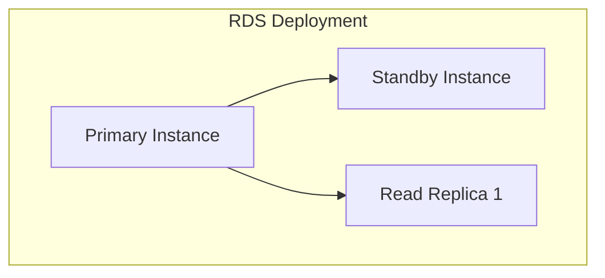
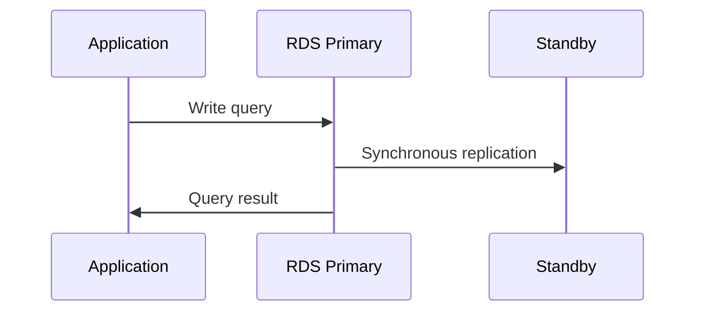

# 1. Introduction

Amazon RDS (Relational Database Service) provides managed relational databases supporting MySQL, PostgreSQL, MariaDB, Oracle, SQL Server, and Aurora.

# 2. Learning Objectives

- Understand RDS instance types and engines
- Configure Multi-AZ and read replicas
- Implement RDS security and backup strategies
- Use AWS SDK v2 for RDS operations

# 3. Prerequisites

- AWS fundamentals (Module 23.1)
- SQL and relational database concepts
- Java programming knowledge

# 4. Why This Concept Exists

Managing databases requires expertise in installation, configuration, backup, patching, and scaling. RDS automates these tasks, allowing developers to focus on application development.

# 5. Problem Statement

**Without RDS:** Manual DB administration, complex backups, difficulty scaling, patching overhead. **With RDS:** Automated backups and patching, easy scaling, high availability, managed security.

# 6. Theory

**RDS Engines:** MySQL (general purpose), PostgreSQL (advanced features), Aurora (high performance), Oracle (enterprise), SQL Server (Microsoft ecosystem).

**RDS Features:** Multi-AZ deployment, Read replicas, Automated backups, Point-in-time recovery, Monitoring.

# 7. Internal Working

**RDS Architecture:** Primary Instance (compute, memory, storage), Standby (Multi-AZ, synchronous replication), Read Replicas (asynchronous replication).

# 8. JVM Perspective

JDBC connects to RDS using standard drivers. Use IAM authentication instead of passwords. Configure connection pooling for performance.

# 9. Memory Representation

RDS Instance: CPU (vCPUs), Memory (RAM), Storage (gp2/io1), IOPS, Network, Connections.

# 10. Architecture Diagram (Mermaid)



# 11. Flow Diagram (Mermaid)



# 12. Syntax

```java
RdsClient rds = RdsClient.builder().build();
CreateDbInstanceRequest request = CreateDbInstanceRequest.builder()
    .dbInstanceIdentifier("mydb")
    .dbInstanceClass("db.t3.micro")
    .engine("mysql")
    .masterUsername("admin")
    .masterUserPassword("secret")
    .allocatedStorage(20)
    .build();
rds.createDBInstance(request);
```

# 13. Easy Example

```java
RdsClient rds = RdsClient.builder().build();
rds.describeDBInstances().dbInstances().forEach(
    i -> System.out.println(i.dbInstanceIdentifier()));
```

# 14. Medium Example

```java
// Create Multi-AZ instance
rds.createDBInstance(CreateDbInstanceRequest.builder()
    .dbInstanceIdentifier("mydb")
    .dbInstanceClass("db.t3.medium")
    .engine("mysql")
    .multiAZ(true)
    .allocatedStorage(100)
    .build());
```

# 15. Hard Example

```java
// Create Aurora cluster with read replicas
rds.createDBCluster(CreateDBClusterRequest.builder()
    .clusterIdentifier("my-aurora-cluster")
    .engine("aurora-mysql")
    .masterUsername("admin")
    .masterUserPassword("secret")
    .build());

rds.createDBInstance(CreateDBInstanceRequest.builder()
    .dbInstanceIdentifier("my-aurora-instance-1")
    .dbInstanceClass("db.r5.large")
    .engine("aurora-mysql")
    .dbClusterIdentifier("my-aurora-cluster")
    .build());
```

# 16. Enterprise Example

```java
// Production RDS with all features
rds.createDBInstance(CreateDbInstanceRequest.builder()
    .dbInstanceIdentifier("prod-db")
    .dbInstanceClass("db.r5.2xlarge")
    .engine("postgres")
    .multiAZ(true)
    .allocatedStorage(500)
    .storageType("io1")
    .iops(10000)
    .backupRetentionPeriod(35)
    .preferredBackupWindow("03:00-04:00")
    .preferredMaintenanceWindow("sun:04:00-sun:05:00")
    .vpcSecurityGroupIds("sg-12345678")
    .dbSubnetGroup("my-subnet-group")
    .build());
```

# 17. Performance

| Metric | Value |
|--------|-------|
| Max Storage | 64 TB |
| Max Connections | 5,000-40,000 |
| Backup Window | 30 min |
| Failover Time | 60-120 sec |

# 18. Time & Space Complexity

| Operation | Time |
|-----------|------|
| Create instance | 5-15 min |
| Failover | 60-120 sec |
| Snapshot restore | 5-60 min |
| Scale up | 5-15 min |

# 19. Thread Safety

RDS API calls are thread-safe. Use connection pooling (HikariCP) for database connections.

# 20. Best Practices

1. Enable Multi-AZ for production
2. Use read replicas for read-heavy workloads
3. Enable automated backups
4. Use IAM authentication
5. Monitor with CloudWatch
6. Use parameter groups for tuning
7. Implement encryption at rest

# 21. Common Mistakes

- Not enabling Multi-AZ
- Ignoring backup retention
- Using default parameter groups
- Not monitoring connections
- Over-provisioning resources

# 22. Pitfalls

- Storage scaling requires downtime (not for Aurora)
- Read replica lag can occur
- Connection limits per instance class
- Backup window affects performance

# 23. Debugging Tips

```bash
aws rds describe-db-instances --db-instance-identifier mydb
aws rds describe-events --source-identifier mydb
```

# 24. Comparison Table

| Feature | RDS | Aurora | DynamoDB |
|---------|-----|--------|----------|
| Type | Relational | Relational | NoSQL |
| Scaling | Vertical | Horizontal | Auto |
| Cost | Medium | Higher | Pay-per-use |

# 25. Decision Tool

```
Need database?
├── Relational SQL? → RDS/Aurora
├── High performance? → Aurora
├── NoSQL? → DynamoDB
└── In-memory? → ElastiCache
```

# 26. Interview Questions

1. What is RDS? Managed relational database service.
2. What is Multi-AZ? Synchronous standby in different AZ for failover.
3. What are read replicas? Asynchronous copies for read scaling.
4. Difference between Multi-AZ and Read Replica? Multi-AZ is for HA; Read Replica is for scaling reads.
5. How does RDS backup work? Automated daily backups with point-in-time recovery.
6. What is Aurora? AWS cloud-native relational database with better performance.
7. How to connect from Java? Use JDBC with RDS endpoint.
8. What is IAM authentication? Token-based auth instead of passwords.
9. How to monitor RDS? Use CloudWatch metrics and Enhanced Monitoring.
10. What are parameter groups? Configuration templates for DB engine settings.

# 27. Exercises

**Level 1:** Create RDS instance, connect via JDBC, query data. **Level 2:** Enable Multi-AZ, create read replica, test failover. **Level 3:** Set up Aurora cluster, configure auto-scaling, implement encryption.

# 28. Summary

RDS provides managed relational databases with automated operations. Understanding engines, Multi-AZ, read replicas, and security is essential for production database management.

# 29. References

- [RDS Documentation](https://docs.aws.amazon.com/rds/)
- [Aurora Documentation](https://docs.aws.amazon.com/aurora/)
- [AWS SDK v2 RDS](https://docs.aws.amazon.com/sdk-for-java/latest/developer-guide/java_rds.html)
