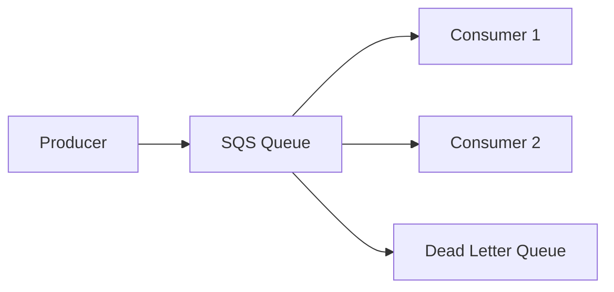
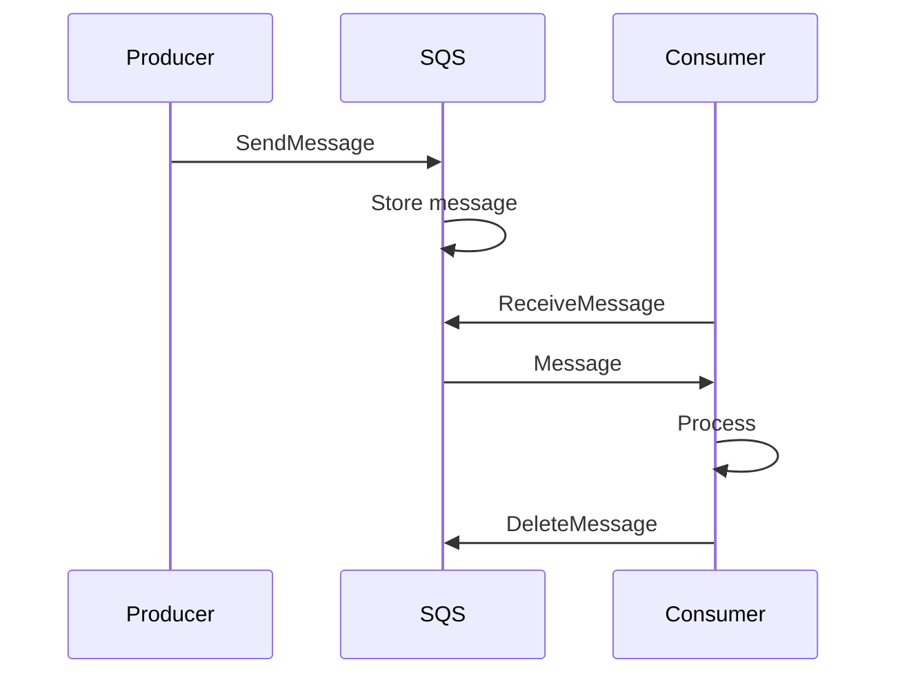

# 1. Introduction

Amazon SQS (Simple Queue Service) is a fully managed message queuing service that enables you to decouple and scale microservices, distributed systems, and serverless applications.

# 2. Learning Objectives

- Understand SQS queue types (Standard and FIFO)
- Configure dead letter queues
- Implement message processing patterns
- Use AWS SDK v2 for SQS operations

# 3. Prerequisites

- AWS fundamentals (Module 23.1)
- Understanding of distributed messaging
- Java programming knowledge

# 4. Why This Concept Exists

Tight coupling between services causes cascading failures. SQS provides reliable, scalable message queuing to decouple components, enabling asynchronous communication and fault tolerance.

# 5. Problem Statement

**Without SQS:** Tight coupling, cascading failures, no retry mechanism, scaling difficulties. **With SQS:** Decoupled services, automatic retries, dead letter handling, unlimited throughput.

# 6. Theory

**Queue Types:**

| Feature | Standard | FIFO |
|---------|----------|------|
| Ordering | Best-effort | Strict |
| Throughput | Unlimited | 3,000 msg/s |
| Delivery | At-least-once | Exactly-once |
| Use Case | General | Ordered processing |

**SQS Features:** Message retention (1-14 days), Visibility timeout, Dead letter queues, Long polling, Server-side encryption.

# 7. Internal Working

**SQS Architecture:** Producer sends message to queue, SQS stores message, Consumer polls and processes message, Consumer deletes message after processing.

# 8. JVM Perspective

Use SQS client with long polling for cost efficiency. Implement message batching for throughput. Handle visibility timeout for processing.

# 9. Memory Representation

SQS Queue: Messages, Attributes, Receipt Handle, Message ID, Body.

# 10. Architecture Diagram (Mermaid)



# 11. Flow Diagram (Mermaid)



# 12. Syntax

```java
SqsClient sqs = SqsClient.builder().build();
sqs.sendMessage(SendMessageRequest.builder()
    .queueUrl(queueUrl)
    .messageBody("Hello SQS")
    .build());
```

# 13. Easy Example

```java
SqsClient sqs = SqsClient.builder().build();
// Send message
sqs.sendMessage(SendMessageRequest.builder()
    .queueUrl(queueUrl)
    .messageBody("Hello")
    .build());
// Receive messages
ReceiveMessageResponse response = sqs.receiveMessage(
    ReceiveMessageRequest.builder()
        .queueUrl(queueUrl)
        .maxNumberOfMessages(10)
        .build());
```

# 14. Medium Example

```java
// FIFO queue with message group
sqs.sendMessage(SendMessageRequest.builder()
    .queueUrl(fifoQueueUrl)
    .messageBody("Order processed")
    .messageGroupId("order-123")
    .messageDeduplicationId("order-123-msg-1")
    .build());
```

# 15. Hard Example

```java
// Dead letter queue configuration
sqs.setQueueAttributes(SetQueueAttributesRequest.builder()
    .queueUrl(queueUrl)
    .attributes(Map.of(
        "RedrivePolicy", "{\"deadLetterTargetArn\":\"arn:aws:sqs:us-east-1:123:dlq\","
            + "\"maxReceiveCount\":\"3\"}"
    ))
    .build());
```

# 16. Enterprise Example

```java
// Full enterprise setup with encryption and monitoring
sqs.createQueue(CreateQueueRequest.builder()
    .queueName("enterprise-queue")
    .attributes(Map.of(
        "VisibilityTimeout", "300",
        "MessageRetentionPeriod", "1209600",
        "ReceiveMessageWaitTimeSeconds", "20",
        "KmsMasterKeyId", "alias/aws/sqs"
    ))
    .build());
```

# 17. Performance

| Metric | Standard | FIFO |
|--------|----------|------|
| Throughput | Unlimited | 3,000/s |
| Latency | 10-100ms | 10-100ms |
| Batch Size | 10 | 10 |

# 18. Time & Space Complexity

| Operation | Time |
|-----------|------|
| Send message | 10-50ms |
| Receive message | 10-100ms |
| Delete message | 10-50ms |

# 19. Thread Safety

SQS client is thread-safe. Use separate threads for sending and receiving. Implement message batching.

# 20. Best Practices

1. Use long polling to reduce costs
2. Implement dead letter queues
3. Use message batching for throughput
4. Set appropriate visibility timeout
5. Enable server-side encryption
6. Monitor queue depth with CloudWatch
7. Use FIFO for ordered processing

# 21. Common Mistakes

- Not implementing dead letter queues
- Using short polling unnecessarily
- Ignoring visibility timeout
- Not batching messages
- Hardcoding queue URLs

# 22. Pitfalls

- Message ordering only in FIFO
- Duplicate delivery possible in Standard
- Message size limit (256 KB)
- Long polling timeout (20 seconds max)

# 23. Debugging Tips

```bash
aws sqs get-queue-attributes --queue-url <url> --attribute-names All
aws sqs receive-message --queue-url <url>
```

# 24. Comparison Table

| Feature | SQS | SNS | Kafka |
|---------|-----|-----|-------|
| Type | Queue | Pub/Sub | Streaming |
| Ordering | FIFO option | No | Yes |
| Retention | 14 days | Indefinite | Configurable |

# 25. Decision Tool

```
Need messaging?
├── Point-to-point? → SQS
├── Pub/sub? → SNS
├── Streaming? → Kafka/Kinesis
└── Event bridge? → EventBridge
```

# 26. Interview Questions

1. What is SQS? Fully managed message queuing service.
2. Standard vs FIFO? Standard: best-effort ordering, unlimited throughput; FIFO: strict ordering, limited throughput.
3. What is a dead letter queue? Queue for messages that fail processing after max retries.
4. What is visibility timeout? Period when received message is hidden from other consumers.
5. What is long polling? Waits for message to arrive, reducing empty responses.
6. SQS vs SNS? SQS: point-to-point; SNS: publish-subscribe.
7. How to ensure message processing? Implement at-least-once delivery with idempotent consumers.
8. What is message batching? Sending/receiving multiple messages in one API call.
9. How to handle duplicate messages? Implement idempotent processing in consumers.
10. SQS vs Kafka? SQS: fully managed, simpler; Kafka: more control, streaming.

# 27. Exercises

**Level 1:** Create queue, send and receive messages. **Level 2:** Implement FIFO queue with message groups. **Level 3:** Set up dead letter queue with retry logic.

# 28. Summary

SQS provides reliable, scalable message queuing for decoupling distributed systems. Understanding queue types, dead letter handling, and best practices is essential for building resilient applications.

# 29. References

- [SQS Documentation](https://docs.aws.amazon.com/sqs/)
- [AWS SDK v2 SQS](https://docs.aws.amazon.com/sdk-for-java/latest/developer-guide/java_sqs.html)
- [SQS Best Practices](https://docs.aws.amazon.com/AWSSimpleQueueService/latest/SQSDeveloperGuide/sqs-best-practices.html)
