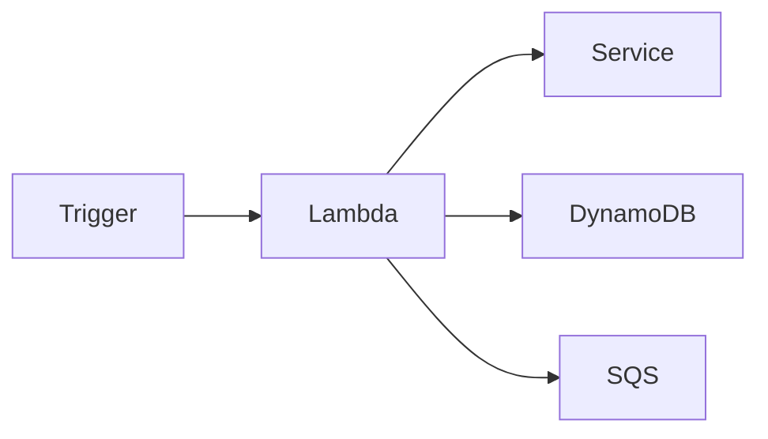
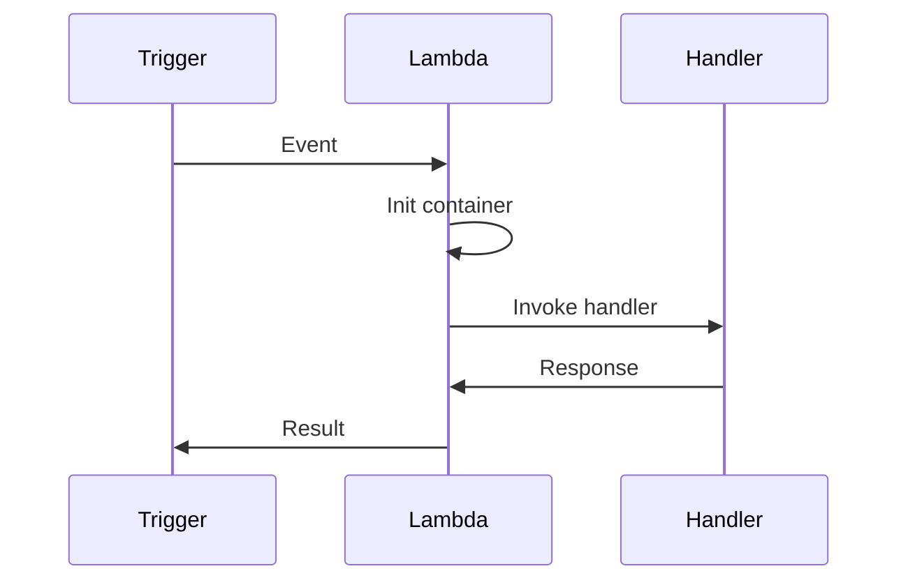

# 1. Introduction

AWS Lambda is a serverless compute service that runs code without provisioning or managing servers. You pay only for the compute time you consume.

# 2. Learning Objectives

- Understand Lambda execution model
- Configure triggers and destinations
- Optimize cold start performance
- Use AWS SDK v2 for Lambda operations

# 3. Prerequisites

- AWS fundamentals (Module 23.1)
- Java programming knowledge
- Understanding of serverless concepts

# 4. Why This Concept Exists

Lambda eliminates server management overhead, enabling developers to focus on code. It scales automatically and charges only for actual usage.

# 5. Problem Statement

**Without Lambda:** Server provisioning, capacity planning, idle costs, scaling complexity. **With Lambda:** No servers, auto-scaling, pay-per-use, simplified deployment.

# 6. Theory

**Lambda Limits:** Memory: 128MB-10GB, Timeout: 15 min, Package size: 250MB (unzipped), Concurrent executions: 1,000 (default).

**Trigger Types:** API Gateway, S3, DynamoDB, SQS, SNS, EventBridge, CloudWatch Events.

# 7. Internal Working

**Lambda Execution:** Event received, Container initialized (cold start), Handler invoked, Response returned, Container reused (warm start).

# 8. JVM Perspective

Use GraalVM native image for faster cold starts. Keep deployment packages small. Use provisioned concurrency for critical functions.

# 9. Memory Representation

Lambda: Memory (128MB-10GB), CPU (proportional to memory), Disk (512MB /tmp), Network (ENI).

# 10. Architecture Diagram (Mermaid)



# 11. Flow Diagram (Mermaid)



# 12. Syntax

```java
public class Handler implements RequestHandler<APIGatewayProxyRequestEvent, 
    APIGatewayProxyResponseEvent> {
    @Override
    public APIGatewayProxyResponseEvent handleRequest(
        APIGatewayProxyRequestEvent input, Context context) {
        return new APIGatewayProxyResponseEvent()
            .withStatusCode(200)
            .withBody("Hello");
    }
}
```

# 13. Easy Example

```java
public class SimpleHandler implements RequestHandler<SQSEvent, Void> {
    @Override
    public Void handleRequest(SQSEvent event, Context context) {
        event.getRecords().forEach(record -> 
            System.out.println(record.getBody()));
        return null;
    }
}
```

# 14. Medium Example

```java
public class ApiHandler implements RequestHandler<APIGatewayProxyRequestEvent,
    APIGatewayProxyResponseEvent> {
    @Override
    public APIGatewayProxyResponseEvent handleRequest(
        APIGatewayProxyRequestEvent input, Context context) {
        
        String path = input.getPath();
        if ("/hello".equals(path)) {
            return new APIGatewayProxyResponseEvent()
                .withStatusCode(200)
                .withBody("{\"message\": \"Hello World\"}");
        }
        return new APIGatewayProxyResponseEvent()
            .withStatusCode(404)
            .withBody("{\"error\": \"Not Found\"}");
    }
}
```

# 15. Hard Example

```java
public class StreamHandler implements RequestHandler<DynamodbEvent, Void> {
    @Override
    public Void handleRequest(DynamodbEvent input, Context context) {
        input.getRecords().forEach(record -> {
            String eventName = record.getEventName();
            Map<String, Object> keys = record.getDynamodb().getKeys();
            
            if ("INSERT".equals(eventName)) {
                // Process new record
                processInsert(keys);
            } else if ("MODIFY".equals(eventName)) {
                // Process update
                processUpdate(keys);
            }
        });
        return null;
    }
    
    private void processInsert(Map<String, Object> keys) {
        // Implementation
    }
    
    private void processUpdate(Map<String, Object> keys) {
        // Implementation
    }
}
```

# 16. Enterprise Example

```java
public class EnterpriseHandler implements RequestHandler<APIGatewayProxyRequestEvent,
    APIGatewayProxyResponseEvent> {
    
    private final ObjectMapper mapper = new ObjectMapper();
    private final DynamoDbClient dynamoDb = DynamoDbClient.builder().build();
    private final SqsClient sqs = SqsClient.builder().build();
    
    @Override
    public APIGatewayProxyResponseEvent handleRequest(
        APIGatewayProxyRequestEvent input, Context context) {
        try {
            Map<String, Object> body = mapper.readValue(
                input.getBody(), Map.class);
            
            // Store in DynamoDB
            dynamoDb.putItem(PutItemRequest.builder()
                .tableName("my-table")
                .item(body.entrySet().stream()
                    .collect(Collectors.toMap(
                        Map.Entry::getKey,
                        e -> AttributeValue.builder().s(e.getValue().toString()).build())))
                .build());
            
            // Send notification
            sqs.sendMessage(SendMessageRequest.builder()
                .queueUrl("notification-queue")
                .messageBody(mapper.writeValueAsString(body))
                .build());
            
            return new APIGatewayProxyResponseEvent()
                .withStatusCode(200)
                .withBody("{\"status\": \"success\"}");
        } catch (Exception e) {
            return new APIGatewayProxyResponseEvent()
                .withStatusCode(500)
                .withBody("{\"error\": e.getMessage()}");
        }
    }
}
```

# 17. Performance

| Metric | Value |
|--------|-------|
| Cold Start | 100-500ms |
| Warm Start | 1-10ms |
| Max Memory | 10 GB |
| Max Timeout | 15 min |

# 18. Time & Space Complexity

| Operation | Time |
|-----------|------|
| Cold start | 100-500ms |
| Warm invocation | 1-10ms |

# 19. Thread Safety

Lambda runs single-threaded per invocation. Use thread pools for concurrent operations within a function.

# 20. Best Practices

1. Minimize deployment package size
2. Use environment variables for configuration
3. Implement connection pooling
4. Use provisioned concurrency for critical functions
5. Monitor with CloudWatch
6. Handle errors gracefully
7. Use dead letter queues

# 21. Common Mistakes

- Large deployment packages
- Not handling cold starts
- Ignoring timeout limits
- Not implementing error handling
- Creating clients in handler (use global scope)

# 22. Pitfalls

- Cold start latency
- Memory/CPU coupling
- Execution time limits
- Concurrency limits
- Temporary storage limitations

# 23. Debugging Tips

```bash
aws logs filter-log-events --log-group-name /aws/lambda/my-function
aws lambda get-function --function-name my-function
```

# 24. Comparison Table

| Feature | Lambda | EC2 | ECS |
|---------|--------|-----|-----|
| Management | None | Full | Partial |
| Scaling | Auto | Manual/Auto | Auto |
| Cost | Per request | Per hour | Per hour |
| Cold Start | Yes | No | No |

# 25. Decision Tool

```
Need compute?
├── Event-driven? → Lambda
├── Long-running? → EC2/ECS
├── Containers? → ECS/EKS
└── Batch? → Batch
```

# 26. Interview Questions

1. What is Lambda? Serverless compute service running code without servers.
2. What is cold start? Initialization time when Lambda creates new execution environment.
3. Lambda vs EC2? Lambda: no servers, auto-scale, per-request; EC2: full control, hourly billing.
4. What are triggers? AWS services that invoke Lambda functions.
5. How to reduce cold starts? Smaller packages, provisioned concurrency, GraalVM.
6. What are environment variables? Key-value pairs for configuration outside code.
7. Lambda memory and CPU? CPU proportional to memory allocation.
8. What is a dead letter queue? Queue for failed Lambda invocations.
9. Lambda vs Fargate? Lambda: event-driven, 15min limit; Fargate: containers, no time limit.
10. How to handle secrets? Use Secrets Manager or Parameter Store.

# 27. Exercises

**Level 1:** Create Lambda function, trigger with test event. **Level 2:** API Gateway + Lambda REST API. **Level 3:** DynamoDB stream processor with error handling.

# 28. Summary

Lambda provides serverless compute for event-driven applications. Understanding cold starts, triggers, and optimization is essential for building scalable, cost-effective applications.

# 29. References

- [Lambda Documentation](https://docs.aws.amazon.com/lambda/)
- [Lambda Best Practices](https://docs.aws.amazon.com/lambda/latest/dg/best-practices.html)
- [AWS SDK v2 Lambda](https://docs.aws.amazon.com/sdk-for-java/latest/developer-guide/java_lambda.html)
