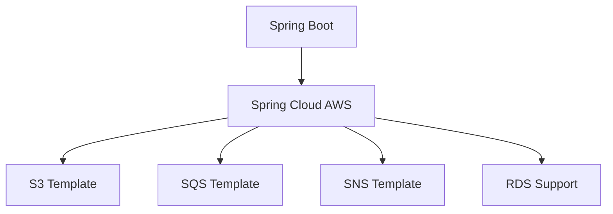
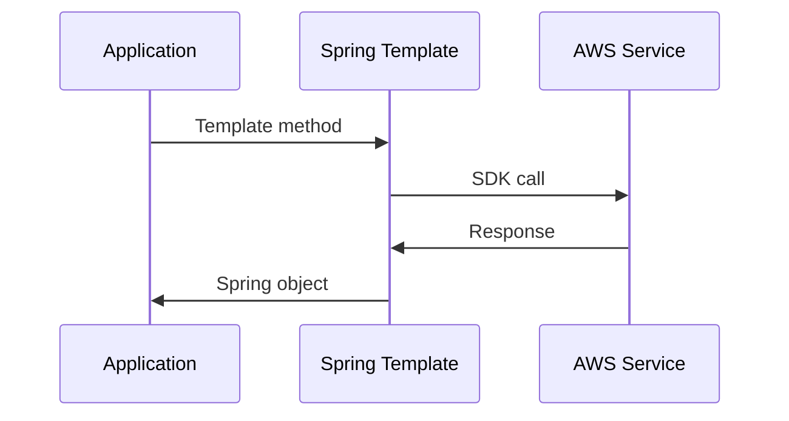

# 1. Introduction

Spring Cloud AWS provides integration with AWS services, simplifying the development of Spring applications on AWS. It offers abstractions for S3, SQS, SNS, RDS, and other services.

# 2. Learning Objectives

- Understand Spring Cloud AWS components
- Configure AWS services in Spring Boot
- Use Spring templates for AWS services
- Implement best practices for AWS integration

# 3. Prerequisites

- Spring Boot knowledge
- AWS fundamentals (Module 23.1)
- Java programming knowledge

# 4. Why This Concept Exists

Direct AWS SDK usage requires boilerplate code. Spring Cloud AWS provides Spring-idiomatic abstractions, reducing code and following Spring conventions.

# 5. Problem Statement

**Without Spring Cloud AWS:** Verbose SDK code, manual configuration, no Spring integration. **With Spring Cloud AWS:** Concise Spring code, auto-configuration, Spring conventions.

# 6. Theory

**Spring Cloud AWS Components:** Spring Cloud AWS Core, Context, Messaging, S3, SQS, SNS, RDS, Parameter Store.

# 7. Internal Working

**Auto-configuration:** Spring Boot auto-configures AWS clients based on dependencies and application properties.

# 8. JVM Perspective

Uses AWS SDK v2 under the hood. Provides Spring templates and converters for seamless integration.

# 9. Memory Representation

Spring Context: Beans, Configuration, Properties, AWS Clients.

# 10. Architecture Diagram (Mermaid)



# 11. Flow Diagram (Mermaid)



# 12. Syntax

```yaml
# application.yml
spring:
  cloud:
    aws:
      region:
        static: us-east-1
      credentials:
        access-key: ${AWS_ACCESS_KEY_ID}
        secret-key: ${AWS_SECRET_ACCESS_KEY}
```

```java
@Autowired
private AmazonS3 amazonS3;

@Autowired
private SimpleMessageListenerContainerFactory containerFactory;
```

# 13. Easy Example

```java
@RestController
public class S3Controller {
    
    @Autowired
    private AmazonS3 s3Client;
    
    @GetMapping("/buckets")
    public List<String> listBuckets() {
        return s3Client.listBuckets().stream()
            .map(Bucket::getName)
            .collect(Collectors.toList());
    }
}
```

# 14. Medium Example

```java
@Service
public class S3Service {
    
    @Autowired
    private AmazonS3 s3Client;
    
    public void uploadFile(String bucket, String key, File file) {
        s3Client.putObject(bucket, key, file);
    }
    
    public byte[] downloadFile(String bucket, String key) {
        S3Object object = s3Client.getObject(bucket, key);
        return IOUtils.toByteArray(object.getObjectContent());
    }
}
```

# 15. Hard Example

```java
@Configuration
@EnableSqs
public class SQSConfig {
    
    @Bean
    public SimpleMessageListenerContainerFactory simpleMessageListenerContainerFactory() {
        SimpleMessageListenerContainerFactory factory = new SimpleMessageListenerContainerFactory();
        factory.setAmazonSqs(amazonSqs());
        factory.setMaxNumberOfMessages(10);
        factory.setWaitTimeSeconds(20);
        return factory;
    }
}

@Component
public class OrderMessageListener {
    
    @SqsListener("order-queue")
    public void receiveOrder(String message) {
        // Process order
    }
}
```

# 16. Enterprise Example

```yaml
# Full configuration
spring:
  cloud:
    aws:
      region:
        static: us-east-1
      stack:
        auto: false
      s3:
        endpoint: http://localhost:4566
      sqs:
        endpoint: http://localhost:4566
      sns:
        endpoint: http://localhost:4566

management:
  endpoints:
    web:
      exposure:
        include: health,info,aws-s3,aws-sqs
```

# 17. Performance

Spring Cloud AWS adds minimal overhead. Use connection pooling and proper timeout configuration.

# 18. Time & Space Complexity

Minimal overhead over direct SDK calls.

# 19. Thread Safety

AWS clients are thread-safe. Spring beans are singleton by default.

# 20. Best Practices

1. Use application properties for configuration
2. Leverage auto-configuration
3. Use templates over direct SDK
4. Implement retry with @Retryable
5. Monitor with Spring Boot Actuator
6. Use profiles for environment-specific config

# 21. Common Mistakes

- Not configuring region properly
- Ignoring error handling
- Not using connection pooling
- Hardcoding credentials

# 22. Pitfalls

- Version compatibility issues
- LocalStack for testing
- Regional endpoint differences

# 23. Debugging Tips

```java
// Enable logging
logging:
  level:
    org.springframework.cloud.aws: DEBUG
    com.amazonaws: DEBUG
```

# 24. Comparison Table

| Feature | Spring Cloud AWS | Direct SDK |
|---------|-----------------|------------|
| Code | Less | More |
| Configuration | Auto | Manual |
| Testing | Easier | Complex |
| Flexibility | Limited | Full |

# 25. Decision Tool

```
AWS + Spring?
├── Spring Boot app? → Spring Cloud AWS
├── Non-Spring? → AWS SDK v2
├── Simple integration? → Spring Cloud AWS
└── Custom requirements? → AWS SDK v2
```

# 26. Interview Questions

1. What is Spring Cloud AWS? Spring framework for AWS integration.
2. Benefits? Less code, auto-configuration, Spring conventions.
3. Supported services? S3, SQS, SNS, RDS, Parameter Store.
4. Auto-configuration? Automatically configures beans based on dependencies.
5. Testing? Use LocalStack or embedded services.
6. Version compatibility? Check Spring Cloud AWS release train.
7. Credentials? Use application properties or IAM roles.
8. Error handling? Use @SqsListener error handlers.
9. Performance? Minimal overhead over direct SDK.
10. Migration from SDK? Replace SDK calls with template methods.

# 27. Exercises

**Level 1:** Create Spring Boot app with S3 integration. **Level 2:** Implement SQS message listener. **Level 3:** Build complete microservice with multiple AWS integrations.

# 28. Summary

Spring Cloud AWS simplifies AWS integration in Spring applications. Understanding auto-configuration, templates, and best practices is essential for building cloud-native Spring applications.

# 29. References

- [Spring Cloud AWS](https://spring.io/projects/spring-cloud-aws)
- [Spring Cloud AWS Reference](https://docs.awspring.io/spring-cloud-aws/docs/current/reference/)
- [Spring Boot AWS](https://spring.io/guides/gs/spring-boot/)
