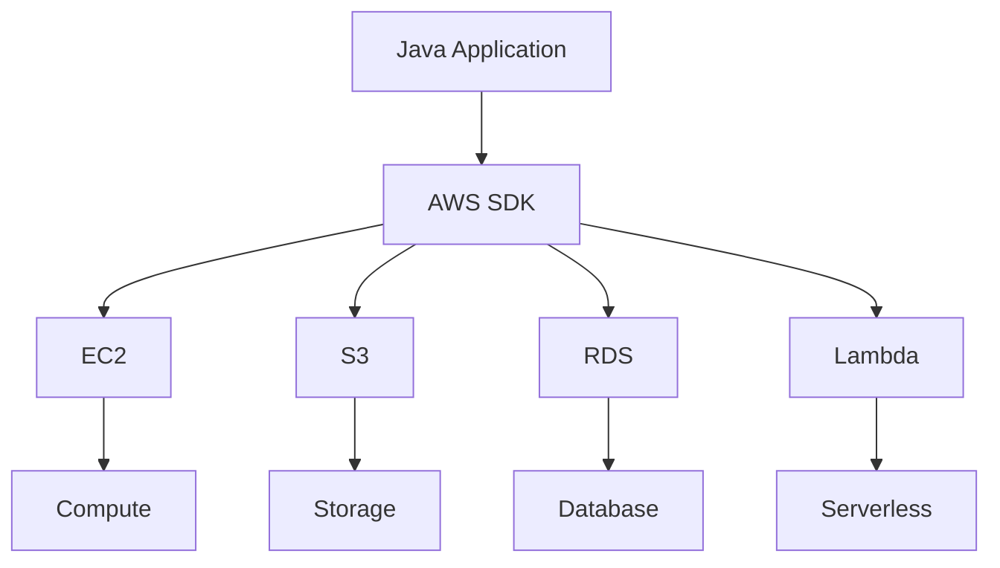

# Module 23: AWS for Java Developers

## Overview
Amazon Web Services (AWS) provides cloud computing services for Java applications. Key services include EC2, S3, RDS, Lambda, and SQS.

## Learning Objectives
- Understand AWS services
- Use AWS SDK for Java
- Deploy applications to AWS
- Implement serverless with Lambda
- Apply AWS best practices

## Prerequisites
- Java fundamentals
- Cloud concepts
- REST API basics

## Why This Concept Exists
On-premise has:
- High upfront costs
- Scaling limitations
- Maintenance overhead
- Disaster recovery complexity

AWS provides:
- Pay-as-you-go
- Elastic scaling
- Managed services
- Global infrastructure

## Problem Statement
How do you leverage cloud services for scalable Java applications?

## Theory

### AWS Services

| Service | Purpose |
|---------|---------|
| EC2 | Virtual machines |
| S3 | Object storage |
| RDS | Managed databases |
| Lambda | Serverless functions |
| SQS | Message queuing |
| DynamoDB | NoSQL database |
| ElastiCache | In-memory cache |

### AWS SDK Components

| Component | Purpose |
|-----------|---------|
| SDK Core | Core functionality |
| Services | Service clients |
| Auth | Authentication |

## Internal Working

### AWS Request Flow
```
Application → AWS SDK → AWS API → AWS Service → Response
```

### Authentication
```
Access Key + Secret Key → Signature → Request
```

## JVM Perspective

### AWS SDK for Java
- Synchronous/Asynchronous clients
- Pagination support
- Retry handling
- Credential providers

## Architecture Diagram



## Syntax

### S3 Operations
```java
// Create client
AmazonS3 s3 = AmazonS3ClientBuilder.standard()
    .withRegion(Regions.US_EAST_1)
    .build();

// Put object
s3.putObject("bucket-name", "key", "content");

// Get object
S3Object object = s3.getObject("bucket-name", "key");
String content = IOUtils.toString(object.getObjectContent(), "UTF-8");

// List objects
ObjectListing listing = s3.listObjects("bucket-name");
for (S3ObjectSummary summary : listing.getObjectSummaries()) {
    System.out.println(summary.getKey());
}
```

### RDS Operations
```java
// JDBC connection
String url = "jdbc:mysql://mydb.cluster-xxx.us-east-1.rds.amazonaws.com:3306/mydb";
Connection conn = DriverManager.getConnection(url, "user", "password");

Statement stmt = conn.createStatement();
ResultSet rs = stmt.executeQuery("SELECT * FROM users");
while (rs.next()) {
    System.out.println(rs.getString("name"));
}
```

## Easy Example
```java
import software.amazon.awssdk.services.s3.*;
import software.amazon.awssdk.services.s3.model.*;

public class AwsEasyExample {
    public static void main(String[] args) {
        S3Client s3 = S3Client.create();
        
        // List buckets
        ListBucketsResponse response = s3.listBuckets();
        response.buckets().forEach(bucket -> 
            System.out.println(bucket.name()));
        
        s3.close();
    }
}
```

## Medium Example
```java
import software.amazon.awssdk.services.s3.*;
import software.amazon.awssdk.services.s3.model.*;
import java.nio.file.Paths;

public class AwsMediumExample {
    public static void main(String[] args) {
        S3Client s3 = S3Client.create();
        
        // Upload file
        PutObjectRequest putRequest = PutObjectRequest.builder()
            .bucket("my-bucket")
            .key("uploads/file.txt")
            .build();
        
        s3.putObject(putRequest, Paths.get("local-file.txt"));
        System.out.println("File uploaded");
        
        // Download file
        GetObjectRequest getRequest = GetObjectRequest.builder()
            .bucket("my-bucket")
            .key("uploads/file.txt")
            .build();
        
        s3.getObject(getRequest, Paths.get("downloaded-file.txt"));
        System.out.println("File downloaded");
        
        s3.close();
    }
}
```

## Hard Example
```java
import software.amazon.awssdk.services.lambda.*;
import software.amazon.awssdk.services.lambda.model.*;
import com.google.gson.Gson;

public class AwsHardExample {
    // Lambda invocation
    public static void main(String[] args) {
        LambdaClient lambda = LambdaClient.create();
        
        String payload = new Gson().toJson(Map.of(
            "key1", "value1",
            "key2", "value2"
        ));
        
        InvokeRequest request = InvokeRequest.builder()
            .functionName("my-function")
            .payload(SdkBytes.fromUtf8String(payload))
            .build();
        
        InvokeResponse response = lambda.invoke(request);
        String result = response.payload().asUtf8String();
        System.out.println("Result: " + result);
        
        lambda.close();
    }
}
```

## Enterprise Example
```java
import software.amazon.awssdk.services.dynamodb.*;
import software.amazon.awssdk.services.dynamodb.model.*;
import java.util.*;

public class AwsEnterpriseExample {
    // DynamoDB operations
    public static void main(String[] args) {
        DynamoDbClient dynamo = DynamoDbClient.create();
        
        // Put item
        Map<String, AttributeValue> item = new HashMap<>();
        item.put("id", AttributeValue.builder().s("123").build());
        item.put("name", AttributeValue.builder().s("John").build());
        
        PutItemRequest putRequest = PutItemRequest.builder()
            .tableName("users")
            .item(item)
            .build();
        
        dynamo.putItem(putRequest);
        
        // Query
        Map<String, AttributeValue> key = new HashMap<>();
        key.put("id", AttributeValue.builder().s("123").build());
        
        GetItemRequest getRequest = GetItemRequest.builder()
            .tableName("users")
            .key(key)
            .build();
        
        GetItemResponse getResponse = dynamo.getItem(getRequest);
        System.out.println("User: " + getResponse.item());
        
        dynamo.close();
    }
}
```

## Performance Considerations
- Use connection pooling
- Enable request compression
- Use pagination
- Cache responses

## Best Practices
1. Use IAM roles
2. Enable encryption
3. Use VPC for security
4. Monitor with CloudWatch
5. Use Auto Scaling

## Comparison Table

| Feature | AWS | Azure | GCP |
|---------|-----|-------|-----|
| Market Share | Largest | Growing | Growing |
| Services | Most | Many | Many |
| Java SDK | Excellent | Good | Good |
| Pricing | Pay-as-you-go | Pay-as-you-go | Pay-as-you-go |

## Interview Questions

### Q1: What is AWS?
**Answer:** Amazon Web Services - cloud computing platform.

### Q2: What is EC2?
**Answer:** Elastic Compute Cloud - virtual machines.

### Q3: What is S3?
**Answer:** Simple Storage Service - object storage.

### Q4: What is Lambda?
**Answer:** Serverless compute service.

### Q5: What is the difference between EC2 and Lambda?
**Answer:** EC2 is persistent VMs, Lambda is serverless functions.

## Summary
AWS provides comprehensive cloud services for Java applications. Use appropriate services for your needs.

## References
- AWS Documentation
- AWS SDK for Java
- AWS Best Practices
