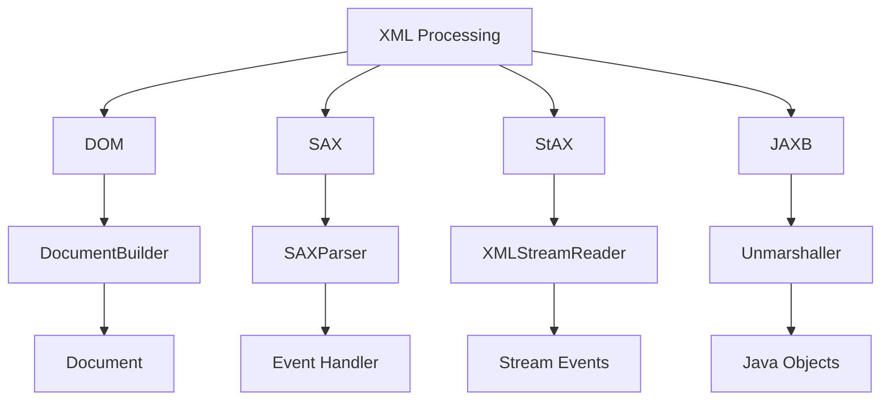
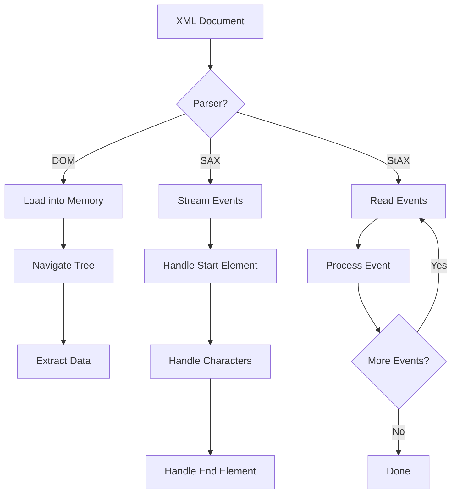
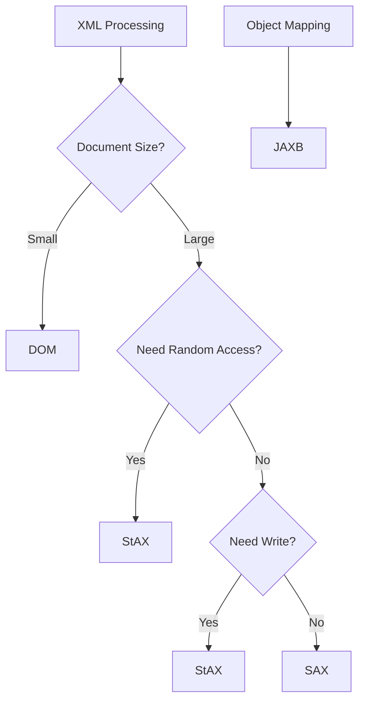

# Module 23: XML

## Overview
XML (eXtensible Markup Language) is a markup language for encoding documents. Java provides DOM, SAX, and StAX parsers for XML processing, along with JAXB for XML-Java object binding.

## Learning Objectives
- Understand XML structure
- Parse XML with DOM, SAX, StAX
- Use JAXB for binding
- Create XML documents
- Handle XML namespaces

## Prerequisites
- Basic Java knowledge
- Understanding of trees/hierarchies
- Familiarity with markup languages

## Why This Concept Exists
XML is used for:
- Configuration files (Spring, Maven)
- Data exchange (SOAP, REST)
- Document storage
- API definitions (WSDL)
- Markup documents

## Problem Statement
How do you read, write, and manipulate XML data in Java?

## Theory

### XML Parsers

| Parser | Type | Memory | Speed | Use Case |
|--------|------|--------|-------|----------|
| DOM | Tree | High | Fast | Small documents |
| SAX | Event | Low | Fast | Large documents |
| StAX | Streaming | Low | Fast | Bidirectional |
| JAXB | Binding | Medium | Fast | Object mapping |

### XML Structure
```xml
<?xml version="1.0" encoding="UTF-8"?>
<root>
    <element attribute="value">Content</element>
    <child>
        <grandchild>Text</grandchild>
    </child>
</root>
```

## Internal Working

### DOM Parsing
1. Load entire document
2. Build tree structure
3. Navigate tree
4. Extract data

### SAX Parsing
1. Event-based parsing
2. Start/end elements
3. Characters events
4. No tree structure

## JVM Perspective

### Memory Usage
- DOM: O(document size)
- SAX: O(1) streaming
- StAX: O(depth) stack
- JAXB: O(objects) bound

### XML Processing
- javax.xml.parsers: DOM/SAX
- javax.xml.stream: StAX
- jakarta.xml.bind: JAXB

## Memory Representation
```
DOM Tree:
┌─────────────────────────────────────┐
│ Document                            │
│  └─ Element: root                   │
│     ├─ Element: child               │
│     │  ├─ Attribute: attr="value"   │
│     │  └─ Text: "content"           │
│     └─ Element: child2              │
└─────────────────────────────────────┘
```

## Architecture Diagram



## Flow Diagram



## Syntax

### DOM Parsing
```java
import javax.xml.parsers.*;
import org.w3c.dom.*;
import java.io.*;

DocumentBuilderFactory factory = DocumentBuilderFactory.newInstance();
DocumentBuilder builder = factory.newDocumentBuilder();
Document doc = builder.parse(new File("data.xml"));

// Get root element
Element root = doc.getDocumentElement();

// Get elements
NodeList nodes = root.getElementsByTagName("item");
for (int i = 0; i < nodes.getLength(); i++) {
    Element element = (Element) nodes.item(i);
    String value = element.getTextContent();
}
```

### SAX Parsing
```java
import javax.xml.parsers.*;
import org.xml.sax.*;
import org.xml.sax.helpers.*;

SAXParserFactory factory = SAXParserFactory.newInstance();
SAXParser parser = factory.newSAXParser();

parser.parse(new File("data.xml"), new DefaultHandler() {
    @Override
    public void startElement(String uri, String localName, 
            String qName, Attributes attributes) {
        System.out.println("Start: " + qName);
    }
    
    @Override
    public void characters(char[] ch, int start, int length) {
        System.out.println("Content: " + new String(ch, start, length));
    }
    
    @Override
    public void endElement(String uri, String localName, String qName) {
        System.out.println("End: " + qName);
    }
});
```

### StAX Parsing
```java
import javax.xml.stream.*;
import java.io.*;

XMLInputFactory factory = XMLInputFactory.newInstance();
XMLStreamReader reader = factory.createXMLStreamReader(
    new FileInputStream("data.xml"));

while (reader.hasNext()) {
    int event = reader.next();
    
    switch (event) {
        case XMLStreamConstants.START_ELEMENT:
            System.out.println("Start: " + reader.getLocalName());
            break;
        case XMLStreamConstants.CHARACTERS:
            System.out.println("Content: " + reader.getText());
            break;
        case XMLStreamConstants.END_ELEMENT:
            System.out.println("End: " + reader.getLocalName());
            break;
    }
}
```

### JAXB
```java
import jakarta.xml.bind.*;
import java.io.*;

// Unmarshal
JAXBContext context = JAXBContext.newInstance(Person.class);
Unmarshaller unmarshaller = context.createUnmarshaller();
Person person = (Person) unmarshaller.unmarshal(new File("person.xml"));

// Marshal
Marshaller marshaller = context.createMarshaller();
marshaller.setProperty(Marshaller.JAXB_FORMATTED_OUTPUT, true);
marshaller.marshal(person, new File("output.xml"));
```

## Easy Example
```java
import javax.xml.parsers.*;
import org.w3c.dom.*;
import java.io.*;

public class EasyExample {
    public static void main(String[] args) throws Exception {
        // Create XML document
        DocumentBuilderFactory factory = DocumentBuilderFactory.newInstance();
        DocumentBuilder builder = factory.newDocumentBuilder();
        Document doc = builder.newDocument();
        
        // Create root element
        Element root = doc.createElement("books");
        doc.appendChild(root);
        
        // Create book element
        Element book = doc.createElement("book");
        book.setAttribute("id", "1");
        root.appendChild(book);
        
        // Create title element
        Element title = doc.createElement("title");
        title.setTextContent("Java Programming");
        book.appendChild(title);
        
        // Print XML
        TransformerFactory tf = TransformerFactory.newInstance();
        Transformer transformer = tf.newTransformer();
        transformer.setOutputProperty(OutputKeys.INDENT, "yes");
        transformer.transform(new DOMSource(doc), 
            new StreamResult(System.out));
    }
}
```

## Medium Example
```java
import javax.xml.parsers.*;
import org.w3c.dom.*;
import java.io.*;

public class MediumExample {
    public static void main(String[] args) throws Exception {
        // Parse XML
        DocumentBuilderFactory factory = DocumentBuilderFactory.newInstance();
        DocumentBuilder builder = factory.newDocumentBuilder();
        Document doc = builder.parse(new File("books.xml"));
        
        // Get all books
        NodeList books = doc.getElementsByTagName("book");
        for (int i = 0; i < books.getLength(); i++) {
            Element book = (Element) books.item(i);
            String id = book.getAttribute("id");
            String title = book.getElementsByTagName("title")
                .item(0).getTextContent();
            String author = book.getElementsByTagName("author")
                .item(0).getTextContent();
            
            System.out.printf("Book %s: %s by %s%n", id, title, author);
        }
    }
}
```

## Hard Example
```java
import javax.xml.stream.*;
import java.io.*;

public class HardExample {
    // StAX streaming parser
    public static void main(String[] args) throws Exception {
        XMLInputFactory factory = XMLInputFactory.newInstance();
        XMLStreamReader reader = factory.createXMLStreamReader(
            new FileInputStream("large.xml"));
        
        StringBuilder content = new StringBuilder();
        boolean inElement = false;
        
        while (reader.hasNext()) {
            int event = reader.next();
            
            switch (event) {
                case XMLStreamConstants.START_ELEMENT:
                    if (reader.getLocalName().equals("item")) {
                        inElement = true;
                        content.setLength(0);
                    }
                    break;
                case XMLStreamConstants.CHARACTERS:
                    if (inElement) {
                        content.append(reader.getText());
                    }
                    break;
                case XMLStreamConstants.END_ELEMENT:
                    if (reader.getLocalName().equals("item")) {
                        System.out.println("Item: " + content);
                        inElement = false;
                    }
                    break;
            }
        }
    }
}
```

## Enterprise Example
```java
import jakarta.xml.bind.*;
import java.io.*;
import java.util.*;

// JAXB example
public class EnterpriseExample {
    public static void main(String[] args) throws Exception {
        // Create objects
        List<Employee> employees = List.of(
            new Employee(1, "John", "Engineering"),
            new Employee(2, "Jane", "Marketing")
        );
        
        Company company = new Company("Acme Corp", employees);
        
        // Marshal to XML
        JAXBContext context = JAXBContext.newInstance(Company.class);
        Marshaller marshaller = context.createMarshaller();
        marshaller.setProperty(Marshaller.JAXB_FORMATTED_OUTPUT, true);
        marshaller.marshal(company, new File("company.xml"));
        
        // Unmarshal from XML
        Unmarshaller unmarshaller = context.createUnmarshaller();
        Company loaded = (Company) unmarshaller.unmarshal(
            new File("company.xml"));
        System.out.println("Loaded: " + loaded.getName());
    }
}

class Company {
    private String name;
    private List<Employee> employees;
    
    public Company() {}
    public Company(String name, List<Employee> employees) {
        this.name = name;
        this.employees = employees;
    }
    
    public String getName() { return name; }
    public List<Employee> getEmployees() { return employees; }
}

class Employee {
    private int id;
    private String name;
    private String department;
    
    public Employee() {}
    public Employee(int id, String name, String department) {
        this.id = id;
        this.name = name;
        this.department = department;
    }
    
    public int getId() { return id; }
    public String getName() { return name; }
    public String getDepartment() { return department; }
}
```

## Performance Considerations
- DOM: fast access, high memory
- SAX: low memory, forward-only
- StAX: low memory, bidirectional
- JAXB: convenient, moderate memory

## Time & Space Complexity
| Operation | Time | Space |
|-----------|------|-------|
| DOM parse | O(n) | O(n) |
| SAX parse | O(n) | O(1) |
| StAX parse | O(n) | O(depth) |
| JAXB unmarshal | O(n) | O(objects) |

## Thread Safety
- Parsers are not thread-safe
- Document objects are mutable
- Use separate parser instances
- JAXB context is thread-safe

## Best Practices
1. Use appropriate parser for use case
2. Handle XML namespaces properly
3. Validate XML schemas
4. Use StAX for large documents
5. Prefer JAXB for object mapping

## Common Mistakes
1. Not closing parsers
2. Ignoring namespaces
3. Memory leaks with DOM
4. Not handling exceptions

## Pitfalls & Warnings
1. XML injection attacks
2. External entity processing
3. Encoding issues
4. Schema validation errors

## Debugging Tips
1. Print DOM tree
2. Log SAX events
3. Use XML validators
4. Check namespace URIs

## Comparison Table

| Feature | DOM | SAX | StAX | JAXB |
|---------|-----|-----|------|------|
| Access | Random | Sequential | Bidirectional | Object |
| Memory | High | Low | Low | Medium |
| Speed | Fast | Fast | Fast | Medium |
| Write | Yes | No | Yes | Yes |

## Decision Tree



## Interview Questions

### Q1: What is the difference between DOM and SAX?
**Answer:** DOM loads entire document, SAX is event-based streaming.

### Q2: What is JAXB?
**Answer:** Java Architecture for XML Binding, maps XML to Java objects.

### Q3: What is StAX?
**Answer:** Streaming API for XML, pull-based streaming parser.

### Q4: How do you handle XML namespaces?
**Answer:** Use namespace-aware parsers and proper URI handling.

### Q5: What is XML schema validation?
**Answer:** Validating XML structure against XSD schema.

### Q6: What is the difference between XSD and DTD?
**Answer:** XSD is XML-based, DTD is older grammar format.

### Q7: How do you prevent XML injection?
**Answer:** Disable external entities, validate input.

### Q8: What is a DOM tree?
**Answer:** In-memory tree representation of XML document.

### Q9: How do you create XML in Java?
**Answer:** Use DocumentBuilder, StAX writer, or JAXB marshalling.

### Q10: What is the difference between getElementById and getElementsByTagName?
**Answer:** getElementById returns single element, getElementsByTagName returns NodeList.

### Q11: How do you handle large XML files?
**Answer:** Use SAX or StAX streaming parsers.

### Q12: What is XML transformation?
**Answer:** Using XSLT to transform XML to other formats.

### Q13: What is XPath?
**Answer:** Language for selecting nodes from XML document.

### Q14: How do you format XML output?
**Answer:** Use Transformer with INDENT property.

### Q15: What are XML entities?
**Answer:** Named references to special characters or external resources.

## Exercises

### Easy
1. Parse XML with DOM
2. Create XML document
3. Read XML attributes

### Medium
1. Use SAX parser
2. Implement StAX parser
3. Map XML to Java objects with JAXB

### Hard
1. Transform XML with XSLT
2. Validate XML with schema
3. Build XML processing pipeline

## Summary
XML processing in Java offers multiple approaches: DOM for random access, SAX/StAX for streaming, and JAXB for object mapping.

## References
- Oracle Java Documentation: XML
- JAXB Tutorial
- StAX Documentation
