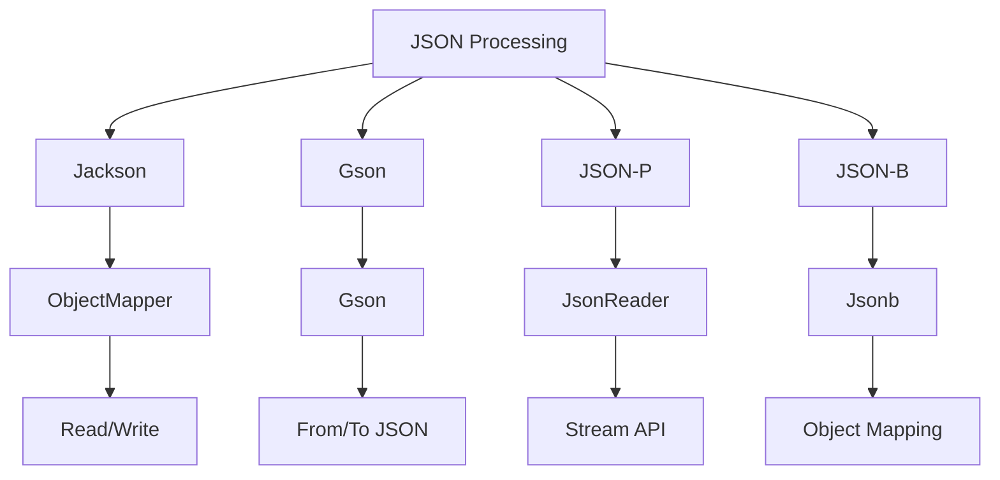
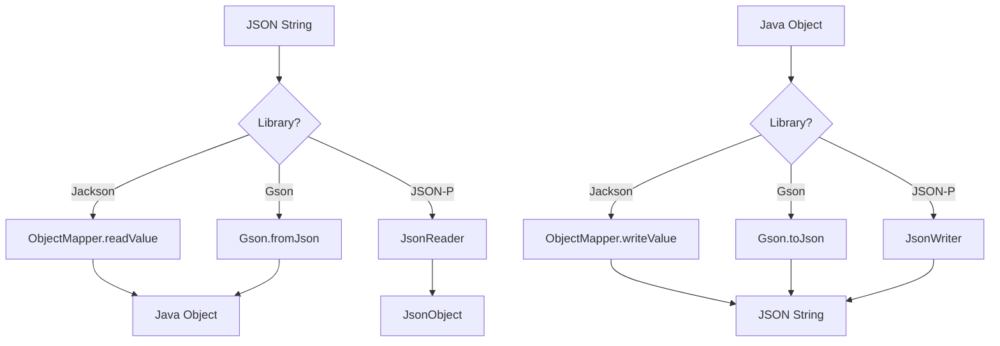
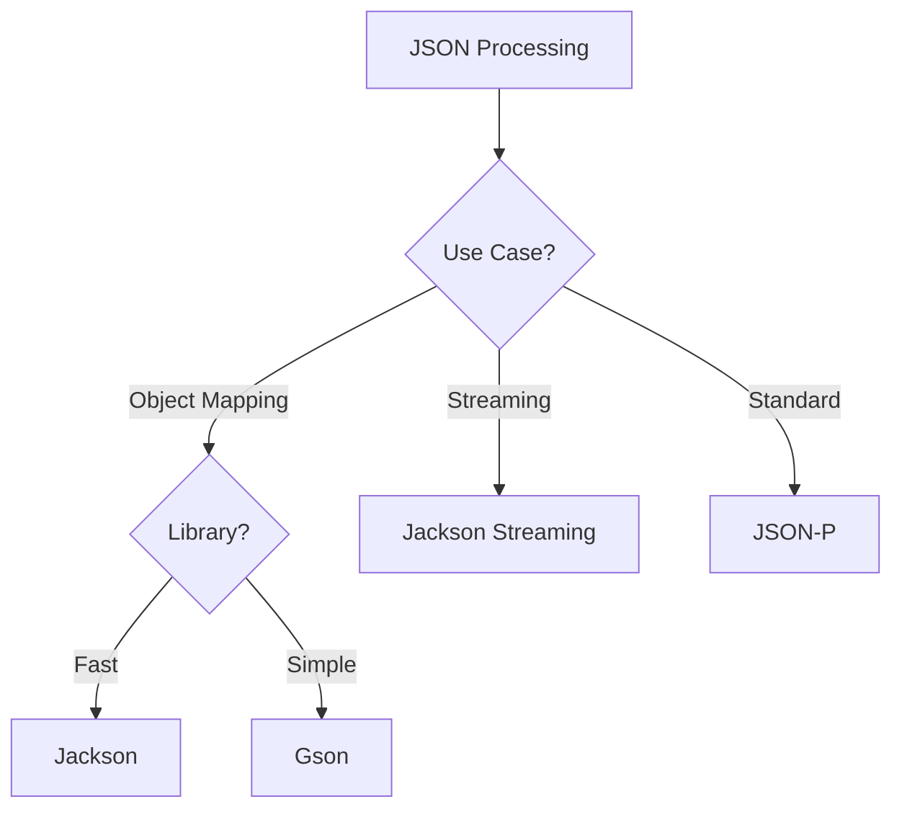

# Module 24: JSON

## Overview
JSON (JavaScript Object Notation) is a lightweight data interchange format. Java provides multiple libraries for JSON processing: Jackson, Gson, and the built-in JSON-P/JSON-B APIs.

## Learning Objectives
- Master JSON parsing and generation
- Understand Jackson and Gson APIs
- Use JSON-B for object mapping
- Handle complex JSON structures
- Optimize JSON performance

## Prerequisites
- Basic Java knowledge
- Understanding of data structures
- Familiarity with REST APIs

## Why This Concept Exists
JSON is the standard for:
- REST API data exchange
- Configuration files
- Logging
- Data storage
- Message queues

## Problem Statement
How do you parse, generate, and map JSON data in Java?

## Theory

### JSON Libraries

| Library | Type | Performance | Features |
|---------|------|-------------|----------|
| Jackson | Streaming | Fast | Full-featured |
| Gson | DOM | Good | Simple API |
| JSON-P | Standard | Good | Specification |
| JSON-B | Standard | Good | Object mapping |

### JSON Data Types

| Type | Java Equivalent |
|------|-----------------|
| Object | Map/Object |
| Array | List/Array |
| String | String |
| Number | Integer/Double |
| Boolean | Boolean |
| null | null |

## Internal Working

### Jackson Processing
1. Create ObjectMapper
2. Read/Write JSON
3. Handle serialization
4. Configure options

### Gson Processing
1. Create Gson instance
2. Convert to/from JSON
3. Handle type adapters
4. Configure options

## JVM Perspective

### Memory Usage
- Streaming: low memory
- DOM: proportional to JSON size
- Object mapping: proportional to objects

### Performance
- Jackson: fastest for large documents
- Gson: simpler API, good performance
- JSON-P: standard but slower

## Memory Representation
```
JSON Object:
{
  "name": "John",
  "age": 30,
  "active": true
}

Java Map:
┌─────────────────────────────────────┐
│ "name" → "John"                     │
│ "age" → 30                          │
│ "active" → true                     │
└─────────────────────────────────────┘
```

## Architecture Diagram



## Flow Diagram



## Syntax

### Jackson
```java
import com.fasterxml.jackson.databind.ObjectMapper;

ObjectMapper mapper = new ObjectMapper();

// Read JSON
String json = "{\"name\":\"John\",\"age\":30}";
Person person = mapper.readValue(json, Person.class);

// Write JSON
Person p = new Person("John", 30);
String output = mapper.writeValueAsString(p);
```

### Gson
```java
import com.google.gson.Gson;

Gson gson = new Gson();

// Read JSON
String json = "{\"name\":\"John\",\"age\":30}";
Person person = gson.fromJson(json, Person.class);

// Write JSON
Person p = new Person("John", 30);
String output = gson.toJson(p);
```

### JSON-P
```java
import jakarta.json.*;
import java.io.*;

// Read JSON
JsonReader reader = Json.createReader(new StringReader(json));
JsonObject object = reader.readObject();
String name = object.getString("name");

// Write JSON
JsonObjectBuilderFactory factory = Json.createObjectFactory();
JsonObject obj = factory.createObjectBuilder()
    .add("name", "John")
    .add("age", 30)
    .build();
```

## Easy Example
```java
import com.fasterxml.jackson.databind.ObjectMapper;

public class EasyExample {
    public static void main(String[] args) throws Exception {
        ObjectMapper mapper = new ObjectMapper();
        
        // JSON to Java
        String json = "{\"name\":\"John\",\"age\":30,\"city\":\"NYC\"}";
        Person person = mapper.readValue(json, Person.class);
        System.out.println("Name: " + person.name);
        
        // Java to JSON
        Person p = new Person("Jane", 25, "LA");
        String output = mapper.writeValueAsString(p);
        System.out.println("JSON: " + output);
    }
}

class Person {
    public String name;
    public int age;
    public String city;
    
    public Person() {}
    public Person(String name, int age, String city) {
        this.name = name;
        this.age = age;
        this.city = city;
    }
}
```

## Medium Example
```java
import com.google.gson.*;
import java.util.*;

public class MediumExample {
    public static void main(String[] args) {
        Gson gson = new GsonBuilder()
            .setPrettyPrinting()
            .serializeNulls()
            .create();
        
        // Complex object
        Map<String, Object> data = new HashMap<>();
        data.put("name", "John");
        data.put("scores", List.of(90, 85, 95));
        data.put("address", Map.of("city", "NYC", "zip", "10001"));
        
        String json = gson.toJson(data);
        System.out.println(json);
        
        // Parse back
        JsonObject parsed = JsonParser.parseString(json).getAsJsonObject();
        System.out.println("Name: " + parsed.get("name").getAsString());
    }
}
```

## Hard Example
```java
import com.fasterxml.jackson.databind.*;
import com.fasterxml.jackson.databind.node.*;
import java.util.*;

public class HardExample {
    // Dynamic JSON processing
    public static void main(String[] args) throws Exception {
        ObjectMapper mapper = new ObjectMapper();
        
        String json = """
            {
                "users": [
                    {"id": 1, "name": "John", "active": true},
                    {"id": 2, "name": "Jane", "active": false}
                ]
            }
            """;
        
        JsonNode root = mapper.readTree(json);
        JsonNode users = root.get("users");
        
        for (JsonNode user : users) {
            if (user.get("active").asBoolean()) {
                System.out.println("Active: " + user.get("name").asText());
            }
        }
        
        // Modify JSON
        ObjectNode newNode = mapper.createObjectNode();
        newNode.put("id", 3);
        newNode.put("name", "Bob");
        newNode.put("active", true);
        
        ((ArrayNode) users).add(newNode);
        System.out.println(mapper.writerWithDefaultPrettyPrinter()
            .writeValueAsString(root));
    }
}
```

## Enterprise Example
```java
import com.fasterxml.jackson.databind.ObjectMapper;
import com.fasterxml.jackson.datatype.jsr310.JavaTimeModule;
import java.time.LocalDateTime;
import java.util.*;

public class EnterpriseExample {
    public static void main(String[] args) throws Exception {
        ObjectMapper mapper = new ObjectMapper()
            .registerModule(new JavaTimeModule());
        
        // Complex nested JSON
        String json = """
            {
                "orderId": 12345,
                "customer": {
                    "name": "John Doe",
                    "email": "john@example.com"
                },
                "items": [
                    {"product": "Laptop", "price": 999.99, "qty": 1},
                    {"product": "Mouse", "price": 29.99, "qty": 2}
                ],
                "total": 1059.97,
                "createdAt": "2024-01-15T10:30:00"
            }
            """;
        
        Order order = mapper.readValue(json, Order.class);
        System.out.println("Order: " + order.orderId);
        System.out.println("Customer: " + order.customer.name);
        System.out.println("Items: " + order.items.size());
    }
}

class Order {
    public long orderId;
    public Customer customer;
    public List<Item> items;
    public double total;
    public LocalDateTime createdAt;
}

class Customer {
    public String name;
    public String email;
}

class Item {
    public String product;
    public double price;
    public int qty;
}
```

## Performance Considerations
- Jackson is fastest for large documents
- Use streaming for memory efficiency
- Cache ObjectMapper instances
- Use typed references for generics

## Time & Space Complexity
| Operation | Time | Space |
|-----------|------|-------|
| Parse | O(n) | O(n) |
| Generate | O(n) | O(n) |
| Stream | O(1) | O(1) |
| Query | O(n) | O(1) |

## Thread Safety
- ObjectMapper is thread-safe
- Gson is thread-safe
- JsonReader/Writer are not
- Cache and reuse instances

## Best Practices
1. Use appropriate library for needs
2. Cache ObjectMapper/Gson instances
3. Handle null values properly
4. Use streaming for large documents
5. Validate JSON structure

## Common Mistakes
1. Not handling exceptions
2. Ignoring null values
3. Not caching instances
4. Using wrong data types

## Pitfalls & Warnings
1. Circular references
2. Unknown properties
3. Date/time handling
4. Encoding issues

## Debugging Tips
1. Pretty print JSON
2. Log parsing errors
3. Validate JSON syntax
4. Check data types

## Comparison Table

| Feature | Jackson | Gson | JSON-P |
|---------|---------|------|--------|
| Performance | Fast | Good | Good |
| API | Complex | Simple | Standard |
| Features | Full | Basic | Basic |
| Streaming | Yes | No | Yes |

## Decision Tree



## Interview Questions

### Q1: What is the difference between Jackson and Gson?
**Answer:** Jackson is faster, Gson is simpler. Both handle object mapping.

### Q2: How do you handle null values in JSON?
**Answer:** Use @JsonInclude or configure serializer.

### Q3: What is JSON streaming?
**Answer:** Processing JSON without loading entire document into memory.

### Q4: How do you handle date/time in JSON?
**Answer:** Use ObjectMapper with JavaTimeModule or custom serializer.

### Q5: What is @JsonIgnore?
**Answer:** Annotation to exclude field from serialization.

### Q6: How do you parse nested JSON?
**Answer:** Use nested classes or JsonNode for dynamic access.

### Q7: What is the difference between @JsonProperty and @SerializedName?
**Answer:** @JsonProperty is Jackson, @SerializedName is Gson.

### Q8: How do you validate JSON?
**Answer:** Use JSON schema validators or manual validation.

### Q9: What is JsonNode?
**Answer:** Jackson's tree model for dynamic JSON processing.

### Q10: How do you handle circular references?
**Answer:** Use @JsonIgnore or configure serializer.

### Q11: What is pretty printing?
**Answer:** Formatting JSON with indentation for readability.

### Q12: How do you convert Map to JSON?
**Answer:** Use mapper.writeValueAsString(map).

### Q13: What is JSON-B?
**Answer:** Standard API for JSON binding in Jakarta EE.

### Q14: How do you handle unknown properties?
**Answer:** Use @JsonIgnoreProperties(ignoreUnknown = true).

### Q15: What is the performance difference?
**Answer:** Jackson fastest, Gson good, JSON-P standard.

## Exercises

### Easy
1. Parse JSON string to object
2. Convert object to JSON
3. Read JSON file

### Medium
1. Handle nested JSON
2. Use streaming parser
3. Convert List to JSON array

### Hard
1. Build JSON transformation pipeline
2. Implement custom serializer
3. Process large JSON files

## Summary
JSON processing is essential for modern Java applications. Jackson and Gson are the most popular libraries with different strengths.

## References
- Jackson Documentation
- Gson User Guide
- JSON-P Specification
