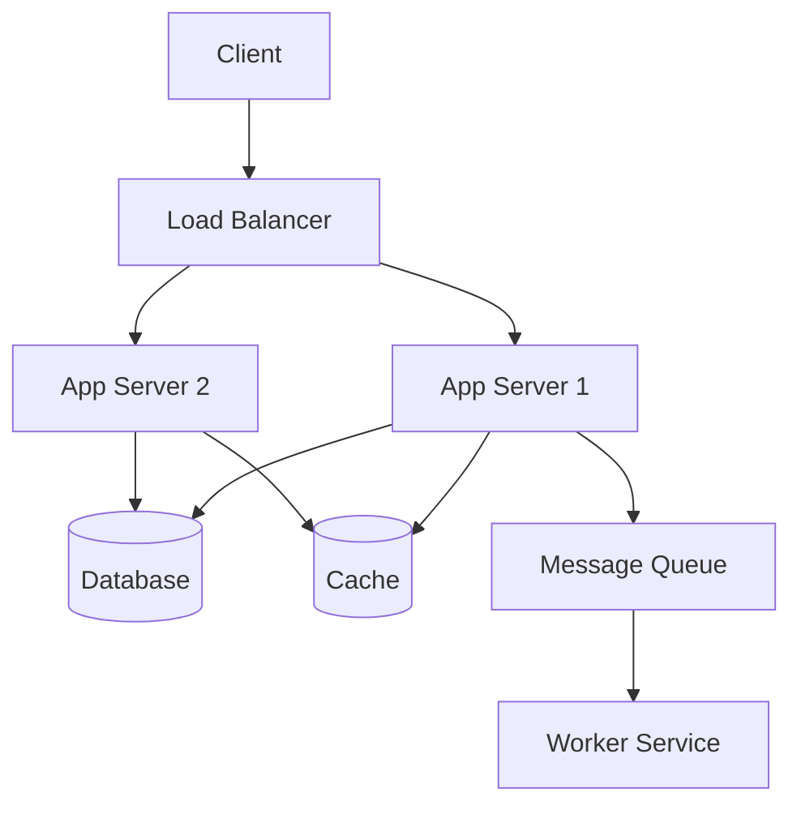
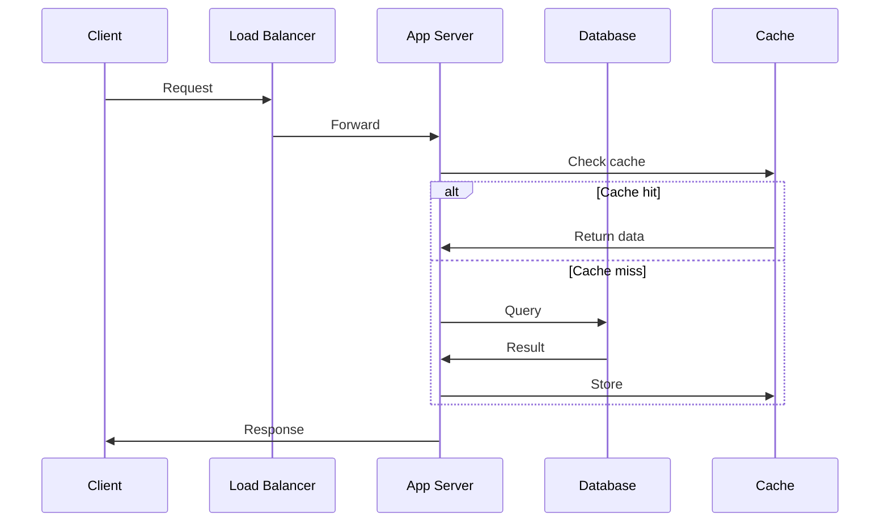

# 1. Introduction

System design is the process of defining architecture, components, modules, interfaces, and data flow of a system to satisfy specified requirements. It's crucial for building scalable, reliable, and maintainable applications.

# 2. Learning Objectives

- Understand scalability, availability, and consistency
- Design distributed systems
- Apply system design patterns
- Evaluate trade-offs in design decisions

# 3. Prerequisites

- Programming fundamentals
- Database concepts
- Networking basics
- Operating systems basics

# 4. Why This Concept Exists

As applications grow, simple architectures fail. System design provides principles and patterns for building systems that handle millions of users, petabytes of data, and 99.99% uptime.

# 5. Problem Statement

**Without System Design:** Monolithic failures, poor scalability, single points of failure, performance bottlenecks. **With System Design:** Scalable architecture, high availability, fault tolerance, optimized performance.

# 6. Theory

**Key Principles:**
- **Scalability**: Handle increased load
- **Availability**: System is accessible
- **Consistency**: Data is accurate
- **Partition Tolerance**: System works despite failures

**CAP Theorem**: You can only guarantee 2 of 3 (Consistency, Availability, Partition Tolerance).

# 7. Internal Working

**Distributed System Components:**
- Load Balancers
- Application Servers
- Databases (SQL/NoSQL)
- Caching Layers
- Message Queues
- CDNs

# 8. JVM Perspective

JVM applications benefit from system design through proper resource management, connection pooling, and distributed caching strategies.

# 9. Memory Representation

System resources: CPU, Memory, Network, Storage, I/O.

# 10. Architecture Diagram (Mermaid)



# 11. Flow Diagram (Mermaid)



# 12. Syntax

```java
// Connection pooling
HikariConfig config = new HikariConfig();
config.setJdbcUrl("jdbc:mysql://localhost:3306/db");
config.setMaximumPoolSize(10);
HikariDataSource ds = new HikariDataSource(config);

// Caching
Cache<String, Object> cache = Caffeine.newBuilder()
    .maximumSize(10_000)
    .expireAfterWrite(Duration.ofMinutes(5))
    .build();
```

# 13. Easy Example

```java
// Simple load balancing
public class RoundRobinBalancer {
    private final AtomicInteger index = new AtomicInteger(0);
    private final List<String> servers = List.of("server1", "server2", "server3");
    
    public String getNextServer() {
        return servers.get(index.getAndIncrement() % servers.size());
    }
}
```

# 14. Medium Example

```java
// Cache-aside pattern
public class CacheAsidePattern {
    private final Cache<String, Object> cache;
    private final DataSource dataSource;
    
    public Object getData(String key) {
        Object value = cache.getIfPresent(key);
        if (value == null) {
            value = dataSource.query(key);
            cache.put(key, value);
        }
        return value;
    }
}
```

# 15. Hard Example

```java
// Circuit breaker pattern
public class CircuitBreaker {
    private final AtomicBoolean closed = new AtomicBoolean(true);
    private final AtomicInteger failureCount = new AtomicInteger(0);
    private final int failureThreshold;
    
    public <T> T execute(Supplier<T> action) {
        if (!closed.get()) {
            throw new CircuitBreakerOpenException();
        }
        try {
            T result = action.get();
            failureCount.set(0);
            return result;
        } catch (Exception e) {
            if (failureCount.incrementAndGet() >= failureThreshold) {
                closed.set(false);
                scheduleReset();
            }
            throw e;
        }
    }
}
```

# 16. Enterprise Example

```java
// Distributed rate limiter
public class DistributedRateLimiter {
    private final RedisTemplate<String, String> redis;
    private final int maxRequests;
    private final Duration window;
    
    public boolean allowRequest(String userId) {
        String key = "rate:" + userId;
        Long count = redis.opsForValue().increment(key);
        if (count == 1) {
            redis.expire(key, window);
        }
        return count <= maxRequests;
    }
}
```

# 17. Performance

Key metrics: Latency (p50, p95, p99), Throughput (requests/second), Error rate, Availability (99.9%, 99.99%, 99.999%).

# 18. Time & Space Complexity

Consider algorithm complexity for core operations. Use appropriate data structures.

# 19. Thread Safety

Use concurrent data structures, synchronization, and locks appropriately. Consider deadlocks and race conditions.

# 20. Best Practices

1. Design for failure
2. Implement redundancy
3. Use caching strategically
4. Monitor everything
5. Plan for scale
6. Keep it simple
7. Document decisions

# 21. Common Mistakes

- Single point of failure
- Not planning for scale
- Ignoring monitoring
- Over-engineering
- Not testing failure scenarios

# 22. Pitfalls

- Network partitions
- Data consistency issues
- Cascading failures
- Memory leaks
- Connection pool exhaustion

# 23. Debugging Tips

- Use distributed tracing
- Monitor metrics
- Log aggregation
- Load testing
- Chaos engineering

# 24. Comparison Table

| Pattern | Use Case | Complexity |
|---------|----------|------------|
| Load Balancing | Distribute traffic | Low |
| Caching | Improve performance | Medium |
| Message Queue | Async processing | Medium |
| Circuit Breaker | Fault tolerance | Medium |
| CQRS | Read/write optimization | High |

# 25. Decision Tool

```
System design need?
├── Scalability? → Horizontal scaling, load balancing
├── Performance? → Caching, CDN, optimization
├── Reliability? → Redundancy, failover
└── Consistency? → Distributed transactions, consensus
```

# 26. Interview Questions

1. What is system design? Process of defining architecture and components.
2. What is CAP theorem? Consistency, Availability, Partition Tolerance trade-off.
3. What is horizontal vs vertical scaling? Horizontal: add more machines; Vertical: add more power.
4. What is a load balancer? Distributes traffic across multiple servers.
5. What is caching? Storing frequently accessed data in fast storage.
6. What is a CDN? Content Delivery Network for distributing static content.
7. What is database sharding? Splitting database across multiple servers.
8. What is a message queue? Async communication between services.
9. What is eventual consistency? Data will become consistent over time.
10. What is a microservices architecture? Application as collection of small services.
11. How do you handle system failures? Redundancy, failover, monitoring.
12. What is a rate limiter? Controls request frequency.
13. What is a circuit breaker? Prevents cascading failures.
14. How do you design a URL shortener? Hash function, database, redirects.
15. How do you design a chat system? WebSockets, message queue, storage.

# 27. Exercises

**Level 1:** Design a URL shortener, Design a rate limiter. **Level 2:** Design a chat application, Design a notification system. **Level 3:** Design a distributed file system, Design a search engine.

# 28. Summary

System design is essential for building scalable, reliable applications. Understanding fundamental principles and patterns enables effective architecture decisions.

# 29. References

- "Designing Data-Intensive Applications" by Martin Kleppmann
- "System Design Interview" by Alex Xu
- "Building Microservices" by Sam Newman
- High Scalability blog
- AWS Architecture Center
