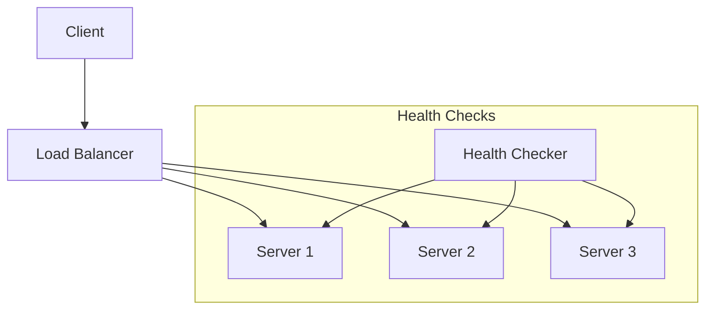
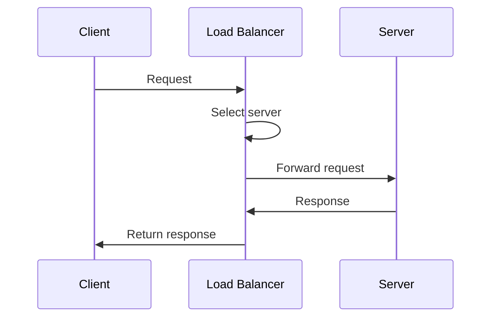

# 1. Introduction

Load balancing distributes incoming network traffic across multiple servers to ensure no single server bears too much demand, improving responsiveness and availability.

# 2. Learning Objectives

- Understand load balancing algorithms
- Configure different types of load balancers
- Implement health checks
- Design for high availability

# 3. Prerequisites

- System design fundamentals (Module 24.1)
- Networking concepts (TCP/IP, HTTP)
- Basic understanding of distributed systems

# 4. Why This Concept Exists

Single servers cannot handle large traffic volumes. Load balancing distributes requests across multiple servers, improving performance, reliability, and scalability.

# 5. Problem Statement

**Without Load Balancing:** Server overload, poor performance, single point of failure, no scalability. **With Load Balancing:** Distributed traffic, improved performance, high availability, easy scaling.

# 6. Theory

**Load Balancing Algorithms:**

| Algorithm | Description | Use Case |
|-----------|-------------|----------|
| Round Robin | Sequential distribution | Equal server capacity |
| Least Connections | Fewest active connections | Variable request times |
| IP Hash | Hash-based distribution | Session persistence |
| Weighted | Proportional distribution | Unequal server capacity |
| Least Response Time | Fastest server | Performance optimization |

**Load Balancer Types:**
- Layer 4 (Transport): TCP/UDP load balancing
- Layer 7 (Application): HTTP/HTTPS load balancing

# 7. Internal Working

**Load Balancer Architecture:**
```
Client Request
    ↓
Load Balancer
    ↓
┌─────────┬─────────┬─────────┐
│Server 1 │Server 2 │Server 3 │
└─────────┴─────────┴─────────┘
```

**Health Checks:**
- HTTP health endpoint
- TCP connection check
- Custom health check script

# 8. JVM Perspective

JVM applications benefit from load balancing through:
- Connection pooling
- Session affinity configuration
- Health check endpoints (Actuator)

# 9. Memory Representation

Load balancer maintains:
- Server list with weights
- Connection counts
- Response times
- Health status

# 10. Architecture Diagram (Mermaid)



# 11. Flow Diagram (Mermaid)



# 12. Syntax

```java
// Round Robin implementation
public class RoundRobinLoadBalancer {
    private final AtomicInteger counter = new AtomicInteger(0);
    private final List<Server> servers;
    
    public Server getServer() {
        int index = counter.getAndIncrement() % servers.size();
        return servers.get(Math.abs(index));
    }
}
```

# 13. Easy Example

```java
// Simple round robin
public class SimpleLoadBalancer {
    private final String[] servers = {"server1:8080", "server2:8080", "server3:8080"};
    private int current = 0;
    
    public synchronized String getNextServer() {
        String server = servers[current];
        current = (current + 1) % servers.length;
        return server;
    }
}
```

# 14. Medium Example

```java
// Weighted round robin
public class WeightedLoadBalancer {
    private final List<WeightedServer> servers;
    private int currentIndex = 0;
    private int currentWeight = 0;
    
    public Server getServer() {
        while (true) {
            currentIndex = (currentIndex + 1) % servers.size();
            if (currentIndex == 0) {
                currentWeight -= getGcd();
                if (currentWeight <= 0) {
                    currentWeight = getMaxWeight();
                    if (currentWeight == 0) return null;
                }
            }
            if (servers.get(currentIndex).weight >= currentWeight) {
                return servers.get(currentIndex).server;
            }
        }
    }
}
```

# 15. Hard Example

```java
// Least connections with health checks
public class LeastConnectionsBalancer {
    private final ConcurrentHashMap<String, AtomicInteger> connections = new ConcurrentHashMap<>();
    private final Set<String> healthyServers = ConcurrentHashMap.newKeySet();
    
    public Optional<String> getServer() {
        return healthyServers.stream()
            .min(Comparator.comparingInt(s -> 
                connections.computeIfAbsent(s, k -> new AtomicInteger(0)).get()));
    }
    
    public void healthCheck(String server) {
        boolean healthy = checkHealth(server);
        if (healthy) {
            healthyServers.add(server);
        } else {
            healthyServers.remove(server);
        }
    }
}
```

# 16. Enterprise Example

```java
// Production load balancer with all features
@Component
public class EnterpriseLoadBalancer {
    private final List<Server> servers;
    private final HealthChecker healthChecker;
    private final MetricsCollector metrics;
    private final CircuitBreaker circuitBreaker;
    
    public Server getServer() {
        return circuitBreaker.execute(() -> {
            List<Server> healthy = servers.stream()
                .filter(Server::isHealthy)
                .filter(s -> s.getConnections() < s.getMaxConnections())
                .sorted(Comparator.comparing(Server::getScore))
                .toList();
            
            if (healthy.isEmpty()) {
                throw new NoServerAvailableException();
            }
            
            Server selected = selectServer(healthy);
            metrics.recordSelection(selected);
            return selected;
        });
    }
}
```

# 17. Performance

| Metric | Value |
|--------|-------|
| Latency overhead | <1ms |
| Throughput | 100K+ req/s |
| Health check interval | 5-30s |
| Failover time | <30s |

# 18. Time & Space Complexity

| Operation | Time | Space |
|-----------|------|-------|
| Server selection | O(n) or O(1) | O(n) |
| Health check | O(1) | O(1) |
| Update server list | O(n) | O(n) |

# 19. Thread Safety

Use concurrent data structures. Implement proper synchronization for state updates.

# 20. Best Practices

1. Implement health checks
2. Use connection pooling
3. Configure session affinity when needed
4. Monitor server health
5. Plan for failover
6. Use appropriate algorithm
7. Log all decisions

# 21. Common Mistakes

- Not implementing health checks
- Using wrong algorithm for use case
- Ignoring session persistence
- Not monitoring server health
- Single load balancer (SPOF)

# 22. Pitfalls

- Session affinity issues
- Uneven load distribution
- Health check false positives
- Cascading failures

# 23. Debugging Tips

- Monitor connection counts
- Check server health status
- Analyze request distribution
- Review health check logs

# 24. Comparison Table

| Type | Layer | Features | Use Case |
|------|-------|----------|----------|
| Hardware | L4/L7 | High performance | Enterprise |
| Software | L4/L7 | Flexible | Most use cases |
| Cloud | L4/L7 | Managed | Cloud-native |
| DNS | L3 | Simple | Basic distribution |

# 25. Decision Tool

```
Need load balancing?
├── Simple distribution? → Round Robin
├── Variable request times? → Least Connections
├── Session persistence? → IP Hash
├── Unequal servers? → Weighted
└── Performance focus? → Least Response Time
```

# 26. Interview Questions

1. What is load balancing? Distributing traffic across multiple servers.
2. Round Robin vs Least Connections? Round Robin: simple; Least Connections: smarter distribution.
3. What is session affinity? Routing same user to same server.
4. What is health checking? Monitoring server availability.
5. Layer 4 vs Layer 7? L4: TCP/UDP; L7: HTTP/HTTPS.
6. How to handle server failure? Remove from pool, redistribute traffic.
7. What is connection pooling? Reusing connections to servers.
8. What is a circuit breaker? Preventing cascading failures.
9. How to handle sticky sessions? Use IP hash or session store.
10. What is global load balancing? Distributing across regions.
11. How to handle slow servers? Monitor response times, adjust weights.
12. What is connection draining? Gracefully removing connections during shutdown.
13. What is rate limiting? Controlling request frequency.
14. How to implement high availability? Redundant load balancers.
15. What is DDoS protection? Defending against distributed attacks.

# 27. Exercises

**Level 1:** Implement round robin load balancer. **Level 2:** Add health checks and least connections. **Level 3:** Build production load balancer with all features.

# 28. Summary

Load balancing is essential for building scalable, reliable systems. Understanding algorithms, health checks, and configuration options is crucial for system design.

# 29. References

- "System Design Interview" by Alex Xu
- NGINX Load Balancing Documentation
- HAProxy Configuration Guide
- AWS Elastic Load Balancing
