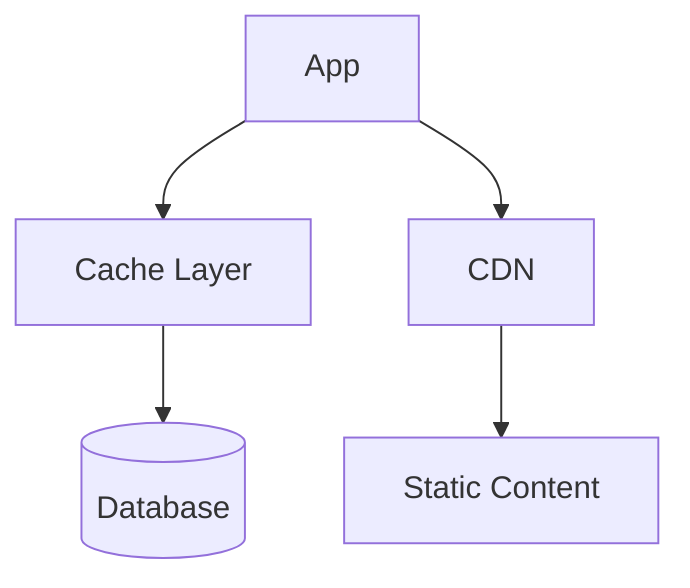
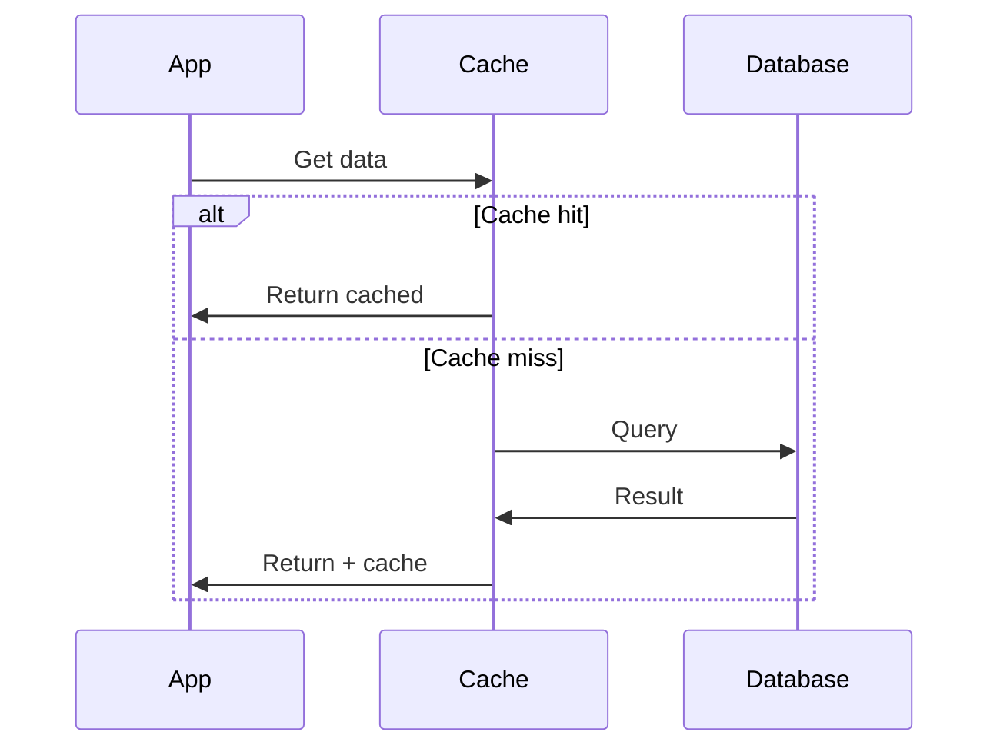

# 1. Introduction

Caching stores frequently accessed data in fast storage layers to reduce database load and improve response times. Effective caching strategies are critical for high-performance applications.

# 2. Learning Objectives

- Understand caching patterns and strategies
- Implement Redis and CDN caching
- Handle cache invalidation
- Design cache-aside and write-through patterns

# 3. Prerequisites

- System design fundamentals (Module 24.1)
- Database concepts
- Basic networking

# 4. Why This Concept Exists

Database queries are expensive. Caching stores computed results in memory, serving subsequent requests without hitting the database.

# 5. Problem Statement

**Without Caching:** Database overload, slow responses, poor scalability. **With Caching:** Fast responses, reduced DB load, improved scalability.

# 6. Theory

**Caching Patterns:**

| Pattern | Description | Use Case |
|---------|-------------|----------|
| Cache-Aside | App manages cache | General purpose |
| Write-Through | Write to cache and DB | Data consistency |
| Write-Behind | Write to cache, async DB | Write performance |
| Read-Through | Cache fetches from DB | Read-heavy |

**Cache Strategies:**
- TTL (Time-To-Live)
- LRU (Least Recently Used)
- LFU (Least Frequently Used)

# 7. Internal Working

**Cache Architecture:**
```
Application
    ↓
Cache (Redis/Memcached)
    ↓ (miss)
Database
    ↓
Cache (populate)
```

# 8. JVM Perspective

Use Caffeine for local caching, Spring Cache for abstraction, Redis for distributed caching.

# 9. Memory Representation

Cache stores key-value pairs with TTL and metadata.

# 10. Architecture Diagram (Mermaid)



# 11. Flow Diagram (Mermaid)



# 12. Syntax

```java
// Caffeine local cache
Cache<String, Object> cache = Caffeine.newBuilder()
    .maximumSize(10_000)
    .expireAfterWrite(Duration.ofMinutes(5))
    .build();

// Spring Cache
@Cacheable("users")
public User getUser(Long id) {
    return userRepository.findById(id);
}
```

# 13. Easy Example

```java
// Simple cache-aside
public class CacheAsideExample {
    private final Cache<String, User> cache;
    private final UserRepository repository;
    
    public User getUser(String id) {
        User user = cache.getIfPresent(id);
        if (user == null) {
            user = repository.findById(id);
            cache.put(id, user);
        }
        return user;
    }
}
```

# 14. Medium Example

```java
// Redis caching with TTL
@Service
public class RedisCacheService {
    @Autowired
    private RedisTemplate<String, Object> redis;
    
    public User getUser(String id) {
        String key = "user:" + id;
        User user = (User) redis.opsForValue().get(key);
        if (user == null) {
            user = repository.findById(id);
            redis.opsForValue().set(key, user, Duration.ofMinutes(30));
        }
        return user;
    }
}
```

# 15. Hard Example

```java
// Multi-level caching
@Service
public class MultiLevelCache {
    private final Cache<String, Object> localCache;  // L1
    private final RedisTemplate<String, Object> redis;  // L2
    
    public User getUser(String id) {
        // L1: Local cache
        User user = (User) localCache.getIfPresent(id);
        if (user != null) return user;
        
        // L2: Redis
        user = (User) redis.opsForValue().get("user:" + id);
        if (user != null) {
            localCache.put(id, user);
            return user;
        }
        
        // L3: Database
        user = repository.findById(id);
        if (user != null) {
            redis.opsForValue().set("user:" + id, user, Duration.ofHours(1));
            localCache.put(id, user);
        }
        return user;
    }
}
```

# 16. Enterprise Example

```java
// Enterprise caching with invalidation
@Service
public class EnterpriseCacheService {
    @Cacheable(value = "users", key = "#id")
    public User getUser(Long id) {
        return userRepository.findById(id);
    }
    
    @CachePut(value = "users", key = "#user.id")
    public User updateUser(User user) {
        return userRepository.save(user);
    }
    
    @CacheEvict(value = "users", key = "#id")
    public void deleteUser(Long id) {
        userRepository.deleteById(id);
    }
    
    @CacheEvict(value = "users", allEntries = true)
    @Scheduled(fixedRate = 3600000)
    public void evictAll() {
        // Clear cache periodically
    }
}
```

# 17. Performance

| Cache Layer | Latency | Throughput |
|-------------|---------|------------|
| CPU Cache | <1ns | TB/s |
| Local Memory | 1-10ns | GB/s |
| Redis | 0.5-2ms | 100K+ ops/s |
| Database | 1-100ms | 1K-10K queries/s |

# 18. Time & Space Complexity

| Operation | Time | Space |
|-----------|------|-------|
| Cache lookup | O(1) | O(n) |
| Cache insert | O(1) | O(1) |
| Cache eviction | O(1) | O(1) |

# 19. Thread Safety

Use thread-safe cache implementations. Caffeine and Redis are thread-safe by default.

# 20. Best Practices

1. Set appropriate TTL
2. Implement cache warming
3. Monitor cache hit rate
4. Plan for cache invalidation
5. Use connection pooling
6. Handle cache failures gracefully

# 21. Common Mistakes

- Not setting TTL (cache grows forever)
- Cache stampede (thundering herd)
- Ignoring cache invalidation
- Over-caching (memory issues)
- Under-caching (DB overload)

# 22. Pitfalls

- Cache coherence issues
- Memory pressure
- Cold start performance
- Invalidation complexity

# 23. Debugging Tips

- Monitor hit/miss ratio
- Check cache size
- Analyze eviction rates
- Review TTL settings

# 24. Comparison Table

| Cache | Type | Use Case |
|-------|------|----------|
| Caffeine | Local | JVM apps |
| Redis | Distributed | Multi-service |
| Memcached | Distributed | Simple caching |
| CDN | Edge | Static content |
| EhCache | Local/ distributed | Java apps |

# 25. Decision Tool

```
Need caching?
├── Single JVM? → Caffeine/Guava
├── Distributed? → Redis/Memcached
├── Static content? → CDN
├── Database? → Query cache
└── API? → Response cache
```

# 26. Interview Questions

1. What is caching? Storing data in fast storage for quick access.
2. Cache-Aside vs Write-Through? Cache-Aside: app manages; Write-Through: cache writes to DB.
3. What is cache invalidation? Removing stale data from cache.
4. What is TTL? Time-To-Live, automatic expiration.
5. What is cache stampede? Many requests hitting DB simultaneously.
6. Redis vs Memcached? Redis: richer features; Memcached: simpler.
7. What is cache hit ratio? Percentage of requests served from cache.
8. How to handle cache failures? Fallback to database.
9. What is write-behind caching? Write to cache, async write to DB.
10. What is cache warming? Pre-populating cache before traffic.
11. What is LRU? Least Recently Used eviction policy.
12. What is distributed caching? Cache shared across multiple instances.
13. What is cache coherence? Consistency across cache instances.
14. What is hot key problem? Single key receiving too much traffic.
15. How to monitor cache? Track hit ratio, memory, evictions.

# 27. Exercises

**Level 1:** Implement local cache with Caffeine. **Level 2:** Set up Redis caching with Spring. **Level 3:** Build multi-level cache with invalidation.

# 28. Summary

Caching is essential for building high-performance applications. Understanding patterns, invalidation, and best practices is crucial for system design.

# 29. References

- "Designing Data-Intensive Applications" by Martin Kleppmann
- Redis Documentation
- Caffeine GitHub
- Spring Cache Documentation
