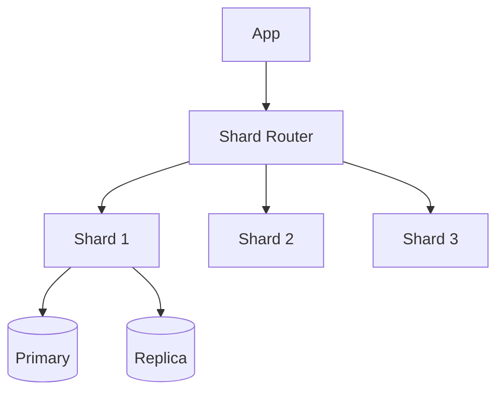
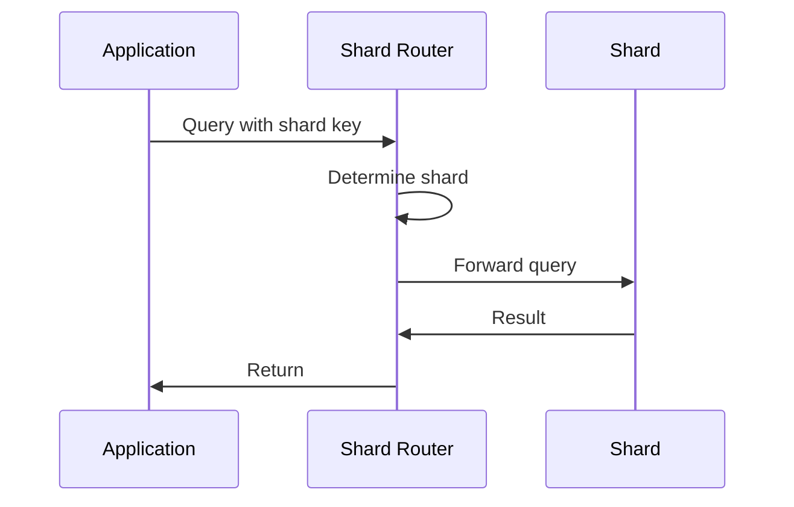

# 1. Introduction

Database design covers techniques like sharding, replication, and partitioning to build scalable, reliable data storage systems that can handle massive workloads.

# 2. Learning Objectives

- Understand database scaling techniques
- Implement sharding and replication
- Design partitioning strategies
- Evaluate trade-offs in database design

# 3. Prerequisites

- System design fundamentals (Module 24.1)
- SQL and database concepts
- Basic understanding of distributed systems

# 4. Why This Concept Exists

Single databases cannot handle massive scale. Sharding, replication, and partitioning distribute data across multiple servers for improved performance and reliability.

# 5. Problem Statement

**Without Scaling:** Database overload, single point of failure, poor performance. **With Scaling:** Distributed load, high availability, improved performance.

# 6. Theory

**Scaling Techniques:**

| Technique | Description | Benefit |
|-----------|-------------|---------|
| Sharding | Split data across servers | Horizontal scaling |
| Replication | Copy data to multiple servers | Read scaling, HA |
| Partitioning | Split tables vertically | Query optimization |
| Caching | Store hot data in memory | Read performance |

# 7. Internal Working

**Sharding Architecture:**
```
Application
    ↓
Shard Router
    ↓
┌─────────┬─────────┬─────────┐
│Shard 1  │Shard 2  │Shard 3  │
│Users A-F│Users G-M│Users N-Z│
└─────────┴─────────┴─────────┘
```

# 8. JVM Perspective

Use JPA/Hibernate for ORM, connection pooling for database connections, and read/write splitting.

# 9. Memory Representation

Database components: Buffer pool, Query cache, Connection pool, Index cache.

# 10. Architecture Diagram (Mermaid)



# 11. Flow Diagram (Mermaid)



# 12. Syntax

```java
// Shard key determination
public class ShardRouter {
    private final int numShards;
    
    public int getShard(String shardKey) {
        return Math.abs(shardKey.hashCode()) % numShards;
    }
}

// Read-write splitting
public class DataSourceRouting extends AbstractRoutingDataSource {
    @Override
    protected Object determineCurrentLookupKey() {
        return TransactionSynchronizationManager.isCurrentTransactionReadOnly()
            ? "read" : "write";
    }
}
```

# 13. Easy Example

```java
// Simple sharding
public class SimpleShardRouter {
    private final String[] shards = {"db1", "db2", "db3"};
    
    public String getShard(String userId) {
        int hash = userId.hashCode() % shards.length;
        return shards[Math.abs(hash)];
    }
}
```

# 14. Medium Example

```java
// Consistent hashing for sharding
public class ConsistentHashRouter {
    private final TreeMap<Integer, String> ring = new TreeMap<>();
    private final int virtualNodes = 150;
    
    public void addNode(String node) {
        for (int i = 0; i < virtualNodes; i++) {
            int hash = hash(node + ":" + i);
            ring.put(hash, node);
        }
    }
    
    public String getNode(String key) {
        int hash = hash(key);
        Integer closest = ring.ceilingKey(hash);
        if (closest == null) closest = ring.firstKey();
        return ring.get(closest);
    }
}
```

# 15. Hard Example

```java
// Sharding with rebalancing
@Service
public class ShardManager {
    private final ShardRouter router;
    private final DataSource[] shards;
    
    public void rebalance() {
        Map<String, List<String>> currentDistribution = analyzeDistribution();
        Map<String, String> newMapping = calculateNewMapping(currentDistribution);
        
        for (Map.Entry<String, String> entry : newMapping.entrySet()) {
            migrateData(entry.getKey(), entry.getValue());
        }
        
        router.updateMapping(newMapping);
    }
}
```

# 16. Enterprise Example

```java
// Enterprise database architecture
@Configuration
public class DatabaseConfig {
    @Bean
    public DataSource dataSource() {
        Map<Object, Object> targetDataSources = new HashMap<>();
        targetDataSources.put("write", writeDataSource());
        targetDataSources.put("read1", readReplica1());
        targetDataSources.put("read2", readReplica2());
        
        AbstractRoutingDataSource dataSource = new ReadWriteRoutingDataSource();
        dataSource.setTargetDataSources(targetDataSources);
        dataSource.setDefaultTargetDataSource(writeDataSource());
        return dataSource;
    }
}
```

# 17. Performance

| Technique | Write Performance | Read Performance | Complexity |
|-----------|------------------|------------------|------------|
| Single DB | 1x | 1x | Low |
| Replication | 1x | Nx | Low |
| Sharding | Nx | Nx | High |
| Partitioning | 1x | Variable | Medium |

# 18. Time & Space Complexity

| Operation | Time | Space |
|-----------|------|-------|
| Shard lookup | O(1) | O(n) |
| Data migration | O(data) | O(temp) |
| Replication lag | 1-10ms | O(data) |

# 19. Thread Safety

Use connection pooling and proper transaction management. Handle concurrent writes to shards.

# 20. Best Practices

1. Choose shard key carefully
2. Monitor replication lag
3. Plan for rebalancing
4. Implement connection pooling
5. Use read replicas for reads
6. Monitor database metrics

# 21. Common Mistakes

- Poor shard key choice (hot spots)
- Ignoring replication lag
- Not planning for growth
- Over-sharding
- Not monitoring performance

# 22. Pitfalls

- Cross-shard queries
- Distributed transactions
- Data migration complexity
- Shard rebalancing

# 23. Debugging Tips

- Monitor query performance
- Check replication lag
- Analyze shard distribution
- Review slow queries

# 24. Comparison Table

| Technique | Scaling | Complexity | Use Case |
|-----------|---------|------------|----------|
| Replication | Read | Low | Read-heavy |
| Sharding | Both | High | Massive scale |
| Partitioning | Query | Medium | Large tables |

# 25. Decision Tool

```
Need database scaling?
├── Read-heavy? → Replication
├── Write-heavy? → Sharding
├── Large tables? → Partitioning
└── All of above? → Combined approach
```

# 26. Interview Questions

1. What is database sharding? Splitting data across multiple servers.
2. What is replication? Copying data to multiple servers.
3. What is a shard key? Column used to determine shard placement.
4. What is consistent hashing? Hash function that minimizes redistribution.
5. What is replication lag? Delay between primary and replica.
6. What is read-write splitting? Routing reads to replicas, writes to primary.
7. What is horizontal vs vertical scaling? Horizontal: more servers; Vertical: more powerful server.
8. What is a hot spot? Shard receiving disproportionate traffic.
9. What is rebalancing? Redistributing data across shards.
10. What is a distributed transaction? Transaction spanning multiple shards.
11. What is eventual consistency? Data becomes consistent over time.
12. What is a materialized view? Pre-computed query result.
13. What is connection pooling? Reusing database connections.
14. What is query optimization? Improving SQL performance.
15. What is database indexing? Data structure for fast lookups.

# 27. Exercises

**Level 1:** Implement simple sharding router. **Level 2:** Set up read-write splitting. **Level 3:** Build sharding with rebalancing.

# 28. Summary

Database design techniques enable scalable, reliable data storage. Understanding sharding, replication, and partitioning is crucial for building high-performance systems.

# 29. References

- "Designing Data-Intensive Applications" by Martin Kleppmann
- Database Scaling Patterns
- Sharding Best Practices
- MySQL/PostgreSQL Replication Docs
