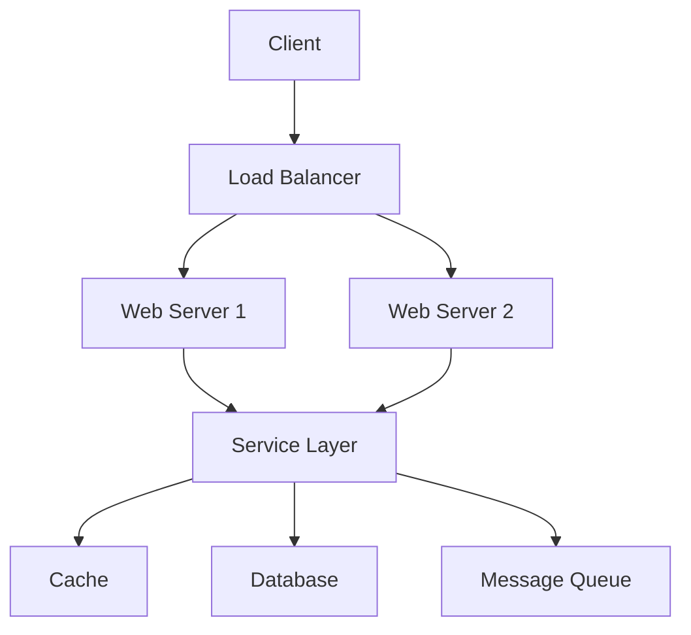

# Module 24: System Design

## Overview
System design is the process of defining architecture, components, and interfaces for complex systems. It covers scalability, availability, and performance considerations.

## Learning Objectives
- Understand system design principles
- Design scalable architectures
- Handle high availability
- Apply design patterns
- Estimate system requirements

## Prerequisites
- Java fundamentals
- Distributed systems
- Networking basics

## Why This Concept Exists
Complex systems need:
- Scalability
- Reliability
- Performance
- Maintainability

System design provides:
- Architecture patterns
- Scaling strategies
- Failure handling
- Performance optimization

## Problem Statement
How do you design scalable, reliable systems?

## Theory

### Design Principles

| Principle | Description |
|-----------|-------------|
| Scalability | Handle growth |
| Availability | Stay operational |
| Performance | Fast response |
| Security | Protect data |

### Scaling Strategies

| Strategy | Description |
|----------|-------------|
| Horizontal | Add more machines |
| Vertical | Upgrade machine |
| Database | Sharding, replication |
| Caching | Store frequent data |

### CAP Theorem

| Property | Description |
|----------|-------------|
| Consistency | All nodes see same data |
| Availability | Every request gets response |
| Partition Tolerance | Works despite network failures |

## Internal Working

### System Design Process
1. Requirements clarification
2. Estimation
3. High-level design
4. Detailed design
5. Scaling

### Estimation

| Metric | Example |
|--------|---------|
| Users | 10M daily active |
| QPS | 1000 queries/sec |
| Storage | 1TB per day |
| Bandwidth | 10Gbps |

## JVM Perspective

### Java in System Design
- Microservices architecture
- Spring Boot for services
- Kafka for messaging
- Redis for caching

## Architecture Diagram



## Syntax

### High-Level Design
```java
// Load balancer configuration
public class LoadBalancer {
    private final List<Server> servers;
    private int currentIndex = 0;
    
    public Server getNextServer() {
        Server server = servers.get(currentIndex);
        currentIndex = (currentIndex + 1) % servers.size();
        return server;
    }
}

// Cache implementation
public class Cache<K, V> {
    private final Map<K, CacheEntry<V>> cache = new ConcurrentHashMap<>();
    private final long defaultTTL;
    
    public void put(K key, V value, long ttl) {
        cache.put(key, new CacheEntry<>(value, System.currentTimeMillis() + ttl));
    }
    
    public Optional<V> get(K key) {
        CacheEntry<V> entry = cache.get(key);
        if (entry != null && !entry.isExpired()) {
            return Optional.of(entry.getValue());
        }
        return Optional.empty();
    }
}
```

## Easy Example
```java
// Simple URL shortener
public class UrlShortener {
    private final Map<String, String> shortToLong = new ConcurrentHashMap<>();
    private final Map<String, String> longToShort = new ConcurrentHashMap<>();
    private final AtomicLong counter = new AtomicLong(0);
    
    public String shorten(String longUrl) {
        return longToShort.computeIfAbsent(longUrl, url -> {
            String shortUrl = generateShortUrl();
            shortToLong.put(shortUrl, url);
            return shortUrl;
        });
    }
    
    public String expand(String shortUrl) {
        return shortToLong.get(shortUrl);
    }
    
    private String generateShortUrl() {
        return Long.toHexString(counter.incrementAndGet());
    }
}
```

## Medium Example
```java
// Rate limiter
public class RateLimiter {
    private final Map<String, Queue<Long>> requestCounts = new ConcurrentHashMap<>();
    private final int maxRequests;
    private final long windowMillis;
    
    public RateLimiter(int maxRequests, long windowMillis) {
        this.maxRequests = maxRequests;
        this.windowMillis = windowMillis;
    }
    
    public boolean allowRequest(String clientId) {
        long now = System.currentTimeMillis();
        Queue<Long> timestamps = requestCounts.computeIfAbsent(clientId, 
            k -> new ConcurrentLinkedQueue<>());
        
        // Remove old timestamps
        while (!timestamps.isEmpty() && timestamps.peek() < now - windowMillis) {
            timestamps.poll();
        }
        
        if (timestamps.size() < maxRequests) {
            timestamps.add(now);
            return true;
        }
        
        return false;
    }
}
```

## Hard Example
```java
// Distributed cache
public class DistributedCache<K, V> {
    private final List<CacheNode<K, V>> nodes;
    private final HashFunction hashFunction;
    
    public DistributedCache(int numNodes) {
        this.nodes = new ArrayList<>();
        this.hashFunction = Hashing.murmur3_32();
        
        for (int i = 0; i < numNodes; i++) {
            nodes.add(new CacheNode<>());
        }
    }
    
    private CacheNode<K, V> getNode(K key) {
        int hash = hashFunction.hashBytes(key.toString().getBytes()).asInt();
        int index = Math.abs(hash) % nodes.size();
        return nodes.get(index);
    }
    
    public void put(K key, V value) {
        getNode(key).put(key, value);
    }
    
    public Optional<V> get(K key) {
        return getNode(key).get(key);
    }
}
```

## Enterprise Example
```java
// Event-driven architecture
public class EventDrivenSystem {
    private final EventBus eventBus;
    private final Map<String, EventHandler> handlers = new ConcurrentHashMap<>();
    
    public EventDrivenSystem() {
        this.eventBus = new EventBus();
    }
    
    public void registerHandler(String eventType, EventHandler handler) {
        handlers.put(eventType, handler);
        eventBus.register(handler);
    }
    
    public void publishEvent(Event event) {
        eventBus.post(event);
    }
    
    @Subscribe
    public void handleEvent(Event event) {
        EventHandler handler = handlers.get(event.getType());
        if (handler != null) {
            handler.handle(event);
        }
    }
}

interface EventHandler {
    void handle(Event event);
}

class Event {
    private final String type;
    private final Map<String, Object> data;
    
    public Event(String type, Map<String, Object> data) {
        this.type = type;
        this.data = data;
    }
    
    public String getType() { return type; }
    public Map<String, Object> getData() { return data; }
}
```

## Performance Considerations
- Use caching
- Database indexing
- Load balancing
- Async processing

## Best Practices
1. Design for failure
2. Use caching wisely
3. Scale horizontally
4. Monitor everything
5. Document decisions

## Comparison Table

| Aspect | Monolith | Microservices | Serverless |
|--------|----------|---------------|------------|
| Complexity | Low | High | Low |
| Scaling | Vertical | Horizontal | Automatic |
| Deployment | Simple | Complex | Simple |
| Cost | Fixed | Variable | Pay-per-use |

## Interview Questions

### Q1: What is system design?
**Answer:** Process of defining architecture for complex systems.

### Q2: What is the CAP theorem?
**Answer:** Consistency, Availability, Partition tolerance - can only have 2.

### Q3: What is horizontal scaling?
**Answer:** Adding more machines to handle load.

### Q4: What is a load balancer?
**Answer:** Distributes traffic across multiple servers.

### Q5: What is caching?
**Answer:** Storing frequent data for faster access.

## Summary
System design is essential for building scalable, reliable applications.

## References
- Designing Data-Intensive Applications
- System Design Interview
- High Scalability Blog
