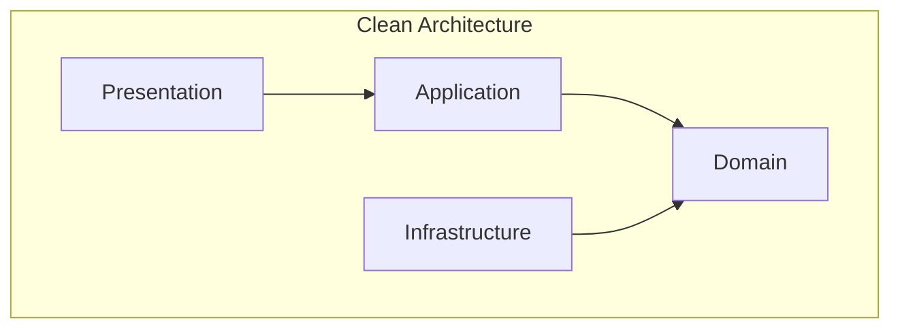
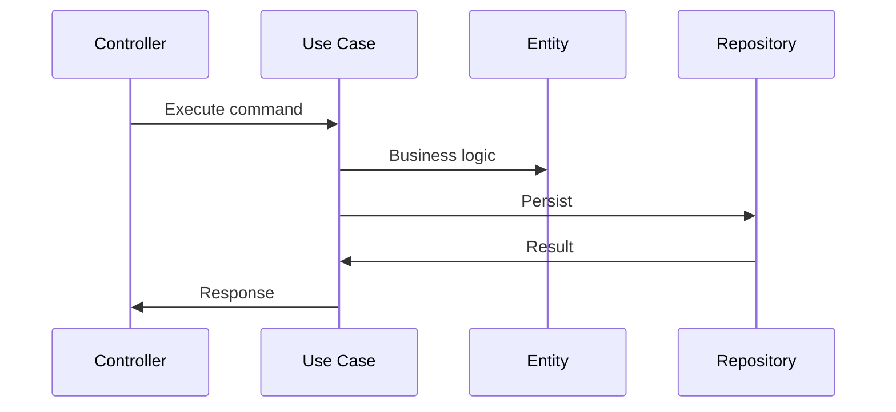

# 1. Introduction

Project architecture defines the structure, communication, and data flow of software systems. Clean architecture, hexagonal architecture, and Domain-Driven Design (DDD) are patterns for building maintainable, testable enterprise applications.

# 2. Learning Objectives

- Understand Clean Architecture principles
- Implement Hexagonal Architecture
- Apply Domain-Driven Design concepts
- Design testable enterprise applications

# 3. Prerequisites

- Java programming knowledge
- OOP concepts
- Design patterns
- Basic architecture knowledge

# 4. Why This Concept Exists

As applications grow, code becomes tangled and difficult to maintain. Architecture patterns provide clear boundaries, making systems easier to understand, test, and evolve.

# 5. Problem Statement

**Without Architecture:** Tangled code, hard to test, difficult to change, technical debt. **With Architecture:** Clear boundaries, testable, maintainable, scalable.

# 6. Theory

**Clean Architecture Layers:**
- **Entities**: Business objects
- **Use Cases**: Application business rules
- **Interface Adapters**: Convert data between layers
- **Frameworks & Drivers**: External tools

**Hexagonal Architecture:**
- **Ports**: Interfaces for business logic
- **Adapters**: Implementations connecting to external systems

# 7. Internal Working

```
Clean Architecture Flow:
UI → Controller → Use Case → Entity → Database
                ↑
            Dependencies point inward
```

# 8. JVM Perspective

Java's package structure naturally supports architecture layers. Use dependency injection to enforce boundaries.

# 9. Memory Representation

Application layers: Presentation → Application → Domain → Infrastructure.

# 10. Architecture Diagram (Mermaid)



# 11. Flow Diagram (Mermaid)



# 12. Syntax

```java
// Domain entity
public class Order {
    private OrderId id;
    private List<OrderItem> items;
    private OrderStatus status;
    
    public Money total() {
        return items.stream()
            .map(OrderItem::subtotal)
            .reduce(Money.ZERO, Money::add);
    }
}

// Use case
public class PlaceOrderUseCase {
    private final OrderRepository repository;
    
    public OrderId execute(PlaceOrderCommand command) {
        Order order = OrderFactory.create(command);
        repository.save(order);
        return order.getId();
    }
}
```

# 13. Easy Example

```java
// Simple layered architecture
public class UserController {
    private final UserService service;
    
    @PostMapping("/orders")
    public OrderResponse createOrder(@RequestBody CreateOrderRequest request) {
        return service.createOrder(request);
    }
}

public class UserService {
    private final OrderRepository repository;
    
    public OrderResponse createOrder(CreateOrderRequest request) {
        Order order = new Order(request.getItems());
        repository.save(order);
        return new OrderResponse(order.getId());
    }
}
```

# 14. Medium Example

```java
// Domain entity with business logic
public class Order {
    private final OrderId id;
    private final List<OrderItem> items;
    private OrderStatus status;
    private final Money discount;
    
    public static Order create(List<OrderItem> items) {
        Order order = new Order(OrderId.generate(), items, OrderStatus.CREATED);
        order.applyDiscount();
        return order;
    }
    
    public void confirm() {
        if (status != OrderStatus.CREATED) {
            throw new InvalidOrderStateException("Cannot confirm order in " + status);
        }
        this.status = OrderStatus.CONFIRMED;
    }
    
    private void applyDiscount() {
        if (total().isGreaterThan(Money.of(100))) {
            this.discount = total().multiply(0.1);
        }
    }
}
```

# 15. Hard Example

```java
// Complete clean architecture
// Domain Layer
public interface OrderRepository {
    Order findById(OrderId id);
    void save(Order order);
}

// Application Layer
public class PlaceOrderUseCase {
    private final OrderRepository repository;
    private final PaymentGateway paymentGateway;
    private final EventPublisher eventPublisher;
    
    @Transactional
    public OrderId execute(PlaceOrderCommand command) {
        Order order = Order.create(command.getItems());
        PaymentResult payment = paymentGateway.charge(order.total());
        
        if (payment.isSuccessful()) {
            order.confirm();
            repository.save(order);
            eventPublisher.publish(new OrderPlacedEvent(order.getId()));
            return order.getId();
        }
        throw new PaymentFailedException(payment.getReason());
    }
}

// Infrastructure Layer
@Repository
public class JpaOrderRepository implements OrderRepository {
    @Autowired
    private OrderJpaRepository jpaRepository;
    
    @Override
    public Order findById(OrderId id) {
        return jpaRepository.findById(id.getValue())
            .map(OrderMapper::toDomain)
            .orElseThrow(() -> new OrderNotFoundException(id));
    }
    
    @Override
    public void save(Order order) {
        jpaRepository.save(OrderMapper.toEntity(order));
    }
}
```

# 16. Enterprise Example

```java
// Enterprise DDD implementation
// Aggregate Root
public class Order extends AggregateRoot<OrderId> {
    private final List<OrderItem> items;
    private OrderStatus status;
    private CustomerId customerId;
    private Money totalAmount;
    
    public static Order create(CustomerId customerId, List<OrderItem> items) {
        Order order = new Order(OrderId.generate(), customerId, items);
        order.validate();
        order.registerEvent(new OrderCreatedEvent(order.getId()));
        return order;
    }
    
    public void addItem(ProductId productId, int quantity, Money price) {
        if (status != OrderStatus.DRAFT) {
            throw new OrderCannotBeModifiedException();
        }
        items.add(new OrderItem(productId, quantity, price));
        recalculateTotal();
    }
    
    public void submit() {
        validate();
        this.status = OrderStatus.SUBMITTED;
        registerEvent(new OrderSubmittedEvent(getId(), totalAmount));
    }
    
    private void validate() {
        if (items.isEmpty()) {
            throw new EmptyOrderException();
        }
    }
}

// Value Object
public class Money {
    private final BigDecimal amount;
    private final Currency currency;
    
    public Money add(Money other) {
        if (!currency.equals(other.currency)) {
            throw new CurrencyMismatchException();
        }
        return new Money(amount.add(other.amount), currency);
    }
    
    public Money multiply(int factor) {
        return new Money(amount.multiply(BigDecimal.valueOf(factor)), currency);
    }
}

// Domain Service
public class PricingService {
    public Money calculateDiscount(Order order, Customer customer) {
        if (customer.isPremium()) {
            return order.total().multiply(0.1);
        }
        if (order.total().isGreaterThan(Money.of(1000))) {
            return order.total().multiply(0.05);
        }
        return Money.ZERO;
    }
}
```

# 17. Performance

Architecture patterns don't significantly impact performance. Focus on clean boundaries; optimize later.

# 18. Time & Space Complexity

Architecture enables clean code, making optimization easier when needed.

# 19. Thread Safety

Use immutable objects in domain layer. Implement proper transaction management.

# 20. Best Practices

1. Keep domain logic pure
2. Use dependency injection
3. Define clear boundaries
4. Write comprehensive tests
5. Follow SOLID principles
6. Use value objects
7. Implement proper error handling

# 21. Common Mistakes

- Leaking domain logic to presentation
- Skipping domain layer
- Anemic domain model
- Ignoring bounded contexts
- Over-engineering

# 22. Pitfalls

- Over-abstraction
- Performance overhead
- Learning curve
- Team adoption

# 23. Debugging Tips

- Use architecture fitness functions
- Track dependency violations
- Monitor complexity metrics
- Code reviews

# 24. Comparison Table

| Pattern | Focus | Complexity | Use Case |
|---------|-------|------------|----------|
| Clean | Dependency rule | High | Large apps |
| Hexagonal | Ports/Adapters | Medium | Flexible I/O |
| DDD | Domain modeling | High | Complex domains |
| Layered | Separation | Low | Simple apps |

# 25. Decision Tool

```
Need architecture?
├── Simple app? → Layered
├── Complex domain? → DDD
├── Multiple I/O? → Hexagonal
├── Large enterprise? → Clean
└── Microservices? → DDD + Clean
```

# 26. Interview Questions

1. What is Clean Architecture? Pattern with dependencies pointing inward.
2. What is DDD? Approach focusing on business domain modeling.
3. What is an Aggregate? Cluster of domain objects treated as single unit.
4. What is a Value Object? Immutable object defined by attributes.
5. What is a Bounded Context? Distinct boundary within which a model applies.
6. What is Hexagonal Architecture? Pattern with ports and adapters.
7. What is the Dependency Rule? Dependencies only point inward.
8. What is an Anti-Corruption Layer? Layer preventing external model leakage.
9. What is CQRS? Command Query Responsibility Segregation.
10. What is Event Sourcing? Store state changes as events.
11. What is a Domain Event? Something that happened in the domain.
12. What is an Anemic Domain Model? Domain objects with only getters/setters.
13. What is a Repository? Abstraction over data persistence.
14. What is a Factory? Object creation pattern in DDD.
15. How to test domain logic? Unit tests with no external dependencies.

# 27. Exercises

**Level 1:** Design a simple Order entity with business logic. **Level 2:** Implement clean architecture for a CRUD application. **Level 3:** Build a complete DDD application with aggregates and events.

# 28. Summary

Architecture patterns like Clean Architecture, Hexagonal, and DDD provide frameworks for building maintainable enterprise applications. Understanding these patterns is essential for senior developers.

# 29. References

- "Clean Architecture" by Robert C. Martin
- "Domain-Driven Design" by Eric Evans
- "Implementing Domain-Driven Design" by Vaughn Vernon
- "Architecture Patterns with Python" by Harry Percival
