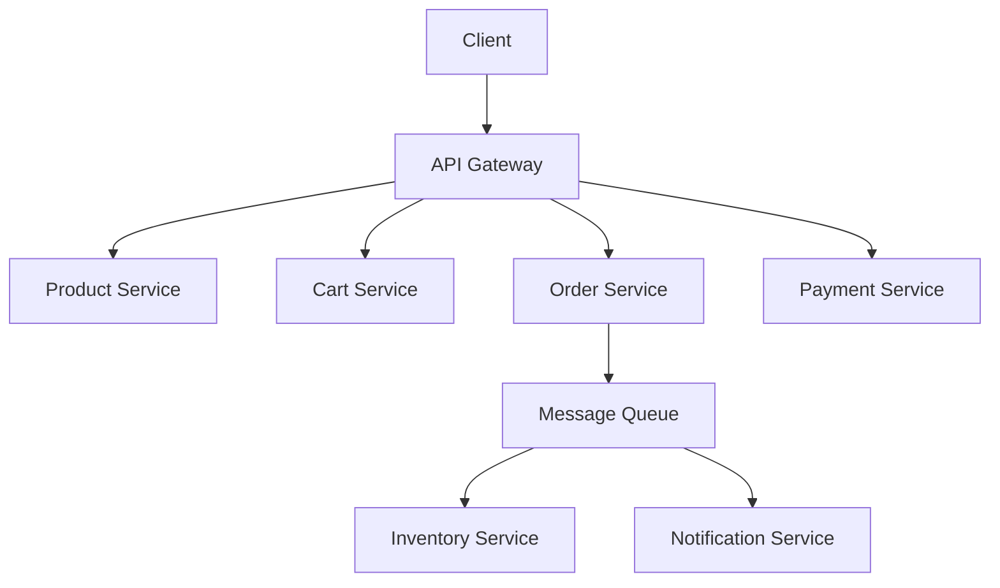
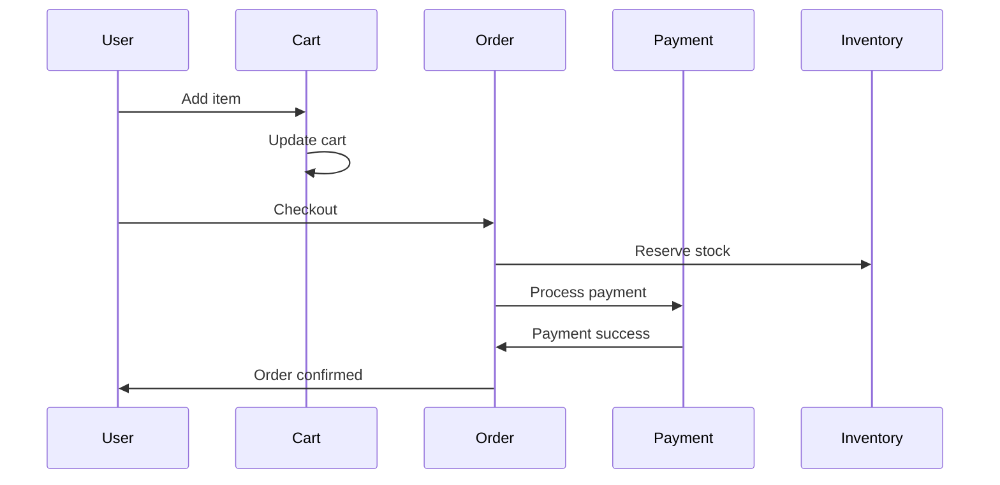

# 1. Introduction

E-commerce platforms require scalable, reliable architectures to handle product catalogs, shopping carts, orders, payments, and user management at scale.

# 2. Learning Objectives

- Design microservices for e-commerce
- Implement product catalog and search
- Build shopping cart and checkout flows
- Handle payments and order management

# 3. Prerequisites

- System design fundamentals (Module 24)
- Enterprise architecture patterns (Module 25.1)
- Java and Spring Boot knowledge

# 4. Why This Concept Exists

E-commerce applications have complex requirements: high availability, scalability, real-time inventory, and secure payments. Proper architecture ensures reliability and performance.

# 5. Problem Statement

**Without Proper Design:** Slow page loads, inventory overselling, payment failures, poor user experience. **With Proper Design:** Fast performance, accurate inventory, reliable payments, great UX.

# 6. Theory

**E-commerce Services:**
- Product Catalog Service
- Inventory Service
- Shopping Cart Service
- Order Service
- Payment Service
- User Service
- Notification Service

# 7. Internal Working

```
User Flow:
Browse → Add to Cart → Checkout → Payment → Order Confirmation
```

# 8. JVM Perspective

Use Spring Boot microservices with REST APIs, message queues for async operations, and caching for performance.

# 9. Memory Representation

Services: Product, Cart, Order, Payment, User, Inventory, Notification.

# 10. Architecture Diagram (Mermaid)



# 11. Flow Diagram (Mermaid)



# 12. Syntax

```java
// Order service
@Service
public class OrderService {
    @Transactional
    public OrderId createOrder(CreateOrderCommand command) {
        Order order = Order.create(command.getUserId(), command.getItems());
        inventoryService.reserve(order.getItems());
        paymentService.charge(order.getId(), order.total());
        orderRepository.save(order);
        return order.getId();
    }
}
```

# 13. Easy Example

```java
// Simple product entity
@Entity
public class Product {
    @Id
    private Long id;
    private String name;
    private Money price;
    private int stockQuantity;
    
    public void reduceStock(int quantity) {
        if (stockQuantity < quantity) {
            throw new InsufficientStockException();
        }
        this.stockQuantity -= quantity;
    }
}
```

# 14. Medium Example

```java
// Shopping cart with business logic
public class ShoppingCart {
    private final CartId id;
    private final UserId userId;
    private final List<CartItem> items;
    
    public void addItem(ProductId productId, int quantity, Money price) {
        items.stream()
            .filter(i -> i.getProductId().equals(productId))
            .findFirst()
            .ifPresentOrElse(
                i -> i.increaseQuantity(quantity),
                () -> items.add(new CartItem(productId, quantity, price))
            );
    }
    
    public Money total() {
        return items.stream()
            .map(CartItem::subtotal)
            .reduce(Money.ZERO, Money::add);
    }
}
```

# 15. Hard Example

```java
// Complete checkout flow
@Service
public class CheckoutService {
    @Transactional
    public OrderId checkout(CheckoutCommand command) {
        // 1. Validate cart
        ShoppingCart cart = cartRepository.findById(command.getCartId());
        cart.validate();
        
        // 2. Check inventory
        inventoryService.checkAvailability(cart.getItems());
        
        // 3. Reserve inventory
        List<Reservation> reservations = inventoryService.reserve(cart.getItems());
        
        // 4. Process payment
        PaymentResult payment = paymentService.charge(
            cart.getUserId(), cart.total(), command.getPaymentMethod());
        
        if (!payment.isSuccessful()) {
            inventoryService.release(reservations);
            throw new PaymentFailedException(payment.getReason());
        }
        
        // 5. Create order
        Order order = Order.create(cart.getUserId(), cart.getItems());
        order.confirm();
        orderRepository.save(order);
        
        // 6. Clear cart
        cartRepository.delete(cart.getId());
        
        // 7. Send confirmation
        notificationService.sendOrderConfirmation(order);
        
        return order.getId();
    }
}
```

# 16. Enterprise Example

```java
// Complete e-commerce microservice
@RestController
@RequestMapping("/api/products")
public class ProductController {
    @GetMapping
    public Page<ProductResponse> search(@RequestParam String query) {
        return productService.search(query);
    }
    
    @GetMapping("/{id}")
    public ProductResponse getProduct(@PathVariable Long id) {
        return productService.getById(id);
    }
}

@Service
public class ProductService {
    private final ProductRepository repository;
    private final CacheManager cacheManager;
    
    @Cacheable("products")
    public ProductResponse getById(Long id) {
        return repository.findById(id)
            .map(ProductMapper::toResponse)
            .orElseThrow(() -> new ProductNotFoundException(id));
    }
    
    public Page<ProductResponse> search(String query) {
        return repository.findByQuery(query)
            .map(ProductMapper::toResponse);
    }
}
```

# 17. Performance

Target metrics: Page load <2s, API response <200ms, 99.99% availability.

# 18. Time & Space Complexity

| Operation | Target |
|-----------|--------|
| Product search | <200ms |
| Cart operations | <100ms |
| Checkout | <2s |

# 19. Thread Safety

Use optimistic locking for inventory, idempotency keys for payments.

# 20. Best Practices

1. Use event-driven architecture
2. Implement circuit breakers
3. Cache product catalog
4. Use idempotent operations
5. Implement proper error handling
6. Monitor all services

# 21. Common Mistakes

- Not handling inventory race conditions
- Ignoring payment idempotency
- Not implementing circuit breakers
- Over-fetching data

# 22. Pitfalls

- Distributed transactions
- Inventory overselling
- Payment failures
- Slow page loads

# 23. Debugging Tips

- Use distributed tracing
- Monitor service health
- Track order status
- Review payment logs

# 24. Comparison Table

| Architecture | Complexity | Scalability | Use Case |
|--------------|------------|-------------|----------|
| Monolith | Low | Limited | MVP |
| Microservices | High | High | Enterprise |
| Serverless | Medium | Auto | Event-driven |

# 25. Decision Tool

```
E-commerce scale?
├── Small? → Monolith
├── Medium? → Modular monolith
├── Large? → Microservices
└── Enterprise? → Microservices + CQRS
```

# 26. Interview Questions

1. How do you prevent inventory overselling? Optimistic locking, reservations.
2. How to handle payment failures? Idempotency, retry with limits.
3. What is cart abandonment? Users leave without purchasing.
4. How to scale product search? Elasticsearch, caching.
5. What is CQRS? Separate read/write models.
6. How to handle flash sales? Queue-based processing.
7. What is order status workflow? Created → Confirmed → Shipped → Delivered.
8. How to handle returns? Refund flow, inventory restocking.
9. What is product recommendation? ML-based suggestions.
10. How to ensure payment security? PCI compliance, tokenization.

# 27. Exercises

**Level 1:** Design product catalog API. **Level 2:** Implement shopping cart service. **Level 3:** Build complete checkout flow.

# 28. Summary

E-commerce platforms require careful architecture for reliability and scalability. Understanding microservices, event-driven patterns, and payment flows is essential.

# 29. References

- "Building Microservices" by Sam Newman
- "Designing Data-Intensive Applications" by Martin Kleppmann
- Spring Boot E-commerce examples
- Stripe Payment Documentation
