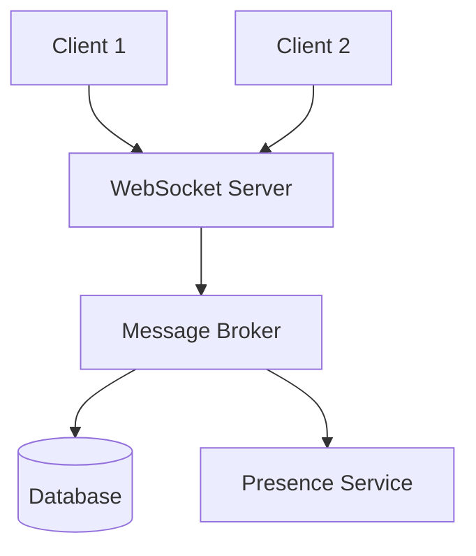
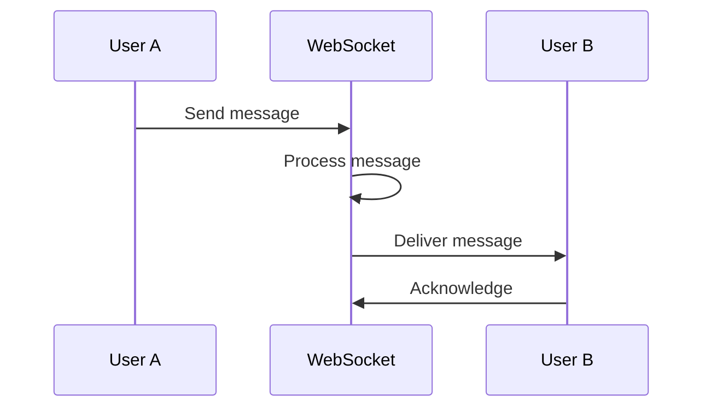

# 1. Introduction

Chat applications require real-time communication using WebSockets, message persistence, presence tracking, and scalable architecture for millions of concurrent users.

# 2. Learning Objectives

- Implement WebSocket communication
- Design chat system architecture
- Handle real-time messaging
- Build scalable chat services

# 3. Prerequisites

- System design fundamentals (Module 24)
- Enterprise architecture (Module 25.1)
- Java and Spring Boot knowledge

# 4. Why This Concept Exists

Traditional HTTP is not suitable for real-time bidirectional communication. WebSockets provide persistent connections for instant message delivery.

# 5. Problem Statement

**Without WebSockets:** Polling, high latency, poor UX. **With WebSockets:** Real-time, bidirectional, efficient.

# 6. Theory

**Chat Components:**
- WebSocket Server
- Message Broker (Kafka/RabbitMQ)
- Presence Service
- Message Storage
- Push Notifications

# 7. Internal Working

**Message Flow:**
User A → WebSocket → Message Broker → WebSocket → User B

# 8. JVM Perspective

Use Spring WebSocket with STOMP protocol, Redis for presence, Kafka for message distribution.

# 9. Memory Representation

Connections: WebSocket sessions, user-to-session mapping, channel subscriptions.

# 10. Architecture Diagram (Mermaid)



# 11. Flow Diagram (Mermaid)



# 12. Syntax

```java
@Controller
public class ChatController {
    @MessageMapping("/chat/{roomId}")
    @SendTo("/topic/room/{roomId}")
    public Message sendMessage(@DestinationVariable String roomId, Message message) {
        return message;
    }
}
```

# 13. Easy Example

```java
@Configuration
@EnableWebSocketMessageBroker
public class WebSocketConfig implements WebSocketMessageBrokerConfigurer {
    @Override
    public void configureMessageBroker(MessageBrokerRegistry config) {
        config.enableSimpleBroker("/topic");
        config.setApplicationDestinationPrefixes("/app");
    }
    
    @Override
    public void registerStompEndpoints(StompEndpointRegistry registry) {
        registry.addEndpoint("/chat").setAllowedOrigins("*").withSockJS();
    }
}
```

# 14. Medium Example

```java
@Service
public class ChatService {
    private final SimpMessagingTemplate messagingTemplate;
    private final MessageRepository repository;
    
    public void sendMessage(ChatMessage message) {
        message.setTimestamp(Instant.now());
        repository.save(message);
        
        messagingTemplate.convertAndSend(
            "/topic/room/" + message.getRoomId(), message);
    }
}
```

# 15. Hard Example

```java
@Service
public class PresenceService {
    private final RedisTemplate<String, String> redis;
    
    public void userConnected(String userId, String sessionId) {
        redis.opsForHash().put("presence", userId, sessionId);
        redis.opsForHash().put("sessions", sessionId, userId);
        broadcastPresence(userId, "ONLINE");
    }
    
    public void userDisconnected(String sessionId) {
        String userId = (String) redis.opsForHash().get("sessions", sessionId);
        redis.opsForHash().delete("presence", userId);
        redis.opsForHash().delete("sessions", sessionId);
        broadcastPresence(userId, "OFFLINE");
    }
}
```

# 16. Enterprise Example

```java
// Enterprise chat with all features
@Service
public class EnterpriseChatService {
    @Transactional
    public void sendMessage(SendMessageCommand command) {
        // 1. Validate
        validateUser(command.getSenderId(), command.getRoomId());
        
        // 2. Store message
        Message message = Message.create(command);
        messageRepository.save(message);
        
        // 3. Distribute
        kafkaTemplate.send("chat-messages", message);
        
        // 4. Push notifications
        notificationService.notifyRoom(command.getRoomId(), message);
        
        // 5. Update metrics
        metrics.recordMessage(command.getRoomId());
    }
}
```

# 17. Performance

| Metric | Target |
|--------|--------|
| Message latency | <100ms |
| Concurrent users | 1M+ |
| Messages/sec | 100K+ |
| Availability | 99.99% |

# 18. Time & Space Complexity

| Operation | Time |
|-----------|------|
| Send message | O(1) |
| Room broadcast | O(n) |
| Presence check | O(1) |

# 19. Thread Safety

Use concurrent collections for session management. Handle WebSocket reconnection gracefully.

# 20. Best Practices

1. Use message persistence
2. Implement presence tracking
3. Handle reconnection
4. Scale WebSocket servers
5. Use message acknowledgments
6. Implement rate limiting

# 21. Common Mistakes

- Not handling reconnections
- Ignoring message ordering
- Not persisting messages
- Missing presence updates
- No rate limiting

# 22. Pitfalls

- WebSocket scaling
- Message ordering
- Connection management
- Memory leaks

# 23. Debugging Tips

- Monitor WebSocket connections
- Track message delivery
- Check broker health
- Review connection logs

# 24. Comparison Table

| Technology | Latency | Scalability | Complexity |
|------------|---------|-------------|------------|
| WebSocket | Low | Medium | Medium |
| Socket.IO | Low | High | Medium |
| Server-Sent Events | Low | High | Low |

# 25. Decision Tool

```
Real-time needs?
├── Bidirectional? → WebSocket
├── Server→Client only? → SSE
├── Simple? → Long polling
└── Mobile? → Push notifications
```

# 26. Interview Questions

1. Why WebSockets over HTTP? Bidirectional, persistent connections.
2. How to scale WebSockets? Sticky sessions, message brokers.
3. How to handle reconnections? Message replay, client state.
4. What is message ordering? FIFO delivery guarantee.
5. How to implement presence? Heartbeats, Redis.
6. WebSocket vs Socket.IO? Socket.IO adds fallbacks.
7. How to handle large groups? Fan-out, message batching.
8. What is message acknowledgment? Confirm delivery.
9. How to ensure delivery? Retry, persistence.
10. How to handle offline users? Message queue, push notifications.

# 27. Exercises

**Level 1:** Implement basic WebSocket chat. **Level 2:** Add presence tracking. **Level 3:** Build enterprise chat with all features.

# 28. Summary

Chat applications require real-time communication with WebSockets. Understanding architecture, presence, and scaling is essential for building reliable chat systems.

# 29. References

- Spring WebSocket Documentation
- "Building Microservices" by Sam Newman
- WebSocket Protocol RFC 6455
- Redis Pub/Sub Documentation
