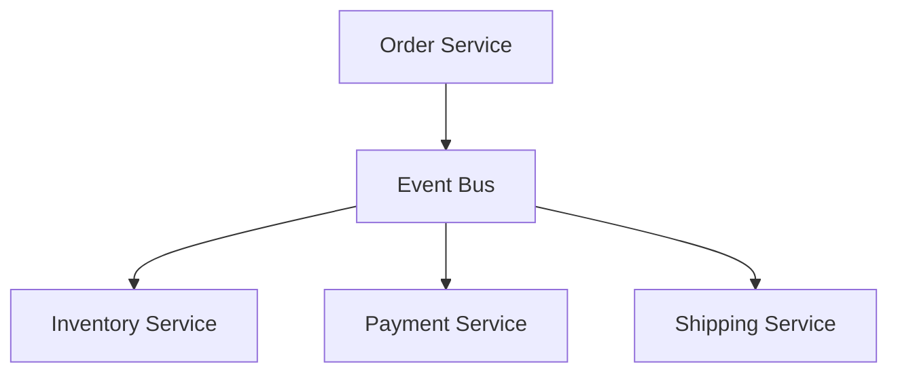
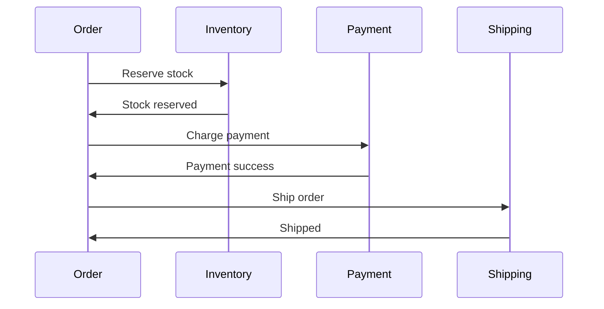

# 1. Introduction

Order management systems handle the complete lifecycle of orders from creation to fulfillment, implementing the saga pattern for distributed transactions.

# 2. Learning Objectives

- Design order processing workflows
- Implement saga pattern for transactions
- Handle order state management
- Build resilient order services

# 3. Prerequisites

- System design fundamentals (Module 24)
- Enterprise architecture (Module 25.1)
- Microservices patterns

# 4. Why This Concept Exists

Order processing spans multiple services. The saga pattern provides a way to maintain data consistency without distributed transactions.

# 5. Problem Statement

**Without Saga:** Distributed transaction failures, inconsistent data. **With Saga:** Eventual consistency, compensating actions, resilience.

# 6. Theory

**Saga Types:**
- **Choreography**: Events trigger next step
- **Orchestration**: Central coordinator

**Order Saga Steps:**
1. Create Order
2. Reserve Inventory
3. Process Payment
4. Confirm Order
5. Ship Order

# 7. Internal Working

```
Order Saga:
Create → Reserve → Payment → Confirm → Ship
    ↓         ↓         ↓
  Compensate Compensate Compensate
```

# 8. JVM Perspective

Use Spring State Machine for order workflow, Kafka for event distribution, and compensating transactions for rollback.

# 9. Memory Representation

Order states: CREATED, INVENTORY_RESERVED, PAYMENT_PROCESSED, CONFIRMED, SHIPPED, DELIVERED.

# 10. Architecture Diagram (Mermaid)



# 11. Flow Diagram (Mermaid)



# 12. Syntax

```java
// Order state machine
StateMachine<OrderState, OrderEvent> stateMachine = 
    StateMachineBuilder.<OrderState, OrderEvent>builder()
    .configureStates()
        .withStates()
            .initial(OrderState.CREATED)
            .end(OrderState.DELIVERED)
            .end(OrderState.CANCELLED)
    .configureTransitions()
        .withExternal()
            .source(OrderState.CREATED).target(OrderState.INVENTORY_RESERVED)
            .event(OrderEvent.INVENTORY_RESERVED)
        .withExternal()
            .source(OrderState.INVENTORY_RESERVED).target(OrderState.PAYMENT_PROCESSED)
            .event(OrderEvent.PAYMENT_PROCESSED)
    .build();
```

# 13. Easy Example

```java
// Simple order entity
@Entity
public class Order {
    @Id
    private Long id;
    private OrderStatus status;
    private List<OrderItem> items;
    private Money total;
    
    public void confirm() {
        this.status = OrderStatus.CONFIRMED;
    }
    
    public void cancel() {
        this.status = OrderStatus.CANCELLED;
    }
}
```

# 14. Medium Example

```java
// Order saga with compensation
@Service
public class OrderSaga {
    private final StateMachine<OrderState, OrderEvent> stateMachine;
    
    public void processOrder(Order order) {
        try {
            inventoryService.reserve(order.getItems());
            stateMachine.sendEvent(OrderEvent.INVENTORY_RESERVED);
            
            paymentService.charge(order.getId(), order.total());
            stateMachine.sendEvent(OrderEvent.PAYMENT_PROCESSED);
            
            shippingService.schedule(order.getId());
            stateMachine.sendEvent(OrderEvent.SHIP_SCHEDULED);
            
        } catch (Exception e) {
            compensate(order);
            throw new OrderProcessingException(e);
        }
    }
    
    private void compensate(Order order) {
        paymentService.refund(order.getId());
        inventoryService.release(order.getItems());
        order.cancel();
    }
}
```

# 15. Hard Example

```java
// Complete saga orchestrator
@Component
public class OrderSagaOrchestrator {
    private final Map<SagaStep, SagaHandler> handlers;
    
    public void execute(Order order) {
        List<SagaStep> steps = List.of(
            SagaStep.RESERVE_INVENTORY,
            SagaStep.PROCESS_PAYMENT,
            SagaStep.CONFIRM_ORDER,
            SagaStep.SCHEDULE_SHIPPING
        );
        
        for (SagaStep step : steps) {
            try {
                handlers.get(step).execute(order);
                order.addCompletedStep(step);
            } catch (Exception e) {
                compensate(order, step);
                throw new SagaFailedException(step, e);
            }
        }
    }
    
    private void compensate(Order order, SagaStep failedStep) {
        List<SagaStep> completed = order.getCompletedSteps();
        Collections.reverse(completed);
        
        for (SagaStep step : completed) {
            try {
                handlers.get(step).compensate(order);
            } catch (Exception e) {
                log.error("Compensation failed for step: {}", step, e);
            }
        }
    }
}
```

# 16. Enterprise Example

```java
// Enterprise order processing
@Service
@Transactional
public class EnterpriseOrderService {
    public OrderId processOrder(ProcessOrderCommand command) {
        // 1. Create order
        Order order = Order.create(command);
        orderRepository.save(order);
        
        // 2. Start saga
        SagaInstance saga = sagaInstanceRepository.save(
            SagaInstance.create("order-saga", order.getId()));
        
        // 3. Process steps
        sagaExecutor.execute(saga, Map.of(
            "order", order,
            "inventory", command.getInventoryCheck(),
            "payment", command.getPaymentMethod()
        ));
        
        return order.getId();
    }
}
```

# 17. Performance

| Metric | Target |
|--------|--------|
| Order processing | <5s |
| Saga completion | <30s |
| Compensation | <10s |

# 18. Time & Space Complexity

| Operation | Time |
|-----------|------|
| Saga step | O(1) |
| Compensation | O(completed steps) |

# 19. Thread Safety

Use optimistic locking for order updates. Handle concurrent saga executions.

# 20. Best Practices

1. Use compensating transactions
2. Implement idempotency
3. Monitor saga progress
4. Handle timeouts
5. Log all steps
6. Test failure scenarios

# 21. Common Mistakes

- Not implementing compensation
- Ignoring idempotency
- Missing timeout handling
- No monitoring
- Skipping tests

# 22. Pitfalls

- Saga complexity
- Compensation failures
- Timeout handling
- Eventual consistency

# 23. Debugging Tips

- Track saga state
- Monitor step completion
- Review compensation logs
- Analyze failures

# 24. Comparison Table

| Pattern | Complexity | Consistency | Use Case |
|---------|------------|-------------|----------|
| Choreography | Medium | Eventual | Simple flows |
| Orchestration | High | Eventual | Complex flows |

# 25. Decision Tool

```
Transaction needs?
├── Single service? → ACID
├── Simple multi-service? → Choreography
├── Complex multi-service? → Orchestration
└── Strong consistency? → 2PC (if absolutely needed)
```

# 26. Interview Questions

1. What is the saga pattern? Sequence of local transactions with compensation.
2. Choreography vs orchestration? Choreography: events; Orchestration: coordinator.
3. What is compensating transaction? Undo action for failed step.
4. What is idempotency? Same operation produces same result.
5. How to handle saga failures? Compensate completed steps.
6. What is eventual consistency? Data becomes consistent over time.
7. What is a state machine? Manages order states and transitions.
8. How to test sagas? Integration tests with failure simulation.
9. What is timeout handling? Automatically fail long-running steps.
10. How to monitor sagas? Track step completion, failures.

# 27. Exercises

**Level 1:** Implement simple order state machine. **Level 2:** Build choreography-based saga. **Level 3:** Create orchestrated saga with compensation.

# 28. Summary

Order management with the saga pattern enables reliable distributed transactions. Understanding compensation, state management, and testing is essential.

# 29. References

- "Microservices Patterns" by Chris Richardson
- "Designing Data-Intensive Applications" by Martin Kleppmann
- Spring State Machine Documentation
