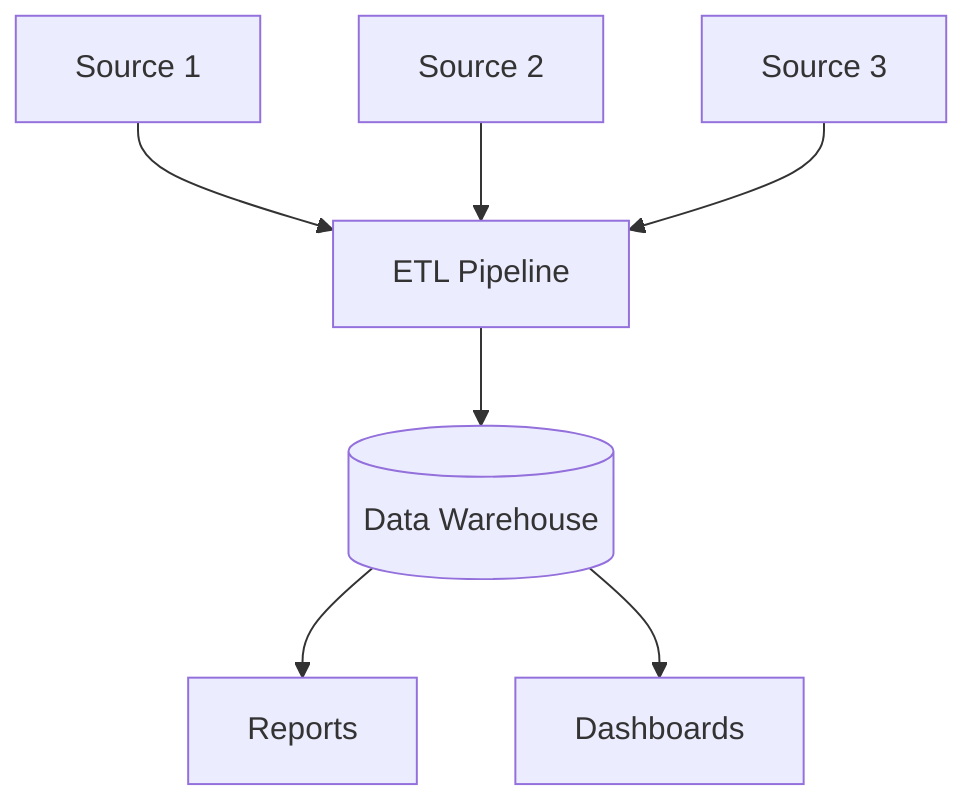
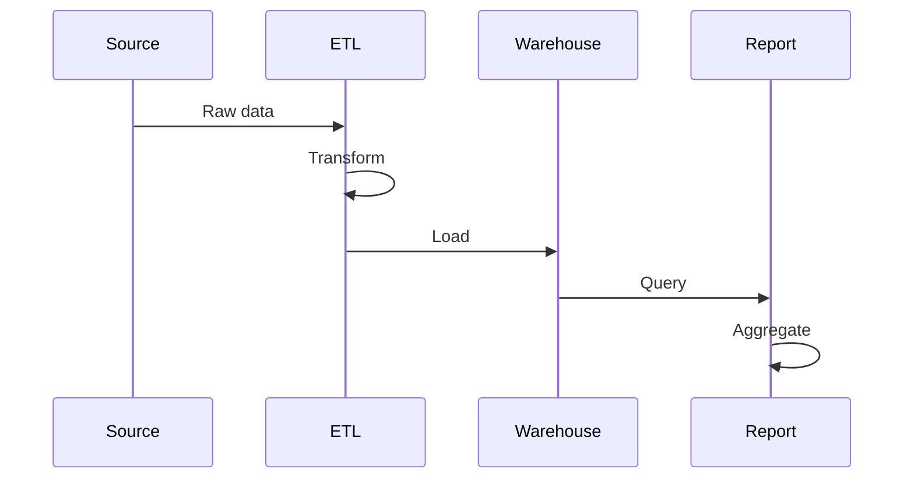

# 1. Introduction

Reporting systems aggregate data from multiple sources, perform transformations, and generate analytics for business intelligence. They handle ETL processes, data warehousing, and real-time analytics.

# 2. Learning Objectives

- Design ETL pipelines
- Implement data aggregation patterns
- Build real-time analytics systems
- Optimize reporting performance

# 3. Prerequisites

- System design fundamentals (Module 24)
- Database concepts
- Data processing knowledge

# 4. Why This Concept Exists

Business decisions require insights from large datasets. Reporting systems process raw data into actionable information efficiently.

# 5. Problem Statement

**Without Reporting:** Manual data analysis, slow insights, inconsistent metrics. **With Reporting:** Automated pipelines, fast insights, consistent metrics.

# 6. Theory

**ETL Components:**
- **Extract**: Pull data from sources
- **Transform**: Clean and aggregate
- **Load**: Store in target system

**Data Warehouse Concepts:**
- Star Schema
- Snowflake Schema
- Fact Tables
- Dimension Tables

# 7. Internal Working

```
Data Flow:
Sources → ETL → Staging → Warehouse → Reports
```

# 8. JVM Perspective

Use Spring Batch for ETL, Apache Spark for big data, and JPA for data access.

# 9. Memory Representation

Pipeline: Extract → Transform → Load → Aggregate → Report.

# 10. Architecture Diagram (Mermaid)



# 11. Flow Diagram (Mermaid)



# 12. Syntax

```java
// Spring Batch ETL
@Bean
public Step etlStep() {
    return stepBuilderFactory.get("etlStep")
        .<InputData, OutputData>chunk(1000)
        .reader(reader())
        .processor(processor())
        .writer(writer())
        .build();
}
```

# 13. Easy Example

```java
// Simple ETL processor
@Component
public class DataProcessor implements ItemProcessor<InputRecord, OutputRecord> {
    @Override
    public OutputRecord process(InputRecord input) {
        return new OutputRecord(
            input.getId(),
            transform(input.getValue()),
            input.getTimestamp()
        );
    }
}
```

# 14. Medium Example

```java
// Reporting aggregation
@Service
public class ReportService {
    @Cacheable("reports")
    public Report generateReport(ReportRequest request) {
        List<RawData> data = dataRepository.findByDateRange(
            request.getStartDate(), request.getEndDate());
        
        Map<String, AggregatedMetrics> metrics = data.stream()
            .collect(Collectors.groupingBy(
                RawData::getCategory,
                Collectors.collectingAndThen(
                    Collectors.toList(),
                    this::aggregate
                )
            ));
        
        return Report.create(request, metrics);
    }
}
```

# 15. Hard Example

```java
// Real-time analytics pipeline
@Service
public class RealTimeAnalytics {
    private final KafkaTemplate<String, Event> kafka;
    private final AnalyticsRepository repository;
    
    @KafkaListener(topics = "raw-events")
    public void processEvent(Event event) {
        // 1. Validate
        validate(event);
        
        // 2. Enrich
        EnrichedEvent enriched = enrich(event);
        
        // 3. Aggregate
        AggregationKey key = createKey(enriched);
        repository.incrementCounter(key, enriched.getMetric());
        
        // 4. Alert if threshold
        if (repository.getCount(key) > THRESHOLD) {
            alertService.send(key, enriched);
        }
    }
}
```

# 16. Enterprise Example

```java
// Enterprise data warehouse
@Configuration
public class DataWarehouseConfig {
    @Bean
    public Job dataWarehouseJob() {
        return jobBuilderFactory.get("dataWarehouseJob")
            .incrementer(new RunIdIncrementer())
            .start(extractStep())
            .next(transformStep())
            .next(loadStep())
            .next(aggregateStep())
            .build();
    }
    
    @Bean
    public Tasklet aggregateStep() {
        return (contribution, chunkContext) -> {
            warehouseService.aggregateDimensions();
            return RepeatStatus.FINISHED;
        };
    }
}
```

# 17. Performance

| Metric | Target |
|--------|--------|
| ETL throughput | 1M records/hour |
| Report generation | <30s |
| Dashboard load | <3s |

# 18. Time & Space Complexity

| Operation | Time |
|-----------|------|
| ETL job | O(n) |
| Report query | O(n) |
| Aggregation | O(n log n) |

# 19. Thread Safety

Use partitioning for parallel processing. Implement proper transaction management.

# 20. Best Practices

1. Use incremental loading
2. Implement data validation
3. Monitor pipeline health
4. Cache frequently accessed reports
5. Use appropriate indexing
6. Archive old data

# 21. Common Mistakes

- Full loads instead of incremental
- Missing data validation
- Poor indexing
- Not monitoring pipelines
- Ignoring data quality

# 22. Pitfalls

- Data inconsistencies
- Pipeline failures
- Performance degradation
- Storage costs

# 23. Debugging Tips

- Track data lineage
- Monitor pipeline metrics
- Validate data quality
- Review transformation logs

# 24. Comparison Table

| Tool | Type | Use Case |
|------|------|----------|
| Spring Batch | ETL | Java applications |
| Apache Spark | Big data | Large datasets |
| Apache Kafka | Streaming | Real-time |
| Apache Airflow | Orchestration | Pipeline management |

# 25. Decision Tool

```
Data processing needs?
├── Batch processing? → Spring Batch
├── Big data? → Spark
├── Real-time? → Kafka Streams
└── Orchestration? → Airflow
```

# 26. Interview Questions

1. What is ETL? Extract, Transform, Load process.
2. What is a data warehouse? Central repository for analytics.
3. What is star schema? Fact table with dimension tables.
4. What is incremental loading? Processing only new/changed data.
5. What is data lineage? Tracking data origin and transformations.
6. What is CDC? Change Data Capture.
7. What is a fact table? Stores quantitative data.
8. What is a dimension table? Stores descriptive attributes.
9. How to optimize ETL? Parallel processing, partitioning.
10. What is data quality? Accuracy, completeness, consistency.

# 27. Exercises

**Level 1:** Build simple ETL pipeline. **Level 2:** Implement real-time analytics. **Level 3:** Design complete data warehouse.

# 28. Summary

Reporting systems enable data-driven decisions through ETL pipelines and analytics. Understanding data warehousing patterns is essential for enterprise applications.

# 29. References

- "The Data Warehouse Toolkit" by Ralph Kimball
- Spring Batch Documentation
- Apache Spark Documentation
- Apache Kafka Documentation
