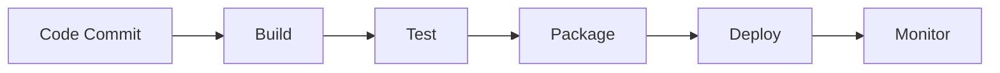
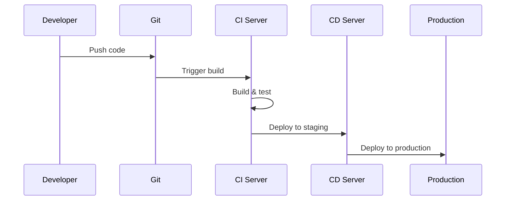

# 1. Introduction

CI/CD pipelines automate building, testing, and deploying applications. Jenkins and GitHub Actions are popular tools for implementing continuous integration and delivery.

# 2. Learning Objectives

- Design CI/CD pipelines
- Implement Jenkins pipelines
- Configure GitHub Actions
- Automate deployment workflows

# 3. Prerequisites

- Java and build tools (Maven/Gradle)
- Git version control
- Basic DevOps concepts

# 4. Why This Concept Exists

Manual deployments are error-prone and slow. CI/CD automates the process, ensuring consistent, reliable deployments.

# 5. Problem Statement

**Without CI/CD:** Manual errors, slow releases, inconsistent environments. **With CI/CD:** Automated, fast, consistent deployments.

# 6. Theory

**CI/CD Stages:**
1. **Source**: Code commit triggers pipeline
2. **Build**: Compile and package
3. **Test**: Automated testing
4. **Artifact**: Store build artifacts
5. **Deploy**: Deploy to environments

# 7. Internal Working

```
Pipeline Flow:
Code → Build → Test → Package → Deploy → Monitor
```

# 8. JVM Perspective

Use Maven/Gradle for builds, JUnit for testing, Docker for containers, Kubernetes for deployment.

# 9. Memory Representation

Pipeline stages: Source → Build → Test → Package → Deploy → Verify.

# 10. Architecture Diagram (Mermaid)



# 11. Flow Diagram (Mermaid)



# 12. Syntax

```yaml
# GitHub Actions workflow
name: CI/CD Pipeline
on:
  push:
    branches: [main]
  pull_request:
    branches: [main]

jobs:
  build:
    runs-on: ubuntu-latest
    steps:
    - uses: actions/checkout@v3
    - name: Set up JDK
      uses: actions/setup-java@v3
      with:
        java-version: '21'
    - name: Build
      run: mvn clean package
    - name: Test
      run: mvn test
```

```groovy
// Jenkinsfile
pipeline {
    agent any
    stages {
        stage('Build') {
            steps {
                sh 'mvn clean package'
            }
        }
        stage('Test') {
            steps {
                sh 'mvn test'
            }
        }
        stage('Deploy') {
            steps {
                sh 'kubectl apply -f k8s/'
            }
        }
    }
}
```

# 13. Easy Example

```yaml
# Simple GitHub Actions
name: Java CI
on: [push]
jobs:
  build:
    runs-on: ubuntu-latest
    steps:
    - uses: actions/checkout@v3
    - uses: actions/setup-java@v3
      with:
        java-version: '21'
    - run: mvn clean package
```

# 14. Medium Example

```groovy
// Jenkins with tests and deployment
pipeline {
    agent any
    environment {
        DOCKER_IMAGE = 'myapp'
    }
    stages {
        stage('Build') {
            steps {
                sh 'mvn clean package -DskipTests'
            }
        }
        stage('Test') {
            steps {
                sh 'mvn test'
            }
            post {
                always {
                    junit 'target/surefire-reports/*.xml'
                }
            }
        }
        stage('Docker Build') {
            steps {
                sh "docker build -t ${DOCKER_IMAGE}:${BUILD_NUMBER} ."
            }
        }
        stage('Deploy') {
            when { branch 'main' }
            steps {
                sh "kubectl set image deployment/myapp myapp=${DOCKER_IMAGE}:${BUILD_NUMBER}"
            }
        }
    }
}
```

# 15. Hard Example

```yaml
# Complete CI/CD pipeline
name: Production CI/CD
on:
  push:
    branches: [main]

jobs:
  build:
    runs-on: ubuntu-latest
    steps:
    - uses: actions/checkout@v3
    
    - name: Build and Test
      run: mvn clean verify
    
    - name: Build Docker Image
      run: docker build -t myapp:${{ github.sha }} .
    
    - name: Push to ECR
      run: |
        aws ecr get-login-password | docker login --username AWS --password-stdin $ECR_URL
        docker tag myapp:${{ github.sha }} $ECR_URL/myapp:${{ github.sha }}
        docker push $ECR_URL/myapp:${{ github.sha }}
    
    - name: Deploy to Staging
      run: |
        kubectl set image deployment/myapp-staging myapp=$ECR_URL/myapp:${{ github.sha }}
        kubectl rollout status deployment/myapp-staging
    
    - name: Integration Tests
      run: mvn verify -P integration-test
    
    - name: Deploy to Production
      if: success()
      run: |
        kubectl set image deployment/myapp myapp=$ECR_URL/myapp:${{ github.sha }}
        kubectl rollout status deployment/myapp
```

# 16. Enterprise Example

```groovy
// Enterprise Jenkins pipeline
pipeline {
    agent {
        kubernetes {
            yaml '''
            spec:
              containers:
              - name: maven
                image: maven:3.9-eclipse-temurin-21
                command: ['cat']
                tty: true
            '''
        }
    }
    options {
        timeout(time: 30, unit: 'MINUTES')
        disableConcurrentBuilds()
    }
    stages {
        stage('Build') {
            steps {
                container('maven') {
                    sh 'mvn clean package -DskipTests'
                }
            }
        }
        stage('Unit Tests') {
            steps {
                container('maven') {
                    sh 'mvn test'
                }
            }
            post {
                always {
                    junit 'target/surefire-reports/*.xml'
                }
            }
        }
        stage('Security Scan') {
            steps {
                sh 'dependency-check --project myapp --scan target/'
            }
        }
        stage('Docker Build') {
            steps {
                sh "docker build -t ${ECR_URL}/myapp:${BUILD_NUMBER} ."
            }
        }
        stage('Push to Registry') {
            steps {
                withAWS(credentials: 'aws-credentials') {
                    sh "aws ecr get-login-password | docker login --username AWS --password-stdin ${ECR_URL}"
                    sh "docker push ${ECR_URL}/myapp:${BUILD_NUMBER}"
                }
            }
        }
        stage('Deploy to Staging') {
            steps {
                withKubeConfig('kubeconfig') {
                    sh "kubectl set image deployment/myapp myapp=${ECR_URL}/myapp:${BUILD_NUMBER} -n staging"
                    sh "kubectl rollout status deployment/myapp -n staging --timeout=300s"
                }
            }
        }
        stage('Integration Tests') {
            steps {
                sh 'mvn verify -P integration-test -Dapp.url=https://staging.myapp.com'
            }
        }
        stage('Deploy to Production') {
            when { branch 'main' }
            input {
                message "Deploy to production?"
                ok "Yes"
            }
            steps {
                withKubeConfig('kubeconfig') {
                    sh "kubectl set image deployment/myapp myapp=${ECR_URL}/myapp:${BUILD_NUMBER} -n production"
                    sh "kubectl rollout status deployment/myapp -n production --timeout=300s"
                }
            }
        }
    }
    post {
        failure {
            slackSend channel: '#alerts', message: "Build failed: ${env.JOB_NAME}"
        }
        success {
            slackSend channel: '#alerts', message: "Build succeeded: ${env.JOB_NAME}"
        }
    }
}
```

# 17. Performance

| Metric | Target |
|--------|--------|
| Build time | <10 min |
| Test time | <15 min |
| Deploy time | <5 min |
| Pipeline reliability | 99% |

# 18. Time & Space Complexity

| Operation | Time |
|-----------|------|
| Build | 2-10 min |
| Test | 5-15 min |
| Deploy | 1-5 min |

# 19. Thread Safety

Use proper locking for concurrent builds. Implement idempotent deployments.

# 20. Best Practices

1. Keep pipelines fast
2. Fail fast
3. Use caching
4. Implement rollbacks
5. Monitor pipeline health
6. Secure secrets
7. Use infrastructure as code

# 21. Common Mistakes

- Slow pipelines
- Flaky tests
- Hardcoded secrets
- No rollback strategy
- Missing notifications

# 22. Pitfalls

- Environment drift
- Secret management
- Pipeline complexity
- Tool maintenance

# 23. Debugging Tips

- Review build logs
- Check environment variables
- Verify credentials
- Test locally first

# 24. Comparison Table

| Tool | Type | Complexity |
|------|------|------------|
| Jenkins | Self-hosted | High |
| GitHub Actions | Cloud | Low |
| GitLab CI | Cloud | Medium |
| CircleCI | Cloud | Low |

# 25. Decision Tool

```
CI/CD needs?
├── Simple? → GitHub Actions
├── Complex? → Jenkins
├── Self-hosted? → Jenkins
└── Cloud-native? → GitHub Actions/GitLab CI
```

# 26. Interview Questions

1. What is CI/CD? Continuous Integration / Continuous Deployment.
2. What is a pipeline? Automated sequence of build/test/deploy steps.
3. Jenkins vs GitHub Actions? Jenkins: flexible, self-hosted; GitHub Actions: cloud-native.
4. What is infrastructure as code? Managing infrastructure through code.
5. What is a rollback? Reverting to previous version.
6. What is blue-green deployment? Two identical environments.
7. What is canary deployment? Gradual rollout to subset of users.
8. How to handle secrets? Use secret managers, not code.
9. What is artifact? Build output stored for deployment.
10. What is deployment window? Scheduled time for deployments.

# 27. Exercises

**Level 1:** Set up GitHub Actions for Java project. **Level 2:** Create Jenkins pipeline with stages. **Level 3:** Implement complete CI/CD with staging and production.

# 28. Summary

CI/CD pipelines automate application delivery. Understanding pipeline design, tool selection, and best practices is essential for modern software development.

# 29. References

- Jenkins Documentation
- GitHub Actions Documentation
- "The Phoenix Project" by Gene Kim
- "Continuous Delivery" by Jez Humble
