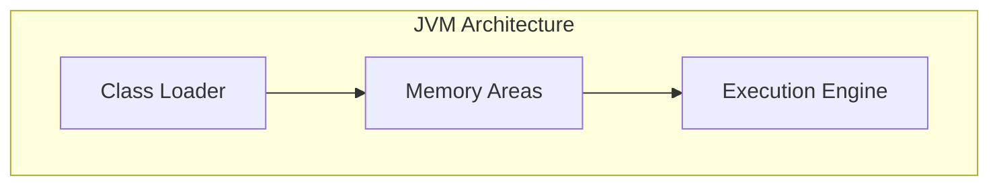
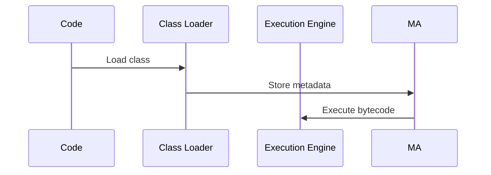

# 1. Introduction

Java interview questions cover core language features, JVM internals, and advanced concepts. This module provides comprehensive Q&A for Java developer interviews.

# 2. Learning Objectives

- Master core Java concepts
- Understand JVM internals
- Solve common interview problems
- Demonstrate Java expertise

# 3. Prerequisites

- Java programming basics
- Object-oriented programming
- Collections framework

# 4. Why This Concept Exists

Java interviews test deep understanding of language features, memory management, and concurrency. Preparation ensures confident, accurate responses.

# 5. Problem Statement

**Without Preparation:** Incomplete answers, missed concepts, poor confidence. **With Preparation:** Comprehensive knowledge, clear explanations, strong performance.

# 6. Theory

**Core Java Topics:**
- OOP Principles
- Collections Framework
- Exception Handling
- Generics
- Concurrency
- JVM Internals
- Memory Management

# 7. Internal Working

**JVM Architecture:**
- Class Loader Subsystem
- Runtime Data Areas
- Execution Engine

# 8. JVM Perspective

Understanding JVM internals enables optimization and debugging. Key areas: memory model, garbage collection, JIT compilation.

# 9. Memory Representation

JVM Memory: Heap, Stack, Method Area, PC Register, Native Method Stack.

# 10. Architecture Diagram (Mermaid)



# 11. Flow Diagram (Mermaid)



# 12. Syntax

```java
// OOP concepts
public class Encapsulation {
    private int value;
    public int getValue() { return value; }
    public void setValue(int v) { this.value = v; }
}

// Inheritance
public class Child extends Parent { }

// Polymorphism
public void process(Animal animal) {
    animal.speak(); // Runtime polymorphism
}
```

# 13. Easy Example

```java
// What is a class?
public class Dog {
    String name;
    int age;
    
    public void bark() {
        System.out.println("Woof!");
    }
}

// What is an object?
Dog myDog = new Dog();
myDog.name = "Buddy";
myDog.bark();
```

# 14. Medium Example

```java
// What is inheritance?
public abstract class Animal {
    public abstract void speak();
}

public class Dog extends Animal {
    @Override
    public void speak() {
        System.out.println("Woof!");
    }
}

// What is polymorphism?
List<Animal> animals = List.of(new Dog(), new Cat());
for (Animal a : animals) {
    a.speak(); // Different behavior
}
```

# 15. Hard Example

```java
// What is the JVM memory model?
// Heap: Object instances
// Stack: Method frames, local variables
// Method Area: Class metadata, constants

// What is garbage collection?
// Automatic memory management
// Mark and sweep algorithm
// Generational collection (Young, Old, Perm)

// What is JIT compilation?
// Just-In-Time compilation
// Hotspot detection
// Native code generation
```

# 16. Enterprise Example

```java
// Enterprise Java patterns
@Service
@Transactional
public class OrderService {
    @Autowired
    private OrderRepository repository;
    
    @Cacheable("orders")
    public Order getOrder(Long id) {
        return repository.findById(id)
            .orElseThrow(() -> new OrderNotFoundException(id));
    }
    
    @Async
    public CompletableFuture<Void> processOrder(Order order) {
        // Process asynchronously
        return CompletableFuture.completedFuture(null);
    }
}
```

# 17. Performance

Key performance concepts: Time complexity, Space complexity, Algorithm optimization, Data structure selection.

# 18. Time & Space Complexity

| Operation | Array | LinkedList | HashMap |
|-----------|-------|------------|---------|
| Access | O(1) | O(n) | O(1) |
| Search | O(n) | O(n) | O(1) |
| Insert | O(n) | O(1) | O(1) |
| Delete | O(n) | O(1) | O(1) |

# 19. Thread Safety

Use synchronized, volatile, concurrent collections, and locks for thread safety.

# 20. Best Practices

1. Understand fundamentals deeply
2. Practice coding problems
3. Explain concepts clearly
4. Provide real-world examples
5. Ask clarifying questions
6. Admit knowledge gaps

# 21. Common Mistakes

- Memorizing without understanding
- Not practicing coding
- Poor communication
- Skipping fundamentals

# 22. Pitfalls

- Trick questions
- Time pressure
- Nervousness
- Overthinking

# 23. Debugging Tips

- Think aloud
- Break down problems
- Test edge cases
- Verify solutions

# 24. Comparison Table

| Concept | Description | Use Case |
|---------|-------------|----------|
| ArrayList | Dynamic array | Random access |
| LinkedList | Doubly linked list | Frequent insertion |
| HashMap | Hash table | Key-value storage |
| TreeMap | Red-black tree | Sorted keys |

# 25. Decision Tool

```
Interview prep?
├── Core Java? → OOP, Collections, Generics
├── JVM? → Memory, GC, JIT
├── Concurrency? → Threads, Sync, Locks
└── Frameworks? → Spring, Hibernate
```

# 26. Interview Questions

1. What is encapsulation? Hiding internal state, exposing behavior.
2. What is inheritance? Creating new classes from existing ones.
3. What is polymorphism? Objects of different types treated as same type.
4. What is the difference between == and .equals()? == checks reference; .equals() checks value.
5. What is a HashMap? Hash table implementation of Map interface.
6. What is the difference between ArrayList and LinkedList? ArrayList: array-based; LinkedList: node-based.
7. What is thread safety? Code that works correctly with concurrent access.
8. What is synchronization? Controlling access to shared resources.
9. What is the JVM? Java Virtual Machine, executes bytecode.
10. What is garbage collection? Automatic memory management.
11. What is the difference between JDK and JRE? JDK: development kit; JRE: runtime environment.
12. What is an interface? Contract defining method signatures.
13. What is an abstract class? Class with abstract methods.
14. What is a functional interface? Interface with single abstract method.
15. What is a lambda expression? Anonymous function implementation.

# 27. Exercises

**Level 1:** Explain OOP principles with examples. **Level 2:** Implement common data structures. **Level 3:** Solve coding challenges.

# 28. Summary

Java interviews test deep understanding of core concepts, JVM internals, and practical skills. Preparation and practice are essential for success.

# 29. References

- "Effective Java" by Joshua Bloch
- "Java Concurrency in Practice" by Brian Goetz
- "Head First Java" by Kathy Sierra
- LeetCode, HackerRank
